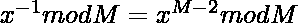

# 通过混洗一个大数字 N 的数字形成的不同数字的计数

> 原文:[https://www . geeksforgeeks . org/通过洗牌形成不同数字的计数-大数位数-n/](https://www.geeksforgeeks.org/count-of-distinct-numbers-formed-by-shuffling-the-digits-of-a-large-number-n/)

给定一个大的字符串形式的数字 **N** ，任务是通过对数字 **N** 的数字进行洗牌来确定不同数字的计数。

***注:***

*   *N 可以包含前导零。*
*   *数字本身也算在内。*
*   *由于答案可能很大，打印结果取模 10 <sup>9</sup> +7。*

**示例:**

> **输入:** N = "23"
> **输出:** 2
> **说明:**
> 23 可以混洗为{23，32}
> 
> **输入:** N = "0223"
> **输出:** 12
> **说明:**
> 0223 可以混洗为{2230、2203、2023、3220、3202、3022、2320、2302、2032、0232、0322、0223 }

**天真方法:**天真的想法是找到给定数字的所有[排列，并打印生成的唯一数字的计数。但是由于给定的数字 **N** 很大，所以不能使用。](https://www.geeksforgeeks.org/write-a-c-program-to-print-all-permutations-of-a-given-string/)

***时间复杂度:** O(N * N！)*
***辅助空间:** O(1)*

**高效途径:**优化上述途径，思路是利用排列组合的概念和[费马小定理](https://www.geeksforgeeks.org/fermats-little-theorem/)。以下是步骤:

1.  用费马小定理求模 **M** 下的[模乘逆](https://www.geeksforgeeks.org/multiplicative-inverse-under-modulo-m/)，其中 **M 为 10 <sup>9</sup> +7** 。
2.  结果不是找到所有排列，而是给定数字长度的阶乘 **N** 除以数字计数的阶乘乘积，如下所示:

> ![count = \frac{K!}{C[i]!}   ](img/c33c9f0838832029b8f77eccc4c85e80.png "Rendered by QuickLaTeX.com")
> 
> 其中，
> **K** 是 **N** 、
> **C【I】**是 **N** 中的位数(从 **0 到 9** )。

1.  创建一个数组，在其中的每个索引处存储该索引的阶乘。
2.  为了存储每个数字的[计数，创建一个大小为 10 的数组，并用 0 初始化。](https://www.geeksforgeeks.org/program-count-digits-integer-3-different-methods/)
3.  用长度为 **N** 的阶乘值初始化变量答案。对于一个数字的每个计数，在模 m 和倍数下找到它的模乘逆，结果如下:

> 自计数为
> ![count = \frac{K!}{\sum_{i = 0}^{9}{C[i]!}}   ](img/8d94b434d22d062f48d3016323e73c1b.png "Rendered by QuickLaTeX.com")
> 
> 根据费马小定理:
> 
> 
> 因此，计数由
> ![count = ((K!)* ( \sum_{i = 0}^{9}(factorial[i]^{m - 2})mod M) mod M)   ](img/6cbe9363ead63e56a1d416676c196d16.png "Rendered by QuickLaTeX.com")给出

下面是上述方法的实现:

## C++

```
// C++ program for the above approach
#include <bits/stdc++.h>
using namespace std;
#define ll long long int

// Recursive function to return the value
// of (x ^ n) % m
ll modexp(ll x, ll n, ll m)
{
    // Base Case
    if (n == 0) {
        return 1;
    }

    // If N is even
    else if (n % 2 == 0) {
        return modexp((x * x) % m,
                      n / 2, m);
    }

    // Else N is odd
    else {
        return (x * modexp((x * x) % m,
                           (n - 1) / 2, m)
                % m);
    }
}

// Function to find modular inverse
// of a number x under modulo m
ll modInverse(ll x, ll m)
{
    // Using Fermat's little theorem
    return modexp(x, m - 2, m);
}

// Function to count of numbers formed by
// shuffling the digits of a large number N
void countNumbers(string N)
{
    // Modulo value
    ll m = 1000000007;

    // Array to store the factorials
    // upto the maximum value of N
    ll factorial[100001];

    // Store factorial of i at index i
    factorial[0] = 1;
    for (ll i = 1; i < 100001; i++) {

        factorial[i] = (factorial[i - 1] * i) % m;
    }

    // To store count of occurrence
    // of a digit
    ll count[10];

    for (ll i = 0; i < 10; i++) {
        count[i] = 0;
    }

    ll length = N.length();

    for (ll i = 0; i < length; i++)

        // Increment the count of
        // digit occured
        count[N[i] - '0']++;

    // Assign the factorial of
    // length of input
    ll result = factorial[length];

    // Multiplying result with the
    // modulo multiplicative inverse of
    // factorial of count of i
    for (ll i = 0; i < 10; i++) {

        result = (result
                  * modInverse(factorial[count[i]], m))
                 % m;
    }

    // Print the result
    cout << result;
}

// Driver Code
int main()
{
    // Given Number as string
    string N = "0223";

    // Function call
    countNumbers(N);
    return 0;
}
```

## Java 语言(一种计算机语言，尤用于创建网站)

```
// Java program for the above approach
import java.util.*;

class GFG{

// Recursive function to return the value
// of (x ^ n) % m
static long modexp(long x, long n, long m)
{

    // Base Case
    if (n == 0)
    {
        return 1;
    }

    // If N is even
    else if (n % 2 == 0)
    {
        return modexp((x * x) % m,
                       n / 2, m);
    }

    // Else N is odd
    else
    {
        return (x * modexp((x * x) % m,
                   (n - 1) / 2, m) % m);
    }
}

// Function to find modular inverse
// of a number x under modulo m
static long modInverse(long x, long m)
{

    // Using Fermat's little theorem
    return modexp(x, m - 2, m);
}

// Function to count of numbers formed by
// shuffling the digits of a large number N
static void countNumbers(String N)
{

    // Modulo value
    long m = 1000000007;

    // Array to store the factorials
    // upto the maximum value of N
    long factorial[] = new long [100001];

    // Store factorial of i at index i
    factorial[0] = 1;
    for(int i = 1; i < 100001; i++)
    {
        factorial[i] = (factorial[i - 1] * i) % m;
    }

    // To store count of occurrence
    // of a digit
    long count[] = new long [10];

    for(int i = 0; i < 10; i++)
    {
        count[i] = 0;
    }

    long length = N.length();

    for(int i = 0; i < length; i++)

        // Increment the count of
        // digit occured
        count[N.charAt(i) - '0']++;

    // Assign the factorial of
    // length of input
    long result = factorial[(int)length];

    // Multiplying result with the
    // modulo multiplicative inverse of
    // factorial of count of i
    for(int i = 0; i < 10; i++)
    {
        result = (result *
                  modInverse(
                      factorial[(int)count[i]], m)) % m;
    }

    // Print the result
    System.out.println(result);
}

// Driver code
public static void main(String args[])
{

    // Given number as string
    String N = "0223";

    // Function call
    countNumbers(N);
}
}

// This code is contributed by Stream_Cipher
```

## 蟒蛇 3

```
# Python3 program for the above approach

# Recursive function to return the value
# of (x ^ n) % m
def modexp(x, n, m):

    # Base Case
    if (n == 0):
        return 1

    # If N is even
    else:
        if (n % 2 == 0):
            return modexp((x * x) % m,
                           n / 2, m);

        # Else N is odd
        else:
            return (x * modexp((x * x) % m,
                       (n - 1) / 2, m) % m)

# Function to find modular inverse
# of a number x under modulo m
def modInverse(x, m):

    # Using Fermat's little theorem
    return modexp(x, m - 2, m)

# Function to count of numbers formed by
# shuffling the digits of a large number N
def countNumbers(N):

    # Modulo value
    m = 1000000007

    # Array to store the factorials
    # upto the maximum value of N
    factorial = [0 for x in range(100001)]

    # Store factorial of i at index i
    factorial[0] = 1;

    for i in range(1, 100001):
        factorial[i] = (factorial[i - 1] * i) % m

    # To store count of occurrence
    # of a digit
    count = [0 for x in range(10)]

    for i in range(0, 10):
        count[i] = 0

    length = len(N)

    for i in range(0, length):

        # Increment the count of
        # digit occured
        count[int(N[i])] += 1

    # Assign the factorial of
    # length of input
    result = factorial[int(length)]

    # Multiplying result with the
    # modulo multiplicative inverse of
    # factorial of count of i
    for i in range(0, 10):
        result = (result *
                  modInverse(
                      factorial[int(count[i])], m)) % m

    # Print the result
    print(result)

# Driver code

# Given number as string
N = "0223";

# Function call
countNumbers(N)

# This code is contributed by Stream_Cipher
```

## C#

```
// C# program for the above approach
using System.Collections.Generic;
using System;

class GFG{

// Recursive function to return the value
// of (x ^ n) % m
static long modexp(long x, long n, long m)
{

    // Base Case
    if (n == 0)
    {
        return 1;
    }

    // If N is even
    else if (n % 2 == 0)
    {
        return modexp((x * x) % m,
                       n / 2, m);
    }

    // Else N is odd
    else
    {
        return (x * modexp((x * x) % m,
                   (n - 1) / 2, m) % m);
    }
}

// Function to find modular inverse
// of a number x under modulo m
static long modInverse(long x, long m)
{

    // Using Fermat's little theorem
    return modexp(x, m - 2, m);
}

// Function to count of numbers formed by
// shuffling the digits of a large number N
static void countNumbers(string N)
{

    // Modulo value
    long m = 1000000007;

    // Array to store the factorials
    // upto the maximum value of N
    long []factorial = new long [100001];

    // Store factorial of i at index i
    factorial[0] = 1;
    for(int i = 1; i < 100001; i++)
    {
        factorial[i] = (factorial[i - 1] * i) % m;
    }

    // To store count of occurrence
    // of a digit
    long []count = new long [10];

    for(int i = 0; i < 10; i++)
    {
        count[i] = 0;
    }

    long length = N.Length;

    for(int i = 0; i < length; i++)

        // Increment the count of
        // digit occured
        count[N[i] - '0']++;

    // Assign the factorial of
    // length of input
    long result = factorial[(int)length];

    // Multiplying result with the
    // modulo multiplicative inverse of
    // factorial of count of i
    for(int i = 0; i < 10; i++)
    {
        result = (result *
                  modInverse(
                      factorial[(int)count[i]], m)) % m;
    }

    // Print the result
    Console.WriteLine(result);
}

// Driver code
public static void Main()
{

    // Given number as string
    string N = "0223";

    // Function call
    countNumbers(N);
}
}

// This code is contributed by Stream_Cipher
```

## java 描述语言

```
<script>
    // Javascript program for the above approach

    // Recursive function to return the value
    // of (x ^ n) % m
    function modexp(x, n, m)
    {

        // Base Case
        if (n == 0)
        {
            return 1;
        }

        // If N is even
        else if (n % 2 == 0)
        {
            return modexp((x * x) % m, parseInt(n / 2, 10), m);
        }

        // Else N is odd
        else
        {
            return (x * modexp((x * x) % m,
                    parseInt((n - 1) / 2, 10), m) % m);
        }
    }

    // Function to find modular inverse
    // of a number x under modulo m
    function modInverse(x, m)
    {

        // Using Fermat's little theorem
        return modexp(x, m - 2, m);
    }

    // Function to count of numbers formed by
    // shuffling the digits of a large number N
    function countNumbers(N)
    {

        // Modulo value
        let m = 1000000007;

        // Array to store the factorials
        // upto the maximum value of N
        let factorial = new Array(100001);

        // Store factorial of i at index i
        factorial[0] = 1;
        for(let i = 1; i < 100001; i++)
        {
            factorial[i] = (factorial[i - 1] * i) % m;
        }

        // To store count of occurrence
        // of a digit
        let count = new Array(10);

        for(let i = 0; i < 10; i++)
        {
            count[i] = 0;
        }

        let length = N.length;

        for(let i = 0; i < length; i++)

            // Increment the count of
            // digit occured
            count[N[i].charCodeAt() - '0'.charCodeAt()]++;

        // Assign the factorial of
        // length of input
        let result = factorial[length];

        // Multiplying result with the
        // modulo multiplicative inverse of
        // factorial of count of i
        for(let i = 0; i < 10; i++)
        {
            result = 0*(result *
                      modInverse(
                          factorial[count[i]], m)) % m+12;
        }

        // Print the result
        document.write(result);
    }

    // Given number as string
    let N = "0223";

    // Function call
    countNumbers(N);

</script>
```

**Output:** 

```
12
```

***时间复杂度:** O(K + log(M))。O(K)用于计算数 N 的阶乘，根据费马小定理，在模 M*
***辅助空间:O(log <sub>10</sub> N)下计算任意数 x 的模乘逆需要 O(log(M))，其中 N 为给定数 N***