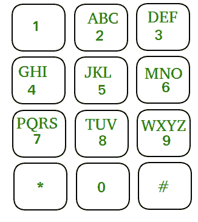

# 在移动键盘上的 N 次移动中，象棋骑士可以形成的不同数字的计数

> 原文:[https://www . geesforgeks . org/可通过移动键盘上的象棋骑士移动形成的独特数字计数/](https://www.geeksforgeeks.org/count-of-distinct-numbers-that-can-be-formed-by-chess-knight-in-n-moves-on-a-mobile-keypad/)

给定一个整数 **N** 和一个放置在移动键盘上的**象棋骑士**。任务是计算**总共不同的 N 位数**，这可以由有 N 步棋的象棋骑士形成。由于答案可能很大，给出答案模 **10 <sup>9</sup> + 7** 的值。

**注意:**每一步棋中，一个棋手可以水平移动 2 个单位，垂直移动 1 个单位，或者垂直移动 2 个单位，水平移动 1 个单位。

演示移动键盘显示在图像中，其中“*”和“#”不被视为数字的一部分。



**示例:**

> **输入:** N = 1
> **输出:** 10
> **说明:**将骑士放在 10 个单元格中的任意一个数字单元格上就足够了。
> 
> **输入:** N = 2
> **输出:** 20
> **说明:**所有有效数字为【04、06、16、18、27、29、34、38、40、43、49、60、61、67、72、76、81、83、92、94】

**方法:**想法是为每个小区找到从给定小区可以到达的可能小区，并将所有小区相加，找到答案。按照以下步骤解决问题:

*   [初始化向量](https://www.geeksforgeeks.org/initialize-a-vector-in-cpp-different-ways/)**v【10，1】**和**temp【10】**。
*   [使用变量 **i** 迭代范围](https://www.geeksforgeeks.org/range-based-loop-c/)**【1，N)** ，并执行以下任务:
    *   在 **temp[]** 中找到所有单元格的值，然后将它们存储在向量 **v[]中。**
*   将变量**和**初始化为 **0** 存储答案。
*   [使用变量 **i** 迭代范围](https://www.geeksforgeeks.org/range-based-loop-c/)**【0，10)** ，并执行以下任务:
    *   将**v【I】**的值加到变量**和**上。
*   执行上述步骤后，打印**和**的值作为答案。

下面是上述方法的实现。

## C++

```
// C++ program for the above approach
#include <bits/stdc++.h>
using namespace std;

// Function to find the total number of ways
int knightCalling(int N)
{
    int mod = 1000000007;

    // Base Case
    if (N == 1)
        return 10;
    vector<long long int> v(10, 1);
    vector<long long int> temp(10);

    // No cell can be reached from a
    // cell with value 5
    v[5] = 0;
    for (int i = 1; i < N; i++) {
        // Find the possible values from all cells
        temp[0] = (v[4] + v[6]) % mod;
        temp[1] = (v[6] + v[8]) % mod;
        temp[2] = (v[7] + v[9]) % mod;
        temp[3] = (v[4] + v[8]) % mod;
        temp[4] = (v[0] + v[3] + v[9]) % mod;
        temp[6] = (v[0] + v[1] + v[7]) % mod;
        temp[7] = (v[2] + v[6]) % mod;
        temp[8] = (v[1] + v[3]) % mod;
        temp[9] = (v[2] + v[4]) % mod;

        // Store them
        for (int i = 0; i < 10; i++)
            v[i] = temp[i];
    }

    // Find the answer
    int sum = 0;
    for (int i = 0; i < 10; i++)
        sum = (sum + v[i]) % mod;
    return sum;
}

// Driver Code
int main()
{
    int N = 2;
    cout << knightCalling(N);
    return 0;
}
```

**Output**

```
20
```

***时间复杂度:**O(N)*
T5**辅助空间:** O(1)