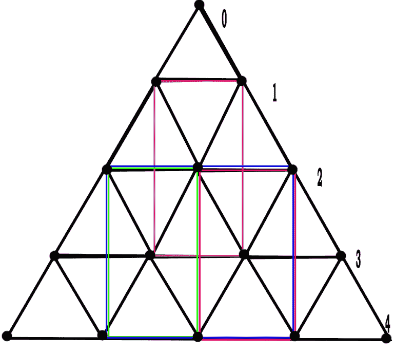

# 等边三角形内接不同矩形的计数

> 原文:[https://www . geesforgeks . org/等边三角形内接不同矩形的计数/](https://www.geeksforgeeks.org/count-of-distinct-rectangles-inscribed-in-an-equilateral-triangle/)

给定一个由点(**)组成的等边三角形。**)连接在一起形成三角形和一个整数 **n** ，代表三角形边的长度。任务是计算给定三角形中可以内接的矩形数量，例如:

1.  水平边必须平行于给定三角形的底边。
2.  矩形只能由点连接而成，即矩形的所有四条边都必须接触三角形上的点。
3.  应该只计算不同的矩形。



**例:**

```
Input: N = 3
Output: 1
          .
        .   .
      .   .   .
    .   .   .   .
The only triangle possible has the top edges 
at the two points of the second row and bottom edges 
at the 2nd and the 3rd points in the last row.

Input: N = 5
Output: 11
```

**进场:**从上图可以明显看出 **n** 和**n–1**级对制作任何矩形都没有贡献，所以我们从**n–2**级开始数矩形。当 **n** 是奇数，并且我们计算的水平说 **i** 也是奇数，那么差将是偶数，因此我们将其除以 2。这将给出可用于制作矩形的水平 **n** 和 **i** 之间的垂直水平的数量，如果两者都是偶数，这是相同的，因为偶数的差是偶数。
但当其中一个为奇数时，则差值为奇数，因此**n–1**电平有助于选择垂直电平，因此**n–1**电平用于计算。为了计算水平方向上两个点的选择方式，我们可以使用 **n** 自然数之和的公式，因为**<sup>N</sup>C<sub>2</sub>= 1+2+3+……+(N–1)**。现在，我们将一个级别中选择两个点的方法数乘以垂直级别中的点数。这将是我们针对特定级别的结果，因此我们将重复这些步骤直到最后，并总结所有值。
以下是上述方法的实施:

## C++

```
// C++ implementation of the approach
#include <iostream>
using namespace std;

// Function to return the count of
// rectangles when n is odd
int countOdd(int n)
{
    int coun = 0, m, j, i;
    for (i = n - 2; i >= 1; i--) {
        if (i & 1) {

            // Calculating number of dots
            // in vertical level
            m = (n - i) / 2;

            // Calculating number of ways
            // to select two points in the
            // horizontal level i
            j = (i * (i + 1)) / 2;

            // Multiply both to obtain the number of
            // rectangles formed at that level
            coun += j * m;
        }
        else {

            // Calculating number of dots
            // in vertical level
            m = ((n - 1) - i) / 2;

            // Calculating number of ways
            // to select two points in the
            // horizontal level i
            j = (i * (i + 1)) / 2;

            // Multiply both to obtain the number of
            // rectangles formed at that level
            coun += j * m;
        }
    }
    return coun;
}

// Function to return the count of
// rectangles when n is even
int countEven(int n)
{
    int coun = 0, m, j, i;
    for (i = n - 2; i >= 1; i--) {
        if (i & 1) {
            m = ((n - 1) - i) / 2;
            j = (i * (i + 1)) / 2;
            coun += j * m;
        }
        else {
            m = (n - i) / 2;
            j = (i * (i + 1)) / 2;
            coun += j * m;
        }
    }
    return coun;
}

// Driver code
int main()
{
    int n = 5;

    // If n is odd
    if (n & 1)
        cout << countOdd(n);
    else
        cout << countEven(n);

    return 0;
}
```

## Java 语言(一种计算机语言，尤用于创建网站)

```
// Java implementation of the approach
import java.io.*;

class GFG {

    // Function to return the count of
    // rectangles when n is odd
    static int countOdd(int n)
    {
        int coun = 0, m, j, i;
        for (i = n - 2; i >= 1; i--) {
            if (i >= 1) {

                // Calculating number of dots
                // in vertical level
                m = (n - i) / 2;

                // Calculating number of ways
                // to select two points in the
                // horizontal level i
                j = (i * (i + 1)) / 2;

                // Multiply both to obtain the number of
                // rectangles formed at that level
                coun += j * m;
            }
            else {

                // Calculating number of dots
                // in vertical level
                m = ((n - 1) - i) / 2;

                // Calculating number of ways
                // to select two points in the
                // horizontal level i
                j = (i * (i + 1)) / 2;

                // Multiply both to obtain the number of
                // rectangles formed at that level
                coun += j * m;
            }
        }
        return coun;
    }

    // Function to return the count of
    // rectangles when n is even
    static int countEven(int n)
    {
        int coun = 0, m, j, i;
        for (i = n - 2; i >= 1; i--) {
            if (i >= 1) {
                m = ((n - 1) - i) / 2;
                j = (i * (i + 1)) / 2;
                coun += j * m;
            }
            else {
                m = (n - i) / 2;
                j = (i * (i + 1)) / 2;
                coun += j * m;
            }
        }
        return coun;
    }

    // Driver code
    public static void main(String[] args)
    {

        int n = 5;

        // If n is odd
        if (n >= 1)
            System.out.println(countOdd(n));
        else
            System.out.println(countEven(n));
    }
}

// This code is contributed by Tushil..
```

## 蟒蛇 3

```
# Python 3 implementation of the approach

# Function to return the count of
# rectangles when n is odd
def countOdd(n):
    coun = 0
    i = n - 2
    while (i >= 1):
        if (i & 1):
            # Calculating number of dots
            # in vertical level
            m = int((n - i) / 2)

            # Calculating number of ways
            # to select two points in the
            # horizontal level i
            j = int((i * (i + 1)) / 2)

            # Multiply both to obtain the number of
            # rectangles formed at that level
            coun += j * m
        else:
            # Calculating number of dots
            # in vertical level
            m = int(((n - 1) - i) / 2)

            # Calculating number of ways
            # to select two points in the
            # horizontal level i
            j = int((i * (i + 1)) / 2)

            # Multiply both to obtain the number of
            # rectangles formed at that level
            coun += j * m

        i -= 1

    return coun

# Function to return the count of
# rectangles when n is even
def countEven(n):
    coun = 0
    i = n - 2
    while(i >= 1):
        if (i & 1):
            m = int(((n - 1) - i) / 2)
            j = int((i * (i + 1)) / 2)
            coun += j * m

        else:
            m = int((n - i) / 2)
            j = (i * (i + 1)) // 2
            coun += j * m

    return coun

# Driver code
if __name__ == '__main__':
    n = 5

    # If n is odd
    if (n & 1):
        print(countOdd(n))
    else:
        print(countEven(n))

# This code is contributed by
# Surendra_Gangwar
```

## C#

```
// C#  implementation of the approach
using System;

class GFG {
    // Function to return the count of
    // rectangles when n is odd
    static int countOdd(int n)
    {
        int coun = 0, m, j, i;
        for (i = n - 2; i >= 1; i--) {
            if (i >= 1) {

                // Calculating number of dots
                // in vertical level
                m = (n - i) / 2;

                // Calculating number of ways
                // to select two points in the
                // horizontal level i
                j = (i * (i + 1)) / 2;

                // Multiply both to obtain the number of
                // rectangles formed at that level
                coun += j * m;
            }
            else {

                // Calculating number of dots
                // in vertical level
                m = ((n - 1) - i) / 2;

                // Calculating number of ways
                // to select two points in the
                // horizontal level i
                j = (i * (i + 1)) / 2;

                // Multiply both to obtain the number of
                // rectangles formed at that level
                coun += j * m;
            }
        }
        return coun;
    }

    // Function to return the count of
    // rectangles when n is even
    static int countEven(int n)
    {
        int coun = 0, m, j, i;
        for (i = n - 2; i >= 1; i--) {
            if (i >= 1) {
                m = ((n - 1) - i) / 2;
                j = (i * (i + 1)) / 2;
                coun += j * m;
            }
            else {
                m = (n - i) / 2;
                j = (i * (i + 1)) / 2;
                coun += j * m;
            }
        }
        return coun;
    }

    // Driver code

    static public void Main()
    {

        int n = 5;

        // If n is odd
        if (n >= 1)
            Console.Write(countOdd(n));
        else
            Console.Write(countEven(n));
    }
}

// This code is contributed by Tushil..
```

## 服务器端编程语言（Professional Hypertext Preprocessor 的缩写）

```
<?php
// PHP implementation of the approach

// Function to return the count of
// rectangles when n is odd
function countOdd($n)
{
    $coun = 0;
    for ($i = $n - 2; $i >= 1; $i--)
    {
        if ($i & 1)
        {

            // Calculating number of dots
            // in vertical level
            $m = ($n - $i) / 2;

            // Calculating number of ways
            // to select two points in the
            // horizontal level i
            $j = ($i * ($i + 1)) / 2;

            // Multiply both to obtain the number of
            // rectangles formed at that level
            $coun += $j * $m;
        }
        else
        {

            // Calculating number of dots
            // in vertical level
            $m = (($n - 1) - $i) / 2;

            // Calculating number of ways
            // to select two points in the
            // horizontal level i
            $j = ($i * ($i + 1)) / 2;

            // Multiply both to obtain the number of
            // rectangles formed at that level
            $coun += $j * $m;
        }
    }
    return $coun;
}

// Function to return the count of
// rectangles when n is even
function countEven($n)
{
    $coun = 0;
    for ($i = $n - 2; $i >= 1; $i--)
    {
        if ($i & 1)
        {
            $m = (($n - 1) - i) / 2;
            $j = ($i * ($i + 1)) / 2;
            $coun += $j * $m;
        }
        else
        {
            $m = ($n - $i) / 2;
            $j = ($i * ($i + 1)) / 2;
            $coun += $j * $m;
        }
    }
    return $coun;
}

// Driver code
    $n = 5;

    // If n is odd
    if ($n & 1)
        echo countOdd($n);
    else
        echo countEven($n);

// This code is contributed by Arnab Kundu
?>
```

## java 描述语言

```
<script>   
    // Javascript implementation of the approach

    // Function to return the count of
    // rectangles when n is odd
    function countOdd(n)
    {
        let coun = 0, m, j, i;
        for (i = n - 2; i >= 1; i--) {
            if (i >= 1) {

                // Calculating number of dots
                // in vertical level
                m = parseInt((n - i) / 2, 10);

                // Calculating number of ways
                // to select two points in the
                // horizontal level i
                j = parseInt((i * (i + 1)) / 2, 10);

                // Multiply both to obtain the number of
                // rectangles formed at that level
                coun += j * m;
            }
            else {

                // Calculating number of dots
                // in vertical level
                m = parseInt(((n - 1) - i) / 2, 10);

                // Calculating number of ways
                // to select two points in the
                // horizontal level i
                j = parseInt((i * (i + 1)) / 2, 10);

                // Multiply both to obtain the number of
                // rectangles formed at that level
                coun += j * m;
            }
        }
        return coun;
    }

    // Function to return the count of
    // rectangles when n is even
    function countEven(n)
    {
        let coun = 0, m, j, i;
        for (i = n - 2; i >= 1; i--) {
            if (i >= 1) {
                m = parseInt(((n - 1) - i) / 2, 10);
                j = parseInt((i * (i + 1)) / 2, 10);
                coun += j * m;
            }
            else {
                m = parseInt((n - i) / 2, 10);
                j = parseInt((i * (i + 1)) / 2, 10);
                coun += j * m;
            }
        }
        return coun;
    }

    let n = 5;

    // If n is odd
    if (n >= 1)
      document.write(countOdd(n));
    else
      document.write(countEven(n));

</script>
```

**Output:** 

```
11
```