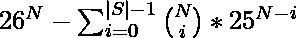

# 通过在原始字符串中插入 K 个字符来计数可能的不同字符串

> 原文:[https://www . geesforgeks . org/通过在原始字符串中插入 k 个字符来计算不同字符串的数量/](https://www.geeksforgeeks.org/count-of-distinct-strings-possible-by-inserting-k-characters-in-the-original-string/)

给定一个字符串 **S** 和一个整数 **K** ，任务是通过在字符串 **S** 的任意位置精确插入 **K** 字符来找到可以形成的字符串总数。因为答案可以很大，所以以 **10 <sup>9</sup> +7** 为模打印。
**示例:**

> **输入:** S = "a" K = 1
> **输出:** 51
> **解释:**
> 由于 26 个字符中的任何一个都可以插入在‘a’之前或‘a’之后，因此总共可以形成 52 个可能的字符串。
> 但是字符串“aa”会形成两次。因此，不同字符串的可能计数是 51。
> **输入:** S = "abc" K = 2
> **输出:** 6376

**方法:**
想法是找到包含作为子序列的**字符串**的字符串数量。按照以下步骤解决问题:

1.  **N** 个字符可以组成的字符串总数为**26<sup>N</sup>T5。**
2.  使用[二进制幂运算](https://www.geeksforgeeks.org/modular-exponentiation-power-in-modular-arithmetic/)计算 26 <sup>N</sup> 。
3.  在这个问题中，只需要考虑包含**字符串**作为**子序列**的字符串。
4.  因此，字符串的最终计数由下式给出

> **(字符串总数)–(不包含输入字符串作为子序列的字符串数)**

1.  在计算不包含**字符串**作为子序列的字符串时，注意 S 的**前缀的长度是结果字符串**的**子序列，可以在 **0 到|S|-1** 之间。**
2.  对于从 **0 到|S|-1** 的每个前缀长度，找出可以用这样的前缀作为子序列形成的字符串总数。然后从**26<sup>N</sup>T5】中减去该值。**
3.  因此，最后的答案是:

> 

下面是上述方法的实现:

## C++

```
// C++ program for the above approach
#include <bits/stdc++.h>
using namespace std;
#define int long long int
const int mod = 1e9 + 7;

// Function to calculate and return
// x^n in log(n) time using
// Binary Exponentiation
int binExp(int base, int power)
{
    int x = 1;
    while (power) {
        if (power % 2 == 1)
            x = ((x % mod)
                 * (base % mod))
                % mod;

        base = ((base % mod)
                * (base % mod))
               % mod;
        power = power / 2;
    }
    return x;
}

// Function to calculate the factorial
// of a number
int fact(int num)
{
    int result = 1;

    for (int i = 1; i <= num; ++i) {

        result = ((result % mod)
                  * (i % mod))
                 % mod;
    }

    return result;
}

// Function to calculate combination
int calculate_nCi(int N, int i)
{
    // nCi = ( n! ) / (( n-i )! * i!)
    int nfact = fact(N);
    int ifact = fact(i);
    int dfact = fact(N - i);

    // Using Euler's theorem of Modular
    // multiplicative inverse to find
    // the inverse of a number.
    // (1/a)%mod=a^(m?2)%mod
    int inv_ifact = binExp(ifact, mod - 2);
    int inv_dfact = binExp(dfact, mod - 2);

    int denm
        = ((inv_ifact % mod)
           * (inv_dfact % mod))
          % mod;

    int answer = ((nfact % mod)
                  * (denm % mod))
                 % mod;
    return answer;
}

// Function to find the count of
// possible strings
void countSubstring(int N, int s, int k)
{
    // Number of ways to form all
    // possible strings
    int allWays = binExp(26, N);

    // Number of ways to form strings
    // that don't contain the input
    // string as a subsequence
    int noWays = 0;

    // Checking for all prefix length
    // from 0 to |S|-1.
    for (int i = 0; i < s; ++i) {
        // to calculate nCi
        int nCi = calculate_nCi(N, i);

        // Select the remaining characters
        // 25 ^ (N-i)
        int remaining = binExp(25, N - i);

        int multiply
            = ((nCi % mod)
               * (remaining % mod))
              % mod;

        // Add the answer for this prefix
        // length to the final answer
        noWays = ((noWays % mod)
                  + (multiply % mod))
                 % mod;
    }

    // Answer is the difference of
    // allWays and noWays
    int answer = ((allWays % mod)
                  - (noWays % mod))
                 % mod;

    if (answer < 0)
        answer += mod;

    // Print the answer
    cout << answer;
}

// Driver Code
int32_t main()
{
    string str = "abc";
    int k = 2;
    int s = str.length();

    int N = s + k;

    countSubstring(N, s, k);
}
```

## Java 语言(一种计算机语言，尤用于创建网站)

```
// Java program for the above approach
class GFG{

static final long mod = 1000000007;

// Function to calculate and return
// x^n in log(n) time using
// Binary Exponentiation
static long binExp(long base, long power)
{
    long x = 1;
    while (power != 0)
    {
        if (power % 2 == 1)
            x = ((x % mod) *
              (base % mod)) % mod;

        base = ((base % mod) *
                (base % mod)) % mod;
        power = power / 2;
    }
    return x;
}

// Function to calculate the factorial
// of a number
static long fact(long num)
{
    long result = 1;

    for(long i = 1; i <= num; ++i)
    {
        result = ((result % mod) *
                       (i % mod)) % mod;
    }
    return result;
}

// Function to calculate combination
static long calculate_nCi(long N, long i)
{

    // nCi = ( n! ) / (( n-i )! * i!)
    long nfact = fact(N);
    long ifact = fact(i);
    long dfact = fact(N - i);

    // Using Euler's theorem of Modular
    // multiplicative inverse to find
    // the inverse of a number.
    // (1/a)%mod=a^(m?2)%mod
    long inv_ifact = binExp(ifact, mod - 2);
    long inv_dfact = binExp(dfact, mod - 2);

    long denm = ((inv_ifact % mod) *
                 (inv_dfact % mod)) % mod;

    long answer = ((nfact % mod) *
                    (denm % mod)) % mod;
    return answer;
}

// Function to find the count of
// possible strings
static void countSubstring(long N, long s, long k)
{

    // Number of ways to form all
    // possible strings
    long allWays = binExp(26, N);

    // Number of ways to form strings
    // that don't contain the input
    // string as a subsequence
    long noWays = 0;

    // Checking for all prefix length
    // from 0 to |S|-1.
    for(long i = 0; i < s; ++i)
    {

        // To calculate nCi
        long nCi = calculate_nCi(N, i);

        // Select the remaining characters
        // 25 ^ (N-i)
        long remaining = binExp(25, N - i);

        long multiply = ((nCi % mod) *
                   (remaining % mod)) % mod;

        // Add the answer for this prefix
        // length to the final answer
        noWays = ((noWays % mod) +
                (multiply % mod)) % mod;
    }

    // Answer is the difference of
    // allWays and noWays
    long answer = ((allWays % mod) -
                    (noWays % mod)) % mod;

    if (answer < 0)
        answer += mod;

    // Print the answer
    System.out.println(answer);
}

// Driver code   
public static void main(String[] args)
{
    String str = "abc";
    long k = 2;
    long s = str.length();
    long N = s + k;

    countSubstring(N, s, k);
}
}

// This code is contributed by rutvik_56
```

## 蟒蛇 3

```
# Python3 program for the above approach
mod = 1000000007

# Function to calculate and return
# x^n in log(n) time using
# Binary Exponentiation
def binExp(base, power):

    x = 1
    while (power):
        if (power % 2 == 1):
            x = (((x % mod) *
               (base % mod)) % mod)

        base = (((base % mod) *
                 (base % mod)) % mod)
        power = power // 2

    return x

# Function to calculate the factorial
# of a number
def fact(num):

    result = 1

    for i in range(1, num + 1):
        result = (((result % mod) *
                        (i % mod)) % mod)

    return result

# Function to calculate combination
def calculate_nCi(N, i):

    # nCi = ( n! ) / (( n-i )! * i!)
    nfact = fact(N)
    ifact = fact(i)
    dfact = fact(N - i)

    # Using Euler's theorem of Modular
    # multiplicative inverse to find
    # the inverse of a number.
    # (1/a)%mod=a^(m?2)%mod
    inv_ifact = binExp(ifact, mod - 2)
    inv_dfact = binExp(dfact, mod - 2)

    denm = (((inv_ifact % mod) *
             (inv_dfact % mod)) % mod)

    answer = (((nfact % mod) *
                (denm % mod)) % mod)

    return answer

# Function to find the count of
# possible strings
def countSubstring(N, s, k):

    # Number of ways to form all
    # possible strings
    allWays = binExp(26, N)

    # Number of ways to form strings
    # that don't contain the input
    # string as a subsequence
    noWays = 0

    # Checking for all prefix length
    # from 0 to |S|-1.
    for i in range(s):

        # To calculate nCi
        nCi = calculate_nCi(N, i)

        # Select the remaining characters
        # 25 ^ (N-i)
        remaining = binExp(25, N - i)

        multiply = (((nCi % mod) *
              (remaining % mod)) % mod)

        # Add the answer for this prefix
        # length to the final answer
        noWays =(((noWays % mod) +
                (multiply % mod)) % mod)

    # Answer is the difference of
    # allWays and noWays
    answer = (((allWays % mod) -
               (noWays % mod)) % mod)

    if (answer < 0):
        answer += mod

    # Print the answer
    print(answer)

# Driver Code
if __name__ == "__main__":

    st = "abc"
    k = 2
    s = len(st)

    N = s + k

    countSubstring(N, s, k)

# This code is contributed by chitranayal
```

## C#

```
// C# program for the above approach
using System;

class GFG{

static readonly long mod = 1000000007;

// Function to calculate and return
// x^n in log(n) time using
// Binary Exponentiation
static long binExp(long Base, long power)
{
    long x = 1;
    while (power != 0)
    {
        if (power % 2 == 1)
            x = ((x % mod) *
              (Base % mod)) % mod;

        Base = ((Base % mod) *
                (Base % mod)) % mod;
        power = power / 2;
    }
    return x;
}

// Function to calculate the factorial
// of a number
static long fact(long num)
{
    long result = 1;

    for(long i = 1; i <= num; ++i)
    {
        result = ((result % mod) *
                       (i % mod)) % mod;
    }
    return result;
}

// Function to calculate combination
static long calculate_nCi(long N, long i)
{
    // nCi = ( n! ) / (( n-i )! * i!)
    long nfact = fact(N);
    long ifact = fact(i);
    long dfact = fact(N - i);

    // Using Euler's theorem of Modular
    // multiplicative inverse to find
    // the inverse of a number.
    // (1/a)%mod=a^(m?2)%mod
    long inv_ifact = binExp(ifact, mod - 2);
    long inv_dfact = binExp(dfact, mod - 2);

    long denm = ((inv_ifact % mod) *
                 (inv_dfact % mod)) % mod;

    long answer = ((nfact % mod) *
                    (denm % mod)) % mod;
    return answer;
}

// Function to find the count of
// possible strings
static void countSubstring(long N, long s, long k)
{

    // Number of ways to form all
    // possible strings
    long allWays = binExp(26, N);

    // Number of ways to form strings
    // that don't contain the input
    // string as a subsequence
    long noWays = 0;

    // Checking for all prefix length
    // from 0 to |S|-1.
    for(long i = 0; i < s; ++i)
    {

        // To calculate nCi
        long nCi = calculate_nCi(N, i);

        // Select the remaining characters
        // 25 ^ (N-i)
        long remaining = binExp(25, N - i);

        long multiply = ((nCi % mod) *
                   (remaining % mod)) % mod;

        // Add the answer for this prefix
        // length to the readonly answer
        noWays = ((noWays % mod) +
                (multiply % mod)) % mod;
    }

    // Answer is the difference of
    // allWays and noWays
    long answer = ((allWays % mod) -
                    (noWays % mod)) % mod;

    if (answer < 0)
        answer += mod;

    // Print the answer
    Console.WriteLine(answer);
}

// Driver code
public static void Main(String[] args)
{
    String str = "abc";
    long k = 2;
    long s = str.Length;
    long N = s + k;

    countSubstring(N, s, k);
}
}

// This code is contributed by Rajput-Ji
```

## java 描述语言

```
<script>

// JavaScript program for the above approach   
 var mod = 10007;

    // Function to calculate and return
    // x^n in log(n) time using
    // Binary Exponentiation
    function binExp(base , power) {
        var x = 1;
        while (power != 0) {
            if (power % 2 == 1)
                x = (((x % mod) * (base % mod)) % mod);

            base = (((base % mod) * (base % mod)) % mod);
            power = parseInt(power / 2);
        }
        return x;
    }

    // Function to calculate the factorial
    // of a number
    function fact(num) {
        var result = 1;

        for (var i = 1; i <= num; ++i) {
            result = (((result % mod) * (i % mod)) % mod);
        }
        return result;
    }

    // Function to calculate combination
    function calculate_nCi(N , i) {

        // nCi = ( n! ) / (( n-i )! * i!)
        var nfact = fact(N);
        var ifact = fact(i);
        var dfact = fact(N - i);

        // Using Euler's theorem of Modular
        // multiplicative inverse to find
        // the inverse of a number.
        // (1/a)%mod=a^(m?2)%mod
        var inv_ifact = binExp(ifact, mod - 2);
        var inv_dfact = binExp(dfact, mod - 2);

        var denm = (((inv_ifact % mod) * (inv_dfact % mod)) % mod);

        var answer = (((nfact % mod) * (denm % mod)) % mod);
        return answer;
    }

    // Function to find the count of
    // possible strings
    function countSubstring(N , s , k) {

        // Number of ways to form all
        // possible strings
        var allWays = binExp(26, N);

        // Number of ways to form strings
        // that don't contain the input
        // string as a subsequence
        var noWays = 0;

        // Checking for all prefix length
        // from 0 to |S|-1.
        for (var i = 0; i < s; ++i) {

            // To calculate nCi
            var nCi = calculate_nCi(N, i);

            // Select the remaining characters
            // 25 ^ (N-i)
            var remaining = binExp(25, N - i);

            var multiply = (((nCi % mod) * (remaining % mod)) % mod);

            // Add the answer for this prefix
            // length to the final answer
            noWays = (((noWays % mod) + (multiply % mod)) % mod);
        }

        // Answer is the difference of
        // allWays and noWays
        var answer = (((allWays % mod) - (noWays % mod)) % mod);

        if (answer < 0)
            answer += mod;

        // Print the answer
        document.write(answer);
    }

    // Driver code

        var str = "abc";
        var k = 2;
        var s = str.length;
        var N = s + k;

        countSubstring(N, s, k);

// This code contributed by umadevi9616

</script>
```

**Output:** 

```
6376
```

***时间复杂度:** O(N)，其中 N 是给定字符串的长度。*
***辅助空间:** O(1)*