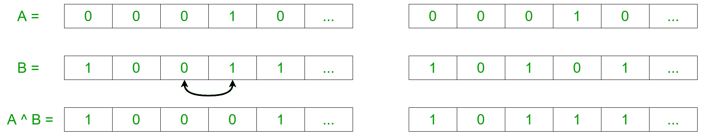

# 通过重新排列两个二进制字符串形成的不同异或的计数

> 原文:[https://www . geesforgeks . org/count-of-distinct-xors-通过重新排列两个二进制字符串形成/](https://www.geeksforgeeks.org/count-of-distinct-xors-formed-by-rearranging-two-binary-strings/)

给定两个长度相等的二进制字符串 **A** 和**B****N**，任务是通过任意重新排序两个二进制字符串来找到可能的不同异或的数量。因为数量足够大，所以求模 **10 <sup>9</sup> + 7** 的数量

**示例:**

> **输入:**A =“00”，B =“01”
> **输出:** 2
> **解释:**
> 通过重新排列字符串 B 的数字有两种可能的结果
> 它们是:“10”和“01”
> 
> **输入:** A = "010 "，B = "100"
> **输出:** 4
> **解释:**
> 通过重新排列两个字符串的数字有四种可能的结果。
> 分别是:“000”、“110”、“011”、“101”

**进场:**

*   既然我们知道

```
0 XOR 0 = 0
0 XOR 1 = 1
1 XOR 0 = 1
1 XOR 1 = 0

```

因此，要在结果字符串的任何索引处获得异或值“1”，输入字符串必须在该索引处有奇数个 1。

*   现在，我们将尝试以一种方式重新排列二进制字符串，最大数量的索引中有奇数个 1。这可以通过以下示例来可视化:



*   因此，从上面的观察来看，想法是**通过重新排序字符串来找到 1 的可能的最小和最大数量**。
    *   **要找到最大值“1”:**当形成最大值{0，1}和{1，0}对时，将出现结果中的最大值“1”。因此，

> {0，1}对的最大数量=最小值(A 中“0”的计数，B 中“1”的计数)
> 最大数量{1，0}对=最小值(A 中“1”的计数，B 中“0”的计数)
> 因此，异或中“1”的最大数量=最大数量{0，1}对+最大数量{1，0}对

*   **求最小‘1’:**这种情况可以看作是结果中最大‘0’个数的逆向。类似地，当形成最大{0，0}和{1，1}对时，结果中会出现最大“0”。因此，

> {0，0}对的最大数量=最小值(A 中“0”的计数，B 中“0”的计数)
> 最大数量{1，1}对=最小值(A 中“1”的计数，B 中“1”的计数)
> 异或中“0”的最大数量=最大数量{0，0}对+最大数量{1，1}对
> 因此，异或中“1”的最小数量= N–异或中“0”的最大数量

*   所有 1 的组合都可以在这两个数字(最小值和最大值)之间形成，两者之差为 2。
*   最后，得到结果的可能途径的总数可以由最小 1 和最大 1 的组合[的数量](https://www.geeksforgeeks.org/compute-ncr-p-set-3-using-fermat-little-theorem/)计算，步长为 2。

下面是上述方法的实现:

## C++14

```
// C++ program to find the number of
// distinct XORs formed by rearranging
// two binary strings
#include <bits/stdc++.h>

using namespace std;

// function to compute modulo power
long long power(long long a, long long b, long long mod)
{
    long long aa = 1;
    while(b)
    {

        if(b&1)
        {
            aa = aa * a;
            aa %= mod;
        }
        a = a * a;
        a %= mod;
        b /= 2;
    }

    return aa;
}

// Function to calculate nCr % p
// over a range
long long nCrRangeSum(long long n, long long r1,
                    long long r2, long long p)
{

    // Initialize the numerator
    // and denominator
    long long num = 1, den = 1;

    // Initialize the sum
    long long sum = 0;

    // nC0 is 1
    if (r1 == 0)
        sum += 1;

    // Traversing till the range
    for (int i = 0; i < r2; i++)
    {

        // Computing the numerator
        num = (num * (n - i)) % p;

        // Computing the denominator
        den = (den * (i + 1)) % p;

        // If 'i' lies between the given range
        // and is at an even long long interval from
        // the starting range because
        // the combinations at a step of 2
        // is required
        if(i - r1 >= -1 and (i - r1 + 1) % 2 == 0)
        {

            // Computing nCr and adding the value
            // sum
            sum += (num * power(den, p - 2, p)) % p;
            sum %= p;
        }
        }
    return sum;
}

// Function to find the number of
// distinct XORs formed by
// rearranging two binary strings
int compute(string A, string B, int N)
{

    // Initializing the count variable
    // to 0
    int c0A = 0, c1A = 0, c0B = 0, c1B = 0;

    // Iterating through A
    for (char c:A) {

        // Increment the c1A variable
        // if the current element is 1
        if (c == '1')
            c1A += 1;

        // Increment the c0A variable
        // if the current element is 0
        else if (c == '0')
            c0A += 1;
        }

    // Iterating through B
    for (char c:B){

        // Increment the c1B variable
        // if the current element is 1
        if (c == '1')
            c1B += 1;

        // Increment the c0A variable
        // if the current element is 0
        else if (c == '0')
            c0B += 1;
        }

    // Finding the minimum number of '1's in the XOR
    // and the maximum number of '1's in the XOR
    int max1xor = min(c0A, c1B) + min(c1A, c0B);
    int min1xor = N - min(c0B, c0A) - min(c1A, c1B);

    // Compute the number of combinations between
    // the minimum number of 1's and the maximum
    // number of 1's and perform % with 10^9 + 7
    int ans = nCrRangeSum(N, min1xor, max1xor, 1000000000 + 7);

    // Return the answer
    return ans;
}

// Driver code
int main()
{
    long long N = 3;
    string A = "010";
    string B = "100";

    cout << compute(A, B,N);
    return 0;
}

// This code is contributed by mohit kumar 29
```

## Java 语言(一种计算机语言，尤用于创建网站)

```
// JAVA program to find the number of
// distinct Bitwise XORs formed by rearranging
// two binary strings

class GFG
{
    // function to compute modular exponentiation
    // i.e. to find (a^b) % mod
    static long mod_power(long a, long b,
                          long mod)
    {
        long result = 1l;
        while(b > 0)
        {
            if((b&1) == 0) // b is even
            {
                result = a * a;
                a %= mod;
                b /= 2;
            }
            else // b is odd
            {
                result = result * a;
                result %= mod;
            }
        }
        return result;
    }

    // method to evaluate nCr modulo p
    // over an interval
    static long nCr_RangeSum(long n, long r1,
                            long r2, long p)
    {

        // initializing numerator
        // and denominator
        long num = 1, den = 1;

        // initialize the sum
        long sum = 0l;

        // nC0 is 1
        if(r1 == 0)
            sum += 1l;

        // Iterating through the range
        for(int i = 0; i < r2; i++)
        {

            // computing the numerator
            num = (num * (n - i)) % p;

            // computing the denominator
            den = (den * (i + 1)) % p;

            // If 'i' lies between the given range
            // and is at an even interval from 
            // the starting range because 
            // the combinations at a step of 2 
            // is required
            if(i - r1 >= -1 && (i - r1 + 1) % 2 == 0)
            {
                // Computing nCr and adding the value
                // to the sum  
                sum += (num * mod_power(den, p - 2, p)) % p;
                sum %= p;
            }
        }
        return sum;
    }

    // method to find the number of
    // distinct XORs formed by
    // rearrangement of two binary strings
    static long compute(String A, String B, int N)
    {
        // Initializing the counter variables
        // to 0
        int c0A = 0, c1A = 0, c0B = 0, c1B = 0;

        // Iterating through A's characters
        for (char c : A.toCharArray())
        {

            // Increment the c1A variable
            // if the current element is 1
            if (c == '1')
                c1A += 1;

            // Increment the c0A variable
            // if the current element is 0
            else if (c == '0')
                c0A += 1;
            }

        // Iterating through B's characters
        for (char c : B.toCharArray())
        {

            // Increment the c1B variable
            // if the current element is 1
            if (c == '1')
                c1B += 1;

            // Increment the c0A variable
            // if the current element is 0
            else if (c == '0')
                c0B += 1;
        }
        // Finding the minimum number of '1's in the XOR
        // and the maximum number of '1's in the XOR
        int max1xor = Math.min(c0A, c1B) + Math.min(c1A, c0B);
        int min1xor = N - Math.min(c0B, c0A) - Math.min(c1A, c1B);

        // Compute the number of combinations between
        // the minimum number of 1's and the maximum
        // number of 1's and perform modulo with 10^9 + 7
        long ans =  nCr_RangeSum(N, min1xor, max1xor, 1000000000 + 7);

        // Return the answer
        return ans;
    }

    // Driver code
    public static void main(String[] args)
    {
        int N = 3; // length of each string

        String A = "010";
        String B = "100";

        System.out.print(compute(A, B, N));
    }
}

// This Code is contributed by Soumitri Chattopadhyay.
```

## 蟒蛇 3

```
# Python3 program to find the number of
# distinct XORs formed by rearranging
# two binary strings

# Function to calculate nCr % p
# over a range
def nCrRangeSum(n, r1, r2, p):

    # Initialize the numerator
    # and denominator
    num = den = 1

    # Initialize the sum
    sum = 0

    # nC0 is 1
    if r1 == 0:
        sum += 1

    # Traversing till the range
    for i in range(r2):

        # Computing the numerator
        num = (num * (n - i)) % p

        # Computing the denominator
        den = (den * (i + 1)) % p

        # If 'i' lies between the given range
        # and is at an even interval from
        # the starting range because
        # the combinations at a step of 2
        # is required
        if(i - r1 >= -1 and (i - r1 + 1) % 2 == 0):

            # Computing nCr and adding the value
            # sum
            sum += (num * pow(den, p - 2, p)) % p
            sum %= p
    return sum

# Function to find the number of
# distinct XORs formed by
# rearranging two binary strings
def compute(A, B):

    # Initializing the count variable
    # to 0
    c0A = c1A = c0B = c1B = 0

    # Iterating through A
    for c in A:

        # Increment the c1A variable
        # if the current element is 1
        if c == '1':
            c1A += 1

        # Increment the c0A variable
        # if the current element is 0
        elif c == '0':
            c0A += 1

    # Iterating through B
    for c in B:

        # Increment the c1B variable
        # if the current element is 1
        if c == '1':
            c1B += 1

        # Increment the c0A variable
        # if the current element is 0
        elif c == '0':
            c0B += 1

    # Finding the minimum number of '1's in the XOR
    # and the maximum number of '1's in the XOR
    max1xor = min(c0A, c1B) + min(c1A, c0B)
    min1xor = N - min(c0B, c0A) - min(c1A, c1B)

    # Compute the number of combinations between
    # the minimum number of 1's and the maximum
    # number of 1's and perform % with 10^9 + 7
    ans = nCrRangeSum(N, min1xor, max1xor, 10**9 + 7)

    # Return the answer
    return ans

# Driver code
if __name__ == "__main__":

    N = 3
    A = "010"
    B = "100"

    print(compute(A, B))
```

## C#

```
// C# program to find the number of 
// distinct Bitwise XORs formed by
// rearranging two binary strings
using System;

class GFG{

// Function to compute modular exponentiation
// i.e. to find (a^b) % mod 
static long mod_power(long a, long b,
                      long mod)
{
    long result = 1;

    while (b > 0)
    {
        if ((b & 1) == 0) // b is even
        {
            result = a * a;
            a %= mod;
            b /= 2;
        }
        else // b is odd
        {
            result = result * a;
            result %= mod;
        }
    }
    return result;
}

// Function to evaluate nCr modulo p
// over an interval
static long nCr_RangeSum(long n, long r1, 
                         long r2, long p)
{

    // Initializing numerator 
    // and denominator
    long num = 1, den = 1;

    // Initialize the sum 
    long sum = 0;

    // nC0 is 1
    if (r1 == 0)
        sum += 1;

    // Iterating through the range
    for(int i = 0; i < r2; i++)
    {

        // Computing the numerator
        num = (num * (n - i)) % p;

        // Computing the denominator
        den = (den * (i + 1)) % p; 

        // If 'i' lies between the given range 
        // and is at an even interval from  
        // the starting range because  
        // the combinations at a step of 2  
        // is required 
        if (i - r1 >= -1 && (i - r1 + 1) % 2 == 0) 
        {

            // Computing nCr and adding the value 
            // to the sum   
            sum += (num * mod_power(
                  den, p - 2, p)) % p; 
            sum %= p; 
        }
    }
    return sum;
}

// Function to find the number of distinct
// XORs formed by rearrangement of two
// binary strings
static long compute(string A, string B, int N)
{

    // Initializing the counter variables 
    // to 0 
    int c0A = 0, c1A = 0, c0B = 0, c1B = 0; 

    // Iterating through A's characters 
    foreach(char c in A) 
    { 

        // Increment the c1A variable 
        // if the current element is 1 
        if (c == '1') 
            c1A += 1; 

        // Increment the c0A variable 
        // if the current element is 0 
        else if (c == '0') 
            c0A += 1; 
    } 

    // Iterating through B's characters 
    foreach(char c in B)
    { 

        // Increment the c1B variable 
        // if the current element is 1 
        if (c == '1') 
            c1B += 1; 

        // Increment the c0A variable 
        // if the current element is 0 
        else if (c == '0') 
            c0B += 1; 
    } 

    // Finding the minimum number of
    // '1's in the XOR and the maximum
    // number of '1's in the XOR 
    int max1xor = Math.Min(c0A, c1B) +
                  Math.Min(c1A, c0B); 
    int min1xor = N - Math.Min(c0B, c0A) -
                      Math.Min(c1A, c1B); 

    // Compute the number of combinations
    // between the minimum number of 1's
    // and the maximum number of 1's and
    // perform modulo with 10^9 + 7 
    long ans =  nCr_RangeSum(N, min1xor,
                 max1xor, 1000000000 + 7);

    // Return the answer 
    return ans; 
}

// Driver code
static public void Main()
{

    // Length of each string
    int N = 3;

    string A = "010"; 
    string B = "100"; 

    Console.WriteLine(compute(A, B, N));
}
}

// This code is contributed by offbeat
```

**Output:** 

```
4

```