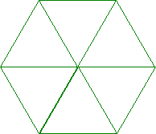
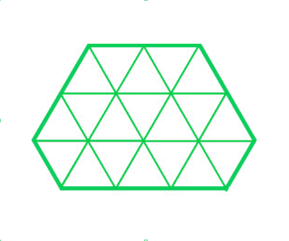
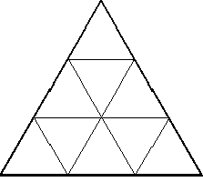
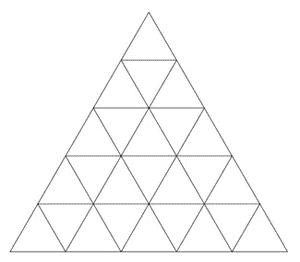
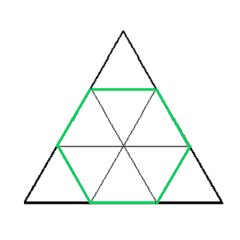
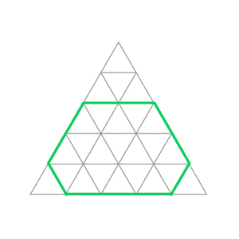

# 给定六边形中可能的单位长度等边三角形的数量

> 原文:[https://www . geeksforgeeks . org/给定六边形可能的单位长度等边三角形数/](https://www.geeksforgeeks.org/count-of-equilateral-triangles-of-unit-length-possible-from-a-given-hexagon/)

给定一个由六边形的 6 条边的长度组成的数组 **S[]** ，任务是计算由给定的六边形可以制成的单位长度的等边三角形的数量。

**示例:**

> **输入:** S = {1，1，1，1，1，1}
> **输出:** 6
> **解释:**
> 
> 
> 
> **输入** : S = {2，2，1，3，1，2}
> **输出:** 19
> **解释:**
> 
> 

**方法:**需要进行以下观察来解决给定的问题:

*   考虑一个边长为**‘X’**的等边三角形。它被分成单位长度的小三角形，每一个都是通过画平行于它的边的线来划分的。
*   下面是三个这样的等边三角形的图像:

[](https://media.geeksforgeeks.org/wp-content/uploads/20200701224436/triangle2-300x270.PNG)

**例 1: X = 2**

[](https://media.geeksforgeeks.org/wp-content/uploads/20200701224437/triangle3.gif)

**例 2: X = 3**

[](https://media.geeksforgeeks.org/wp-content/uploads/20200701224438/triangle5-300x262.jpg)

**例 3: X = 5**

*   在以上三个例子中，单位长度等边三角形的计数可能是:

> 1.  **X = 2:** Four equilateral triangles with one unit long side.
> 2.  **X = 3:** Nine equilateral triangles with a side length of one unit.
> 3.  **X = 5:** 25 equilateral triangles with one unit long side.

*   通过观察，很明显，对于边长为 **X** 的等边三角形，**X<sup>2</sup>T5】的等边三角形是可能的。**
*   将此观察扩展到六边形，在等边三角形内刻六边形，如下所示:

[](https://media.geeksforgeeks.org/wp-content/uploads/20200701234825/Untitleddesign-300x300.png)

**由边 X = 3 的等边三角形内接的正六边形，内部有 6 个小三角形。**

[](https://media.geeksforgeeks.org/wp-content/uploads/20200701234823/Untitleddesign1-300x300.png)

**由边 X = 5 的等边三角形内接的不规则六边形，内部有 19 个小三角形。**

*   可以观察到，从较大的三角形中去掉一定数量的小三角形，就可以找到给定尺寸的六边形。

对于六边形 S <sub>1</sub> 、S <sub>2</sub> 、S <sub>3</sub> 、S <sub>4</sub> 、S <sub>5</sub> 、S <sub>6</sub> 的六边形，计算单位长度三角形个数的公式可以概括为:

> 可形成的三角形数量**=(S<sub>1</sub>+S<sub>2</sub>+S<sub>3</sub>)<sup>2</sup>–S<sub>1</sub><sup>2</sup>–S<sub>3</sub>T15】2–S<sub>5</sub><sup>2</sup>**

下面是上述方法的实现:

## C++

```
// C++ program to implement
// the above approach
#include <bits/stdc++.h>
using namespace std;

// Function to calculate the
// the number of Triangles possible
int calculateTriangles(int sides[])
{
    double count = pow(sides[0] + sides[1] +
                       sides[2], 2);
    count -= pow(sides[0], 2);
    count -= pow(sides[2], 2);
    count -= pow(sides[4], 2);

    return (int)(count);
}

// Driver Code
int main()
{

    // Regular Hexagon
    int sides[] = { 1, 1, 1, 1, 1, 1 };
    cout << (calculateTriangles(sides)) << endl;

    // Irregular Hexagon
    int sides1[] = { 2, 2, 1, 3, 1, 2 };
    cout << (calculateTriangles(sides1)) << endl;

    return 0;
}

// This code is contributed by 29AjayKumar
```

## Java 语言(一种计算机语言，尤用于创建网站)

```
// Java program to implement
// the above approach
import java.util.*;

class GFG{

// Function to calculate the
// the number of Triangles possible
static int calculateTriangles(int sides[])
{
    double count = Math.pow(sides[0] + sides[1] +
                            sides[2], 2);
    count -= Math.pow(sides[0], 2);
    count -= Math.pow(sides[2], 2);
    count -= Math.pow(sides[4], 2);

    return (int)(count);
}

// Driver Code
public static void main(String[] args)
{

    // Regular Hexagon
    int sides[] = { 1, 1, 1, 1, 1, 1 };
    System.out.print((calculateTriangles(sides)) + "\n");

    // Irregular Hexagon
    int sides1[] = { 2, 2, 1, 3, 1, 2 };
    System.out.print((calculateTriangles(sides1)) + "\n");
}
}

// This code is contributed by amal kumar choubey
```

## 蟒蛇 3

```
# Python3 Program to implement
# the above approach

# Function to calculate the
# the number of Triangles possible
def calculateTriangles(sides):
    count = pow( sides[0] + sides[1] + sides[2], 2)
    count -= pow( sides[0], 2)
    count -= pow( sides[2], 2)
    count -= pow( sides[4], 2)

    return int(count)

# Driver Code

# Regular Hexagon
sides = [1, 1, 1, 1, 1, 1]
print(calculateTriangles(sides))

# Irregular Hexagon
sides = [2, 2, 1, 3, 1, 2]
print(calculateTriangles(sides))
```

## C#

```
// C# program to implement
// the above approach
using System;

class GFG{

// Function to calculate the
// the number of Triangles possible
static int calculateTriangles(int []sides)
{
    double count = Math.Pow(sides[0] + sides[1] +
                            sides[2], 2);
    count -= Math.Pow(sides[0], 2);
    count -= Math.Pow(sides[2], 2);
    count -= Math.Pow(sides[4], 2);

    return (int)(count);
}

// Driver Code
public static void Main(String[] args)
{

    // Regular Hexagon
    int []sides = { 1, 1, 1, 1, 1, 1 };
    Console.Write((calculateTriangles(sides)) + "\n");

    // Irregular Hexagon
    int []sides1 = { 2, 2, 1, 3, 1, 2 };
    Console.Write((calculateTriangles(sides1)) + "\n");
}
}

// This code is contributed by amal kumar choubey
```

## java 描述语言

```
<script>

// JavaScript program to implement
// the above approach

// Function to calculate the
// the number of Triangles possible
function calculateTriangles(sides)
{
    let count = Math.pow(sides[0] + sides[1] +
                            sides[2], 2);
    count -= Math.pow(sides[0], 2);
    count -= Math.pow(sides[2], 2);
    count -= Math.pow(sides[4], 2);

    return (count);
}

// Driver Code

    // Regular Hexagon
    let sides = [ 1, 1, 1, 1, 1, 1 ];
    document.write((calculateTriangles(sides)) + "<br/>");

    // Irregular Hexagon
    let sides1 = [ 2, 2, 1, 3, 1, 2 ];
    document.write((calculateTriangles(sides1)) + "<br/>");

</script>
```

**Output:** 

```
6
19
```

***时间复杂度:**O(1)*
T5**辅助空间:** O(1)