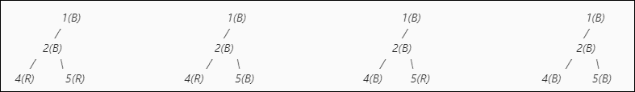

# 将任意红色节点的颜色由黑色变为黑色形成的图形数

> 原文:[https://www . geeksforgeeks . org/通过将任何红色节点的颜色从黑色变为父黑色形成的图形计数/](https://www.geeksforgeeks.org/count-of-graphs-formed-by-changing-color-of-any-red-colored-node-with-black-parent-to-black/)

给定一个由 **N** 节点和 **N-1** 边组成的[有向图](https://www.geeksforgeeks.org/graph-data-structure-and-algorithms/) **G** ，以及一个正整数 **K、**，并且最初，除了黑色的 **K、**之外，图的所有节点都是红色的，任务是计算通过将任何红色节点的颜色变为黑色而形成的不同可能图的数量，只要它们的父节点被着色为黑色，次数不限。

**示例:**

> **输入:** N = 5，K = 1，Edges[] = {{1，2}，{1，3}，{2，4}，{2，5}}
> **输出:** 10
> **解释:**
> 当节点 2 是红色时，那么我们不能改变 4 和 5 的颜色，因为它的父节点(2)不是黑色。所以，只有一种可能的上色方式。
> 
> 1(B)
> /\
> 2(R)3(R)
> /\
> 4(R)5(R)
> 但是当 2 是黑色时，那么我们可以通过 2 种可能的方式改变 4 和 5 的颜色(4 和 5 是相互独立的)，每一种(红-黑)都是因为它的母体(2)是黑色的。
> 
> 
> 
> 节点 3 也可以用两种不同的方式着色。因此，着色方式的总数是(5*2 = 10)。因此，总共有 10 个不同的可能图形。
> 
> **输入:** N = 3，K = 2，边[] = {{1，2}，{1，3}}
> **输出:** 1

**方法:**根据以下观察结果可以解决问题:

1.  给定的有向图可以被视为扎根于节点 **K.** 的[树](https://www.geeksforgeeks.org/tree-traversals-inorder-preorder-and-postorder/)，并且不同可能的图的数量与相应地给图着色的方式的数量相同。
2.  只有当父节点被涂成黑色时，任何节点的子节点才能被涂成黑色。因此，从 **K** 到当前节点的所有节点都必须涂黑。
3.  因此，想法是从 **K** 开始执行 [DFS 遍历](https://www.geeksforgeeks.org/depth-first-search-or-dfs-for-a-graph/)，并且对于每个节点，要么将当前节点涂黑，要么保持原样。然后，仅当当前节点被涂成黑色时，才遍历子树。
4.  如果当前节点有 **3** 个子节点 **U** ，并且 **X，Y，Z** 是对节点**U**子节点的子树进行着色的方式数，那么对当前子树进行着色的方式总数为 **(X*Y*Z+1)。**节点 **K** 不能着色，所以 **1** 没有添加到节点**K**

按照以下步骤解决问题:

*   从图的给定边形成一个[邻接表](https://www.geeksforgeeks.org/graph-and-its-representations/)，并将其存储在一个变量中，比如说**图**
*   定义一个[递归函数](https://www.geeksforgeeks.org/recursive-functions/)，比如说 **numOfGraph(U)** ，其中 **U** 是当前节点:
    *   如果节点 **U** 是叶子，那么返回 **2** 。因为节点可以涂成黑色或红色。
    *   初始化一个变量，比如 **cnt** ，它存储了给图形着色的方法数量。
    *   使用变量 **i** 迭代当前节点 **U、**连接的节点，并执行以下步骤:
        *   通过递归调用子节点 **i** 的函数，将 **cnt** 的值更新为 **cnt*NumberOfGraph(i)** 。
    *   完成上述步骤后，返回 **cnt+1 的值。**
*   最后，从节点 **K** 即 **numOfGraph(K)** 调用 [DFS 函数](https://www.geeksforgeeks.org/depth-first-search-or-dfs-for-a-graph/)，并打印其返回的值作为答案。

下面是上述方法的实现:

## C++

```
// C++ program for the above approach
#include <bits/stdc++.h>
using namespace std;

// Class to represents a directed graph
// using adjacency list representation

// Constructor
int V;

vector<int> graph[100];

// Function to add an edge in an directed
// graph
void addEdge(int u, int v)
{
    graph[u].push_back(v);
}

// Function to count number of
// possible graphs with given
// coloring
int numOfGraph(int u)
{

    // If node is leaf node
    if (graph[u].size() == 0)
        return 2;

    // Stores the number of ways to
    // color the subtree of node u
    int cnt = 1;

    // Traverse over the children of
    // node u
    for(int i:graph[u])
    {

        // Multiply number of possible ways
        // to color the subtree
        cnt *= numOfGraph(i);
    }

    // Return cnt
    return cnt + 1;
}

// Driver code
int main()
{

    // Create a graph
    V = 5;
    addEdge(1, 2);
    addEdge(1, 3);
    addEdge(2, 4);
    addEdge(2, 5);

    // Node initially in black
    int K = 1;

    // Function Call
    cout << (numOfGraph(K) - 1);

    return 0;
}

// This code is contributed by Mohit kumar
```

## Java 语言(一种计算机语言，尤用于创建网站)

```
// Java program for above approach
import java.util.*;

class Graph{

// Function to add an edge in an directed
// graph
static void addEdge(int u, int v,
                    ArrayList<ArrayList<Integer>> graph)
{
    graph.get(u).add(v);
}

// Function to count number of
// possible graphs with given
// coloring
static int numOfGraph(int u,
                      ArrayList<ArrayList<Integer>> graph)
{

    // If node is leaf node
    if (graph.get(u).size() == 0)
        return 2;

    // Stores the number of ways to
    // color the subtree of node u
    int cnt = 1;

    // Traverse over the children of
    // node u
    for(int i:graph.get(u))
    {

        // Multiply number of possible ways
        // to color the subtree
        cnt *= numOfGraph(i,graph);
    }

    // Return cnt
    return cnt + 1;
}

// Driver code
public static void main(String[] args)
{

    // Represents a directed graph
    // using adjacency list representation
    int V;

    ArrayList<ArrayList<Integer>> graph = new ArrayList<>();

    // Create a graph
    V = 5;
    for(int i = 0; i <= V; i++)
        graph.add(new ArrayList<>());

    addEdge(1, 2, graph);
    addEdge(1, 3, graph);
    addEdge(2, 4, graph);
    addEdge(2, 5, graph);

    // Node initially in black
    int K = 1;

    // Function Call
    System.out.println((numOfGraph(K, graph) - 1));
}
}

// This code is contributed by hritikrommie
```

## 蟒蛇 3

```
# Python3 program for the above approach

# Import library for create defaultdict
from collections import defaultdict

# Class to represents a directed graph
# using adjacency list representation

class Graph:

    # Constructor
    def __init__(self, vertices):
        self.V = vertices
        self.graph = defaultdict(list)

    # Function to add an edge in an directed
    # graph
    def addEdge(self, u, v):
        self.graph[u].append(v)

    # Function to count number of
    # possible graphs with given
    # coloring
    def numOfGraph(self, u):

        # If node is leaf node
        if u not in self.graph:
            return 2
            # Stores the number of ways to
        # color the subtree of node u
        cnt = 1

        # Traverse over the children of
        # node u
        for i in self.graph[u]:
            # Multiply number of possible ways
            # to color the subtree
            cnt *= self.numOfGraph(i)

        # Return cnt
        return cnt + 1

# Driver code
if __name__ == "__main__":

    # Create a graph
    g = Graph(5)
    g.addEdge(1, 2)
    g.addEdge(1, 3)
    g.addEdge(2, 4)
    g.addEdge(2, 5)

    # Node initially in black
    K = 1

    # Function Call
    print(g.numOfGraph(K)-1)
```

## C#

```
// C# program for the above approach
using System;
using System.Collections.Generic;
using System.Linq;
using System.Text;

public class Graph{

static int V;

//Adjacency Lists
static LinkedList<int>[] graph;

// Function to add an edge in an directed
// graph
public void addEdge(int u, int v)
{       
    graph[u].AddLast(v);
}

public Graph(int v)
{
    graph = new LinkedList<int>[v];
    for(int i = 0; i <= V; i++)
    {
        graph[i] = new LinkedList<int>();
    }
}

// Function to count number of
// possible graphs with given
// coloring
static int numOfGraph(int u)
{

    // If node is leaf node
    if (graph[u].Count == 0)
        return 2;

    // Stores the number of ways to
    // color the subtree of node u
    int cnt = 1;

    // Traverse over the children of
    // node u
    foreach (var i in graph[u])
    {

        // Multiply number of possible ways
        // to color the subtree
        cnt *= numOfGraph(i);
    }

    // Return cnt
    return cnt + 1;
}

// Driver code
static public void Main (){

      V = 5;

    // Create a graph
      Graph g = new Graph(100);

    g.addEdge(1, 2);
    g.addEdge(1, 3);
    g.addEdge(2, 4);
    g.addEdge(2, 5);

    // Node initially in black
    int K = 1;

    // Function Call
    Console.WriteLine(numOfGraph(K) - 1);
}
}

// This code is contributed by Dharanendra L V.
```

## java 描述语言

```
<script>
    // Javascript program for the above approach

    let V;

    //Adjacency Lists
    let graph = new Array(100);
    for(let i = 0; i < 100; i++)
    {
        graph[i] = []
    }

    // Function to add an edge in an directed
    // graph
    function addEdge(u, v)
    {      
        graph[u].push(v);
    }

    // Function to count number of
    // possible graphs with given
    // coloring
    function numOfGraph(u)
    {

        // If node is leaf node
        if (graph[u].length == 0)
            return 2;

        // Stores the number of ways to
        // color the subtree of node u
        let cnt = 1;

        // Traverse over the children of
        // node u
        for(let i = 0; i < graph[u].length; i++)
        {

            // Multiply number of possible ways
            // to color the subtree
            cnt *= numOfGraph(graph[u][i]);
        }

        // Return cnt
        return cnt + 1;
    }

    // Create a graph
    V = 5;
    addEdge(1, 2);
    addEdge(1, 3);
    addEdge(2, 4);
    addEdge(2, 5);

    // Node initially in black
    let K = 1;

    // Function Call
    document.write(numOfGraph(K) - 1);

// This code is contributed by decode2207.
</script>
```

**Output**

```
10
```

***时间复杂度:******O(N)*
***辅助空间:** O(1)***