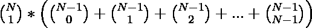
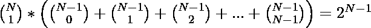

# 每组只有一个领导的 N 个人的组数

> 原文:[https://www . geesforgeks . org/每组只有一个领导者的 n 人中的组数/](https://www.geeksforgeeks.org/count-of-groups-among-n-people-having-only-one-leader-in-each-group/)

给定 **N** 人的数量，任务是统计形成大小组**的方法数量？N** 其中，在每个组中，组的第一个元素是组的领导者。
**注:**

*   同一个人有不同领导的团体被视为不同的团体。**例如:**组{1，2，3}和{2，1，3}被视为不同的组，因为它们分别具有不同的领导者 1 和 2。
*   领导相同、人员相同的小组被视为一个小组。**例如:**组{1，3，2}和{1，2，3}被视为同一个组，因为它们有相同的领导者和相同的人。
*   答案可以很大，取模到 **(1e9+7)。**

**示例:**

> **输入:** N = 3
> **输出:** 12
> **说明:**
> 有领导的总组为:
> 有领导 1 的组:
> 1。{1}
> 2。{1，2}
> 3。{1，3}
> 4。{1，2，3}
> 组，组长 2:
> 5。{2}
> 6。{2，1}
> 7。{2，3}
> 8。{2，1，3}
> 组，组长 3:
> 9。{3}
> 10。{3，1}
> 11。{3，2}
> 12。{3，1，2}
> **输入:** N = 5
> **输出:** 80

**方法:**这个问题可以用[二项式系数](https://www.geeksforgeeks.org/binomial-coefficient-dp-9/)和[模幂](https://www.geeksforgeeks.org/modular-exponentiation-power-in-modular-arithmetic/)的概念来解决。以下是对这个问题陈述的观察:

*   在 **N** 个人中选择一个领导的方式数为 **C(N，1)** 。
*   对于每个领导者，我们可以选择一组大小为 **K** 的 **0 ≤ K ≤ N-1** 来进行可能数量的分组。
*   因此，总数方式由 **N** 和剩余**(N–1)**元素中的选择 **K** 元素的乘积给出如下:

    > 总途径= 

通过使用二项式定理，二项式系数的总和可以写成:

> 

因此，选择只有一个领导者的小组的方法有

> 

下面是上述方法的实现:

## C++

```
// C++ program for the above approach

#include <bits/stdc++.h>
using namespace std;

long long mod = 1000000007;

// Function to find 2^x using
// modular exponentiation
int exponentMod(int A, int B)
{
    // Base cases
    if (A == 0)
        return 0;
    if (B == 0)
        return 1;

    // If B is even
    long long y;
    if (B % 2 == 0) {
        y = exponentMod(A, B / 2);
        y = (y * y) % mod;
    }

    // If B is odd
    else {
        y = A % mod;
        y = (y * exponentMod(A, B - 1)
             % mod)
            % mod;
    }

    return (int)((y + mod) % mod);
}

// Function to count the number of
// ways to form the group having
// one leader
void countWays(int N)
{

    // Find 2^(N-1) using modular
    // exponentiation
    long long select = exponentMod(2,
                                   N - 1);

    // Count total ways
    long long ways
        = ((N % mod)
           * (select % mod));

    ways %= mod;

    // Print the total ways
    cout << ways;
}

// Driver Code
int main()
{

    // Given N number of peoples
    int N = 5;

    // Function Call
    countWays(N);
}
```

## Java 语言(一种计算机语言，尤用于创建网站)

```
// Java program for the above approach
import java.util.*;
class GFG{

static long mod = 1000000007;

// Function to find 2^x using
// modular exponentiation
static int exponentMod(int A, int B)
{
    // Base cases
    if (A == 0)
        return 0;
    if (B == 0)
        return 1;

    // If B is even
    long y;
    if (B % 2 == 0) 
    {
        y = exponentMod(A, B / 2);
        y = (y * y) % mod;
    }

    // If B is odd
    else 
    {
        y = A % mod;
        y = (y * exponentMod(A, B - 1) % 
                                  mod) % mod;
    }

    return (int)((y + mod) % mod);
}

// Function to count the number of
// ways to form the group having
// one leader
static void countWays(int N)
{

    // Find 2^(N-1) using modular
    // exponentiation
    long select = exponentMod(2, N - 1);

    // Count total ways
    long ways = ((N % mod) * (select % mod));

    ways %= mod;

    // Print the total ways
    System.out.print(ways);
}

// Driver Code
public static void main(String[] args)
{

    // Given N number of peoples
    int N = 5;

    // Function Call
    countWays(N);
}
}

// This code is contributed by sapnasingh4991
```

## 蟒蛇 3

```
# Python3 program for the above approach
mod = 1000000007

# Function to find 2^x using
# modular exponentiation
def exponentMod(A, B):

    # Base cases
    if (A == 0):
        return 0;
    if (B == 0):
        return 1;

    # If B is even
    y = 0;

    if (B % 2 == 0):
        y = exponentMod(A, B // 2);
        y = (y * y) % mod;

    # If B is odd
    else:
        y = A % mod;
        y = (y * exponentMod(A, B - 1) %
                                  mod) % mod;

    return ((y + mod) % mod);

# Function to count the number of
# ways to form the group having
# one leader
def countWays(N):

    # Find 2^(N-1) using modular
    # exponentiation
    select = exponentMod(2, N - 1);

    # Count total ways
    ways = ((N % mod) * (select % mod));

    ways %= mod;

    # Print the total ways
    print(ways)

# Driver code        
if __name__=='__main__':

    # Given N number of people
    N = 5;

    # Function call
    countWays(N);

# This code is contributed by rutvik_56
```

## C#

```
// C# program for the above approach
using System;
class GFG{

static long mod = 1000000007;

// Function to find 2^x using
// modular exponentiation
static int exponentMod(int A, int B)
{
    // Base cases
    if (A == 0)
        return 0;
    if (B == 0)
        return 1;

    // If B is even
    long y;
    if (B % 2 == 0) 
    {
        y = exponentMod(A, B / 2);
        y = (y * y) % mod;
    }

    // If B is odd
    else
    {
        y = A % mod;
        y = (y * exponentMod(A, B - 1) % 
                                  mod) % mod;
    }

    return (int)((y + mod) % mod);
}

// Function to count the number of
// ways to form the group having
// one leader
static void countWays(int N)
{

    // Find 2^(N-1) using modular
    // exponentiation
    long select = exponentMod(2, N - 1);

    // Count total ways
    long ways = ((N % mod) * (select % mod));

    ways %= mod;

    // Print the total ways
    Console.Write(ways);
}

// Driver Code
public static void Main(String[] args)
{

    // Given N number of peoples
    int N = 5;

    // Function Call
    countWays(N);
}
}

// This code is contributed by sapnasingh4991
```

## java 描述语言

```
<script>

// Javascript program for the above approach

let mod = 1000000007;

// Function to find 2^x using
// modular exponentiation
function exponentMod(A, B)
{
    // Base cases
    if (A == 0)
        return 0;
    if (B == 0)
        return 1;

    // If B is even
    let y;
    if (B % 2 == 0) {
        y = exponentMod(A, B / 2);
        y = (y * y) % mod;
    }

    // If B is odd
    else {
        y = A % mod;
        y = (y * exponentMod(A, B - 1)
            % mod)
            % mod;
    }

    return ((y + mod) % mod);
}

// Function to count the number of
// ways to form the group having
// one leader
function countWays(N)
{

    // Find 2^(N-1) using modular
    // exponentiation
    let select = exponentMod(2,
                                N - 1);

    // Count total ways
    let ways
        = ((N % mod)
        * (select % mod));

    ways %= mod;

    // Print the total ways
    document.write(ways);
}

// Driver Code

    // Given N number of peoples
    let N = 5;

    // Function Call
    countWays(N);

// This code is contributed by Mayank Tyagi

</script>
```

**Output:** 

```
80
```

***时间复杂度:** O(log N)*
***辅助空间:** O(1)*