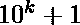
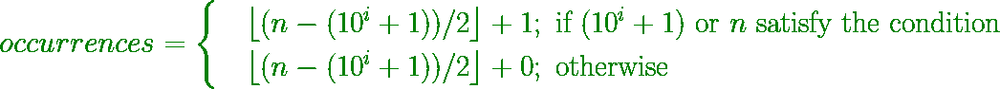
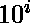

# 奇数位数为偶数、偶数位数为奇数的范围内的整数个数

> 原文:[https://www . geesforgeks . org/范围内整数的计数，其中奇数为偶数，偶数为奇数/](https://www.geeksforgeeks.org/count-of-integers-in-a-range-which-have-even-number-of-odd-digits-and-odd-number-of-even-digits/)

给定一个范围**【L，R】**，任务是统计奇数位数为偶数，偶数位数为奇数的数字。例如，

1.  8 有 1 个偶数和 0 个奇数–满足条件，因为 1 是奇数，0 是偶数。
2.  545 有 1 个偶数和 2 个奇数–满足条件，因为 1 是奇数，2 是偶数。
3.  4834 有 3 个偶数和 1 个奇数–不满足条件，因为奇数中有奇数(即 1)。

**示例:**

> **输入:** L = 1，R = 9
> **输出:** 4
> 2、4、6、8 是
> 给定范围内唯一满足给定条件的整数。
> 
> **输入:** L = 1，R = 19
> T3】输出: 4
> 
> **输入:** L = 123，R = 984
> T3】输出: 431

**进场:**

*   **案例 1**
    这些数字出现在和之间(其中 1 < =k < =18)。
    发生次数从
    *   1–10 和 1–100 是 4
    *   1–1000 和 1–10000 是 454
    *   1–10000 和 1–100000 是 45454
*   **案例 2**
    *   如果一个数的位数是偶数，那么它不能满足给定的条件，因为我们需要一个奇数(位数)和一个偶数(位数)来满足我们的条件，奇数+偶数总是奇数
    *   因此，如果给定数字(比如 n)的位数是偶数，那么它从 1 开始的出现次数等于从到小于 n 的最大 (1 < =k < =18)的出现次数

> **例:**
> 设 n = 19，19 中的位数为 2
> 因此从 1–19 的出现次数=从 1–10 的出现次数(从 10 开始最大的小于 19)

*   **情况 3**
    如果给定数字(比如 n)的位数是奇数，则和 **n** 之间的出现次数等于



其中最大小于 n。

**实现:**现在我们来看如何计算从 1 到给定 n 的出现次数，因此，
从 L 到 R 的出现次数= Number of concurrencesupto(R)–Number of concurrencesupto(L–1)，其中 L 不等于 1。

下面是上述方法的实现:

## C++14

```
// C++ implementation of the approach
#include <bits/stdc++.h>
using namespace std;

#define ll long long

// Pattern table from Case 1
map<ll, ll> values{{1, 0},
                   {10, 4},
                   {100, 4},
                   {1000, 454},
                   {10000, 454},
                   {100000, 45454},
                   {1000000, 45454},
                   {10000000, 4545454},
                   {100000000, 4545454},
                   {1000000000, 454545454},
                   {10000000000, 454545454},
                   {100000000000, 45454545454},
                   {1000000000000, 45454545454},
                   {10000000000000, 4545454545454},
                   {100000000000000, 4545454545454},
                   {1000000000000000, 454545454545454},
                   {10000000000000000, 454545454545454},
                   {100000000000000000, 45454545454545454},
                   {1000000000000000000, 45454545454545454}};

// Function that returns the number of
// even and odd digits in val
pair<ll, ll> count_even_odd(ll val)
{
    ll even = 0, odd = 0;
    while (val)
    {
        ll num = val % 10;
        if (num % 2 == 0)
            even++;
        else
            odd++;
        val /= 10;
    }
    return make_pair(even, odd);
}

// Function that returns True if num
// satisfies the given condition
bool satisfies_condition(ll num)
{
    pair<ll, ll> answer = count_even_odd(num);
    ll even = answer.first;
    ll odd = answer.second;

    if (even % 2 == 1 and
         odd % 2 == 0) return true;
    return false;
}

// Function to return the count of
// numbers from 1 to val that
// satisfies the given condition
ll count_upto(ll val)
{
    // If the value is already present
    // in the values dict
    if (values.find(val) != values.end())
        return values[val];

    ll index = 1;
    for (int i = 0;
             i < to_string(val).length() - 1;
             i++)
         index *= 10;

    // If the value is even
    // Case 2
    if (to_string(val).length() % 2 == 0)
        return values[index];

    ll val_len = to_string(val).length();
    ll cnt = values[index];

    // Now the problem is to count the desired
    // numbers from 10**(val_len-1) + 1 to val
    ll left_end = index + 1;

    // Case 3
    // Eliminating all the even numbers
    cnt += (val - left_end) / 2;
    if (satisfies_condition(val) or
        satisfies_condition(left_end))
        cnt++;

    return cnt;
}

// Driver Code
int main()
{
    // Input l and r
    ll l = 123, r = 984;
    ll right = count_upto(r);
    ll left = 0;

    if (l == '1')
        left = 0;
    else
        left = count_upto(l - 1);

    cout << right - left << endl;
    return 0;
}

// This code is contributed by
// sanjeev2552
```

## Java 语言(一种计算机语言，尤用于创建网站)

```
// Java implementation of the approach
import java.io.*;
import java.lang.*;
import java.util.*;

class GFG{

// Pattern table from Case 1
static HashMap<Long, Long> values = new HashMap<>();

public static void intitializeMap()
{
    values = new HashMap<>();
    values.put(1L, 0L);
    values.put(10L, 4L);
    values.put(100L, 4L);
    values.put(1000L, 454L);
    values.put(10000L, 454L);
    values.put(100000L, 45454L);
    values.put(1000000L, 45454L);
    values.put(10000000L, 4545454L);
    values.put(100000000L, 4545454L);
    values.put(1000000000L, 454545454L);
    values.put(10000000000L, 454545454L);
    values.put(100000000000L, 45454545454L);
    values.put(1000000000000L, 45454545454L);
    values.put(10000000000000L, 4545454545454L);
    values.put(100000000000000L, 4545454545454L);
    values.put(1000000000000000L, 454545454545454L);
    values.put(10000000000000000L, 454545454545454L);
    values.put(100000000000000000L, 45454545454545454L);
    values.put(1000000000000000000L, 45454545454545454L);
}

// Function that returns the number of
// even and odd digits in val
static long[] count_even_odd(long val)
{
    long even = 0, odd = 0;
    while (val > 0)
    {
        long num = val % 10;
        if (num % 2 == 0)
            even++;
        else
            odd++;

        val /= 10;
    }
    return (new long[] { even, odd });
}

// Function that returns True if num
// satisfies the given condition
static boolean satisfies_condition(long num)
{
    long[] answer = count_even_odd(num);
    long even = answer[0];
    long odd = answer[1];

    if (even % 2 == 1 && odd % 2 == 0)
        return true;

    return false;
}

// Function to return the count of
// numbers from 1 to val that
// satisfies the given condition
static long count_upto(long val)
{

    // If the value is already present
    // in the values dict
    if (values.containsKey(val))
        return values.get(val);

    long index = 1;
    for(int i = 0;
            i < Long.toString(val).length() - 1;
            i++)
        index *= 10;

    // If the value is even
    // Case 2
    if (Long.toString(val).length() % 2 == 0)
        return values.get(index);

    long val_len = Long.toString(val).length();
    long cnt = values.get(index);

    // Now the problem is to count the desired
    // numbers from 10**(val_len-1) + 1 to val
    long left_end = index + 1;

    // Case 3
    // Eliminating all the even numbers
    cnt += (val - left_end) / 2;
    if (satisfies_condition(val) ||
        satisfies_condition(left_end))
        cnt++;

    return cnt;
}

// Driver Code
public static void main(String[] args)
{

    // Input l and r
    long l = 123, r = 984;

    // Function to initialize the Map
    intitializeMap();

    long right = count_upto(r);
    long left = 0;

    if (l == '1')
        left = 0;
    else
        left = count_upto(l - 1);

    System.out.println(right - left);
}
}

// This code is contributed by Kingash
```

## 蟒蛇 3

```
# Python3 implementation of the approach

# Pattern table from Case 1
values = {
    1: 0,
    10: 4,
    100: 4,
    1000: 454,
    10000: 454,
    100000: 45454,
    1000000: 45454,
    10000000: 4545454,
    100000000: 4545454,
    1000000000: 454545454,
    10000000000: 454545454,
    100000000000: 45454545454,
    1000000000000: 45454545454,
    10000000000000: 4545454545454,
    100000000000000: 4545454545454,
    1000000000000000: 454545454545454,
    10000000000000000: 454545454545454,
    100000000000000000: 45454545454545454,
    1000000000000000000: 45454545454545454,
}

# Function that returns the number of
# even and odd digits in val
def count_even_odd(val):
    even = odd = 0
    while val > 0:
        num = val % 10
        if num % 2 == 0:
            even += 1
        else:
            odd += 1
        val //= 10

    return even, odd

# Function that returns True if num
# satisfies the given condition
def satisfies_condition(num):
    even, odd = count_even_odd(num)
    if even % 2 == 1 and odd % 2 == 0:
        return True
    return False

# Function to return the count of numbers
# from 1 to val that satisfies the given condition
def count_upto(val):

    # If the value is already present in the
    # values dict
    if int(val) in values:
        return values[int(val)]

    # If the value is even
    # Case 2
    if len(val) % 2 == 0:
        return values[int('1' + '0' * (len(val) - 1))]

    val_len = len(val)
    count = values[int('1' + '0' * (val_len - 1))]

    # Now the problem is to count the desired
    # numbers from 10**(val_len-1) + 1 to val
    left_end = int('1' + '0' * (val_len - 1)) + 1

    # Case 3
    # Eliminating all the even numbers
    count += (int(val) - left_end) // 2

    if satisfies_condition(int(val)) or satisfies_condition(left_end):
        count += 1
    return count

if __name__ == '__main__':

    # Input L and R ( as a string )
    l, r = '123', '984'

    right = count_upto(r)

    left = 0
    if(l == '1'):
        left = 0
    else:
        left = count_upto(str(int(l)-1))

    print(right - left)
```

## C#

```
// C# implementation of the approach
using System;
using System.Collections.Generic;

class GFG{

// Pattern table from Case 1
static Dictionary<long,
                  long> values = new Dictionary<long,
                                                long>();

public static void intitializeMap()
{
    values = new Dictionary<long, long>();
    values.Add(1L, 0L);
    values.Add(10L, 4L);
    values.Add(100L, 4L);
    values.Add(1000L, 454L);
    values.Add(10000L, 454L);
    values.Add(100000L, 45454L);
    values.Add(1000000L, 45454L);
    values.Add(10000000L, 4545454L);
    values.Add(100000000L, 4545454L);
    values.Add(1000000000L, 454545454L);
    values.Add(10000000000L, 454545454L);
    values.Add(100000000000L, 45454545454L);
    values.Add(1000000000000L, 45454545454L);
    values.Add(10000000000000L, 4545454545454L);
    values.Add(100000000000000L, 4545454545454L);
    values.Add(1000000000000000L, 454545454545454L);
    values.Add(10000000000000000L, 454545454545454L);
    values.Add(100000000000000000L, 45454545454545454L);
    values.Add(1000000000000000000L, 45454545454545454L);
}

// Function that returns the number of
// even and odd digits in val
static long[] count_even_odd(long val)
{
    long even = 0, odd = 0;

    while (val > 0)
    {
        long num = val % 10;
        if (num % 2 == 0)
            even++;
        else
            odd++;

        val /= 10;
    }
    return (new long[]{ even, odd });
}

// Function that returns True if num
// satisfies the given condition
static bool satisfies_condition(long num)
{
    long[] answer = count_even_odd(num);
    long even = answer[0];
    long odd = answer[1];

    if (even % 2 == 1 && odd % 2 == 0)
        return true;

    return false;
}

// Function to return the count of
// numbers from 1 to val that
// satisfies the given condition
static long count_upto(long val)
{

    // If the value is already present
    // in the values dict
    if (values.ContainsKey(val))
        return values[val];

    long index = 1;
    for(int i = 0;
            i < val.ToString().Length - 1;
            i++)
        index *= 10;

    // If the value is even
    // Case 2
    if (val.ToString().Length % 2 == 0)
        return values[index];

    long val_len = val.ToString().Length;
    long cnt = values[index];

    // Now the problem is to count the desired
    // numbers from 10**(val_len-1) + 1 to val
    long left_end = index + 1;

    // Case 3
    // Eliminating all the even numbers
    cnt += (val - left_end) / 2;
    if (satisfies_condition(val) ||
        satisfies_condition(left_end))
        cnt++;

    return cnt;
}

// Driver Code
public static void Main(String[] args)
{

    // Input l and r
    long l = 123, r = 984;

    // Function to initialize the Map
    intitializeMap();

    long right = count_upto(r);
    long left = 0;

    if (l == '1')
        left = 0;
    else
        left = count_upto(l - 1);

    Console.WriteLine(right - left);
}
}

// This code is contributed by umadevi9616
```

**Output:** 

```
431
```

**时间复杂度:**O(logn)
T3】辅助空间: O(19*2)