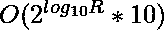
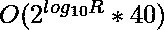

# 每个数字频率为偶数的[L，R]范围内整数的计数

> 原文:[https://www . geesforgeks . org/范围内整数计数-l-r-每位数具有偶数频率/](https://www.geeksforgeeks.org/count-of-integers-in-range-l-r-having-even-frequency-of-each-digit/)

给定两个整数 **L** 和 **R** ，任务是找出**【L，R】**范围内的整数个数，使得整数中每个数字的[频率为偶数。](https://www.geeksforgeeks.org/find-the-frequency-of-a-digit-in-a-number/)

**示例:**

> **输入:** L = 47，R = 999
> **输出:** 5
> **说明:**在[47，999]范围内且符合给定条件的整数为{55，66，77，88，99}。
> 
> **输入:** L = 32，R = 1010
> **输出:** 9
> **说明:**在[32，1010]范围内且符合给定条件的整数为{33，44，55，66，77，88，99，1001，1010}。

**方法:**上述问题可以借助[位屏蔽和动态编程](https://www.geeksforgeeks.org/bitmasking-and-dynamic-programming-set-1-count-ways-to-assign-unique-cap-to-every-person/)解决。以下是一些可用于解决给定问题的观察结果:

*   [具有 10 位的位掩码](https://www.geeksforgeeks.org/bitmasking-and-dynamic-programming-set-1-count-ways-to-assign-unique-cap-to-every-person/)可用于存储范围**【0，9】**中每个数字的奇偶校验，其中 **i <sup>th</sup>** 设置位将整数中数字 **i** 的频率表示为奇数。
*   让我们定义一个函数 **countInt(X)** 来计算有效整数在**【1，X】**范围内的计数。因此，范围**【L，R】**的答案可以计算为**count int(R)–count int(L-1)**。

考虑一个 [4D 数组](https://www.geeksforgeeks.org/4-dimensional-array-c-cpp/)表示**DP[][][][][]**，其中 **dp【掩码】【长度】【较小】【起始】**，其中**掩码**表示位掩码，表示从 **0** 到 **9** ，**长度**表示当前数字中的数字总数，**较小**表示当前数字是否小于上限，即在于以下是要遵循的步骤:

*   创建一个[递归函数](https://www.geeksforgeeks.org/recursive-functions/)来遍历整数的每个索引，并为整数当前索引处的每个有效数字递归调用该函数。
*   跟踪变量**开始的**中的前导零，以防止它们在计数中重复。
*   如果当前指数是最高有效指数，有效数字必须在**【1，9】**范围内，否则可以在**【0，9】**范围内。
*   如果将当前数字放入整数的当前索引中后，**形成整数< =范围的上限**，则当前数字为有效数字。
*   如果已经计算了当前状态，则记录每个状态的计数并返回记录的值。

下面是上述方法的实现:

## C++

```
// C++ program for the above approach

#include <bits/stdc++.h>
using namespace std;

// Stores the upper limit of the range
string s;

// Stores the overlapping states
int dp[1024][10][2][2];

// Recursive Function to calculate the
// count of valid integers in the range
// [1, s] using memoization
int calcCnt(int mask, int len,
            int smaller, int started)
{
    // Base Case
    if (len == s.size()) {

        // If current integer has even
        // count of digits and is not
        // repeated
        return (mask == 0 && started);
    }

    // If current state is already
    // considered
    if (dp[mask][len][smaller][started] != -1)
        return dp[mask][len][smaller][started];

    // Stores the maximum valid digit at
    // the current index
    int mx = 9;
    if (!smaller) {
        mx = s[len] - '0';
    }

    // Stores the count of valid integers
    int ans = 0;

    // If the current digit is not the
    // most significant digit, i.e, the
    // integer is already started
    if (started) {

        // Iterate through all valid digits
        for (int i = 0; i <= mx; i++) {

            // Recursive call for ith digit
            // at the current index
            ans += calcCnt(mask ^ (1 << i), len + 1,
                           smaller || (i < s[len] - '0'), 1);
        }
    }
    else {

        // Recursive call for integers having
        // leading zeroes in the beginning
        ans = calcCnt(mask, len + 1, 1, 0);

        // Iterate through all valid digits as
        // most significant digits
        for (int i = 1; i <= mx; i++) {

            // Recursive call for ith digit
            // at the current index
            ans += calcCnt(mask ^ (1 << i), len + 1,
                           smaller || (i < s[len] - '0'), 1);
        }
    }

    // Return answer
    return dp[mask][len][smaller][started] = ans;
}

// Function to calculate valid number in
// the range [1, X]
int countInt(int x)
{
    // Initialize dp array with -1
    memset(dp, -1, sizeof(dp));

    // Store the range in form of string
    s = to_string(x);

    // Return Count
    return calcCnt(0, 0, 0, 0);
}

// Function to find the count of integers
// in the range [L, R] such that the
// frequency of each digit is even
int countIntInRange(int L, int R)
{
    return countInt(R) - countInt(L - 1);
}

// Driver Code
int main()
{
    int L = 32, R = 1010;
    cout << countIntInRange(L, R);

    return 0;
}
```

## Java 语言(一种计算机语言，尤用于创建网站)

```
// Java program for the above approach
import java.util.*;
class GFG{

// Stores the upper limit of the range
static String s;

// Stores the overlapping states
static int [][][][] dp = new int[1024][10][2][2];

// Function to convert Integer to boolean
static boolean toBoolean(int smaller)
{
    if (smaller >= 1)
        return true;
    else
       return false; 
}

// Recursive Function to calculate the
// count of valid integers in the range
// [1, s] using memoization
static int calcCnt(int mask, int len,
            int smaller, int started)
{
    // Base Case
    if (len == s.length()) {

        // If current integer has even
        // count of digits and is not
        // repeated
        if (mask == 0 && started !=0)
          return 1;
        else
          return 0;

    }

    // If current state is already
    // considered
    if (dp[mask][len][smaller][started] != -1)
        return dp[mask][len][smaller][started];

    // Stores the maximum valid digit at
    // the current index
    int mx = 9;
    if (smaller == 0) {
        mx = (int)s.charAt(len) - 48;
    }

    // Stores the count of valid integers
    int ans = 0;

    // If the current digit is not the
    // most significant digit, i.e, the
    // integer is already started
    if (started !=0) {

        // Iterate through all valid digits
        for (int i = 0; i <= mx; i++) {

            // Recursive call for ith digit
            // at the current index
            ans += calcCnt(mask ^ (1 << i), len + 1,
                           toBoolean(smaller) || (i < (int)s.charAt(len) - 48)?1:0,
                           1);
        }
    }
    else {

        // Recursive call for integers having
        // leading zeroes in the beginning
        ans = calcCnt(mask, len + 1, 1, 0);

        // Iterate through all valid digits as
        // most significant digits
        for (int i = 1; i <= mx; i++) {

            // Recursive call for ith digit
            // at the current index
            ans += calcCnt(mask ^ (1 << i), len + 1,
                           toBoolean(smaller) || (i < (int)s.charAt(len) - 48)?1:0,
                           1);
        }
    }

    // Return answer
    dp[mask][len][smaller][started] = ans;
    return ans;
}

// Function to calculate valid number in
// the range [1, X]
static int countInt(int x)
{
    // Initialize dp array with -1
    for(int i = 0; i < 1024; i++){
      for(int j = 0; j < 10; j++){
        for(int k = 0; k < 2; k++){
          for(int l = 0; l < 2; l++)
            dp[i][j][k][l] = -1;
        }
      }
    }

    // Store the range in form of string
    s = Integer.toString(x);

    // Return Count
    return calcCnt(0, 0, 0, 0);
}

// Function to find the count of integers
// in the range [L, R] such that the
// frequency of each digit is even
static int countIntInRange(int L, int R)
{
    return countInt(R) - countInt(L - 1);
}

// Driver Code
public static void main(String [] args)
{
    int L = 32, R = 1010;
    System.out.println(countIntInRange(L, R));
}
}

// This code is contributed by ihritik
```

## 蟒蛇 3

```
# Python program for the above approach

# Stores the upper limit of the range
s = ""

# Stores the overlapping states
dp = [[[[0 for _ in range(2)] for _ in range(2)]
       for _ in range(10)] for _ in range(1024)]

# Recursive Function to calculate the
# count of valid integers in the range
#  [1, s] using memoization
def calcCnt(mask, sz, smaller, started):

    # Base Case
    if (sz == len(s)):

        # If current integer has even
        # count of digits and is not
        # repeated
        return (mask == 0 and started)

    # If current state is already
    # considered
    if (dp[mask][sz][smaller][started] != -1):
        return dp[mask][sz][smaller][started]

    # Stores the maximum valid digit at
    # the current index
    mx = 9
    if (not smaller):
        mx = ord(s[sz]) - ord('0')

    # Stores the count of valid integers
    ans = 0

    # If the current digit is not the
    # most significant digit, i.e, the
    # integer is already started
    if (started):

        # Iterate through all valid digits
        for i in range(0, mx+1):

            # Recursive call for ith digit
            # at the current index
            ans += calcCnt(mask ^ (1 << i), sz + 1,
                           smaller or (i < ord(s[sz]) - ord('0')), 1)
    else:

        # Recursive call for integers having
        # leading zeroes in the beginning
        ans = calcCnt(mask, sz + 1, 1, 0)

        # Iterate through all valid digits as
        # most significant digits
        for i in range(1, mx+1):

            # Recursive call for ith digit
            # at the current index
            ans += calcCnt(mask ^ (1 << i), sz + 1,
                           smaller or (i < ord(s[sz]) - ord('0')), 1)
    # Return answer
    dp[mask][sz][smaller][started] = ans
    return dp[mask][sz][smaller][started]

# Function to calculate valid number in
# the range [1, X]
def countInt(x):

    # Initialize dp array with -1
    global dp
    dp = [[[[-1 for _ in range(2)] for _ in range(2)]
           for _ in range(10)] for _ in range(1024)]

    # Store the range in form of string
    global s
    s = str(x)

    # Return Count
    return calcCnt(0, 0, 0, 0)

# Function to find the count of integers
# in the range [L, R] such that the
# frequency of each digit is even
def countIntInRange(L, R):
    return countInt(R) - countInt(L - 1)

# Driver Code
if __name__ == "__main__":
    L = 32
    R = 1010
    print(countIntInRange(L, R))

    # This code is contributed by rakeshsahni
```

## C#

```
// C# program for the above approach
using System;
using System.Collections.Generic;

class GFG{

// Stores the upper limit of the range
static string s;

// Stores the overlapping states
static int [,,,]dp = new int[1024, 10, 2, 2];

// Recursive Function to calculate the
// count of valid integers in the range
// [1, s] using memoization
static int calcCnt(int mask, int len,
            int smaller, int started)
{
    // Base Case
    if (len == s.Length) {

        // If current integer has even
        // count of digits and is not
        // repeated
        if (mask == 0 && started !=0)
          return 1;
        else
          return 0;

    }

    // If current state is already
    // considered
    if (dp[mask, len, smaller, started] != -1)
        return dp[mask, len, smaller, started];

    // Stores the maximum valid digit at
    // the current index
    int mx = 9;
    if (smaller == 0) {
        mx = (int)s[len] - 48;
    }

    // Stores the count of valid integers
    int ans = 0;

    // If the current digit is not the
    // most significant digit, i.e, the
    // integer is already started
    if (started !=0) {

        // Iterate through all valid digits
        for (int i = 0; i <= mx; i++) {

            // Recursive call for ith digit
            // at the current index
            ans += calcCnt(mask ^ (1 << i), len + 1,
                           Convert.ToBoolean(smaller) || (i < (int)s[len] - 48)?1:0,
                           1);
        }
    }
    else {

        // Recursive call for integers having
        // leading zeroes in the beginning
        ans = calcCnt(mask, len + 1, 1, 0);

        // Iterate through all valid digits as
        // most significant digits
        for (int i = 1; i <= mx; i++) {

            // Recursive call for ith digit
            // at the current index
            ans += calcCnt(mask ^ (1 << i), len + 1,
                           Convert.ToBoolean(smaller) || (i < (int)s[len] - 48)?1:0,
                           1);
        }
    }

    // Return answer
    dp[mask, len, smaller, started] = ans;
    return ans;
}

// Function to calculate valid number in
// the range [1, X]
static int countInt(int x)
{
    // Initialize dp array with -1
    for(int i = 0; i < 1024; i++){
      for(int j = 0; j < 10; j++){
        for(int k = 0; k < 2; k++){
          for(int l = 0; l < 2; l++)
            dp[i, j, k, l] = -1;
        }
      }
    }

    // Store the range in form of string
    s = x.ToString();

    // Return Count
    return calcCnt(0, 0, 0, 0);
}

// Function to find the count of integers
// in the range [L, R] such that the
// frequency of each digit is even
static int countIntInRange(int L, int R)
{
    return countInt(R) - countInt(L - 1);
}

// Driver Code
public static void Main()
{
    int L = 32, R = 1010;
    Console.Write(countIntInRange(L, R));
}
}

// This code is contributed by ipg2016107.
```

**Output:** 

```
9
```

**时间复杂度:** 
**辅助空间:** 