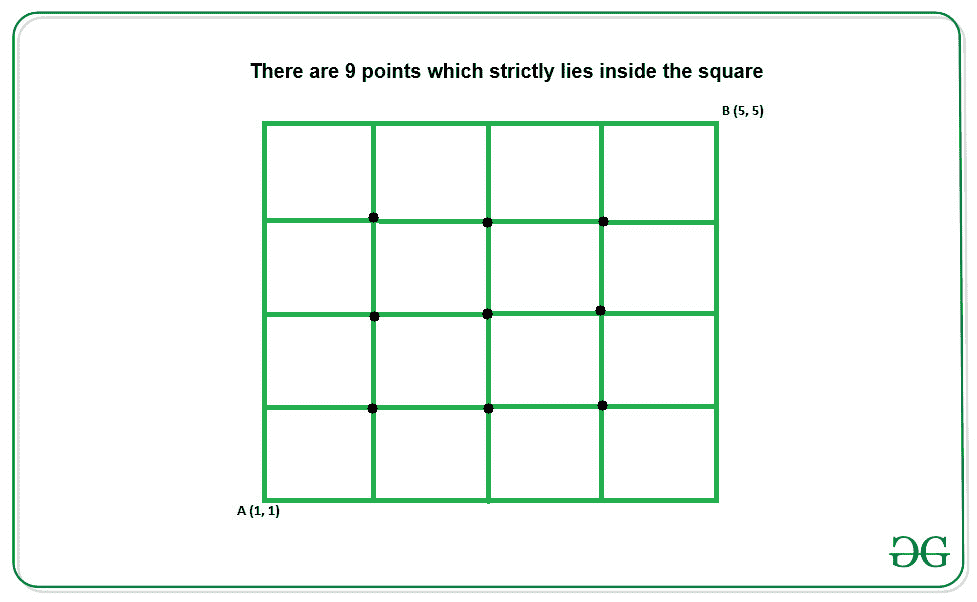

# 位于正方形内的积分坐标的计数

> 原文:[https://www . geeksforgeeks . org/位于正方形内的整数坐标计数/](https://www.geeksforgeeks.org/count-of-integral-coordinates-that-lies-inside-a-square/)

给定正方形的左下和右上坐标 **(x1，y1)和(x2，y2)** ，任务是计算严格位于正方形内部的积分坐标的数量。
**例:**

> **输入:** x1 = 1，y1 = 1，x2 = 5，x3 = 5
> **输出:** 9
> **说明:**
> 下面是给定坐标的正方形:
> 
> 
> 
> **输入:** x1 = 1，y1 = 1，x2 = 4，x3 = 4
> T3】输出: 4

**逼近:**给定正方形的右下坐标和右上坐标的 x 坐标和 y 坐标之差，分别给出正方形相对两侧的 x 坐标和 y 坐标的积分点数。严格位于正方形内的点的总数由下式给出:

> 计数=(x2–x1–1)*(y2–y1–1)

**例如:**

> [](https://media.geeksforgeeks.org/wp-content/uploads/20200427174017/square1.jpg)
> 
> 上图中:
> 1。正方形底边内的积分点总数为**(x2–x1–1)**。
> 2。正方形高度内的积分点总数为**(y2–y1–1)**。
> 这些**(x2–x1–1)**积分点平行于正方形的底边重复**(y2–y1–1)**次。因此积分总数由**(x2–x1–1)*(y2–y1–1)**给出。

以下是上述方法的实现:

## C++

```
// C++ program for the above approach
#include <bits/stdc++.h>
using namespace std;

// Function to calculate the integral
// points inside a square
void countIntgralPoints(int x1, int y1,
                        int x2, int y2)
{
    cout << (y2 - y1 - 1) * (x2 - x1 - 1);
}

// Driver Code
int main()
{
    int x1 = 1, y1 = 1;
    int x2 = 4, y2 = 4;

    countIntgralPoints(x1, y1, x2, y2);
    return 0;
}
```

## Java 语言(一种计算机语言，尤用于创建网站)

```
// Java program for the above approach

class GFG {

// Function to calculate the integral
// points inside a square
static void countIntgralPoints(int x1, int y1,
                               int x2, int y2)
{
    System.out.println((y2 - y1 - 1) *
                       (x2 - x1 - 1));
}

// Driver Code
public static void main(String args[])
{
    int x1 = 1, y1 = 1;
    int x2 = 4, y2 = 4;

    countIntgralPoints(x1, y1, x2, y2);
}
}

// This code is contributed by rutvik_56
```

## 蟒蛇 3

```
# Python3 program for the above approach

# Function to calculate the integral
# points inside a square
def countIntgralPoints(x1, y1, x2, y2):
    print((y2 - y1 - 1) * (x2 - x1 - 1))

# Driver Code
if __name__ == '__main__':

    x1 = 1
    y1 = 1
    x2 = 4
    y2 = 4

    countIntgralPoints(x1, y1, x2, y2)

# This code is contributed by Samarth
```

## C#

```
// C# program for the above approach
using System;

class GFG{

// Function to calculate the integral
// points inside a square
static void countIntgralPoints(int x1, int y1,
                               int x2, int y2)
{
    Console.WriteLine((y2 - y1 - 1) *
                      (x2 - x1 - 1));
}

// Driver code
static void Main()
{
    int x1 = 1, y1 = 1;
    int x2 = 4, y2 = 4;

    countIntgralPoints(x1, y1, x2, y2);
}
}

// This code is contributed by divyeshrabadiya07   
```

## java 描述语言

```
<script>

// Javascript program for the above approach

// Function to calculate the integral
// points inside a square
function countIntgralPoints(x1, y1, x2, y2)
{
    document.write( (y2 - y1 - 1) * (x2 - x1 - 1));
}

// Driver Code

var x1 = 1, y1 = 1;
var x2 = 4, y2 = 4;

countIntgralPoints(x1, y1, x2, y2);

</script>
```

**Output:** 

```
4
```

***时间复杂度:** O(1)*