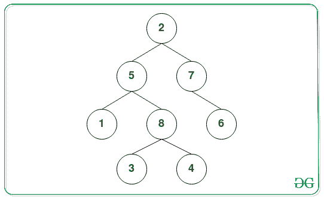
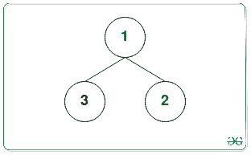

# 清空给定二叉树每一步需要移除的叶节点数

> 原文:[https://www . geeksforgeeks . org/每一步需要删除的叶节点数-清空给定的二叉树/](https://www.geeksforgeeks.org/count-of-leaf-nodes-required-to-be-removed-at-each-step-to-empty-a-given-binary-tree/)

给定一个[二叉树](https://www.geeksforgeeks.org/binary-tree-data-structure/)，任务是在每次操作中移除[二叉树](https://www.geeksforgeeks.org/binary-tree-data-structure/)的叶节点并打印计数。

**示例:**

> **输入:**
> 
> 
> 
> **输出:** 4 2 1 1
> **解释:**
> 在第一次操作中，从二叉树中移除叶节点{ 1，3，4，6 }。
> 在移除叶节点{ 8，7 }
> 的第二次操作中，在移除叶节点{ 5 }
> 的第三次操作中，在移除叶节点{ 2 }
> 的第四次操作中，因此，在每次操作中移除的叶节点的计数为 4 2 1 1。
> 
> **输入:**
> 
> 
> 
> **输出:** 2 1

**天真方法:**解决这个问题最简单的方法就是每次操作重复[遍历树](https://www.geeksforgeeks.org/tree-traversals-inorder-preorder-and-postorder/)，[打印二叉树](https://www.geeksforgeeks.org/write-a-c-program-to-get-count-of-leaf-nodes-in-a-binary-tree/)中当前存在的叶节点数，[删除二叉树](https://www.geeksforgeeks.org/remove-leaf-nodes-binary-search-tree/)中的所有叶节点。

***时间复杂度:**O(N<sup>2</sup>)*
***辅助空间:** O(1)*

**高效方法:**为了优化上述方法，其思想是观察到，除非一个节点的两个子节点都已经被删除，否则该节点不会被删除。因此，可以确定在哪个步骤删除一个节点，这将等于 **1 +从该节点到以该节点为根的子树中的任何叶节点的最大路径长度**。按照以下步骤解决此问题:

*   初始化一个[映射](https://www.geeksforgeeks.org/map-associative-containers-the-c-standard-template-library-stl/)，比如说 **M** ，来存储树中每次删除时的叶节点。
*   按照以下步骤对给定的二叉树执行 [DFS 遍历:](https://www.geeksforgeeks.org/dfs-traversal-of-a-tree-using-recursion/)
    *   检查给定节点是否为**空**。如果发现是真的，则返回 **0** 。
    *   否则，递归调用**左侧**和**右侧**节点，并存储其返回的值。
    *   求最大高度，比如 **maxHeight** ，此时每个节点都将是一个叶子节点作为 **(1 +左右递归调用返回的值的最大值)**在上面的步骤中为每个节点。
    *   将当前节点插入地图 **M** 中的关键点**最大高度**。
*   完成上述步骤后，打印每次删除后**图**中存储的叶节点数。

下面是上述方法的实现:

## C++

```
// C++ program for the above approach

#include <bits/stdc++.h>
using namespace std;

// Structure of a
// Binary Tree Node
struct Node {
    int data;
    Node *left, *right;
};

// Function to allocate
// a new tree node
Node* newNode(int data)
{
    Node* node = new Node;
    node->data = data;
    node->left = NULL;
    node->right = NULL;

    return node;
}

// Function to find the maximum height
// from leaf in the subtree rooted at
// current node and add that to hashmap
int maxHeightToLeafUTIL(
    Node* curr, map<int, vector<int> >& mp)
{
    if (curr == NULL) {
        return 0;
    }

    // Max height to leaf in left subtree
    int leftLeaf
        = maxHeightToLeafUTIL(curr->left, mp);

    // Max height to leaf in right subtree
    int rightLeaf
        = maxHeightToLeafUTIL(curr->right, mp);

    // Max height to leaf in current subtree
    int maxHeightSubtree
        = 1 + max(leftLeaf, rightLeaf);

    // Adding current node to the Map
    mp[maxHeightSubtree].push_back(
        curr->data);

    return maxHeightSubtree;
}

// Function to find the count of leaf nodes
// by repeatedly removing the leaf nodes
void printAndDelete(Node* root)
{

    // Stores the leaf deletion with
    // each iteration
    map<int, vector<int> > mp;

    // Function Call to find the order
    // of deletion of nodes
    maxHeightToLeafUTIL(root, mp);

    // Printing the map values
    for (auto step : mp) {

        cout << mp[step.first].size() << " ";
    }
}

// Driver code
int main()
{
    // Given Binary Tree
    Node* root = newNode(2);
    root->right = newNode(7);
    root->right->right = newNode(6);
    root->left = newNode(5);
    root->left->left = newNode(1);
    root->left->right = newNode(8);
    root->left->right->left = newNode(3);
    root->left->right->right = newNode(4);

    /*
    Input :
         2
       /   \
      5     7
     / \     \
    1   8     6
       / \
      3   4
*/

    // Function Call
    printAndDelete(root);

    return 0;
}

// This code is contributed by pragup
```

## Java 语言(一种计算机语言，尤用于创建网站)

```
// Java program for the above approach
import java.util.*;

// A binary tree node
class Node 
{
  int data;
  Node left, right;
  Node(int item) 
  {
    data = item;
    left = right = null;
  }
}

class GFG 
{
  Node root;

  // Function to find the maximum height
  // from leaf in the subtree rooted at
  // current node and add that to hashmap
  static int maxHeightToLeafUTIL(
    Node curr, Map<Integer, ArrayList<Integer> > mp)
  {
    if (curr == null)
    {
      return 0;
    }

    // Max height to leaf in left subtree
    int leftLeaf
      = maxHeightToLeafUTIL(curr.left, mp);

    // Max height to leaf in right subtree
    int rightLeaf
      = maxHeightToLeafUTIL(curr.right, mp);

    // Max height to leaf in current subtree
    int maxHeightSubtree
      = 1 + Math.max(leftLeaf, rightLeaf);

    // Adding current node to the Map
    if(!mp.containsKey(maxHeightSubtree))
    {
      mp.put(maxHeightSubtree, new ArrayList<>());   
    }

    mp.get(maxHeightSubtree).add(curr.data);
    return maxHeightSubtree;
  }

  // Function to find the count of leaf nodes
  // by repeatedly removing the leaf nodes
  static void printAndDelete(Node root)
  {

    // Stores the leaf deletion with
    // each iteration
    Map<Integer, ArrayList<Integer> > mp=new HashMap<>();

    // Function Call to find the order
    // of deletion of nodes
    maxHeightToLeafUTIL(root, mp);

    // Printing the map values
    for (Map.Entry<Integer,ArrayList<Integer>> k:mp.entrySet()) 
    {
      System.out.print(k.getValue().size() + " ");
    }
  }

  // Driver code
  public static void main (String[] args) 
  {

    GFG tree = new GFG();

    tree.root = new Node(2);
    tree.root.left = new Node(5);
    tree.root.right = new Node(7);
    tree.root.right.right = new Node(6);
    tree.root.left.left = new Node(1);
    tree.root.left.right = new Node(8);
    tree.root.left.right.left = new Node(3);
    tree.root.left.right.right = new Node(4);

    /*
    Input :
         2
       /   \
      5     7
     / \     \
    1   8     6
       / \
      3   4
*/

    // Function Call
    printAndDelete(tree.root);
  }
}

// This code is contributed by offbeat
```

## 蟒蛇 3

```
# Python3 program for the above approach 

# Tree node structure used in the program
class Node:

    def __init__(self, x):

        self.data = x
        self.left = None
        self.right = None

# Function to find the maximum height
# from leaf in the subtree rooted at
# current node and add that to hashmap
def maxHeightToLeafUTIL(curr):

    global mp

    if (curr == None):
        return 0

    # Max height to leaf in left subtree
    leftLeaf = maxHeightToLeafUTIL(curr.left)

    # Max height to leaf in right subtree
    rightLeaf = maxHeightToLeafUTIL(curr.right)

    # Max height to leaf in current subtree
    maxHeightSubtree = 1 + max(leftLeaf, rightLeaf)

    # Adding current node to the Map
    mp[maxHeightSubtree].append(curr.data)

    return maxHeightSubtree

# Function to find the count of leaf nodes
# by repeatedly removing the leaf nodes
def printAndDelete(root):

    global mp

    # Function Call to find the order
    # of deletion of nodes
    maxHeightToLeafUTIL(root)

    for step in mp:
        if len(step):
            print(len(step), end = " ")

# Driver code
if __name__ == '__main__':

    mp = [[] for i in range(1000)]

    # Given Binary Tree
    root = Node(2)
    root.right = Node(7)
    root.right.right = Node(6)
    root.left = Node(5)
    root.left.left = Node(1)
    root.left.right = Node(8)
    root.left.right.left = Node(3)
    root.left.right.right = Node(4)
    #
    #     
    #     Input :
    #          2
    #        /   \
    #       5     7
    #      / \     \
    #     1   8     6
    #        / \
    #       3   4

    # Function Call
    printAndDelete(root)

# This code is contributed by mohit kumar 29
```

## C#

```
// C# program for the above approach
using System;
using System.Collections.Generic;

// A binary tree node
public class Node
{
  public int data;
  public Node left, right;
  public Node(int item)
  {
    data = item;
    left = right = null;
  }
}

public class GFG{

    Node root;

  // Function to find the maximum height
  // from leaf in the subtree rooted at
  // current node and add that to hashmap
  static int maxHeightToLeafUTIL(
    Node curr, Dictionary<int, List<int> > mp)
  {
    if (curr == null)
    {
      return 0;
    }

    // Max height to leaf in left subtree
    int leftLeaf
      = maxHeightToLeafUTIL(curr.left, mp);

    // Max height to leaf in right subtree
    int rightLeaf
      = maxHeightToLeafUTIL(curr.right, mp);

    // Max height to leaf in current subtree
    int maxHeightSubtree
      = 1 + Math.Max(leftLeaf, rightLeaf);

    // Adding current node to the Map
    if(!mp.ContainsKey(maxHeightSubtree))
    {
      mp.Add(maxHeightSubtree, new List<int>());  
    }

    mp[maxHeightSubtree].Add(curr.data);
    return maxHeightSubtree;
  }

  // Function to find the count of leaf nodes
  // by repeatedly removing the leaf nodes
  static void printAndDelete(Node root)
  {

    // Stores the leaf deletion with
    // each iteration
    Dictionary<int, List<int> > mp=new Dictionary<int, List<int> >();

    // Function Call to find the order
    // of deletion of nodes
    maxHeightToLeafUTIL(root, mp);

    // Printing the map values
    foreach(KeyValuePair<int, List<int>> k in mp)
    {
      Console.Write(k.Value.Count + " ");
    }
  }

  // Driver code

    static public void Main (){

        GFG tree = new GFG();

    tree.root = new Node(2);
    tree.root.left = new Node(5);
    tree.root.right = new Node(7);
    tree.root.right.right = new Node(6);
    tree.root.left.left = new Node(1);
    tree.root.left.right = new Node(8);
    tree.root.left.right.left = new Node(3);
    tree.root.left.right.right = new Node(4);

    /*
    Input :
         2
       /   \
      5     7
     / \     \
    1   8     6
       / \
      3   4
*/

    // Function Call
    printAndDelete(tree.root);
    }
}
```

## java 描述语言

```
<script>

    // JavaScript program to implement the above approach

    // Structure of a tree node
    class Node
    {
        constructor(item) {
           this.left = null;
           this.right = null;
           this.data = item;
        }
    }

    let root;

    class GFG
    {
        constructor() {
        }
    }

    // Function to find the maximum height
    // from leaf in the subtree rooted at
    // current node and add that to hashmap
    function maxHeightToLeafUTIL(curr, mp)
    {
      if (curr == null)
      {
        return 0;
      }

      // Max height to leaf in left subtree
      let leftLeaf
        = maxHeightToLeafUTIL(curr.left, mp);

      // Max height to leaf in right subtree
      let rightLeaf
        = maxHeightToLeafUTIL(curr.right, mp);

      // Max height to leaf in current subtree
      let maxHeightSubtree
        = 1 + Math.max(leftLeaf, rightLeaf);

      // Adding current node to the Map
      if(!mp.has(maxHeightSubtree))
      {
        mp.set(maxHeightSubtree, []);  
      }

      mp.get(maxHeightSubtree).push(curr.data);
      return maxHeightSubtree;
    }

    // Function to find the count of leaf nodes
    // by repeatedly removing the leaf nodes
    function printAndDelete(root)
    {

      // Stores the leaf deletion with
      // each iteration
      let mp = new Map();

      // Function Call to find the order
      // of deletion of nodes
      maxHeightToLeafUTIL(root, mp);

      // Printing the map values
      mp.forEach((values,keys)=>{
          document.write(values.length + " ")
      })
    }

    let tree = new GFG();

    tree.root = new Node(2);
    tree.root.left = new Node(5);
    tree.root.right = new Node(7);
    tree.root.right.right = new Node(6);
    tree.root.left.left = new Node(1);
    tree.root.left.right = new Node(8);
    tree.root.left.right.left = new Node(3);
    tree.root.left.right.right = new Node(4);

    /*
    Input :
         2
       /   \
      5     7
     / \     \
    1   8     6
       / \
      3   4
    */

    // Function Call
    printAndDelete(tree.root);

</script>
```

**Output:** 

```
4 2 1 1
```

***时间复杂度:**O(N)*
T5**辅助空间:** O(N)