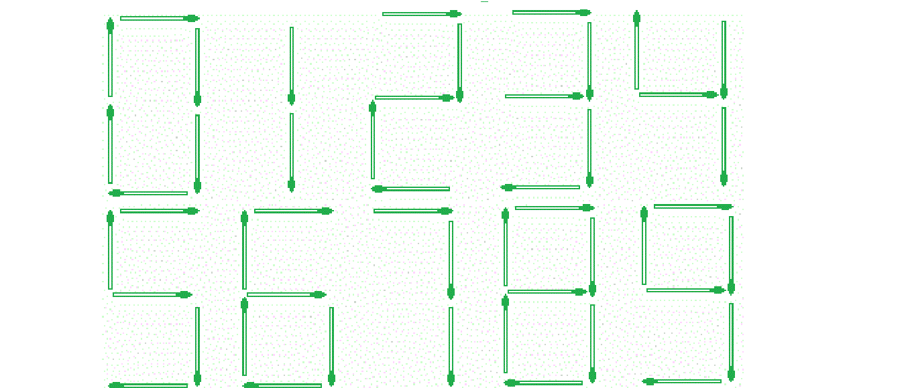

# 表示给定数量所需的火柴杆数量

> 原文:[https://www . geeksforgeeks . org/火柴杆数量-需要表示给定的数量/](https://www.geeksforgeeks.org/count-of-matchsticks-required-to-represent-the-given-number/)

给定一个大整数作为字符串 **str** ，任务是找到表示它所需的火柴杆数量。



**例:**

> **输入:** str = "56"
> **输出:** 11
> 5 根需代表 5 根，
> 6 根需代表 6 根。
> **输入:**str = " 548712458645878 "
> **输出:** 74

**方法:**存储在一个数组棒[]中表示从 0 到 9 的每个数字所需的火柴棒计数。现在一个数字一个数字地遍历给定的字符串，并添加当前数字所需的棒数。
以下是上述办法的实施情况:

## C++

```
// C++ implementation of the approach
#include <bits/stdc++.h>
using namespace std;

// stick[i] stores the count of sticks
// required to represent the digit i
const int sticks[] = { 6, 2, 5, 5, 4, 5,
                       6, 3, 7, 6 };

// Function to return the count of
// matchsticks required to represent
// the given number
int countSticks(string str, int n)
{
    int cnt = 0;

    // For every digit of the given number
    for (int i = 0; i < n; i++) {

        // Add the count of sticks required
        // to represent the current digit
        cnt += (sticks[str[i] - '0']);
    }

    return cnt;
}

// Driver code
int main()
{
    string str = "56";
    int n = str.length();

    cout << countSticks(str, n);

    return 0;
}
```

## Java 语言(一种计算机语言，尤用于创建网站)

```
// Java implementation of the approach
import java.util.*;

class GFG
{

// stick[i] stores the count of sticks
// required to represent the digit i
static int sticks[] = { 6, 2, 5, 5, 4, 5,
                        6, 3, 7, 6 };

// Function to return the count of
// matchsticks required to represent
// the given number
static int countSticks(String str, int n)
{
    int cnt = 0;

    // For every digit of the given number
    for (int i = 0; i < n; i++)
    {

        // Add the count of sticks required
        // to represent the current digit
        cnt += (sticks[str.charAt(i) - '0']);
    }
    return cnt;
}

// Driver code
public static void main(String []args)
{
    String str = "56";
    int n = str.length();

    System.out.println(countSticks(str, n));
}
}

// This code is contributed by 29AjayKumar
```

## 蟒蛇 3

```
# Python3 implementation of the approach

# stick[i] stores the count of sticks
# required to represent the digit i
sticks = [ 6, 2, 5, 5, 4, 5,
           6, 3, 7, 6 ];

# Function to return the count of
# matchsticks required to represent
# the given number
def countSticks(string, n) :

    cnt = 0;

    # For every digit of the given number
    for i in range(n) :

        # Add the count of sticks required
        # to represent the current digit
        cnt += (sticks[ord(string[i]) - ord('0')]);

    return cnt;

# Driver code
if __name__ == "__main__" :

    string = "56";
    n = len(string);

    print(countSticks(string, n));

# This code is contributed by AnkitRai01
```

## C#

```
// C# implementation of the approach
using System;

class GFG
{

// stick[i] stores the count of sticks
// required to represent the digit i
static int []sticks = { 6, 2, 5, 5, 4, 5,
                        6, 3, 7, 6 };

// Function to return the count of
// matchsticks required to represent
// the given number
static int countSticks(String str, int n)
{
    int cnt = 0;

    // For every digit of the given number
    for (int i = 0; i < n; i++)
    {

        // Add the count of sticks required
        // to represent the current digit
        cnt += (sticks[str[i] - '0']);
    }
    return cnt;
}

// Driver code
public static void Main(String []args)
{
    String str = "56";
    int n = str.Length;

    Console.WriteLine(countSticks(str, n));
}
}

// This code is contributed by 29AjayKumar
```

## java 描述语言

```
<script>

// Javascript implementation of the approach

// stick[i] stores the count of sticks
// required to represent the digit i
var sticks = [ 6, 2, 5, 5, 4, 5, 6, 3, 7, 6 ]

// Function to return the count of
// matchsticks required to represent
// the given number
function countSticks(str, n)
{
    var cnt = 0;

    // For every digit of the given number
    for (var i = 0; i < n; i++) {

        // Add the count of sticks required
        // to represent the current digit
        cnt += (sticks[str[i] - '0']);
    }

    return cnt;
}

// Driver code
var str = "56";
var n = str.length;
document.write(countSticks(str, n));

// This code is contributed by rutvik_56.
</script>
```

**Output:** 

```
11
```

**时间复杂度:** O(n)