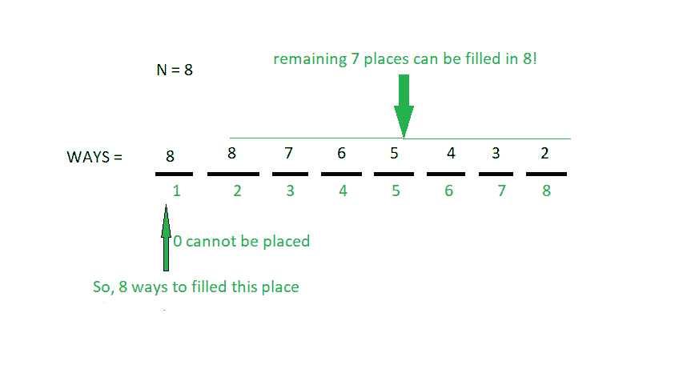

# 满足给定条件的可能的 N 位数的计数

> 原文:[https://www . geesforgeks . org/n 位数计数-满足给定条件的可能数字/](https://www.geeksforgeeks.org/count-of-n-digit-numbers-possible-which-satisfy-the-given-conditions/)

给定一个整数 **N** ，任务是找到可能的 **N** 位数的总数，例如:

1.  所有数字的位数都在**【0，N】**范围内。
2.  没有前导 0。
3.  数字中的所有数字都是不同的。

**例:**

> **输入:** N = 2
> **输出:** 4
> 10、12、20 和 21 是满足给定条件的唯一可能的 2 位数
> 数字。
> **输入:** N = 5
> **输出:** 600

**方式:**给定 **N** 位数，第一位可以 N 种方式填写【 **0** 不能作为第一位，允许的位数在**【1，N】**
范围内，剩余**(N–1)**位可以填写 **N！方式**
所以，可能的总数将是 **N * N！**。
举个例子更好理解。比方说，N = 8



第一名可以用[1，8]中的任意数字填充，其余 7 名可以用 8 填充！方式即 8 * 7 * 6 * 5 * 4 * 3 * 2。
所以，总途径= 8 * 8！= 8 * 8 * 7 * 6 * 5 * 4 * 3 * 2 = 322560
以下是上述办法的实施:

## C++

```
// C++ implementation of the approach
#include <bits/stdc++.h>
using namespace std;

// Function to return the factorial of n
int fact(int n)
{
    int res = 1;
    for (int i = 2; i <= n; i++)
        res = res * i;
    return res;
}

// Function to return the
// count of numbers possible
int Count_number(int N)
{
    return (N * fact(N));
}

// Driver code
int main()
{
    int N = 2;

    cout << Count_number(N);

    return 0;
}
```

## Java 语言(一种计算机语言，尤用于创建网站)

```
// Java implementation of the approach
import java.io.*;

class GFG
{

// Function to return the factorial of n
static int fact(int n)
{
    int res = 1;
    for (int i = 2; i <= n; i++)
        res = res * i;
    return res;
}

// Function to return the
// count of numbers possible
static int Count_number(int N)
{
    return (N * fact(N));
}

// Driver code
public static void main (String[] args)
{
    int N = 2;

    System.out.print(Count_number(N));
}
}

// This code is contributed by anuj_67..
```

## 蟒蛇 3

```
# Python3 implementation of the approach

# Function to return the factorial of n
def fact(n):

    res = 1
    for i in range(2, n + 1):
        res = res * i
    return res

# Function to return the
# count of numbers possible
def Count_number(N):
    return (N * fact(N))

# Driver code
N = 2

print(Count_number(N))

# This code is contributed by Mohit Kumar
```

## C#

```
// C# implementation of the approach
using System;

class GFG
{

// Function to return the factorial of n
static int fact(int n)
{
    int res = 1;
    for (int i = 2; i <= n; i++)
        res = res * i;
    return res;
}

// Function to return the
// count of numbers possible
static int Count_number(int N)
{
    return (N * fact(N));
}

// Driver code
public static void Main ()
{
    int N = 2;

    Console.WriteLine(Count_number(N));
}
}

// This code is contributed by anuj_67..
```

## java 描述语言

```
<script>

// Javascript implementation of the approach

// Function to return the factorial of n
function fact(n)
{
    let res = 1;
    for (let i = 2; i <= n; i++)
        res = res * i;
    return res;
}

// Function to return the
// count of numbers possible
function Count_number(N)
{
    return (N * fact(N));
}

// Driver code
    let N = 2;

    document.write(Count_number(N));

</script>
```

**Output:** 

```
4
```