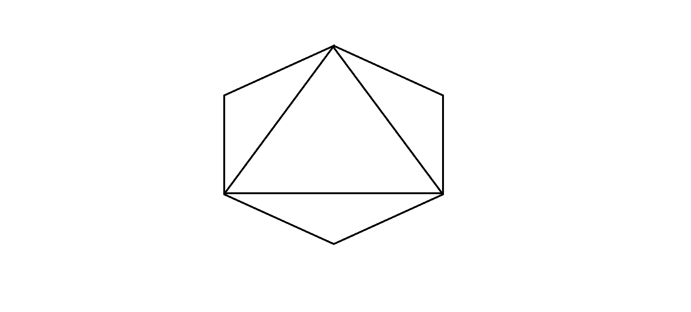
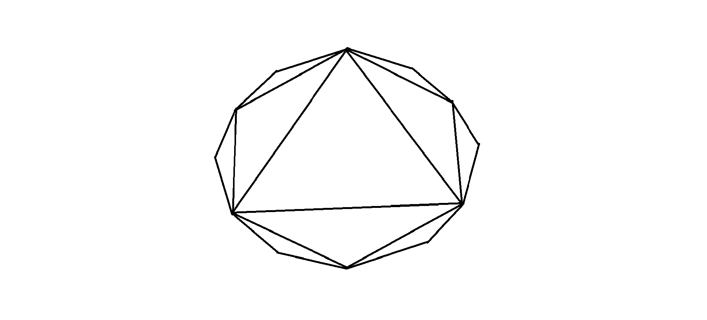

# 通过内部连接顶点可以绘制的嵌套多边形的数量

> 原文:[https://www . geeksforgeeks . org/嵌套多边形的数量-可以通过连接顶点来绘制-内部/](https://www.geeksforgeeks.org/count-of-nested-polygons-that-can-be-drawn-by-joining-vertices-internally/)

给定一个边长为 **N** 的正多边形。任务是通过在内部连接给定多边形的顶点，找到可以从给定多边形绘制的多边形的数量。

**示例:**

> **输入:** N = 6
> **输出:** 1
> **解释:**
> 
> [](https://media.geeksforgeeks.org/wp-content/uploads/20200824202108/hexagon.png)
> 
> 只有一个嵌套多边形，即三角形，其边是直接父多边形(即六边形)的弦。
> 
> **输入:**N = 12
> T3】输出:2
> T6】说明:
> 
> [](https://media.geeksforgeeks.org/wp-content/uploads/20200824204318/NestedPolygons.png)
> 
> 有两个嵌套的多边形。第一个是六边形，第二个是三角形。两个嵌套多边形的边实际上都是其直接父多边形的弦。

**方法:**要解决此问题，请遵循以下步骤:

> 1.  Polygons with less than or equal to 5 edges cannot generate nested polygons, that is, polygons with less than or equal to 5 edges will always have at least one edge overlapping with their nested polygons.
> 2.  Each edge of the nested polygon adopts two continuous edges of the direct parent polygon.

通过以上观察，很容易得出结论，每个嵌套多边形的边数是其直接父多边形边数的一半。因此，我们继续将 **N 除以 2** ，并增加嵌套多边形的计数器，直到 **N** 变得小于或等于 5。

下面是上述方法的实现:

## C++

```
// C++ program for the above approach

#include <iostream>
using namespace std;

// Function that counts the nested
// polygons inside another polygons
int countNestedPolygons(int sides)
{
    // Stores the count
    int count = 0;

    // Child polygons can only existss
    // if parent polygon has sides > 5
    while (sides > 5) {

        // Get next nested polygon
        sides /= 2;
        count += 1;
    }

    // Return the count
    return count;
}

// Driver Code
int main()
{
    // Given side of polygon
    int N = 12;

    // Function Call
    cout << countNestedPolygons(N);

    return 0;
}
```

## Java 语言(一种计算机语言，尤用于创建网站)

```
// Java program for the above approach
class GFG{

// Function that counts the nested
// polygons inside another polygons
static int countNestedPolygons(int sides)
{
    // Stores the count
    int count = 0;

    // Child polygons can only existss
    // if parent polygon has sides > 5
    while (sides > 5)
    {

        // Get next nested polygon
        sides /= 2;
        count += 1;
    }

    // Return the count
    return count;
}

// Driver Code
public static void main(String[] args)
{
    // Given side of polygon
    int N = 12;

    // Function Call
    System.out.print(countNestedPolygons(N));
}
}

// This code is contributed by Rajput-Ji
```

## 蟒蛇 3

```
# Python3 program for the above approach

# Function that counts the nested
# polygons inside another polygons
def countNestedPolygons(sides):

    # Stores the count
    count = 0

    # Child polygons can only exists
    # if parent polygon has sides > 5
    while (sides > 5):

        # Get next nested polygon
        sides //= 2
        count += 1

    # Return the count
    return count

# Driver Code

# Given side of polygon
N = 12

# Function call
print(countNestedPolygons(N))

# This code is contributed by vishu2908
```

## C#

```
// C# program for the above approach
using System;

class GFG{

// Function that counts the nested
// polygons inside another polygons
static int countNestedPolygons(int sides)
{

    // Stores the count
    int count = 0;

    // Child polygons can only existss
    // if parent polygon has sides > 5
    while (sides > 5)
    {

        // Get next nested polygon
        sides /= 2;
        count += 1;
    }

    // Return the count
    return count;
}

// Driver Code
public static void Main(String[] args)
{

    // Given side of polygon
    int N = 12;

    // Function call
    Console.Write(countNestedPolygons(N));
}
}

// This code is contributed by Rajput-Ji
```

## java 描述语言

```
<script>

// JavaScript program for the above approach
// Function that counts the nested
// polygons inside another polygons
function countNestedPolygons(sides)
{
    // Stores the count
    var count = 0;

    // Child polygons can only existss
    // if parent polygon has sides > 5
    while (sides > 5)
    {

        // Get next nested polygon
        sides /= 2;
        count += 1;
    }

    // Return the count
    return count;
}

// Driver Code
// Given side of polygon
var N = 12;

// Function Call
document.write(countNestedPolygons(N));

// This code contributed by shikhasingrajput

</script>
```

**Output:** 

```
2
```

***时间复杂度:** O(log N)，其中 N 是给定多边形的顶点数。*
***辅助空间:** O(1)*