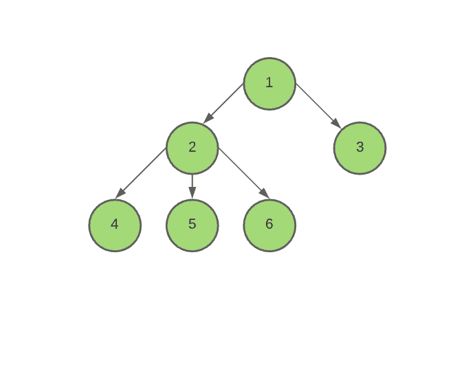

# Q 查询的子树中距离 S 为 K 的节点数

> 原文:[https://www . geeksforgeeks . org/q 查询子树中距离为 k 的节点数/](https://www.geeksforgeeks.org/count-of-nodes-at-distance-k-from-s-in-its-subtree-for-q-queries/)

给定由 **N** 节点组成并扎根于节点 **1** 的[树](https://www.geeksforgeeks.org/tree-traversals-inorder-preorder-and-postorder/)，还给定一个由 **M** [对](https://www.geeksforgeeks.org/pair-in-cpp-stl/)组成的数组**Q[**，其中每个数组元素代表一个形式为 **(S，K)** 的查询。任务是为数组的每个查询 **(S，K)** 打印节点 **S** 的[子树中距离 **K** 的节点数。](https://www.geeksforgeeks.org/queries-for-dfs-of-a-subtree-in-a-tree/)

**示例:**

> **输入:** Q[] = {{2，1}，{1，1}}，
> 
> 
> 
> **输出:**3
> 2
> T4】说明:
> 
> 1.  查询(2，1):打印 3，因为节点 2 的子树中距离 1 有 3 个节点 4、5 和 6。
> 2.  查询(1，1):打印 2，因为节点 1 的子树中距离 1 有 2 个节点 2 和 3。
> 
> **输入:**边= {{1，2}、{2，3}、{3，4}}、Q[] = {{1，2}、{2，2}}
> 输出: 1 1

**简单方法:**最简单的方法是每个查询从节点 **S** 开始运行一个[深度优先搜索(DFS)](https://www.geeksforgeeks.org/depth-first-search-or-dfs-for-a-graph/) ，并找到与给定节点 **S** 相距 **K** 的所有节点。

***时间复杂度:** O(N*Q)*
***辅助空间:** O(1)*

**高效方法:**上述方法可以基于以下观察进行优化:

> 1.  Suppose that **tin [】【】** stores the entry time of each node according to [DFS traversal](https://www.geeksforgeeks.org/depth-first-search-or-dfs-for-a-graph/) of the tree, and [T4】 tout【】 【T5] stores the exit time of a node.
> 2.  Then, for two nodes, **a** and **b** and **b** will be in the subtree of **a** if and only if:
>     *   **tin[b]tin[a]你好一切〔b〕〔一切〔a〕t1〕**
> 3.  Suppose that **levels []** , where [T27
> 4.  Then, use the [method of bisection](https://www.geeksforgeeks.org/binary-search/) node to find it at a certain distance **k** from a certain node.

按照以下步骤解决问题:

*   初始化三个[数组](https://www.geeksforgeeks.org/introduction-to-arrays/)，比如**tin【】**、**tout【】**和**depth【】**分别存储节点的进入时间、退出时间和深度。
*   初始化两个 [2D 向量](https://www.geeksforgeeks.org/vector-of-vectors-in-c-stl-with-examples/)，比如**调整**和**级别**，存储[邻接表](https://www.geeksforgeeks.org/graph-and-its-representations/)和特定深度每个节点的进入时间。
*   初始化一个变量，说 **t** 为 **1，**记录时间。
*   定义一个[递归 DFS](https://www.geeksforgeeks.org/depth-first-search-or-dfs-for-a-graph/) 函数，比如 **dfs(节点，父节点，d)** ，执行以下步骤:
    *   将 **t** 分配给 **tin【节点】**，然后将 **t** 增加 **1。**
    *   在矢量**级别【d】**中推 **tin【节点】**，然后将 **d** 分配给**深度【节点】。**
    *   迭代节点的子节点，并为每个子节点 **X.** 调用递归函数作为 **dfs(X，节点，d+1)**
    *   完成上述步骤后，将 **t** 分配给 **tout【节点】**，并将 **t** 增加 **1。**
*   调用递归函数 **dfs(1，1，0)。**
*   [使用变量 **i** 遍历数组](https://www.geeksforgeeks.org/c-program-to-traverse-an-array/) **Q[]** ，并执行以下操作:
    *   将当前数组元素的值存储为 **S = Q[i]。第一，**和 **K = Q[i].第二，**
    *   在向量**级别【深度【S】+K】**中找到所有大于**tin【S】**的节点数，并将其存储在一个变量中，比如 **L.**
    *   在向量**级别【深度【S】+K】**中找到所有大于**tout【S】**的节点数，并将其存储在一个变量中，比如 **R** 。
    *   打印 **R-L** 的值作为当前查询的答案。

下面是上述方法的实现:

## C++

```
// C++ program for the above approach
#include <bits/stdc++.h>
using namespace std;

int tin[100], tout[100], depth[100];
int t = 0;

// Function to add edges
void Add_edge(int parent, int child,
              vector<vector<int> >& adj)
{
    adj[parent].push_back(child);
    adj[child].push_back(parent);
}

// Function to perform Depth First Search
void dfs(int node, int parent, vector<vector<int> >& adj,
         vector<vector<int> >& levels, int d)
{
    // Stores the entry time of a node
    tin[node] = t++;

    // Stores the entering time
    // of a node at depth d
    levels[d].push_back(tin[node]);
    depth[node] = d;

    // Iterate over the children of node
    for (auto x : adj[node]) {
        if (x != parent)
            dfs(x, node, adj, levels, d + 1);
    }

    // Stores the Exit time of a node
    tout[node] = t++;
}

// Function to find number of nodes
// at distance K from node S in the
// subtree of S
void numberOfNodes(int node, int dist,
                   vector<vector<int> >& levels)
{
    // Distance from root node
    dist += depth[node];

    // Index of node with greater tin value
    // then tin[S]
    int start = lower_bound(levels[dist].begin(),
                            levels[dist].end(), tin[node])
                - levels[dist].begin();

    // Index of node with greater tout value then tout[S]
    int ed = lower_bound(levels[dist].begin(),
                         levels[dist].end(), tout[node])
             - levels[dist].begin();

    // Answer to the Query
    cout << ed - start << endl;
}

// Function for performing DFS
// and answer to queries
void numberOfNodesUtil(pair<int, int> Q[], int M, int N)
{

    vector<vector<int> > adj(N + 5), levels(N + 5);

    Add_edge(1, 2, adj);
    Add_edge(1, 3, adj);
    Add_edge(2, 4, adj);
    Add_edge(2, 5, adj);
    Add_edge(2, 6, adj);

    t = 1;

    // DFS function call
    dfs(1, 1, adj, levels, 0);

    // Traverse the array Q[]
    for (int i = 0; i < M; ++i) {
        numberOfNodes(Q[i].first, Q[i].second, levels);
    }
}

// Driver Code
int main()
{
    // Input
    int N = 6;
    pair<int, int> Q[] = { { 2, 1 }, { 1, 1 } };
    int M = sizeof(Q) / sizeof(Q[0]);

    // Function call
    numberOfNodesUtil(Q, M, N);
}
```

## 蟒蛇 3

```
# Python3 program for the above approach
from bisect import bisect_left, bisect_right

tin = [0] * 100
tout = [0] * 100
depth = [0] * 100
t = 0

# Function to add edges
def Add_edge(parent, child, adj):

    adj[parent].append(child)
    adj[child].append(parent)
    return adj

# Function to perform Depth First Search
def dfs(node, parent, d):

    global tin, tout, depth, adj, levels, t

    # Stores the entry time of a node
    tin[node] = t
    t += 1

    # Stores the entering time
    # of a node at depth d
    levels[d].append(tin[node])
    depth[node] = d

    # Iterate over the children of node
    for x in adj[node]:
        if (x != parent):
            dfs(x, node, d + 1)

    # Stores the Exit time of a node
    tout[node] = t
    t += 1

# Function to find number of nodes
# at distance K from node S in the
# subtree of S
def numberOfNodes(node, dist):

    global levels, tin, tout

    # Distance from root node
    dist += depth[node]

    # Index of node with greater tin value
    # then tin[S]
    start = bisect_left(levels[dist], tin[node])

    # Index of node with greater tout value then tout[S]
    ed = bisect_left(levels[dist], tout[node])

    # Answer to the Query
    print(ed - start)

# Function for performing DFS
# and answer to queries
def numberOfNodesUtil(Q, M, N):

    global t, adj

    adj = Add_edge(1, 2, adj)
    adj = Add_edge(1, 3, adj)
    adj = Add_edge(2, 4, adj)
    adj = Add_edge(2, 5, adj)
    adj = Add_edge(2, 6, adj)

    t = 1

    # DFS function call
    dfs(1, 1, 0)

    # Traverse the array Q[]
    for i in range(M):
        numberOfNodes(Q[i][0], Q[i][1])

# Driver Code
if __name__ == '__main__':

    # Input
    N = 6
    Q = [ [ 2, 1 ], [ 1, 1 ] ]

    M = len(Q)

    adj = [[] for i in range(N+5)]
    levels = [[] for i in range(N + 5)]

    # Function call
    numberOfNodesUtil(Q, M, N)

# This code is contributed by mohit kumar 29
```

**Output**

```
3
2
```

***时间复杂度:**O(N+M * log(N))*
***辅助空间:** O(N)*