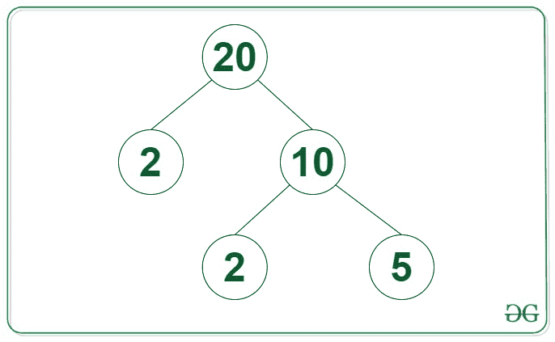
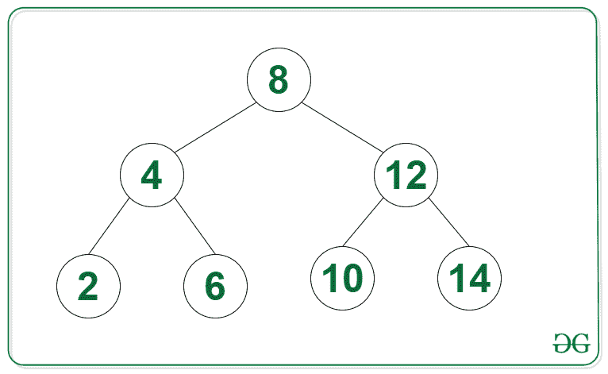

# 二叉树中节点数在范围[L，R]

内的节点数

> 原文:[https://www . geeksforgeeks . org/二进制树中节点数-范围内节点数-l-r/](https://www.geeksforgeeks.org/count-of-nodes-in-a-binary-tree-having-their-nodes-in-range-l-r/)

给定一个由 **N** 节点和两个正整数 L 和 R 组成的[二叉树](https://www.geeksforgeeks.org/binary-tree-data-structure/)，任务是找出其值在**【L，R】**范围内的节点数。

**示例:**

> **输入:**下图中的树，L = 4，R = 15
> 
> 
> 
> **输出:** 2
> **说明:**给定树中位于范围[4，15]内的节点为{5，10}。
> 
> **输入:**下图中的树，L = 8，R = 20
> 
> 
> 
> **输出:** 4

**方法:**给定的问题可以通过执行任意[树遍历](https://www.geeksforgeeks.org/tree-traversals-inorder-preorder-and-postorder/)并保持其值在范围**【L，R】**内的节点计数来解决。本文使用了 [DFS 遍历](https://www.geeksforgeeks.org/dfs-traversal-of-a-tree-using-recursion/)。

下面是上述方法的实现:

## C++

```
// C++ program for the above approach
#include <bits/stdc++.h>
using namespace std;

// Class for node of the Tree
class Node {
public:
    int val;
    Node *left, *right;
};

// Function to create a new Binary node
Node* newNode(int item)
{
    Node* temp = new Node();
    temp->val = item;
    temp->left = temp->right = NULL;

    // Return the newly created node
    return temp;
}

// Function to find the count of
// nodes in the given tree with
// their value in the range [1, N]
int countRange(Node* root, int low,
               int high, int count)
{
    int val = 0;

    // If root exists
    if (root != NULL) {

        val += root->val >= low
                       && root->val <= high
                   ? 1
                   : 0;
    }

    // Otherwise return
    else {
        return 0;
    }

    // Add count of current node,
    // count in left subtree, and
    // count in the right subtree
    count = val
            + countRange(root->left,
                         low, high, count)
            + countRange(root->right,
                         low, high, count);

    // Return Answer
    return count;
}

// Driver Code
int main()
{
    Node* root = NULL;
    root = newNode(20);
    root->left = newNode(2);
    root->right = newNode(10);
    root->right->left = newNode(2);
    root->right->right = newNode(5);

    int L = 4, R = 15;
    cout << countRange(root, L, R, 0);

    return 0;
}
```

## Java 语言(一种计算机语言，尤用于创建网站)

```
// Java program for the above approach
import java.util.*;
class GFG{

  // Class for node of the Tree
  static class Node {

    int val;
    Node left, right;
  };

  // Function to create a new Binary node
  static Node newNode(int item)
  {
    Node temp = new Node();
    temp.val = item;
    temp.left = temp.right = null;

    // Return the newly created node
    return temp;
  }

  // Function to find the count of
  // nodes in the given tree with
  // their value in the range [1, N]
  static int countRange(Node root, int low,
                        int high, int count)
  {
    int val = 0;

    // If root exists
    if (root != null) {

      val += root.val >= low
        && root.val <= high
        ? 1
        : 0;
    }

    // Otherwise return
    else {
      return 0;
    }

    // Add count of current node,
    // count in left subtree, and
    // count in the right subtree
    count = val
      + countRange(root.left,
                   low, high, count)
      + countRange(root.right,
                   low, high, count);

    // Return Answer
    return count;
  }

  // Driver Code
  public static void main(String[] args)
  {
    Node root = null;
    root = newNode(20);
    root.left = newNode(2);
    root.right = newNode(10);
    root.right.left = newNode(2);
    root.right.right = newNode(5);

    int L = 4, R = 15;
    System.out.print(countRange(root, L, R, 0));
  }
}

// This code is contributed by shikhasingrajput
```

## java 描述语言

```
<script>
      // JavaScript code for the above approach

      // Class for node of the Tree
      class Node {

          constructor(val1) {
              this.val = val1;
              this.left = null;
              this.right = null;
          }
      };

      // Function to find the count of
      // nodes in the given tree with
      // their value in the range [1, N]
      function countRange(root, low,
          high, count) {
          let val = 0;

          // If root exists
          if (root != null) {

              val += root.val >= low
                  && root.val <= high
                  ? 1
                  : 0;
          }

          // Otherwise return
          else {
              return 0;
          }

          // Add count of current node,
          // count in left subtree, and
          // count in the right subtree
          count = val
              + countRange(root.left,
                  low, high, count)
              + countRange(root.right,
                  low, high, count);

          // Return Answer
          return count;
      }

      // Driver Code
      let root = null;
      root = new Node(20);
      root.left = new Node(2);
      root.right = new Node(10);
      root.right.left = new Node(2);
      root.right.right = new Node(5);

      let L = 4, R = 15;
      document.write(countRange(root, L, R, 0));

// This code is contributed by Potta Lokesh
  </script>
```

**Output**

```
2
```

***时间复杂度:** O(N)*
***辅助空间:** O(1)*