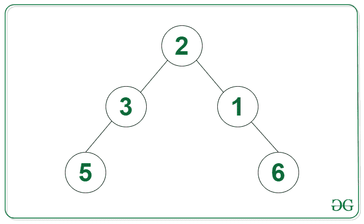

# 给定 N 元树中的节点计数，这些节点到其子树中所有叶节点的距离相等

> 原文:[https://www . geeksforgeeks . org/给定 n 元树中的节点数与所有叶节点在其子树中的距离相等/](https://www.geeksforgeeks.org/count-of-nodes-in-a-given-n-ary-tree-having-distance-to-all-leaf-nodes-equal-in-their-subtree/)

给定一个 [N 元树](https://www.geeksforgeeks.org/generic-treesn-array-trees/) **根，**任务是找到树中非叶节点的数量，使得当前节点的子树中的所有叶节点与当前节点的距离相等。

**示例:**

> **输入:**下图中的树
> **输出:** 4
> **解释:**节点{10，3，2，4}与其子树中的所有叶节点之间的距离分别相等。
> 
> 
> 
> **输入:**下图中的树
> T3】输出: 3
> 
> 

**方法:**使用[后序遍历](https://www.geeksforgeeks.org/post-order-traversal-of-binary-tree-in-on-using-o1-space/)可以解决给定的问题。其思想是检查从当前节点到其所有叶节点的节点数是否相同。可以遵循以下步骤来解决问题:

*   在 N 元树上应用[后序遍历](https://www.geeksforgeeks.org/post-order-traversal-of-binary-tree-in-on-using-o1-space/):
    *   如果根没有子对象，那么返回 1 给父对象
    *   如果每个分支都有相同的高度，那么将计数增加 1，并将高度+ 1 返回给父分支
    *   否则返回-1 给父节点，表示分支的高度不相等
*   返回计数作为答案

## C++

```
// C++ code for the above approach
#include <bits/stdc++.h>
using namespace std;
class Node {
public:
    vector<Node*> children;
    int val;
    // constructor
    Node(int v)
    {
        val = v;
        children = {};
    }
};

// Post-order traversal to find
// depth of all branches of every
// node of the tree
int postOrder(Node* root, int count[])
{

    // If root is a leaf node
    // then return 1
    if (root->children.size() == 0)
        return 1;

    // Initialize a variable height
    // calculate longest increasing path
    int height = 0;

    // Use recursion on all child nodes
    for (Node* child : root->children)
    {

        // Get the height of the branch
        int h = postOrder(child, count);

        // Initialize height of first
        // explored branch
        if (height == 0)
            height = h;

        // If branches are unbalanced
        // then store -1 in height
        else if (h == -1 || height != h)
            height = -1;
    }

    // Increment the value of count
    // If height is not -1
    if (height != -1)
        count[0]++;

    // Return the height of branches
    // including the root if height is
    // not -1 or else return -1
    return height != -1 ? height + 1 : -1;
}

// Function to find the number of nodes
// in the N-ary tree with their branches
// having equal height
int equalHeightBranches(Node* root)
{

    // Base case
    if (root == NULL)
        return 0;

    // Initialize a variable count
    // to store the answer
    int count[1] = { 0 };

    // Apply post order traversal
    // on the tree
    postOrder(root, count);

    // Return the answer
    return count[0];
}
// Driver code
int main()
{
    // Initialize the tree
    Node* seven = new Node(7);
    Node* seven2 = new Node(7);
    Node* five = new Node(5);
    Node* four = new Node(4);
    Node* nine = new Node(9);
    Node* one = new Node(1);
    Node* two = new Node(2);
    Node* six = new Node(6);
    Node* eight = new Node(8);
    Node* ten = new Node(10);
    Node* three = new Node(3);
    Node* mfour = new Node(-4);
    Node* mtwo = new Node(-2);
    Node* zero = new Node(0);
    three->children.push_back(mfour);
    three->children.push_back(mtwo);
    three->children.push_back(zero);
    ten->children.push_back(three);
    two->children.push_back(six);
    two->children.push_back(seven2);
    four->children.push_back(nine);
    four->children.push_back(one);
    four->children.push_back(five);
    seven->children.push_back(ten);
    seven->children.push_back(two);
    seven->children.push_back(eight);
    seven->children.push_back(four);

    // Call the function
    // and print the result
    cout << (equalHeightBranches(seven));
}

// This code is contributed by Potta Lokesh
```

## Java 语言(一种计算机语言，尤用于创建网站)

```
// Java implementation for the above approach

import java.io.*;
import java.util.*;

class GFG {

    // Function to find the number of nodes
    // in the N-ary tree with their branches
    // having equal height
    public static int equalHeightBranches(Node root)
    {

        // Base case
        if (root == null)
            return 0;

        // Initialize a variable count
        // to store the answer
        int[] count = new int[1];

        // Apply post order traversal
        // on the tree
        postOrder(root, count);

        // Return the answer
        return count[0];
    }

    // Post-order traversal to find
    // depth of all branches of every
    // node of the tree
    public static int postOrder(
        Node root, int[] count)
    {

        // If root is a leaf node
        // then return 1
        if (root.children.size() == 0)
            return 1;

        // Initialize a variable height
        // calculate longest increasing path
        int height = 0;

        // Use recursion on all child nodes
        for (Node child : root.children) {

            // Get the height of the branch
            int h = postOrder(child, count);

            // Initialize height of first
            // explored branch
            if (height == 0)
                height = h;

            // If branches are unbalanced
            // then store -1 in height
            else if (h == -1 || height != h)
                height = -1;
        }

        // Increment the value of count
        // If height is not -1
        if (height != -1)
            count[0]++;

        // Return the height of branches
        // including the root if height is
        // not -1 or else return -1
        return height != -1 ? height + 1 : -1;
    }

    // Driver code
    public static void main(String[] args)
    {

        // Initialize the tree
        Node seven = new Node(7);
        Node seven2 = new Node(7);
        Node five = new Node(5);
        Node four = new Node(4);
        Node nine = new Node(9);
        Node one = new Node(1);
        Node two = new Node(2);
        Node six = new Node(6);
        Node eight = new Node(8);
        Node ten = new Node(10);
        Node three = new Node(3);
        Node mfour = new Node(-4);
        Node mtwo = new Node(-2);
        Node zero = new Node(0);
        three.children.add(mfour);
        three.children.add(mtwo);
        three.children.add(zero);
        ten.children.add(three);
        two.children.add(six);
        two.children.add(seven2);
        four.children.add(nine);
        four.children.add(one);
        four.children.add(five);
        seven.children.add(ten);
        seven.children.add(two);
        seven.children.add(eight);
        seven.children.add(four);

        // Call the function
        // and print the result
        System.out.println(
            equalHeightBranches(seven));
    }

    static class Node {

        List<Node> children;
        int val;

        // constructor
        public Node(int val)
        {

            this.val = val;
            children = new ArrayList<>();
        }
    }
}
```

## C#

```
// C# implementation for the above approach
using System;
using System.Collections.Generic;

public class Node
{
  public int val;
  public List<Node> children;

  // Constructor to create a Node
  public Node(int vall)
  {
    val = vall;
    children = new List<Node>();
  }
}

class GFG {

  // Function to find the number of nodes
  // in the N-ary tree with their branches
  // having equal height
  public static int equalHeightBranches(Node root)
  {

    // Base case
    if (root == null)
      return 0;

    // Initialize a variable count
    // to store the answer
    int[] count = new int[1];

    // Apply post order traversal
    // on the tree
    postOrder(root, count);

    // Return the answer
    return count[0];
  }

  // Post-order traversal to find
  // depth of all branches of every
  // node of the tree
  public static int postOrder(
    Node root, int[] count)
  {

    // If root is a leaf node
    // then return 1
    if (root.children.Count == 0)
      return 1;

    // Initialize a variable height
    // calculate longest increasing path
    int height = 0;

    // Use recursion on all child nodes
    foreach (Node child in root.children) {

      // Get the height of the branch
      int h = postOrder(child, count);

      // Initialize height of first
      // explored branch
      if (height == 0)
        height = h;

      // If branches are unbalanced
      // then store -1 in height
      else if (h == -1 || height != h)
        height = -1;
    }

    // Increment the value of count
    // If height is not -1
    if (height != -1)
      count[0]++;

    // Return the height of branches
    // including the root if height is
    // not -1 or else return -1
    return height != -1 ? height + 1 : -1;
  }

  // Driver code
  public static void Main()
  {

    // Initialize the tree
    Node seven = new Node(7);
    Node seven2 = new Node(7);
    Node five = new Node(5);
    Node four = new Node(4);
    Node nine = new Node(9);
    Node one = new Node(1);
    Node two = new Node(2);
    Node six = new Node(6);
    Node eight = new Node(8);
    Node ten = new Node(10);
    Node three = new Node(3);
    Node mfour = new Node(-4);
    Node mtwo = new Node(-2);
    Node zero = new Node(0);
    three.children.Add(mfour);
    three.children.Add(mtwo);
    three.children.Add(zero);
    ten.children.Add(three);
    two.children.Add(six);
    two.children.Add(seven2);
    four.children.Add(nine);
    four.children.Add(one);
    four.children.Add(five);
    seven.children.Add(ten);
    seven.children.Add(two);
    seven.children.Add(eight);
    seven.children.Add(four);

    // Call the function
    // and print the result
    Console.WriteLine(
      equalHeightBranches(seven));
  }
}

// This code is contributed
// by Shubham Singh
```

## java 描述语言

```
<script>
// Javascript implementation for the above approach
class Node {

  // constructor
  constructor(val) {

    this.val = val;
    this.children = [];
  }
}

// Function to find the number of nodes
// in the N-ary tree with their branches
// having equal height
function equalHeightBranches(root) {

  // Base case
  if (root == null)
    return 0;

  // Initialize a variable count
  // to store the answer
  let count = [0];

  // Apply post order traversal
  // on the tree
  postOrder(root, count);

  // Return the answer
  return count[0];
}

// Post-order traversal to find
// depth of all branches of every
// let of the tree
function postOrder(root, count) {

  // If root is a leaf node
  // then return 1
  if (root.children.length == 0)
    return 1;

  // Initialize a variable height
  // calculate longest increasing path
  let height = 0;

  // Use recursion on all child nodes
  for (child of root.children) {

    // Get the height of the branch
    let h = postOrder(child, count);

    // Initialize height of first
    // explored branch
    if (height == 0)
      height = h;

    // If branches are unbalanced
    // then store -1 in height
    else if (h == -1 || height != h)
      height = -1;
  }

  // Increment the value of count
  // If height is not -1
  if (height != -1)
    count[0]++;

  // Return the height of branches
  // including the root if height is
  // not -1 or else return -1
  return height != -1 ? height + 1 : -1;
}

// Driver code

// Initialize the tree
let seven = new Node(7);
let seven2 = new Node(7);
let five = new Node(5);
let four = new Node(4);
let nine = new Node(9);
let one = new Node(1);
let two = new Node(2);
let six = new Node(6);
let eight = new Node(8);
let ten = new Node(10);
let three = new Node(3);
let mfour = new Node(-4);
let mtwo = new Node(-2);
let zero = new Node(0);
three.children.push(mfour);
three.children.push(mtwo);
three.children.push(zero);
ten.children.push(three);
two.children.push(six);
two.children.push(seven2);
four.children.push(nine);
four.children.push(one);
four.children.push(five);
seven.children.push(ten);
seven.children.push(two);
seven.children.push(eight);
seven.children.push(four);

// Call the function
// and print the result
console.log(equalHeightBranches(seven));

// This code is contributed by gfgking.
</script>
```

**Output**

```
4
```

***时间复杂度:**O(N)*
T5**辅助空间:** O(H)，其中 H 是树的高度