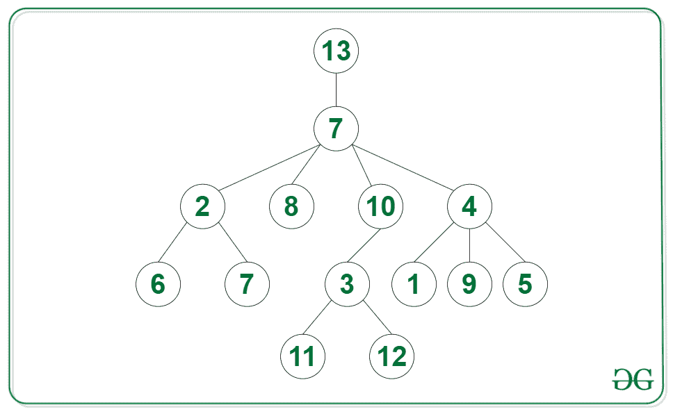
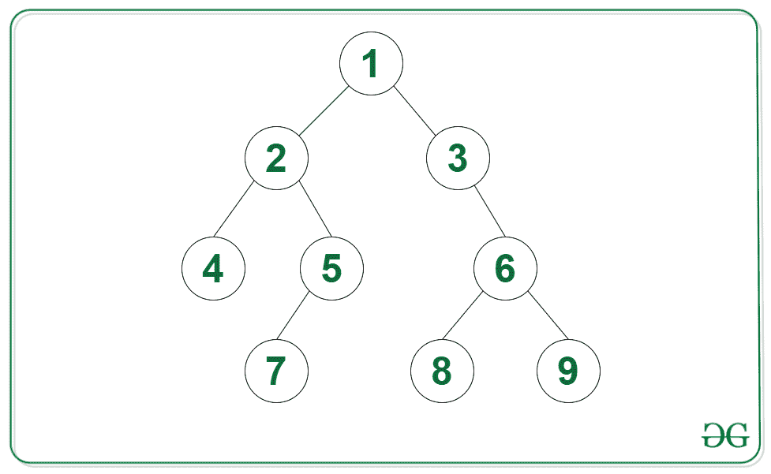

# 给定 N 元树中节点的计数，使得它们的子树是二叉树

> 原文:[https://www . geesforgeks . org/给定 n 元树中的节点数，这样它们的子树就是二叉树/](https://www.geeksforgeeks.org/count-of-nodes-in-given-n-ary-tree-such-that-their-subtree-is-a-binary-tree/)

给定一个 [N 元树](https://www.geeksforgeeks.org/generic-treesn-array-trees/) **根，**的任务是找到节点的数量，这样它们的子树就是一个二叉树。

**示例:**

> **输入:**下图中的树
> 
> 
> 
> **输出:** 11
> **解释:**有子树的节点是二叉树{2，8，10，6，7，3，1，9，5，11，12}。
> 
> **输入:**下图中的树
> 
> 
> 
> **输出:** 9

**方法:**使用[后序遍历](https://www.geeksforgeeks.org/post-order-traversal-of-binary-tree-in-on-using-o1-space/)可以解决给定的问题。想法是使用[递归](http://www.geeksforgeeks.org/recursion/)并检查当前节点是否最多包含 2 个子节点，以及这些子节点是否是有效的二叉树。可以遵循以下步骤来解决问题:

*   在 [N 元](https://www.geeksforgeeks.org/number-of-ways-to-traverse-an-n-ary-tree/)树上应用[后序遍历](https://www.geeksforgeeks.org/post-order-traversal-of-binary-tree-in-on-using-o1-space/):
    *   将每个子节点的返回值相加，计算在该节点找到的二叉树的数量，并将其存储在 **sum** 中
    *   如果根最多有两个子树是有效的二叉树，那么根也是二叉树，所以返回一对**和+ 1** 和 **1** 来表示有效的二叉树
    *   如果根有两个以上的子节点或者任何子节点都不是有效的二叉树，那么返回一对**和**以及 **0** 来指示一个无效的二叉树
*   从从[后序遍历](https://www.geeksforgeeks.org/post-order-traversal-of-binary-tree-in-on-using-o1-space/)返回的对中返回第一个索引**和**处的值。

下面是上述方法的实现:

## C++

```
// C++ code for the above approach
#include <bits/stdc++.h>
using namespace std;

class Node
{
public:
    vector<Node *> children;
    int val;

    // constructor
    Node(int v)
    {

        val = v;
        children = {};
    }
};
// Post-order traversal to find
// depth of all branches of every
// node of the tree
vector<int> postOrder(Node *root)
{

    // Initialize a variable sum to
    // count number of binary trees
    int sum = 0;

    // Integer to indicate if the tree
    // rooted at current root is a
    // valid binary tree
    int valid = 1;

    // Use recursion on all child nodes
    for (Node *child : root->children)
    {

        // Get the number of binary trees
        vector<int> binTrees = postOrder(child);

        // If tree rooted at current child
        // is not a valid binary tree then
        // tree rooted at current root is
        // also not a valid binary tree
        if (binTrees[1] == 0)
            valid = 0;

        // If branches are unbalanced
        // then store -1 in height
        sum += binTrees[0];
    }

    // Children are valid binary trees
    // and the number of children
    // are less than 3
    if (valid == 1 && root->children.size() < 3)
    {

        // Root is also a valid binary tree
        sum++;
    }

    // Children are leaf nodes but number
    // of children are greater than 2
    else
        valid = 0;

    // Return the answer
    return {sum, valid};
}

// Function to find the number of
// binary trees in an N-ary tree
int binTreesGeneric(Node *root)
{

    // Base case
    if (root == NULL)
        return 0;

    // Apply post-order traversal on
    // the root and return the answer
    return postOrder(root)[0];
}

// Driver code
int main()
{

    // Initialize the graph
    Node *twenty = new Node(20);
    Node *seven = new Node(7);
    Node *seven2 = new Node(7);
    Node *five = new Node(5);
    Node *four = new Node(4);
    Node *nine = new Node(9);
    Node *one = new Node(1);
    Node *two = new Node(2);
    Node *six = new Node(6);
    Node *eight = new Node(8);
    Node *ten = new Node(10);
    Node *three = new Node(3);
    Node *mfour = new Node(11);
    Node *zero = new Node(12);
    three->children.push_back(mfour);
    three->children.push_back(zero);
    ten->children.push_back(three);
    two->children.push_back(six);
    two->children.push_back(seven2);
    four->children.push_back(nine);
    four->children.push_back(one);
    four->children.push_back(five);
    seven->children.push_back(ten);
    seven->children.push_back(two);
    seven->children.push_back(eight);
    seven->children.push_back(four);
    twenty->children.push_back(seven);

    // Call the function
    // and print the result
    cout << (binTreesGeneric(twenty));
}

// This code is contributed by Potta Lokesh
```

## Java 语言(一种计算机语言，尤用于创建网站)

```
// Java implementation for the above approach

import java.io.*;
import java.util.*;

class GFG {

    static class Node {

        List<Node> children;
        int val;

        // constructor
        public Node(int val)
        {

            this.val = val;
            children = new ArrayList<>();
        }
    }

    // Function to find the number of
    // binary trees in an N-ary tree
    public static int binTreesGeneric(Node root)
    {

        // Base case
        if (root == null)
            return 0;

        // Apply post-order traversal on
        // the root and return the answer
        return postOrder(root)[0];
    }

    // Post-order traversal to find
    // depth of all branches of every
    // node of the tree
    public static int[] postOrder(Node root)
    {

        // Initialize a variable sum to
        // count number of binary trees
        int sum = 0;

        // Integer to indicate if the tree
        // rooted at current root is a
        // valid binary tree
        int valid = 1;

        // Use recursion on all child nodes
        for (Node child : root.children) {

            // Get the number of binary trees
            int[] binTrees = postOrder(child);

            // If tree rooted at current child
            // is not a valid binary tree then
            // tree rooted at current root is
            // also not a valid binary tree
            if (binTrees[1] == 0)
                valid = 0;

            // If branches are unbalanced
            // then store -1 in height
            sum += binTrees[0];
        }

        // Children are valid binary trees
        // and the number of children
        // are less than 3
        if (valid == 1 && root.children.size() < 3) {

            // Root is also a valid binary tree
            sum++;
        }

        // Children are leaf nodes but number
        // of children are greater than 2
        else
            valid = 0;

        // Return the answer
        return new int[] { sum, valid };
    }

    // Driver code
    public static void main(String[] args)
    {

        // Initialize the graph
        Node twenty = new Node(20);
        Node seven = new Node(7);
        Node seven2 = new Node(7);
        Node five = new Node(5);
        Node four = new Node(4);
        Node nine = new Node(9);
        Node one = new Node(1);
        Node two = new Node(2);
        Node six = new Node(6);
        Node eight = new Node(8);
        Node ten = new Node(10);
        Node three = new Node(3);
        Node mfour = new Node(11);
        Node zero = new Node(12);
        three.children.add(mfour);
        three.children.add(zero);
        ten.children.add(three);
        two.children.add(six);
        two.children.add(seven2);
        four.children.add(nine);
        four.children.add(one);
        four.children.add(five);
        seven.children.add(ten);
        seven.children.add(two);
        seven.children.add(eight);
        seven.children.add(four);
        twenty.children.add(seven);

        // Call the function
        // and print the result
        System.out.println(
            binTreesGeneric(twenty));
    }
}
```

## 蟒蛇 3

```
# Python code for the above approach
class Node:

  # constructor
  def __init__(self, v):
    self.val = v;
    self.children = [];

# Post-order traversal to find
# depth of all branches of every
# node of the tree
def postOrder(root):

  # Initialize a variable sum to
  # count number of binary trees
  sum = 0;

  # Integer to indicate if the tree
  # rooted at current root is a
  # valid binary tree
  valid = 1;

  # Use recursion on all child nodes
  for child in root.children:

    # Get the number of binary trees
    binTrees = postOrder(child);

    # If tree rooted at current child
    # is not a valid binary tree then
    # tree rooted at current root is
    # also not a valid binary tree
    if (binTrees[1] == 0):
      valid = 0;

    # If branches are unbalanced
    # then store -1 in height
    sum += binTrees[0];

  # Children are valid binary trees
  # and the number of children
  # are less than 3
  if (valid == 1 and len(root.children) < 3):

    # Root is also a valid binary tree
    sum += 1

  # Children are leaf nodes but number
  # of children are greater than 2
  else:
    valid = 0;

  # Return the answer
  return [ sum, valid ];

# Function to find the number of
# binary trees in an N-ary tree
def binTreesGeneric(root):

  # Base case
  if (root == None):
    return 0;

  # Apply post-order traversal on
  # the root and return the answer
  return postOrder(root)[0];

# Driver code

# Initialize the graph
twenty = Node(20);
seven = Node(7);
seven2 = Node(7);
five = Node(5);
four = Node(4);
nine = Node(9);
one = Node(1);
two = Node(2);
six = Node(6);
eight = Node(8);
ten = Node(10);
three = Node(3);
mfour = Node(11);
zero = Node(12);
three.children.append(mfour);
three.children.append(zero);
ten.children.append(three);
two.children.append(six);
two.children.append(seven2);
four.children.append(nine);
four.children.append(one);
four.children.append(five);
seven.children.append(ten);
seven.children.append(two);
seven.children.append(eight);
seven.children.append(four);
twenty.children.append(seven);

# Call the function
# and print the result
print((binTreesGeneric(twenty)));

# This code is contributed by gfgking
```

## java 描述语言

```
<script>
// Javascript code for the above approach
class Node {

  // constructor
  constructor(v) {

    this.val = v;
    this.children = [];
  }
};

// Post-order traversal to find
// depth of all branches of every
// node of the tree
function postOrder(root) {

  // Initialize a variable sum to
  // count number of binary trees
  let sum = 0;

  // Integer to indicate if the tree
  // rooted at current root is a
  // valid binary tree
  let valid = 1;

  // Use recursion on all child nodes
  for (child of root.children) {

    // Get the number of binary trees
    let binTrees = postOrder(child);

    // If tree rooted at current child
    // is not a valid binary tree then
    // tree rooted at current root is
    // also not a valid binary tree
    if (binTrees[1] == 0)
      valid = 0;

    // If branches are unbalanced
    // then store -1 in height
    sum += binTrees[0];
  }

  // Children are valid binary trees
  // and the number of children
  // are less than 3
  if (valid == 1 && root.children.length < 3) {

    // Root is also a valid binary tree
    sum++;
  }

  // Children are leaf nodes but number
  // of children are greater than 2
  else
    valid = 0;

  // Return the answer
  return [ sum, valid ];
}

// Function to find the number of
// binary trees in an N-ary tree
function binTreesGeneric(root) {

  // Base case
  if (root == null)
    return 0;

  // Apply post-order traversal on
  // the root and return the answer
  return postOrder(root)[0];
}

// Driver code

// Initialize the graph
let twenty = new Node(20);
let seven = new Node(7);
let seven2 = new Node(7);
let five = new Node(5);
let four = new Node(4);
let nine = new Node(9);
let one = new Node(1);
let two = new Node(2);
let six = new Node(6);
let eight = new Node(8);
let ten = new Node(10);
let three = new Node(3);
let mfour = new Node(11);
let zero = new Node(12);
three.children.push(mfour);
three.children.push(zero);
ten.children.push(three);
two.children.push(six);
two.children.push(seven2);
four.children.push(nine);
four.children.push(one);
four.children.push(five);
seven.children.push(ten);
seven.children.push(two);
seven.children.push(eight);
seven.children.push(four);
twenty.children.push(seven);

// Call the function
// and print the result
document.write((binTreesGeneric(twenty)));

// This code is contributed by gfgking
</script>
```

**Output**

```
11
```

***时间复杂度:**O(N)*
T5**辅助空间:** O(N)