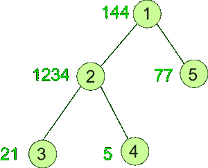

# 树中具有素数和权重的节点数

> 原文:[https://www . geeksforgeeks . org/树中有质数和权重的节点数/](https://www.geeksforgeeks.org/count-of-nodes-which-has-prime-digit-sum-weight-in-a-tree/)

给定**一棵加权树**，任务是计算权重位数之和为[素数](https://www.geeksforgeeks.org/prime-numbers/)的节点数。
**例:**

> **输入:**
> 
> 
> 
> **输出:** 2
> **说明:**
> 节点 1: digitSum(144) = 1 + 4 + 4 = 9
> 节点 2: digitSum(1234) = 1 + 2 + 3 + 4 = 10
> 节点 3: digitSum(21) = 2 + 1 = 3
> 节点 4: digitSum(5) = 5
> 节点 5: digitSum(77) = 7 + 7 = 14

**方法:**为了解决上面提到的问题，我们必须对树和每个节点执行 [DFS](https://www.geeksforgeeks.org/depth-first-traversal-for-a-graph/) ，并检查其权重的位数之和是否为素数。如果是，则增加计数。为了检查数字和是否为质数，我们将使用厄拉多塞[筛](https://www.geeksforgeeks.org/sieve-of-eratosthenes/)。创建一个筛子，它将帮助我们识别度在 O(1)时间内是否是质数。
以下是上述方法的实现:

## C++

```
// C++ program to Count Nodes
// which has Prime Digit
// Sum Weight in a Tree

#include <bits/stdc++.h>
using namespace std;

int MAX = 1000000;
int ans = 0;

vector<int> graph[100];
vector<int> weight(100);

// Function to create Sieve
// to check primes
void SieveOfEratosthenes(
    bool prime[], int p_size)
{
    // false here indicates
    // that it is not prime
    prime[0] = false;
    prime[1] = false;

    for (int p = 2; p * p <= p_size; p++) {

        // If prime[p] is not changed,
        // then it is a prime
        if (prime[p]) {

            // Update all multiples of p,
            // set them to non-prime
            for (int i = p * 2;
                 i <= p_size;
                 i += p)
                prime[i] = false;
        }
    }
}

// Function to return the
// sum of the digits of n
int digitSum(int n)
{
    int sum = 0;
    while (n) {
        sum += n % 10;
        n = n / 10;
    }
    return sum;
}

// Function to perform dfs
void dfs(int node,
         int parent,
         bool prime[])
{
    // If sum of the digits
    // of current node's weight
    // is prime then increment ans
    int sum = digitSum(weight[node]);
    if (prime[sum])
        ans += 1;

    for (int to : graph[node]) {
        if (to == parent)
            continue;
        dfs(to, node, prime);
    }
}

// Driver code
int main()
{

    // Weights of the node
    weight[1] = 144;
    weight[2] = 1234;
    weight[3] = 21;
    weight[4] = 5;
    weight[5] = 77;

    // Edges of the tree
    graph[1].push_back(2);
    graph[2].push_back(3);
    graph[2].push_back(4);
    graph[1].push_back(5);

    bool prime[MAX];
    memset(prime, true, sizeof(prime));

    SieveOfEratosthenes(prime, MAX);

    dfs(1, 1, prime);

    cout << ans;

    return 0;
}
```

## Java 语言(一种计算机语言，尤用于创建网站)

```
// Java program to Count Nodes
// which has Prime Digit
// Sum Weight in a Tree
import java.util.*;
class GFG{

static int MAX = 1000000;
static int ans = 0;

static Vector<Integer> []graph =
              new Vector[100];
static int []weight = new int[100];

// Function to create Sieve
// to check primes
static void SieveOfEratosthenes(boolean prime[],
                                int p_size)
{
  // false here indicates
  // that it is not prime
  prime[0] = false;
  prime[1] = false;

  for (int p = 2; p * p <= p_size; p++)
  {
    // If prime[p] is not changed,
    // then it is a prime
    if (prime[p])
    {
      // Update all multiples of p,
      // set them to non-prime
      for (int i = p * 2;
               i < p_size; i += p)
        prime[i] = false;
    }
  }
}

// Function to return the
// sum of the digits of n
static int digitSum(int n)
{
  int sum = 0;
  while (n > 0)
  {
    sum += n % 10;
    n = n / 10;
  }
  return sum;
}

// Function to perform dfs
static void dfs(int node,
                int parent,
                boolean prime[])
{
  // If sum of the digits
  // of current node's weight
  // is prime then increment ans
  int sum = digitSum(weight[node]);
  if (prime[sum])
    ans += 1;

  for (int to : graph[node])
  {
    if (to == parent)
      continue;
    dfs(to, node, prime);
  }
}

// Driver code
public static void main(String[] args)
{
  // Weights of the node
  weight[1] = 144;
  weight[2] = 1234;
  weight[3] = 21;
  weight[4] = 5;
  weight[5] = 77;
  for (int i = 0; i < graph.length; i++)
    graph[i] = new Vector<Integer>();

  // Edges of the tree
  graph[1].add(2);
  graph[2].add(3);
  graph[2].add(4);
  graph[1].add(5);

  boolean []prime = new boolean[MAX];
  Arrays.fill(prime, true);
  SieveOfEratosthenes(prime, MAX);
  dfs(1, 1, prime);
  System.out.print(ans);
}
}

// This code is contributed by Rajput-Ji
```

## 蟒蛇 3

```
# Python program to Count Nodes
# which has Prime Digit
# Sum Weight in a Tree
from typing import List
MAX = 1000000
ans = 0

graph = [[] for _ in range(100)]
weight = [0 for _ in range(100)]

# Function to create Sieve
# to check primes
def SieveOfEratosthenes(prime: List[bool], p_size: int) -> None:

    # false here indicates
    # that it is not prime
    prime[0] = False
    prime[1] = False

    p = 2
    while p * p <= p_size:

        # If prime[p] is not changed,
        # then it is a prime
        if (prime[p]):

            # Update all multiples of p,
            # set them to non-prime
            for i in range(p * 2, p_size + 1, p):
                prime[i] = False
        p += 1

# Function to return the
# sum of the digits of n
def digitSum(n: int) -> int:
    sum = 0
    while (n):
        sum += n % 10
        n = n // 10
    return sum

# Function to perform dfs
def dfs(node: int, parent: int, prime: List[bool]) -> None:
    global ans

    # If sum of the digits
    # of current node's weight
    # is prime then increment ans
    sum = digitSum(weight[node])
    if (prime[sum]):
        ans += 1
    for to in graph[node]:
        if (to == parent):
            continue
        dfs(to, node, prime)

# Driver code
if __name__ == "__main__":

    # Weights of the node
    weight[1] = 144
    weight[2] = 1234
    weight[3] = 21
    weight[4] = 5
    weight[5] = 77

    # Edges of the tree
    graph[1].append(2)
    graph[2].append(3)
    graph[2].append(4)
    graph[1].append(5)

    prime = [True for _ in range(MAX + 1)]
    SieveOfEratosthenes(prime, MAX)
    dfs(1, 1, prime)
    print(ans)

# This code is contributed by sanjeev2552
```

## C#

```
// C# program to Count Nodes
// which has Prime Digit
// Sum Weight in a Tree
using System;
using System.Collections.Generic;
class GFG{

static int MAX = 1000000;
static int ans = 0;
static List<int> []graph =
       new List<int>[100];
static int []weight = new int[100];

// Function to create Sieve
// to check primes
static void SieveOfEratosthenes(bool []prime,
                                int p_size)
{
  // false here indicates
  // that it is not prime
  prime[0] = false;
  prime[1] = false;

  for (int p = 2; p * p <= p_size; p++)
  {
    // If prime[p] is not changed,
    // then it is a prime
    if (prime[p])
    {
      // Update all multiples of p,
      // set them to non-prime
      for (int i = p * 2;
               i < p_size; i += p)
        prime[i] = false;
    }
  }
}

// Function to return the
// sum of the digits of n
static int digitSum(int n)
{
  int sum = 0;
  while (n > 0)
  {
    sum += n % 10;
    n = n / 10;
  }
  return sum;
}

// Function to perform dfs
static void dfs(int node,
                int parent,
                bool []prime)
{
  // If sum of the digits
  // of current node's weight
  // is prime then increment ans
  int sum = digitSum(weight[node]);
  if (prime[sum])
    ans += 1;

  foreach (int to in graph[node])
  {
    if (to == parent)
      continue;
    dfs(to, node, prime);
  }
}

// Driver code
public static void Main(String[] args)
{
  // Weights of the node
  weight[1] = 144;
  weight[2] = 1234;
  weight[3] = 21;
  weight[4] = 5;
  weight[5] = 77;
  for (int i = 0; i < graph.Length; i++)
    graph[i] = new List<int>();

  // Edges of the tree
  graph[1].Add(2);
  graph[2].Add(3);
  graph[2].Add(4);
  graph[1].Add(5);

  bool []prime = new bool[MAX];

  for (int i = 0; i < prime.Length; i++)
    prime[i] = true;

  SieveOfEratosthenes(prime, MAX);
  dfs(1, 1, prime);
  Console.Write(ans);
}
}

// This code is contributed by Rajput-Ji
```

## java 描述语言

```
<script>
// Javascript program to Count Nodes
// which has Prime Digit
// Sum Weight in a Tree

let MAX = 1000000;
let ans = 0;

let graph = [];

for(let i = 0; i < 100; i++){
    graph.push([])
}

console.log(graph)
let weight = new Array(100);

// Function to create Sieve
// to check primes
function SieveOfEratosthenes(prime, p_size)
{
    // false here indicates
    // that it is not prime
    prime[0] = false;
    prime[1] = false;

    for (let p = 2; p * p <= p_size; p++) {

        // If prime[p] is not changed,
        // then it is a prime
        if (prime[p]) {

            // Update all multiples of p,
            // set them to non-prime
            for (let i = p * 2;
                i <= p_size;
                i += p)
                prime[i] = false;
        }
    }
}

// Function to return the
// sum of the digits of n
function digitSum(n)
{
    let sum = 0;
    while (n) {
        sum += n % 10;
        n = Math.floor(n / 10);
    }
    return sum;
}

// Function to perform dfs
function dfs(node, parent, prime)
{
    // If sum of the digits
    // of current node's weight
    // is prime then increment ans
    let sum = digitSum(weight[node]);
    if (prime[sum])
        ans += 1;

    for (let to of graph[node]) {
        if (to == parent)
            continue;
        dfs(to, node, prime);
    }
}

// Driver code

    // Weights of the node
    weight[1] = 144;
    weight[2] = 1234;
    weight[3] = 21;
    weight[4] = 5;
    weight[5] = 77;

    // Edges of the tree
    graph[1].push(2);
    graph[2].push(3);
    graph[2].push(4);
    graph[1].push(5);

    let prime = new Array(MAX);
    prime.fill(true)

    SieveOfEratosthenes(prime, MAX);

    dfs(1, 1, prime);

    document.write(ans);

    // This code is contributed by gfgking
</script>
```

**Output:** 

```
2
```

**<u>复杂度分析:</u>**

*   **时间复杂度:** O(N)。
    在 DFS 中，树的每个节点都被处理一次，因此如果树中总共有 N 个节点，由于 DFS 而导致的复杂性是 O(N)。此外，为了处理每个节点，使用了 SieveOfEratosthenes()函数，该函数的复杂度也是 O(sqrt(N))，但是由于该函数只执行一次，因此不会影响整体的时间复杂度。因此，时间复杂度为 O(N)。
*   **辅助空间:** O(N)。
    质数数组使用额外空间，因此空间复杂度为 O(N)。