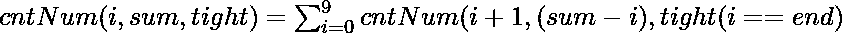

# 数字总和为 Y 的[L，R]范围内的数字计数|设置 2

> 原文:[https://www . geesforgeks . org/numbers-from-range-l-r-其位数总和为-y-set-2/](https://www.geeksforgeeks.org/count-of-numbers-from-range-l-r-whose-sum-of-digits-is-y-set-2/)

给定三个正整数 **L** 、 **R** 和 **Y** ，任务是统计**【L，R】**范围内的数字，其[位数之和](https://www.geeksforgeeks.org/program-for-sum-of-the-digits-of-a-given-number/)等于 **Y**

**示例:**

> **输入:** L = 500，R = 1000，Y = 6
> **输出:** 3
> **说明:**
> 数字之和为 Y(= 6)的[500，600]范围内的数字为:
> 501 = 5+0+1 = 6
> 510 = 5+1+0 = 6
> 600 = 6+0+0 = 6
> 因此，所需的输出
> 
> **输入:** L = 20，R = 10000，Y = 14
> T3】输出: 540

**天真的做法:**参考[上一篇](https://www.geeksforgeeks.org/count-of-numbers-from-range-l-r-whose-sum-of-digits-is-y/)通过迭代**【L，R】**范围内的所有数字来解决这个问题，对于每个数字，检查其位数之和是否等于 **Y** 。如果发现为真，则增加计数。最后，打印获得的计数。

***时间复杂度:**O(R–L+1)* log<sub>10</sub>(R)*
***辅助空间:** O(1)*

**高效方法:**为了优化上述方法，思路是使用[数字 DP](https://www.geeksforgeeks.org/digit-dp-introduction/) 使用以下递归关系:

> 
> 
> 其中， **sum:** 表示位数之和。
> **紧:**检查位数总和是否超过 Y。
> **结束:**存储一个数字的第 i <sup>个</sup>位的最大可能值。
> **cntNum(N，Y，紧密):**返回数字之和为 Y 的[0，X]范围内的数字计数

在进入 DP 解决方案之前，最好写下递归代码。

以下是递归代码–

## Java 语言(一种计算机语言，尤用于创建网站)

```
// Java program for the above approach
import java.util.*;
class GFG
{
// Function to find the sum of digits
// of numbers in the range [0, X]
static int cntNum(String X, int i, int sum,
           int tight)
 {
    // Check if count of digits in a number
    // greater than count of digits in X
    if (i >= X.length() || sum < 0) {

        // Check Iif sum of digits of a
        // number is equal to Y
        if (sum == 0) {
            return 1;
        }

        return 0;
    }

    // Stores count of numbers whose
    // sum of digits is Y
    int res = 0;

    // Check if the number
    // exceeds Y or not
    int end = tight != 0 ? X.charAt(i) - '0' : 9;

    // Iterate over all possible
    // values of i-th digits
    for (int j = 0; j <= end; j++) {

        // Update res
        res += cntNum(X, i + 1, sum - j,
                      (tight > 0 & (j == end)) ==
                               true ? 1 : 0);
    }

    // Return res
    return res;
 }
// Utility function to count the numbers in
// the range [L, R] whose sum of digits is Y
static int UtilCntNumRange(int L,int R,int Y)
 {
     // Base Case
    if (R == 0 && Y == 0) {

        return 1;
    }
   // Stores numbers in the form
    // of its equivalent String
    String str = String.valueOf(R);

     // Stores count of numbers
    // in the range [0, R]
    int cntR = cntNum(str, 0, Y,
                      1);

    // Update str
    str = String.valueOf(L - 1);
    // Stores count of numbers in
    // the range [0, L - 1]
    int cntL = cntNum(str, 0, Y,
                      1);

    return (cntR - cntL);
 }
// Driver Code
 public static void main (String[] args)
    {
      int L = 20, R = 10000, Y = 14;
      System.out.print(UtilCntNumRange(L, R, Y));
    }
}
// This code is contributed by Debojyoti Mandal
```

## C#

```
// C# program for the above approach
using System;
class GFG
{

    // Function to find the sum of digits
    // of numbers in the range [0, X]
    static int cntNum(string X, int i, int sum, int tight)
    {

        // Check if count of digits in a number
        // greater than count of digits in X
        if (i >= X.Length || sum < 0) {

            // Check Iif sum of digits of a
            // number is equal to Y
            if (sum == 0) {
                return 1;
            }

            return 0;
        }

        // Stores count of numbers whose
        // sum of digits is Y
        int res = 0;

        // Check if the number
        // exceeds Y or not
        int end = tight != 0 ? X[i] - '0' : 9;

        // Iterate over all possible
        // values of i-th digits
        for (int j = 0; j <= end; j++) {

            // Update res
            res += cntNum(
                X, i + 1, sum - j,
                (tight > 0 & (j == end)) == true ? 1 : 0);
        }

        // Return res
        return res;
    }
    // Utility function to count the numbers in
    // the range [L, R] whose sum of digits is Y
    static int UtilCntNumRange(int L, int R, int Y)
    {
        // Base Case
        if (R == 0 && Y == 0) {

            return 1;
        }
        // Stores numbers in the form
        // of its equivalent String
        string str = R.ToString();

        // Stores count of numbers
        // in the range [0, R]
        int cntR = cntNum(str, 0, Y, 1);

        // Update str
        str = (L - 1).ToString();
        // Stores count of numbers in
        // the range [0, L - 1]
        int cntL = cntNum(str, 0, Y, 1);

        return (cntR - cntL);
    }

    // Driver Code
    public static void Main(string[] args)
    {
        int L = 20, R = 10000, Y = 14;
        Console.WriteLine(UtilCntNumRange(L, R, Y));
    }
}

// This code is contributed by ukasp.
```

## java 描述语言

```
// JavaScript program for the above approach
// Function to find the sum of digits
// of numbers in the range [0, X]
function cntNum( X, i, sum, tight)
 {
    // Check if count of digits in a number
    // greater than count of digits in X
    if (i >= X.length || sum < 0) {

        // Check Iif sum of digits of a
        // number is equal to Y
        if (sum == 0) {
            return 1;
        }

        return 0;
    }

    // Stores count of numbers whose
    // sum of digits is Y
    var res = 0;

    // Check if the number
    // exceeds Y or not
    var end = tight != 0 ? X[i].charCodeAt(0) - '0'.charCodeAt(0) : 9;

    // Iterate over all possible
    // values of i-th digits
    for (var j = 0; j <= end; j++) {

        // Update res
        res += cntNum(X, i + 1, sum - j,
                      (tight > 0 & (j == end)) ==
                               true ? 1 : 0);
    }

    // Return res
    return res;
 }
// Utility function to count the numbers in
// the range [L, R] whose sum of digits is Y
function UtilCntNumRange(L, R, Y)
 {
     // Base Case
    if (R == 0 && Y == 0) {

        return 1;
    }
   // Stores numbers in the form
    // of its equivalent String
    var str = (R).toString();

     // Stores count of numbers
    // in the range [0, R]
    var cntR = cntNum(str, 0, Y,
                      1);

    // Update str
     str = (L - 1).toString();
    // Stores count of numbers in
    // the range [0, L - 1]
    var cntL = cntNum(str, 0, Y,
                      1);

    return (cntR - cntL);
 }
// Driver Code

      var L = 20, R = 10000, Y = 14;
      document.write(UtilCntNumRange(L, R, Y));

// This code is contributed by shivanisinghss2110
```

**Output**

```
540
```

按照以下步骤使用 DP 解决问题。

1.  初始化一个[三维数组](https://www.geeksforgeeks.org/multidimensional-arrays-c-cpp/)**DP【N】【Y】【紧】**计算并存储上述递归关系的所有子问题的值。
2.  最后，返回**DP【N】【sum】【紧】**的值。

下面是上述方法的实现:

## C++

```
// CPP program for the above approach
#include <bits/stdc++.h>
using namespace std;

#define M 1000

// Function to find the sum of digits
// of numbers in the range [0, X]
int cntNum(string X, int i, int sum,
           int tight, int dp[M][M][2])
{
    // Check if count of digits in a number
    // greater than count of digits in X
    if (i >= X.length() || sum < 0) {

        // If sum of digits of a
        // number is equal to Y
        if (sum == 0) {
            return 1;
        }

        return 0;
    }

    // Check if current subproblem has
    // already been computed
    if (dp[sum][i][tight] != -1) {
        return dp[sum][i][tight];
    }

    // Stores count of numbers whose
    // sum of digits is Y
    int res = 0;

    // Check if the number
    // exceeds Y or not
    int end = tight ? X[i] - '0' : 9;

    // Iterate over all possible
    // values of i-th digits
    for (int j = 0; j <= end; j++) {

        // Update res
        res += cntNum(X, i + 1, sum - j,
                      (tight & (j == end)), dp);
    }

    // Return res
    return dp[sum][i][tight]=res;
}

// Utility function to count the numbers in
// the range [L, R] whose sum of digits is Y
int UtilCntNumRange(int L, int R, int Y)
{
    // Base Case
    if (R == 0 && Y == 0) {

        return 1;
    }

    // Stores numbers in the form
    // of its equivalent string
    string str = to_string(R);

    // Stores overlapping subproblems
    int dp[M][M][2];

    // Initialize dp[][][]
    memset(dp, -1, sizeof(dp));

    // Stores count of numbers
    // in the range [0, R]
    int cntR = cntNum(str, 0, Y,
                      true, dp);

    // Update str
    str = to_string(L - 1);

    // Initialize dp[][][]
    memset(dp, -1, sizeof(dp));

    // Stores count of numbers in
    // the range [0, L - 1]
    int cntL = cntNum(str, 0, Y,
                      true, dp);

    return (cntR - cntL);
}

// Driver Code
int main()
{
    int L = 20, R = 10000, Y = 14;
    cout << UtilCntNumRange(L, R, Y);
}
```

## Java 语言(一种计算机语言，尤用于创建网站)

```
// Java program for the above approach
import java.util.*;

class GFG{

static final int M = 1000;

// Function to find the sum of digits
// of numbers in the range [0, X]
static int cntNum(String X, int i, int sum,
           int tight, int dp[][][])
{
    // Check if count of digits in a number
    // greater than count of digits in X
    if (i >= X.length() || sum < 0) {

        // Check Iif sum of digits of a
        // number is equal to Y
        if (sum == 0) {
            return 1;
        }

        return 0;
    }

    // Check if current subproblem has
    // already been computed
    if (dp[sum][i][tight] != -1) {
        return dp[sum][i][tight];
    }

    // Stores count of numbers whose
    // sum of digits is Y
    int res = 0;

    // Check if the number
    // exceeds Y or not
    int end = tight != 0 ? X.charAt(i) - '0' : 9;

    // Iterate over all possible
    // values of i-th digits
    for (int j = 0; j <= end; j++) {

        // Update res
        res += cntNum(X, i + 1, sum - j,
                      (tight > 0 & (j == end)) ==
                               true ? 1 : 0, dp);
    }

    // Return res
    return dp[sum][i][tight]=res;
}

// Utility function to count the numbers in
// the range [L, R] whose sum of digits is Y
static int UtilCntNumRange(int L, int R, int Y)
{
    // Base Case
    if (R == 0 && Y == 0) {

        return 1;
    }

    // Stores numbers in the form
    // of its equivalent String
    String str = String.valueOf(R);

    // Stores overlapping subproblems
    int [][][]dp = new int[M][M][2];

    // Initialize dp[][][]
    for(int i = 0; i < M; i++)
    {
        for (int j = 0; j < M; j++) {
            for (int k = 0; k < 2; k++)
                dp[i][j][k] = -1;
        }
    }

    // Stores count of numbers
    // in the range [0, R]
    int cntR = cntNum(str, 0, Y,
                      1, dp);

    // Update str
    str = String.valueOf(L - 1);

    // Initialize dp[][][]
    for(int i = 0; i < M; i++)
    {
        for (int j = 0; j < M; j++) {
            for (int k = 0; k < 2; k++)
                dp[i][j][k] = -1;
        }
    }

    // Stores count of numbers in
    // the range [0, L - 1]
    int cntL = cntNum(str, 0, Y,
                      1, dp);

    return (cntR - cntL);
}

// Driver Code
public static void main(String[] args)
{
    int L = 20, R = 10000, Y = 14;
    System.out.print(UtilCntNumRange(L, R, Y));
}
}

// This code is contributed by shikhasingrajput
```

## 蟒蛇 3

```
# Python program for the above approach
M = 1000

# Function to find the sum of digits
# of numbers in the range [0, X]
def cntNum(X, i, sum, tight, dp):

    # Check if count of digits in a number
    # greater than count of digits in X
    if (i >= len(X) or sum < 0):

        # Check if sum of digits of a
        # number is equal to Y
        if (sum == 0):
            return 1

        return 0

    # Check if current subproblem has
    # already been comrputed
    if (dp[sum][i][tight] != -1):
        return dp[sum][i][tight]

    # Stores count of numbers whose
    # sum of digits is Y
    res, end = 0, 9

    # Check if the number
    # exceeds Y or not
    if tight:
        end = ord(X[i]) - ord('0')
    # end = tight ? X[i] - '0' : 9;

    # Iterate over all possible
    # values of i-th digits
    for j in range(end + 1):

        # Update res
        res += cntNum(X, i + 1, sum - j,
                      (tight & (j == end)), dp)

    # Return res
    dp[sum][i][tight] = res
    return res

# Utility function to count the numbers in
# the range [L, R] whose sum of digits is Y
def UtilCntNumRange(L, R, Y):

    # Base Case
    if (R == 0 and Y == 0):

        return 1

    # Stores numbers in the form
    # of its equivalent
    strr = str(R)

    # Stores overlapping subproblems
    dp = [[[-1 for i in range(2)] for i in range(M)]
                                  for i in range(M)]

    # Initialize dp[][][]
    # memset(dp, -1, sizeof(dp))

    # Stores count of numbers
    # in the range [0, R]
    cntR = cntNum(strr, 0, Y, True, dp)

    # Update str
    strr = str(L - 1)

    # Initialize dp[][][]
    # memset(dp, -1, sizeof(dp))

    # Stores count of numbers in
    # the range [0, L - 1]
    cntL = cntNum(strr, 0, Y, True, dp)

    return (cntR - cntL)

# Driver Code
if __name__ == '__main__':
    L, R, Y = 20, 10000, 14
    print(UtilCntNumRange(L, R, Y))

# This code is contributed by mohit kumar 29
```

## C#

```
// C# program for the above approach
using System;

class GFG{

static readonly int M = 1000;

// Function to find the sum of digits
// of numbers in the range [0, X]
static int cntNum(String X, int i, int sum,
                 int tight, int [,,]dp)
{

    // Check if count of digits in a number
    // greater than count of digits in X
    if (i >= X.Length || sum < 0)
    {

        // Check if sum of digits of a
        // number is equal to Y
        if (sum == 0)
        {
            return 1;
        }
        return 0;
    }

    // Check if current subproblem has
    // already been computed
    if (dp[sum, i, tight] != -1)
    {
        return dp[sum, i, tight];
    }

    // Stores count of numbers whose
    // sum of digits is Y
    int res = 0;

    // Check if the number
    // exceeds Y or not
    int end = tight != 0 ? X[i] - '0' : 9;

    // Iterate over all possible
    // values of i-th digits
    for(int j = 0; j <= end; j++)
    {

        // Update res
        res += cntNum(X, i + 1, sum - j,
                    (tight > 0 & (j == end)) ==
                      true ? 1 : 0, dp);
    }

    // Return res
    return dp[sum][i][tight] = res;
}

// Utility function to count the numbers in
// the range [L, R] whose sum of digits is Y
static int UtilCntNumRange(int L, int R, int Y)
{

    // Base Case
    if (R == 0 && Y == 0)
    {
        return 1;
    }

    // Stores numbers in the form
    // of its equivalent String
    String str = String.Join("", R);

    // Stores overlapping subproblems
    int [,,]dp = new int[M, M, 2];

    // Initialize [,]dp[]
    for(int i = 0; i < M; i++)
    {
        for(int j = 0; j < M; j++)
        {
            for(int k = 0; k < 2; k++)
                dp[i, j, k] = -1;
        }
    }

    // Stores count of numbers
    // in the range [0, R]
    int cntR = cntNum(str, 0, Y,
                      1, dp);

    // Update str
    str = String.Join("",L - 1);

    // Initialize [,]dp[]
    for(int i = 0; i < M; i++)
    {
        for(int j = 0; j < M; j++)
        {
            for(int k = 0; k < 2; k++)
                dp[i, j, k] = -1;
        }
    }

    // Stores count of numbers in
    // the range [0, L - 1]
    int cntL = cntNum(str, 0, Y,
                      1, dp);

    return (cntR - cntL);
}

// Driver Code
public static void Main(String[] args)
{
    int L = 20, R = 10000, Y = 14;

    Console.Write(UtilCntNumRange(L, R, Y));
}
}

// This code is contributed by 29AjayKumar
```

## java 描述语言

```
<script>
// Javascript program for the above approach
let M = 1000;

// Function to find the sum of digits
// of numbers in the range [0, X]
function cntNum(X, i, sum, tight, dp)
{

    // Check if count of digits in a number
    // greater than count of digits in X
    if (i >= X.length || sum < 0) {

        // Check Iif sum of digits of a
        // number is equal to Y
        if (sum == 0) {
            return 1;
        }

        return 0;
    }

    // Check if current subproblem has
    // already been computed
    if (dp[sum][i][tight] != -1) {
        return dp[sum][i][tight];
    }

    // Stores count of numbers whose
    // sum of digits is Y
    let res = 0;

    // Check if the number
    // exceeds Y or not
    let end = tight != 0 ? X[i].charCodeAt(0) - '0'.charCodeAt(0) : 9;

    // Iterate over all possible
    // values of i-th digits
    for (let j = 0; j <= end; j++) {

        // Update res
        res += cntNum(X, i + 1, sum - j,
                      (tight > 0 & (j == end)) ==
                               true ? 1 : 0, dp);
    }

    // Return res
    return dp[sum][i][tight]=res;
}

// Utility function to count the numbers in
// the range [L, R] whose sum of digits is Y
function UtilCntNumRange(L,R,Y)
{
    // Base Case
    if (R == 0 && Y == 0) {

        return 1;
    }

    // Stores numbers in the form
    // of its equivalent String
    let str = (R).toString();

    // Stores overlapping subproblems
    let dp = new Array(M);

    // Initialize dp[][][]
    for(let i = 0; i < M; i++)
    {
        dp[i]=new Array(M);
        for (let j = 0; j < M; j++) {
            dp[i][j]=new Array(2);
            for (let k = 0; k < 2; k++)
                dp[i][j][k] = -1;
        }
    }

    // Stores count of numbers
    // in the range [0, R]
    let cntR = cntNum(str, 0, Y,
                      1, dp);

    // Update str
    str = (L - 1).toString();

    // Initialize dp[][][]
    for(let i = 0; i < M; i++)
    {
        for (let j = 0; j < M; j++) {
            for (let k = 0; k < 2; k++)
                dp[i][j][k] = -1;
        }
    }

    // Stores count of numbers in
    // the range [0, L - 1]
    let cntL = cntNum(str, 0, Y,
                      1, dp);

    return (cntR - cntL);
}

// Driver Code
let L = 20, R = 10000, Y = 14;
document.write(UtilCntNumRange(L, R, Y));

// This code is contributed by patel2127
</script>
```

**Output**

```
540
```

***时间复杂度:**O(Y * log<sub>10</sub>(R)* 10)*
*T8】辅助空间: O(Y * log <sub>10</sub> (R)*