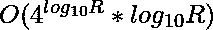
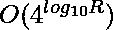

# 范围【L，R】内的数字计数，其平方的位数之和等于位数之和的平方

> 原文:[https://www . geeksforgeeks . org/范围内数字计数-l-r-具有等于数字总和的平方的数字总和/](https://www.geeksforgeeks.org/count-of-numbers-in-range-l-r-having-sum-of-digits-of-its-square-equal-to-square-of-sum-of-digits/)

给定两个整数 **L** 和 **R，**任务是找出范围**【L，R】**内的数字个数，使其平方的**位数之和等于其位数之和的平方**，

**例**:

> **输入:** L = 22，R = 22
> **输出:** 1
> **说明:** 22 是该范围内唯一有效的数字，因为其平方的
> 位数之和= S(22*22) = S(484) = 16，其位数之和的
> 平方= S(22)*S(22) = 16
> 
> **输入:** L = 1，R = 58
> **输出:** 12
> **解释**:总有效数字为{1，2，3，10，11，12，13，20，21，22，30，31}

**简单方法:**运行从 **L** 到 **R** 的循环，计算每个数字的数字总和，并检查当前数字是否满足给定条件。

按照以下步骤解决问题:

*   从 L 到 R 迭代，计算每个数字的数字总和。
*   对当前数字求平方，找出它的位数总和。
*   如果它们相等，递增答案，否则继续下一个元素。

**时间复杂度:** O((R-L)*log(R))

**有效途径:**从例 2 中我们可以观察到**所有的有效数字都只有 0 到 3 的数字**。因此，数字中的每个数字只有 4 个选项。使用[递归](https://www.geeksforgeeks.org/recursion/)计算所有有效数字直到 **R** 并检查其是否满足给定条件。

按照以下步骤解决问题:

*   请注意，所有有效数字都是从[0，3]开始的数字。
*   当平方时，介于[4，9]之间的数字带有进位。
    *   S(4)*S(4) = 16 和 S(16) = 7，16！= 7.
    *   S(5)*S(5) = 25 和 S(25) = 7，25！= 7.
*   因此，生成所有可能的数字直到 **R** 。
*   对于每个生成的数字，在[0，3]之间总共有 4 种可能的选择。
*   计算每个可能的选择，并检查每个选择的条件。

下面是上述方法的实现:

## C++

```
// C++ program for the above approach
#include <bits/stdc++.h>
using namespace std;

// Function to check if the number is valid
bool check(int num)
{
    // Sum of digits of num
    int sm = 0;

    // Squared number
    int num2 = num * num;

    while (num) {
        sm += num % 10;
        num /= 10;
    }

    // Sum of digits of (num * num)
    int sm2 = 0;
    while (num2) {
        sm2 += num2 % 10;
        num2 /= 10;
    }
    return ((sm * sm) == sm2);
}

// Function to convert a string to an integer
int convert(string s)
{
    int val = 0;
    reverse(s.begin(), s.end());
    int cur = 1;
    for (int i = 0; i < s.size(); i++) {
        val += (s[i] - '0') * cur;
        cur *= 10;
    }
    return val;
}

// Function to generate all possible
// strings of length len
void generate(string s, int len, set<int>& uniq)
{
    // Desired string
    if (s.size() == len) {

        // Take only valid numbers
        if (check(convert(s))) {
            uniq.insert(convert(s));
        }
        return;
    }

    // Recurse for all possible digits
    for (int i = 0; i <= 3; i++) {
        generate(s + char(i + '0'), len, uniq);
    }
}

// Function to calculate unique numbers
// in range [L, R]
int totalNumbers(int L, int R)
{
    // Initialize a variable
    // to store the answer
    int ans = 0;

    // Calculate the maximum
    // possible length
    int max_len = log10(R) + 1;

    // Set to store distinct
    // valid numbers
    set<int> uniq;

    for (int i = 1; i <= max_len; i++) {
        // Generate all possible strings
        // of length i
        generate("", i, uniq);
    }

    // Iterate the set to get the count
    // of valid numbers in the range [L,R]
    for (auto x : uniq) {
        if (x >= L && x <= R) {
            ans++;
        }
    }
    return ans;
}

// Driver Code
int main()
{
    int L = 22, R = 22;
    cout << totalNumbers(L, R);
}
```

## Java 语言(一种计算机语言，尤用于创建网站)

```
// Java program for the above approach
import java.util.*;

class GFG{

// Function to check if the number is valid
static boolean check(int num)
{

    // Sum of digits of num
    int sm = 0;

    // Squared number
    int num2 = num * num;

    while (num > 0) {
        sm += num % 10;
        num /= 10;
    }

    // Sum of digits of (num * num)
    int sm2 = 0;
    while (num2>0) {
        sm2 += num2 % 10;
        num2 /= 10;
    }
    return ((sm * sm) == sm2);
}

// Function to convert a String to an integer
static int convert(String s)
{
    int val = 0;
    s = reverse(s);
    int cur = 1;
    for (int i = 0; i < s.length(); i++) {
        val += (s.charAt(i) - '0') * cur;
        cur *= 10;
    }
    return val;
}

// Function to generate all possible
// Strings of length len
static void generate(String s, int len, HashSet<Integer> uniq)
{
    // Desired String
    if (s.length() == len) {

        // Take only valid numbers
        if (check(convert(s))) {
            uniq.add(convert(s));
        }
        return;
    }

    // Recurse for all possible digits
    for (int i = 0; i <= 3; i++) {
        generate(s + (char)(i + '0'), len, uniq);
    }
}
static String reverse(String input) {
    char[] a = input.toCharArray();
    int l, r = a.length - 1;
    for (l = 0; l < r; l++, r--) {
        char temp = a[l];
        a[l] = a[r];
        a[r] = temp;
    }
    return String.valueOf(a);
}

// Function to calculate unique numbers
// in range [L, R]
static int totalNumbers(int L, int R)
{

    // Initialize a variable
    // to store the answer
    int ans = 0;

    // Calculate the maximum
    // possible length
    int max_len = (int) (Math.log10(R) + 1);

    // Set to store distinct
    // valid numbers
    HashSet<Integer> uniq = new HashSet<Integer>();

    for (int i = 1; i <= max_len; i++) {
        // Generate all possible Strings
        // of length i
        generate("", i, uniq);
    }

    // Iterate the set to get the count
    // of valid numbers in the range [L,R]
    for (int x : uniq) {
        if (x >= L && x <= R) {
            ans++;
        }
    }
    return ans;
}

// Driver Code
public static void main(String[] args)
{
    int L = 22, R = 22;
    System.out.print(totalNumbers(L, R));
}
}

// This code is contributed by Princi Singh
```

## 蟒蛇 3

```
# python 3 program for the above approach

from math import log10
# Function to check if the number is valid
def check(num):
    # Sum of digits of num
    sm = 0

    # Squared number
    num2 = num * num

    while (num):
        sm += num % 10
        num //= 10

    # Sum of digits of (num * num)
    sm2 = 0
    while (num2):
        sm2 += num2 % 10
        num2 //= 10
    return ((sm * sm) == sm2)

# Function to convert a string to an integer
def convert(s):
    val = 0
    s = s[::-1]
    cur = 1
    for i in range(len(s)):
        val += (ord(s[i]) - ord('0')) * cur
        cur *= 10
    return val

# Function to generate all possible
# strings of length len
def generate(s, len1, uniq):
    # Desired string
    if (len(s) == len1):

        # Take only valid numbers
        if(check(convert(s))):
            uniq.add(convert(s))
        return

    # Recurse for all possible digits
    for i in range(4):
        generate(s + chr(i + ord('0')), len1, uniq)

# Function to calculate unique numbers
# in range [L, R]
def totalNumbers(L, R):
    # Initialize a variable
    # to store the answer
    ans = 0

    # Calculate the maximum
    # possible length
    max_len = int(log10(R)) + 1

    # Set to store distinct
    # valid numbers
    uniq = set()

    for i in range(1,max_len+1,1):
        # Generate all possible strings
        # of length i
        generate("", i, uniq)

    # Iterate the set to get the count
    # of valid numbers in the range [L,R]
    for x in uniq:
        if (x >= L and x <= R):
            ans += 1
    return ans

# Driver Code
if __name__ == '__main__':
    L = 22
    R = 22
    print(totalNumbers(L, R))

    # This code is contributed by ipg2016107.
```

## C#

```
// C# program for the above approach
using System;
using System.Collections.Generic;

class GFG{

// Function to check if the number is valid
static bool check(int num)
{
    // Sum of digits of num
    int sm = 0;

    // Squared number
    int num2 = num * num;

    while (num>0) {
        sm += num % 10;
        num /= 10;
    }

    // Sum of digits of (num * num)
    int sm2 = 0;
    while (num2>0) {
        sm2 += num2 % 10;
        num2 /= 10;
    }
    return ((sm * sm) == sm2);
}

// Function to convert a string to an integer
static int convert(string s)
{
    int val = 0;
    char[] charArray = s.ToCharArray();
    Array.Reverse( charArray );
    s = new string( charArray );
    int cur = 1;
    for (int i = 0; i < s.Length; i++) {
        val += ((int)s[i] - (int)'0') * cur;
        cur *= 10;
    }
    return val;
}

// Function to generate all possible
// strings of length len
static void generate(string s, int len, HashSet<int> uniq)
{
    // Desired string
    if (s.Length == len) {

        // Take only valid numbers
        if (check(convert(s))) {
            uniq.Add(convert(s));
        }
        return;
    }

    // Recurse for all possible digits
    for (int i = 0; i <= 3; i++) {
        generate(s + Convert.ToChar(i + (int)'0'), len, uniq);
    }
}

// Function to calculate unique numbers
// in range [L, R]
static int totalNumbers(int L, int R)
{
    // Initialize a variable
    // to store the answer
    int ans = 0;

    // Calculate the maximum
    // possible length
    int max_len = (int)Math.Log10(R) + 1;

    // Set to store distinct
    // valid numbers
    HashSet<int> uniq = new HashSet<int>();

    for (int i = 1; i <= max_len; i++) {
        // Generate all possible strings
        // of length i
        generate("", i, uniq);
    }

    // Iterate the set to get the count
    // of valid numbers in the range [L,R]
    foreach (int x in uniq) {
        if (x >= L && x <= R) {
            ans++;
        }
    }
    return ans;
}

// Driver Code
public static void Main()
{
    int L = 22, R = 22;
    Console.Write(totalNumbers(L, R));
}

}

// This code is contributed by SURENDRA_GANGWAR.
```

## java 描述语言

```
<script>
// Javascript program for the above approach

// Function to check if the number is valid
function check(num)
{

  // Sum of digits of num
  let sm = 0;

  // Squared number
  let num2 = num * num;

  while (num) {
    sm += num % 10;
    num = Math.floor(num / 10);
  }

  // Sum of digits of (num * num)
  let sm2 = 0;
  while (num2) {
    sm2 += num2 % 10;
    num2 = Math.floor(num2 / 10);
  }
  return sm * sm == sm2;
}

// Function to convert a string to an integer
function convert(s) {
  let val = 0;
  s = s.split("").reverse().join("");
  let cur = 1;

  for (let i = 0; i < s.length; i++) {
    val += (s[i].charCodeAt(0) - "0".charCodeAt(0)) * cur;
    cur *= 10;
  }
  return val;
}

// Function to generate all possible
// strings of length len
function generate(s, len, uniq) {
  // Desired string
  if (s.length == len) {
    // Take only valid numbers
    if (check(convert(s))) {
      uniq.add(convert(s));
    }
    return;
  }

  // Recurse for all possible digits
  for (let i = 0; i <= 3; i++) {
    generate(s + String.fromCharCode(i + "0".charCodeAt(0)), len, uniq);
  }
}

// Function to calculate unique numbers
// in range [L, R]
function totalNumbers(L, R) {
  // Initialize a variable
  // to store the answer
  let ans = 0;

  // Calculate the maximum
  // possible length
  let max_len = Math.log10(R) + 1;

  // Set to store distinct
  // valid numbers
  let uniq = new Set();

  for (let i = 1; i <= max_len; i++) {
    // Generate all possible strings
    // of length i
    generate("", i, uniq);
  }

  // Iterate the set to get the count
  // of valid numbers in the range [L,R]
  for (let x of uniq) {
    if (x >= L && x <= R) {
      ans++;
    }
  }
  return ans;
}

// Driver Code
let L = 22,
  R = 22;
document.write(totalNumbers(L, R));

// This code is contributed by _saurabh_jaiswal.
</script>
```

**输出:**

```
1
```

**时间复杂度:** ( )，由于到 **R** 的长度为止每个数字有 4 个选择，即 log10(R) + 1，因此时间复杂度为指数。

**辅助空间:** (递归栈空间)