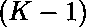

# 不含任何相邻 0 的数字 0 到 K-1 构成的最多 N 位数字的计数

> 原文:[https://www . geesforgeks . org/count-numbers-up-n-digits-formed-using-digits-0-k-1-不带任何相邻的-0/](https://www.geeksforgeeks.org/count-of-numbers-upto-n-digits-formed-using-digits-0-to-k-1-without-any-adjacent-0s/)

给定两个整数 **N** 和 **K** ，任务是将数字计数到 **N** 位，使得没有两个零相邻，数字范围从 0 到 K-1。
**举例:**

> **输入:** N = 2，K = 3
> **输出:** 8
> **解释:**
> 有 8 个这样的数字，数字仅从 0 到 2，没有任何相邻的 0:{ 1，2，10，11，12，20，21，22}
> **输入:** N = 3，K = 3
> **输出:** 22

**方法:**思路是用[动态规划](https://www.geeksforgeeks.org/dynamic-programming/)解决这个问题。
设 **DP[i][j]** 为最大值为**的数字，其最后一位为 **j** 。
**观察:****

*   填满一个地方的方法数量是
*   众所周知，零不能相邻。所以当我们的最后一个元素是 0 时，意味着前面的索引被 1 填充，也就是 0。因此，当前位置只能由(K-1)位数字填充。
*   如果最后一个位置由(K-1)位数字填充，那么当前数字位置可以由 0 或(K-1)位数字填充。

**基本情况:**

*   如果 n == 1，最后一个== K，那么我们可以用(K-1)个数字填充这个地方，返回(K-1)
*   否则，返回 1

**复发关系:**

> 当最后一位没有被零填充时
> 
> ![dp[i][j] = (K-1)*solve(n-1, K) + (K-1)*solve(n-1, 1)  ](img/5b2d64c8a1137d5f86422d7ec88cf10e.png "Rendered by QuickLaTeX.com")
> 
> 当最后一位被零填充时
> 
> ![dp[i][j] = solve(n-1, K)  ](img/8be42aba7f0483353e244fcd623daf88.png "Rendered by QuickLaTeX.com")

以下是上述方法的实现:

## C++

```
// C++ implementation to count the
// numbers upto N digits such that
// no two zeros are adjacent

#include <bits/stdc++.h>
using namespace std;

int dp[15][10];

// Function to count the
// numbers upto N digits such that
// no two zeros are adjacent
int solve(int n, int last, int k)
{
    // Condition to check if only
    // one element remains
    if (n == 1) {

        // If last element is non
        // zero, return K-1
        if (last == k) {
            return (k - 1);
        }
        // If last element is 0
        else {
            return 1;
        }
    }

    // Condition to check if value
    // calculated already
    if (dp[n][last])
        return dp[n][last];

    // If last element is non zero,
    // then two cases arise,
    // current element can be either
    // zero or non zero
    if (last == k) {

        // Memoize this case
        return dp[n][last]
               = (k - 1)
                     * solve(n - 1, k, k)
                 + (k - 1)
                       * solve(n - 1, 1, k);
    }

    // If last is 0, then current
    // can only be non zero
    else {

        // Memoize and return
        return dp[n][last]
               = solve(n - 1, k, k);
    }
}

// Driver Code
int main()
{
    // Given N and K
    int n = 2, k = 3;

    // Function Call
    int x = solve(n, k, k)
            + solve(n, 1, k);
    cout << x;
}
```

## Java 语言(一种计算机语言，尤用于创建网站)

```
// Java implementation to count the
// numbers upto N digits such that
// no two zeros are adjacent
class GFG{

static int[][] dp = new int[15][10];

// Function to count the numbers
// upto N digits such that
// no two zeros are adjacent
static int solve(int n, int last, int k)
{

    // Condition to check if only
    // one element remains
    if (n == 1)
    {

        // If last element is non
        // zero, return K-1
        if (last == k)
        {
            return (k - 1);
        }

        // If last element is 0
        else
        {
            return 1;
        }
    }

    // Condition to check if
    // value calculated already
    if (dp[n][last] == 1)
        return dp[n][last];

    // If last element is non zero,
    // then two cases arise, current
    // element can be either zero
    // or non zero
    if (last == k)
    {

        // Memoize this case
        return dp[n][last] = (k - 1) *
                        solve(n - 1, k, k) +
                             (k - 1) *
                        solve(n - 1, 1, k);
    }

    // If last is 0, then current
    // can only be non zero
    else
    {

        // Memoize and return
        return dp[n][last] = solve(n - 1, k, k);
    }
}

// Driver Code
public static void main(String[] args)
{

    // Given N and K
    int n = 2, k = 3;

    // Function Call
    int x = solve(n, k, k) +
            solve(n, 1, k);

    System.out.print(x);
}
}

// This code is contributed by Ritik Bansal
```

## 蟒蛇 3

```
# Python3 implementation to count the
# numbers upto N digits such that
# no two zeros are adjacent
dp = [[0] * 10 for j in range(15)]

# Function to count the numbers
# upto N digits such that no two
# zeros are adjacent
def solve(n, last, k):

    # Condition to check if only
    # one element remains
    if (n == 1):

        # If last element is non
        # zero, return K-1
        if (last == k):
            return (k - 1)

        # If last element is 0
        else:
            return 1

    # Condition to check if value
    # calculated already
    if (dp[n][last]):
        return dp[n][last]

    # If last element is non zero,
    # then two cases arise, current
    # element can be either zero or
    # non zero
    if (last == k):

        # Memoize this case
        dp[n][last] = ((k - 1) *
                  solve(n - 1, k, k) +
                       (k - 1) *
                  solve(n - 1, 1, k))

        return dp[n][last]

    # If last is 0, then current
    # can only be non zero
    else:

        # Memoize and return
        dp[n][last] = solve(n - 1, k, k)
        return dp[n][last]

# Driver code

# Given N and K
n = 2
k = 3

# Function call
x = solve(n, k, k) + solve(n, 1, k)

print(x)

# This code is contributed by himanshu77
```

## C#

```
// C# implementation to count the
// numbers upto N digits such that
// no two zeros are adjacent
using System;

class GFG{

public static int [,]dp = new int[15, 10];

// Function to count the numbers
// upto N digits such that
// no two zeros are adjacent
public static int solve(int n, int last, int k)
{

    // Condition to check if only
    // one element remains
    if (n == 1)
    {

        // If last element is non
        // zero, return K-1
        if (last == k)
        {
            return (k - 1);
        }

        // If last element is 0
        else
        {
            return 1;
        }
    }

    // Condition to check if
    // value calculated already
    if (dp[n, last] == 1)
        return dp[n, last];

    // If last element is non zero,
    // then two cases arise, current
    // element can be either zero
    // or non zero
    if (last == k)
    {

        // Memoize this case
        return dp[n, last] = (k - 1) *
                        solve(n - 1, k, k) +
                             (k - 1) *
                        solve(n - 1, 1, k);
    }

    // If last is 0, then current
    // can only be non zero
    else
    {

        // Memoize and return
        return dp[n, last] = solve(n - 1, k, k);
    }
}

// Driver Code
public static void Main(string[] args)
{

    // Given N and K
    int n = 2, k = 3;

    // Function Call
    int x = solve(n, k, k) +
            solve(n, 1, k);

    Console.WriteLine(x);
}
}

// This code is contributed by SoumikMondal
```

## java 描述语言

```
<script>

// Javascript implementation to count the
// numbers upto N digits such that
// no two zeros are adjacent

var dp = Array.from(Array(15),
() => Array(10).fill(0));

// Function to count the
// numbers upto N digits such that
// no two zeros are adjacent
function solve(n, last, k)
{
    // Condition to check if only
    // one element remains
    if (n == 1) {

        // If last element is non
        // zero, return K-1
        if (last == k) {
            return (k - 1);
        }
        // If last element is 0
        else {
            return 1;
        }
    }

    // Condition to check if value
    // calculated already
    if ((dp[n][last])!=0)
        return dp[n][last];

    // If last element is non zero,
    // then two cases arise,
    // current element can be either
    // zero or non zero
    if (last == k) {

        // Memoize this case
        return dp[n][last]
               = (k - 1)
                     * solve(n - 1, k, k)
                 + (k - 1)
                       * solve(n - 1, 1, k);
    }

    // If last is 0, then current
    // can only be non zero
    else {

        // Memoize and return
        dp[n][last]
               = solve(n - 1, k, k);
        return dp[n][last];
    }
}

// Driver Code
// Given N and K
var n = 2, k = 3;
// Function Call
var x = solve(n, k, k)
        + solve(n, 1, k);
document.write(x);

</script>
```

**Output:** 

```
8
```

**时间复杂度:***O(N)*
T5】辅助空间: *O(N*10)*