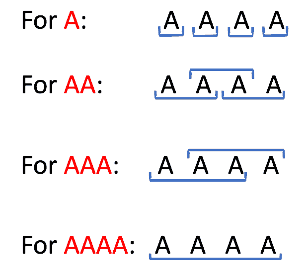

# 使用改进的 KMP 算法计算字符串中每个前缀的出现次数

> 原文:[https://www . geeksforgeeks . org/使用修改的 kmp 算法的每个字符串前缀的出现次数/](https://www.geeksforgeeks.org/count-of-occurrences-of-each-prefix-in-a-string-using-modified-kmp-algorithm/)

给定一个大小为 **N** 的字符串 **S** ，任务是统计给定字符串 **S** 的所有前缀的出现次数。

**示例:**

> **输入:**S =【AAAA】
> **输出:**
> A 出现 4 次
> AA 出现 3 次。
> AAA 发生 2 次。
> AAAA 发生 1 次。
> **解释:**
> 下面是所有前缀的图解:
> 
> 
> 
> **输入:** S = "ABACABA"
> **输出:**
> A 发生 4 次
> AB 发生 2 次
> ABA 发生 2 次
> ABAC 发生 1 次
> ABACA 发生 1 次
> ABACAB 发生 1 次
> ABACABA 发生 1 次

**天真方法:**

1.  遍历集合 p 中的所有前缀，让 x 作为前缀。
2.  做一个尺寸|x|的[滑动窗口接近](https://www.geeksforgeeks.org/window-sliding-technique/)。
3.  检查 S 上的当前滑动窗口是否等于 x。如果是，则将计数[x]增加 1。

***时间复杂度:**O(N<sup>3</sup>)*
***辅助空间:** O(N)*

**高效方法:**
使用 [KMP 算法](https://www.geeksforgeeks.org/kmp-algorithm-for-pattern-searching/)中的 [**LPS**](https://www.geeksforgeeks.org/kmp-algorithm-for-pattern-searching/) 数组(也称为**前缀 _ 函数**)。
该字符串的**前缀函数**定义为长度为 **N** 的数组 **LPS** ，其中**LPS【I】**是子串**S【0…I】**的最长适当前缀的长度，也是该子串的后缀。让 **occ[i]** 表示长度前缀 **i** 的出现次数。

下面是实现这种方法的步骤:

1.  计算 **LPS 数组**或**前缀 _ 函数**。
2.  对于前缀函数的每个值，首先统计它在 **LPS 数组**中出现的次数。
3.  长度前缀 **i** 恰好出现**ans【I】**次，那么这个数字必须加到其最长后缀(也是前缀)的出现次数上。
4.  最后，将 **occ 数组**的所有值加 1，因为原来的前缀也应该计算在内。

**例如:**
LPS[i]表示在位置 **i** ，出现长度为= **LPS[i]** 的前缀。这是最长的前缀。但是可以出现较短的前缀。
对于字符串 S =**“AAAA”**，以下是前缀:

> S[0..0]= A
> S【0..1]= AA
> S【0..2]= AAA
> S【0..3] = AAAA

最初:

> OCC[a]= 0
> OCC[aa]= 0
> OCC[AAA]= 0
> OCC[yyyy]= 0

**步骤 1:** 以下字符串的 LPS 数组表示最长前缀的长度，该前缀也是后缀:

> LPS[1]在字符串 A 中表示 **A** ，A 是后缀也是前缀作为 LPS[1] = 1
> LPS[2]在字符串 A 中表示 **AA** ，AA 是后缀也是前缀作为 LPS[2] = 2
> LPS[3]在字符串 A 中表示 **AAA** ，AAA 是后缀也是前缀作为 LPS[3] = 3

**步骤 2:** 在**OCC【】**数组中，将这些前缀作为后缀添加到答案中:

> **值:计数子字符串**
> OCC[A]= 1**:**S[1]
> OCC[AA]= 1**:**S[1..2]
> OCC【AAA】= 1**:**S【1..3]
> OCC[AAAA]= 0**:**NULL(因为没有前缀**“AAAA”**也是后缀。

**步骤 3:** 现在从**“AAA”**开始以相反的顺序遍历字符串(因为最后一个值总是 0，因为完整的字符串不是正确的前缀)。

> 自，串“A**AA**S【1..3]包含**【AA】**S【2..3]同样，还没有计算在内，因此将 OCC[“AA”]中字符串**“AA”**的出现增加为 OCC[“AA”]+= OCC[“AAA”]。以下是相同的计数:
> **值:计数的子字符串**
> OCC[A]= 1**:**S[1]
> OCC[AA]= 2**:**S[1..2]，S[2..3]
> OCC【AAA】= 1**:**S【1..3]
> occ[AAAA] = 0 **:** 空

现在字符串“A **A** ”也包含了**“A”**，还没有统计，因此将 OCC[“A”]中字符串**“A”**的出现增加为 OCC[“A”]+= OCC[“AA”]。以下是相同的计数:

> **值:计数子字符串**
> occ[A] = 3 **:** S[1]，S[2]，S[3]
> occ[AA] = 2 **:** S[1..2]，S[2..3]
> OCC【AAA】= 1**:**S【1..3]
> occ[AAAA] = 0 **:** 空

**第四步:**最后给原前缀的所有出现加一，还没算。

> **值:计数子串**T2】OCC[A]= 4**:**S[1]，S[2]，S[3]，S[0]
> occ[AA] = 3 **:** S[1..2]，S[2..3]，S[0..1]
> OCC【AAA】= 2**:**S【1..3]，S[0..2]
> OCC[AAAA]= 1**:**S【0..3]

下面是上述方法的实现:

## C++

```
// C++ program for the above approach
#include <bits/stdc++.h>
using namespace std;

// Function to print the count of all
// prefix in the given string
void print(vector<int>& occ, string& s)
{
    // Iterate over string s
    for (int i = 1; i <= int(s.size());
         i++) {

        // Print the prefix and their
        // frequency
        cout << s.substr(0, i)
             << " occurs "
             << occ[i]
             << " times."
             << endl;
    }
}

// Function to implement the LPS
// array to store the longest prefix
// which is also a suffix for every
// substring of the string S
vector<int> prefix_function(string& s)
{
    // Array to store LPS values
    vector<int> LPS(s.size());

    // Value of lps[0] is 0
    // by definition
    LPS[0] = 0;

    // Find the values of LPS[i] for
    // the rest of the string using
    // two pointers and DP
    for (int i = 1;
         i < int(s.size());
         i++) {

        // Initially set the value
        // of j as the longest
        // prefix that is also a
        // suffix for i as LPS[i-1]
        int j = LPS[i - 1];

        // Check if the suffix of
        // length j+1 is also a prefix
        while (j > 0 && s[i] != s[j]) {
            j = LPS[j - 1];
        }

        // If s[i] = s[j] then, assign
        // LPS[i] as j+1
        if (s[i] == s[j]) {
            LPS[i] = j + 1;
        }

        // If we reached j = 0, assign
        // LPS[i] as 0 as there was no
        // prefix equal to suffix
        else {
            LPS[i] = 0;
        }
    }

    // Return the calculated
    // LPS array
    return LPS;
}

// Function to count the occurrence
// of all the prefix in the string S
void count_occurrence(string& s)
{
    int n = s.size();

    // Call the prefix_function
    // to get LPS
    vector<int> LPS
        = prefix_function(s);

    // To store the occurrence of
    // all the prefix
    vector<int> occ(n + 1);

    // Count all the suffixes that
    // are also prefix
    for (int i = 0; i < n; i++) {
        occ[LPS[i]]++;
    }

    // Add the occurrences of
    // i to smaller prefixes
    for (int i = n - 1;
         i > 0; i--) {
        occ[LPS[i - 1]] += occ[i];
    }

    // Adding 1 to all occ[i] for all
    // the original prefix
    for (int i = 0; i <= n; i++)
        occ[i]++;

    // Function Call to print the
    // occurrence of all the prefix
    print(occ, s);
}

// Driver Code
int main()
{
    // Given String
    string A = "ABACABA";

    // Function Call
    count_occurrence(A);
    return 0;
}
```

## Java 语言(一种计算机语言，尤用于创建网站)

```
// Java program for
// the above approach
import java.util.*;
class GFG{

// Function to print the count
// of all prefix in the
// given String
static void print(int[] occ,
                  String s)
{
  // Iterate over String s
  for (int i = 1;
           i <= s.length() - 1; i++)
  {
    // Print the prefix and their
    // frequency
    System.out.print(s.substring(0, i) +
                     " occurs " + occ[i] +
                     " times." + "\n");
  }
}

// Function to implement the LPS
// array to store the longest prefix
// which is also a suffix for every
// subString of the String S
static int[] prefix_function(String s)
{
  // Array to store LPS values
  int []LPS = new int[s.length()];

  // Value of lps[0] is 0
  // by definition
  LPS[0] = 0;

  // Find the values of LPS[i] for
  // the rest of the String using
  // two pointers and DP
  for (int i = 1;
       i < s.length(); i++)
  {
    // Initially set the value
    // of j as the longest
    // prefix that is also a
    // suffix for i as LPS[i-1]
    int j = LPS[i - 1];

    // Check if the suffix of
    // length j+1 is also a prefix
    while (j > 0 &&
           s.charAt(i) != s.charAt(j))
    {
      j = LPS[j - 1];
    }

    // If s[i] = s[j] then, assign
    // LPS[i] as j+1
    if (s.charAt(i) == s.charAt(j))
    {
      LPS[i] = j + 1;
    }

    // If we reached j = 0, assign
    // LPS[i] as 0 as there was no
    // prefix equal to suffix
    else
    {
      LPS[i] = 0;
    }
  }

  // Return the calculated
  // LPS array
  return LPS;
}

// Function to count the occurrence
// of all the prefix in the String S
static void count_occurrence(String s)
{
  int n = s.length();

  // Call the prefix_function
  // to get LPS
  int[] LPS = prefix_function(s);

  // To store the occurrence of
  // all the prefix
  int []occ = new int[n + 1];

  // Count all the suffixes that
  // are also prefix
  for (int i = 0; i < n; i++)
  {
    occ[LPS[i]]++;
  }

  // Add the occurrences of
  // i to smaller prefixes
  for (int i = n - 1;
           i > 0; i--)
  {
    occ[LPS[i - 1]] += occ[i];
  }

  // Adding 1 to all occ[i] for all
  // the original prefix
  for (int i = 0; i <= n; i++)
    occ[i]++;

  // Function Call to print the
  // occurrence of all the prefix
  print(occ, s);
}

// Driver Code
public static void main(String[] args)
{
  // Given String
  String A = "ABACABA";

  // Function Call
  count_occurrence(A);
}
}

// This code is contributed by Princi Singh
```

## 蟒蛇 3

```
# Python3 program for the above approach

# Function to print the count of all
# prefix in the given string
def Print(occ, s):

    # Iterate over string s
    for i in range(1, len(s) + 1):

        # Print the prefix and their
        # frequency
        print(s[0 : i], "occur", occ[i], "times.")

# Function to implement the LPS
# array to store the longest prefix
# which is also a suffix for every
# substring of the string S
def prefix_function(s):

    # Array to store LPS values
    # Value of lps[0] is 0
    # by definition
    LPS = [0 for i in range(len(s))]

    # Find the values of LPS[i] for
    # the rest of the string using
    # two pointers and DP
    for i in range(1, len(s)):

        # Initially set the value
        # of j as the longest
        # prefix that is also a
        # suffix for i as LPS[i-1]
        j = LPS[i - 1]

        # Check if the suffix of
        # length j+1 is also a prefix
        while (j > 0 and s[i] != s[j]):
            j = LPS[j - 1]

        # If s[i] = s[j] then, assign
        # LPS[i] as j+1
        if (s[i] == s[j]):
            LPS[i] = j + 1

        # If we reached j = 0, assign
        # LPS[i] as 0 as there was no
        # prefix equal to suffix
        else:
            LPS[i] = 0

    # Return the calculated
    # LPS array
    return LPS

# Function to count the occurrence
# of all the prefix in the string S
def count_occurrence(s):

    n = len(s)

    # Call the prefix_function
    # to get LPS
    LPS = prefix_function(s)

    # To store the occurrence of
    # all the prefix
    occ = [0 for i in range(n + 1)]

    # Count all the suffixes that
    # are also prefix
    for i in range(n):
        occ[LPS[i]] += 1

    # Add the occurrences of
    # i to smaller prefixes
    for i in range(n - 1, 0, -1):
        occ[LPS[i - 1]] += occ[i]

    # Adding 1 to all occ[i] for all
    # the original prefix
    for i in range(n + 1):
        occ[i] += 1

    # Function Call to print the
    # occurrence of all the prefix
    Print(occ, s)

# Driver Code

# Given String
A = "ABACABA"

# Function Call
count_occurrence(A)

# This code is contributed by avanitrachhadiya2155
```

## C#

```
// C# program for
// the above approach
using System;
class GFG{

// Function to print the
// count of all prefix
// in the given String
static void print(int[] occ,
                  String s)
{
  // Iterate over String s
  for (int i = 1;
           i <= s.Length - 1; i++)
  {
    // Print the prefix and their
    // frequency
    Console.Write(s.Substring(0, i) + 
                  " occurs " + occ[i] + 
                  " times." + "\n");
  }
}

// Function to implement the LPS
// array to store the longest prefix
// which is also a suffix for every
// subString of the String S
static int[] prefix_function(String s)
{
  // Array to store LPS values
  int []LPS = new int[s.Length];

  // Value of lps[0] is 0
  // by definition
  LPS[0] = 0;

  // Find the values of LPS[i] for
  // the rest of the String using
  // two pointers and DP
  for (int i = 1;
           i < s.Length; i++)
  {
    // Initially set the value
    // of j as the longest
    // prefix that is also a
    // suffix for i as LPS[i-1]
    int j = LPS[i - 1];

    // Check if the suffix of
    // length j+1 is also a prefix
    while (j > 0 && s[i] != s[j])
    {
      j = LPS[j - 1];
    }

    // If s[i] = s[j] then,
    // assign LPS[i] as j+1
    if (s[i] == s[j])
    {
      LPS[i] = j + 1;
    }

    // If we reached j = 0, assign
    // LPS[i] as 0 as there was no
    // prefix equal to suffix
    else
    {
      LPS[i] = 0;
    }
  }

  // Return the calculated
  // LPS array
  return LPS;
}

// Function to count the occurrence
// of all the prefix in the String S
static void count_occurrence(String s)
{
  int n = s.Length;

  // Call the prefix_function
  // to get LPS
  int[] LPS = prefix_function(s);

  // To store the occurrence of
  // all the prefix
  int []occ = new int[n + 1];

  // Count all the suffixes that
  // are also prefix
  for (int i = 0; i < n; i++)
  {
    occ[LPS[i]]++;
  }

  // Add the occurrences of
  // i to smaller prefixes
  for (int i = n - 1;
           i > 0; i--)
  {
    occ[LPS[i - 1]] += occ[i];
  }

  // Adding 1 to all occ[i] for all
  // the original prefix
  for (int i = 0; i <= n; i++)
    occ[i]++;

  // Function Call to print the
  // occurrence of all the prefix
  print(occ, s);
}

// Driver Code
public static void Main(String[] args)
{
  // Given String
  String A = "ABACABA";

  // Function Call
  count_occurrence(A);
}
}

// This code is contributed by Amit Katiyar
```

## java 描述语言

```
<script>
    // JavaScript program for the above approach

    // Function to print the count of all
    // prefix in the given string
    const print = (occ, s) => {
        // Iterate over string s
        for (let i = 1; i <= s.length; i++) {

            // Print the prefix and their
            // frequency
            document.write(`${s.substr(0, i)} occurs ${occ[i]} times.<br/>`);
        }
    }

    // Function to implement the LPS
    // array to store the longest prefix
    // which is also a suffix for every
    // substring of the string S
    const prefix_function = (s) => {
        // Array to store LPS values
        let LPS = new Array(s.length).fill(0);

        // Value of lps[0] is 0
        // by definition
        LPS[0] = 0;

        // Find the values of LPS[i] for
        // the rest of the string using
        // two pointers and DP
        for (let i = 1; i < s.length; i++) {

            // Initially set the value
            // of j as the longest
            // prefix that is also a
            // suffix for i as LPS[i-1]
            let j = LPS[i - 1];

            // Check if the suffix of
            // length j+1 is also a prefix
            while (j > 0 && s[i] != s[j]) {
                j = LPS[j - 1];
            }

            // If s[i] = s[j] then, assign
            // LPS[i] as j+1
            if (s[i] == s[j]) {
                LPS[i] = j + 1;
            }

            // If we reached j = 0, assign
            // LPS[i] as 0 as there was no
            // prefix equal to suffix
            else {
                LPS[i] = 0;
            }
        }

        // Return the calculated
        // LPS array
        return LPS;
    }

    // Function to count the occurrence
    // of all the prefix in the string S
    const count_occurrence = (s) => {
        let n = s.length;

        // Call the prefix_function
        // to get LPS
        let LPS = prefix_function(s);

        // To store the occurrence of
        // all the prefix
        let occ = new Array(n + 1).fill(0);

        // Count all the suffixes that
        // are also prefix
        for (let i = 0; i < n; i++) {
            occ[LPS[i]]++;
        }

        // Add the occurrences of
        // i to smaller prefixes
        for (let i = n - 1;
            i > 0; i--) {
            occ[LPS[i - 1]] += occ[i];
        }

        // Adding 1 to all occ[i] for all
        // the original prefix
        for (let i = 0; i <= n; i++)
            occ[i]++;

        // Function Call to print the
        // occurrence of all the prefix
        print(occ, s);
    }

    // Driver Code

    // Given String
    let A = "ABACABA";

    // Function Call
    count_occurrence(A);

    // This code is contributed by rakeshsahni

</script>
```

**Output:** 

```
A occurs 4 times.
AB occurs 2 times.
ABA occurs 2 times.
ABAC occurs 1 times.
ABACA occurs 1 times.
ABACAB occurs 1 times.
ABACABA occurs 1 times.
```

**时间复杂度:***O(N<sup>2</sup>)*
**辅助空间:** *O(N)*