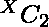

# 数组中的对计数，其和等于其按位“与”的两倍

> 原文:[https://www . geeksforgeeks . org/数组对计数加和等于按位与的两倍/](https://www.geeksforgeeks.org/count-of-pairs-from-array-with-sum-equal-to-twice-their-bitwise-and/)

给定一个数组 **arr[]** ，任务是计算数组中的对，其和等于它们的[位“与”](https://www.geeksforgeeks.org/bitwise-and-or-of-a-range/)的两倍，即
**例:**

> **输入:** arr[] = {1，1，3，4，4，5，7，8}
> **输出:** 2
> **解释:**
> 对的和等于其按位 AND 的两倍:
> {(1，1)，(4，4)}
> **输入:** arr[] = {1，3，3，5，4，6}
> **输出:** 1

**天真方法:**一个简单的解决方案是迭代每一个可能的对，并检查该对的和是否等于该对的二倍位“与”。如果该对具有相等的和和按位“与”，则将这些对的计数增加 1。
**有效方法:**想法是利用和与按位“与”之间的关系。也就是–

在这种情况下，对于等和和按位“与”，对的按位“异或”的值应该等于 0。我们知道，任何两对的按位异或只有彼此相等时才等于 0。因此，如果 X 是元素的频率。然后将对的计数增加。
以下是上述方法的实施:

## C++

```
// C++ implementation to find the pairs
// with equal sum and twice the
// bitwise AND of the pairs

#include <bits/stdc++.h>

using namespace std;

// Map to store the
// occurrence of
// elements of array
map<int, int> mp;

// Function to find the pairs
// with equal sum and twice the
// bitwise AND of the pairs
int find_pairs(int ar[], int n)
{
    int ans = 0;

    // Loop to find the frequency
    // of elements of array
    for (int i = 0; i < n; i++) {
        mp[ar[i]]++;
    }

    // Function to find the count
    // such pairs in the array
    for (auto i : mp) {
        int count = i.second;
        if (count > 1) {

            // if an element occurs more
            // than once then the answer
            // will by incremented
            // by nC2 times
            ans += ((count
                     * (count - 1))
                    / 2);
        }
    }
    return ans;
}

// Driver Code
int main()
{
    int ar[]
        = { 1, 2, 3, 3, 4,
            5, 5, 7, 8 };
    int arr_size = (sizeof(ar)
                    / sizeof(ar[0]));

    // Function Call
    cout << find_pairs(ar, arr_size);
    return 0;
}
```

## Java 语言(一种计算机语言，尤用于创建网站)

```
// Java implementation to find the pairs
// with equal sum and twice the
// bitwise AND of the pairs
import java.util.*;

class GFG{

// Map to store the
// occurrence of
// elements of array
static HashMap<Integer,
               Integer> mp = new HashMap<Integer,
                                         Integer>();

// Function to find the pairs
// with equal sum and twice the
// bitwise AND of the pairs
static int find_pairs(int arr[], int n)
{
    int ans = 0;

    // Loop to find the frequency
    // of elements of array
    for(int i = 0; i < n; i++)
    {
       if(mp.containsKey(arr[i]))
       {
           mp.put(arr[i], mp.get(arr[i]) + 1);
       }
       else
       {
           mp.put(arr[i], 1);
       }
    }

    // Function to find the count
    // such pairs in the array
    for(Map.Entry<Integer, Integer> i:mp.entrySet())
    {
       int count = i.getValue();
       if (count > 1)
       {

           // If an element occurs more
           // than once then the answer
           // will by incremented
           // by nC2 times
           ans += ((count * (count - 1)) / 2);
       }
    }
    return ans;
}

// Driver Code
public static void main(String[] args)
{
    int arr[] = { 1, 2, 3, 3, 4,
                  5, 5, 7, 8 };
    int arr_size = arr.length;

    // Function Call
    System.out.print(find_pairs(arr, arr_size));
}
}

// This code is contributed by amal kumar choubey
```

## 蟒蛇 3

```
# Python3 implementation to find the
# pairs with equal sum and twice the
# bitwise AND of the pairs
from collections import defaultdict

# Map to store the occurrence
# of elements of array
mp = defaultdict(int)

# Function to find the pairs
# with equal sum and twice the
# bitwise AND of the pairs
def find_pairs(arr, n):

    ans = 0

    # Loop to find the frequency
    # of elements of array
    for i in range(n):
        mp[arr[i]] += 1

    # Function to find the count
    # such pairs in the array
    for i in mp.values():
        count = i
        if (count > 1):

            # If an element occurs more
            # than once then the answer
            # will by incremented
            # by nC2 times
            ans += ((count * (count - 1)) // 2)

    return ans

# Driver Code
if __name__ == "__main__":

    arr = [ 1, 2, 3, 3, 4,
            5, 5, 7, 8 ]
    arr_size = len(arr)

    # Function Call
    print(find_pairs(arr, arr_size))

# This code is contributed by chitranayal
```

## C#

```
// C# implementation to find the pairs
// with equal sum and twice the
// bitwise AND of the pairs
using System;
using System.Collections.Generic;

class GFG{

// To store the occurrence
// of elements of array
static Dictionary<int,
                  int> mp = new Dictionary<int,
                                           int>();

// Function to find the pairs
// with equal sum and twice the
// bitwise AND of the pairs
static int find_pairs(int []arr, int n)
{
    int ans = 0;

    // Loop to find the frequency
    // of elements of array
    for(int i = 0; i < n; i++)
    {
       if(mp.ContainsKey(arr[i]))
       {
           mp[arr[i]] = mp[arr[i]] + 1;
       }
       else
       {
           mp.Add(arr[i], 1);
       }
    }

    // Function to find the count
    // such pairs in the array
    foreach(KeyValuePair<int, int> i in mp)
    {
       int count = i.Value;
       if (count > 1)
       {

           // If an element occurs more
           // than once then the answer
           // will by incremented
           // by nC2 times
           ans += ((count * (count - 1)) / 2);
       }
    }
    return ans;
}

// Driver Code
public static void Main(String[] args)
{
    int []arr = { 1, 2, 3, 3, 4,
                  5, 5, 7, 8 };
    int arr_size = arr.Length;

    // Function Call
    Console.Write(find_pairs(arr, arr_size));
}
}

// This code is contributed by amal kumar choubey
```

## java 描述语言

```
<script>

// JavaScript implementation to find the pairs
// with equal sum and twice the
// bitwise AND of the pairs

// Map to store the
// occurrence of
// elements of array
let  mp = new Map();

// Function to find the pairs
// with equal sum and twice the
// bitwise AND of the pairs
function find_pairs(arr,n)
{
    let ans = 0;

    // Loop to find the frequency
    // of elements of array
    for(let i = 0; i < n; i++)
    {
       if(mp.has(arr[i]))
       {
           mp.set(arr[i], mp.get(arr[i]) + 1);
       }
       else
       {
           mp.set(arr[i], 1);
       }
    }

    // Function to find the count
    // such pairs in the array
    for(let [key, value] of mp.entries())
    {
       let count = value;
       if (count > 1)
       {

           // If an element occurs more
           // than once then the answer
           // will by incremented
           // by nC2 times
           ans += ((count * (count - 1)) / 2);
       }
    }
    return ans;
}

// Driver Code
let arr=[1, 2, 3, 3, 4,
                  5, 5, 7, 8];

let arr_size = arr.length;
// Function Call
document.write(find_pairs(arr, arr_size));

// This code is contributed by avanitrachhadiya2155

</script>
```

**Output:** 

```
2
```