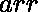

# 一个和为完美平方的数组中对的计数

> 原文:[https://www . geeksforgeeks . org/数组中的对数，其和为完美平方/](https://www.geeksforgeeks.org/count-of-pairs-in-an-array-whose-sum-is-a-perfect-square/)

给定一个由不同元素组成的数组，任务是从数组中找出两个元素对的总数，这两个元素对的和是一个[完美平方](https://www.geeksforgeeks.org/check-if-given-number-is-perfect-square-in-cpp/)。

**示例:**

> **输入:** arr[] = {2，3，6，9，10，20}
> **输出:** 2
> 只有可能的对是(3，6)和(6，10)
> 
> **输入:** arr[] = {9，2，5，1}
> **输出:** 0

**天真方法:**使用嵌套循环，检查每一个可能的对，看它们的和是否是一个完美的正方形。当数组的长度很大时，这种技术是无效的。

**有效方法:**

*   将数组的所有元素存储在名为 **nums** 的 [HashSet](https://www.geeksforgeeks.org/hashset-in-java/) 中，并将最大两个元素的总和保存在名为 **max** 的变量中。
*   很明显，数组中任意两个元素的和都不会超过 **max** 。因此，找到所有最大值为≤**的完美方块，并将其保存在名为**完美方块**的[数组列表](https://www.geeksforgeeks.org/arraylist-in-java/)中。**
*   **现在对数组中的每个元素说 **arr[i]** ，对保存在 **perfectSquares** 中的每个完美方块，检查**perfectSquares . get(I)–arr[I]**是否存在于 **nums** 中，即如果原始数组中有任何元素，当与当前选择的元素相加时，给出列表中的任何完美方块。**
*   **如果满足上述条件，增加**计数**变量。**
*   **最后打印**计数**的值。**

**以下是上述方法的实现:** 

## **C++**

```
// CPP implementation of the approach 

#include <bits/stdc++.h>
using namespace std;

// Function to return an ArrayList containing 
// all the perfect squares upto n 
vector<int> getPerfectSquares(int n)
{
    vector<int> perfectSquares;
    int current = 1, i = 1;

    // while current perfect square is less than or equal to n 
    while (current <= n)
    {
        perfectSquares.push_back(current);
        current = static_cast<int>(pow(++i, 2));
    }
    return perfectSquares;
}

// Function to print the sum of maximum 
// two elements from the array
int maxPairSum(vector<int> &arr)
{
    int n = arr.size();
    int max, secondMax;
    if (arr[0] > arr[1])
    {
        max = arr[0];
        secondMax = arr[1];
    }
    else
    {
        max = arr[1];
        secondMax = arr[0];
    }

    for (int i = 2; i < n; i++)
    {
        if (arr[i] > max)
        {
            secondMax = max;
            max = arr[i];
        }
        else if (arr[i] > secondMax)
        {
            secondMax = arr[i];
        }
    }
    return (max + secondMax);
}

// Function to return the count of numbers that 
// when added with n give a perfect square 
int countPairsWith(int n, vector<int> &perfectSquares, unordered_set<int> &nums)
{
    int count = 0;
    for (int i = 0; i < perfectSquares.size(); i++)
    {
        int temp = perfectSquares[i] - n;

        // temp > n is checked so that pairs 
        // (x, y) and (y, x) don't get counted twice 
        if (temp > n && find(nums.begin(), nums.end(), temp) != nums.end())
        {
            count++;
        }
    }
    return count;
}

// Function to count the pairs whose sum is a perfect square 
int countPairs(vector<int> &arr)
{
    int i, n = arr.size();

    // Sum of the maximum two elements from the array 
    int max = maxPairSum(arr);

    // List of perfect squares upto max 
    vector<int> perfectSquares = getPerfectSquares(max);

    // Contains all the array elements 
    unordered_set<int> nums;
    for (i = 0; i < n; i++)
    {
        nums.insert(arr[i]);
    }

    int count = 0;
    for (i = 0; i < n; i++)
    {

        // Add count of the elements that when 
        // added with arr[i] give a perfect square 
        count += countPairsWith(arr[i], perfectSquares, nums);
    }
    return count;
}

// Driver code
int main()
{
    vector<int> arr = {2, 3, 6, 9, 10, 20};

    cout << countPairs(arr) << endl;
    return 0;
}
// This code is contributed by mits
```

## **Java 语言(一种计算机语言，尤用于创建网站)**

```
// Java implementation of the approach
import java.util.*;

public class GFG {

    // Function to return an ArrayList containing
    // all the perfect squares upto n
    public static ArrayList<Integer> getPerfectSquares(int n)
    {
        ArrayList<Integer> perfectSquares = new ArrayList<>();
        int current = 1, i = 1;

        // while current perfect square is less than or equal to n
        while (current <= n) {
            perfectSquares.add(current);
            current = (int)Math.pow(++i, 2);
        }
        return perfectSquares;
    }

    // Function to print the sum of maximum
    // two elements from the array
    public static int maxPairSum(int arr[])
    {
        int n = arr.length;
        int max, secondMax;
        if (arr[0] > arr[1]) {
            max = arr[0];
            secondMax = arr[1];
        }
        else {
            max = arr[1];
            secondMax = arr[0];
        }

        for (int i = 2; i < n; i++) {
            if (arr[i] > max) {
                secondMax = max;
                max = arr[i];
            }
            else if (arr[i] > secondMax) {
                secondMax = arr[i];
            }
        }
        return (max + secondMax);
    }

    // Function to return the count of numbers that
    // when added with n give a perfect square
    public static int countPairsWith(
        int n, ArrayList<Integer> perfectSquares, 
                            HashSet<Integer> nums)
    {
        int count = 0;
        for (int i = 0; i < perfectSquares.size(); i++) {
            int temp = perfectSquares.get(i) - n;

            // temp > n is checked so that pairs
            // (x, y) and (y, x) don't get counted twice
            if (temp > n && nums.contains(temp))
                count++;
        }
        return count;
    }

    // Function to count the pairs whose sum is a perfect square
    public static int countPairs(int arr[])
    {
        int i, n = arr.length;

        // Sum of the maximum two elements from the array
        int max = maxPairSum(arr);

        // List of perfect squares upto max
        ArrayList<Integer> perfectSquares = 
                                    getPerfectSquares(max);

        // Contains all the array elements
        HashSet<Integer> nums = new HashSet<>();
        for (i = 0; i < n; i++)
            nums.add(arr[i]);

        int count = 0;
        for (i = 0; i < n; i++) {

            // Add count of the elements that when
            // added with arr[i] give a perfect square
            count += countPairsWith(arr[i], perfectSquares, nums);
        }
        return count;
    }

    // Driver code
    public static void main(String[] args)
    {
        int arr[] = { 2, 3, 6, 9, 10, 20 };

        System.out.println(countPairs(arr));
    }
}
```

## **蟒蛇 3**

```
# Python3 implementation of the approach 

# Function to return an ArrayList containing 
# all the perfect squares upto n 
def getPerfectSquares(n): 

    perfectSquares = [];
    current = 1;
    i = 1; 

    # while current perfect square is 
    # less than or equal to n 
    while (current <= n): 
        perfectSquares.append(current);
        i += 1;
        current = int(pow(i, 2)); 

    return perfectSquares; 

# Function to print the sum of maximum 
# two elements from the array 
def maxPairSum(arr): 

    n = len(arr); 
    max = 0;
    secondMax = 0; 
    if (arr[0] > arr[1]): 
        max = arr[0]; 
        secondMax = arr[1]; 
    else: 
        max = arr[1]; 
        secondMax = arr[0]; 

    for i in range(2, n): 
        if (arr[i] > max): 
            secondMax = max; 
            max = arr[i]; 
        elif (arr[i] > secondMax): 
            secondMax = arr[i]; 

    return (max + secondMax); 

# Function to return the count of numbers that 
# when added with n give a perfect square 
def countPairsWith(n, perfectSquares, nums): 

    count = 0; 
    for i in range(len(perfectSquares)): 
        temp = perfectSquares[i] - n; 

        # temp > n is checked so that pairs 
        # (x, y) and (y, x) don't get counted twice 
        if (temp > n and (temp in nums)): 
            count += 1; 

    return count; 

# Function to count the pairs whose
# sum is a perfect square 
def countPairs(arr):

    n = len(arr); 

    # Sum of the maximum two elements 
    # from the array 
    max = maxPairSum(arr); 

    # List of perfect squares upto max 
    perfectSquares = getPerfectSquares(max); 

    # Contains all the array elements 
    nums = []; 
    for i in range(n): 
        nums.append(arr[i]); 

    count = 0; 
    for i in range(n): 

        # Add count of the elements that when 
        # added with arr[i] give a perfect square 
        count += countPairsWith(arr[i], 
                 perfectSquares, nums); 
    return count; 

# Driver code 
arr = [ 2, 3, 6, 9, 10, 20 ]; 
print(countPairs(arr));

# This code is contributed by mits
```

## **C#**

```
// C# implementation of the approach 
using System;
using System.Collections; 
using System.Collections.Generic;

public class GFG { 

    // Function to return an ArrayList containing 
    // all the perfect squares upto n 
    public static ArrayList getPerfectSquares(int n) 
    { 
        ArrayList perfectSquares = new ArrayList();
        int current = 1, i = 1; 

        // while current perfect square is less than or equal to n 
        while (current <= n) { 
            perfectSquares.Add(current); 
            current = (int)Math.Pow(++i, 2); 
        } 
        return perfectSquares; 
    } 

    // Function to print the sum of maximum 
    // two elements from the array 
    public static int maxPairSum(int[] arr) 
    { 
        int n = arr.Length; 
        int max, secondMax; 
        if (arr[0] > arr[1]) { 
            max = arr[0]; 
            secondMax = arr[1]; 
        } 
        else { 
            max = arr[1]; 
            secondMax = arr[0]; 
        } 

        for (int i = 2; i < n; i++) { 
            if (arr[i] > max) { 
                secondMax = max; 
                max = arr[i]; 
            } 
            else if (arr[i] > secondMax) { 
                secondMax = arr[i]; 
            } 
        } 
        return (max + secondMax); 
    } 

    // Function to return the count of numbers that 
    // when added with n give a perfect square 
    public static int countPairsWith( 
        int n, ArrayList perfectSquares, ArrayList nums) 
    { 
        int count = 0; 
        for (int i = 0; i < perfectSquares.Count; i++) { 
            int temp = (int)perfectSquares[i] - n; 

            // temp > n is checked so that pairs 
            // (x, y) and (y, x) don't get counted twice 
            if (temp > n && nums.Contains(temp)) 
                count++; 
        } 
        return count; 
    } 

    // Function to count the pairs whose sum is a perfect square 
    public static int countPairs(int[] arr) 
    { 
        int i, n = arr.Length; 

        // Sum of the maximum two elements from the array 
        int max = maxPairSum(arr); 

        // List of perfect squares upto max 
        ArrayList perfectSquares = getPerfectSquares(max); 

        // Contains all the array elements 
        ArrayList nums = new ArrayList(); 
        for (i = 0; i < n; i++) 
            nums.Add(arr[i]); 

        int count = 0; 
        for (i = 0; i < n; i++) { 

            // Add count of the elements that when 
            // added with arr[i] give a perfect square 
            count += countPairsWith(arr[i], perfectSquares, nums); 
        } 
        return count; 
    } 

    // Driver code 
    public static void Main() 
    { 
        int[] arr = { 2, 3, 6, 9, 10, 20 }; 

        Console.WriteLine(countPairs(arr)); 
    } 
} 
// This code is contributed by mits
```

## **服务器端编程语言（Professional Hypertext Preprocessor 的缩写）**

```
<?php
// PHP implementation of the approach 

// Function to return an ArrayList containing 
// all the perfect squares upto n 
function getPerfectSquares($n) 
{ 
    $perfectSquares = array();
    $current = 1;
    $i = 1; 

    // while current perfect square
    // is less than or equal to n 
    while ($current <= $n)
    { 
        array_push($perfectSquares, $current); 
        $current = (int)pow(++$i, 2); 
    } 
    return $perfectSquares; 
} 

// Function to print the sum of maximum 
// two elements from the array 
function maxPairSum($arr) 
{ 
    $n = count($arr); 
    $max;
    $secondMax; 
    if ($arr[0] > $arr[1]) 
    { 
        $max = $arr[0]; 
        $secondMax = $arr[1]; 
    } 
    else 
    { 
        $max = $arr[1]; 
        $secondMax = $arr[0]; 
    } 

    for ($i = 2; $i < $n; $i++) 
    { 
        if ($arr[$i] > $max)
        { 
            $secondMax = $max; 
            $max = $arr[$i]; 
        } 
        else if ($arr[$i] > $secondMax)
        { 
            $secondMax = $arr[$i]; 
        } 
    } 
    return ($max + $secondMax); 
} 

// Function to return the count of numbers that 
// when added with n give a perfect square 
function countPairsWith($n, $perfectSquares, $nums) 
{ 
    $count = 0; 
    for ($i = 0; $i < count($perfectSquares); $i++) 
    { 
        $temp = $perfectSquares[$i] - $n; 

        // temp > n is checked so that pairs 
        // (x, y) and (y, x) don't get counted twice 
        if ($temp > $n && in_array($temp, $nums)) 
            $count++; 
    } 
    return $count; 
} 

// Function to count the pairs whose 
// sum is a perfect square 
function countPairs($arr) 
{ 
    $n = count($arr); 

    // Sum of the maximum two elements
    // from the array 
    $max = maxPairSum($arr); 

    // List of perfect squares upto max 
    $perfectSquares = getPerfectSquares($max); 

    // Contains all the array elements 
    $nums = array(); 
    for ($i = 0; $i < $n; $i++) 
        array_push($nums, $arr[$i]); 

    $count = 0; 
    for ($i = 0; $i < $n; $i++) 
    { 

        // Add count of the elements that when 
        // added with arr[i] give a perfect square 
        $count += countPairsWith($arr[$i], 
                                 $perfectSquares, $nums); 
    } 
    return $count; 
} 

// Driver code 
$arr = array( 2, 3, 6, 9, 10, 20 ); 

echo countPairs($arr);

// This code is contributed by mits     
?>
```

****Output:**

```
2

```**