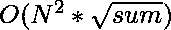

# 和为素数的数组中的对的计数

> 原文:[https://www . geeksforgeeks . org/数组中的对数-其和为质数/](https://www.geeksforgeeks.org/count-of-pairs-in-an-array-whose-sum-is-prime/)

给定一个大小为 **N** 元素的数组 **arr** ，任务是计算数组中和为素数的元素对的数量。

**示例:**

> **输入:** arr = {1，2，3，4，5}
> **输出:** 5
> **解释:**以和为素数的对为:{1，2}、{1，4}、{2，3}、{2，5}和{3，4}
> 
> **输入:** arr = {10，20，30，40}
> **输出:** 0
> **说明:**不存在和为素数的对。

**天真方法:**
计算数组中每对元素的和，并检查该和是否为素数。

下面的代码是上述方法的实现:

## C++

```
// C++ code to count of pairs
// of elements in an array
// whose sum is prime
#include <bits/stdc++.h>
using namespace std;

// Function to check whether a
// number is prime or not
bool isPrime(int num)
{
    if (num == 0 || num == 1) {
        return false;
    }
    for (int i = 2; i * i <= num; i++) {
        if (num % i == 0) {
            return false;
        }
    }
    return true;
}

// Function to count total number of pairs
// of elements whose sum is prime
int numPairsWithPrimeSum(int* arr, int n)
{
    int count = 0;
    for (int i = 0; i < n; i++) {
        for (int j = i + 1; j < n; j++) {
            int sum = arr[i] + arr[j];
            if (isPrime(sum)) {
                count++;
            }
        }
    }
    return count;
}

// Driver Code
int main()
{
    int arr[] = { 1, 2, 3, 4, 5 };
    int n = sizeof(arr) / sizeof(arr[0]);
    cout << numPairsWithPrimeSum(arr, n);
    return 0;
}
```

## Java 语言(一种计算机语言，尤用于创建网站)

```
// Java code to find number of pairs of
// elements in an array whose sum is prime
import java.io.*;
import java.util.*;

class GFG {

    // Function to check whether a number
    // is prime or not
    public static boolean isPrime(int num)
    {
        if (num == 0 || num == 1) {
            return false;
        }
        for (int i = 2; i * i <= num; i++) {
            if (num % i == 0) {
                return false;
            }
        }
        return true;
    }

    // Function to count total number of pairs
    // of elements whose sum is prime
    public static int numPairsWithPrimeSum(
        int[] arr, int n)
    {
        int count = 0;
        for (int i = 0; i < n; i++) {
            for (int j = i + 1; j < n; j++) {
                int sum = arr[i] + arr[j];
                if (isPrime(sum)) {
                    count++;
                }
            }
        }
        return count;
    }

    // Driver code
    public static void main(String[] args)
    {
        int[] arr = { 1, 2, 3, 4, 5 };
        int n = arr.length;
        System.out.println(
            numPairsWithPrimeSum(arr, n));
    }
}
```

## 蟒蛇 3

```
# Python3 code to find number of pairs of
# elements in an array whose sum is prime
import math

# Function to check whether a
# number is prime or not
def isPrime(num):

    sq = int(math.ceil(math.sqrt(num)))

    if num == 0 or num == 1:
        return False

    for i in range(2, sq + 1):
        if num % i == 0:
            return False

    return True

# Function to count total number of pairs
# of elements whose sum is prime
def numPairsWithPrimeSum(arr, n):

    count = 0

    for i in range(n):
        for j in range(i + 1, n):
            sum = arr[i] + arr[j]

            if isPrime(sum):
                count += 1

    return count

# Driver Code
arr = [ 1, 2, 3, 4, 5 ]
n = len(arr)

print(numPairsWithPrimeSum(arr, n))

# This code is contributed by grand_master
```

## C#

```
// C# code to find number of pairs of
// elements in an array whose sum is prime
using System;
class GFG{

// Function to check whether a number
// is prime or not
public static bool isPrime(int num)
{
    if (num == 0 || num == 1)
    {
        return false;
    }
    for (int i = 2; i * i <= num; i++)
    {
        if (num % i == 0)
        {
            return false;
        }
    }
    return true;
}

// Function to count total number of pairs
// of elements whose sum is prime
public static int numPairsWithPrimeSum(int[] arr,
                                       int n)
{
    int count = 0;
    for (int i = 0; i < n; i++)
    {
        for (int j = i + 1; j < n; j++)
        {
            int sum = arr[i] + arr[j];
            if (isPrime(sum))
            {
                count++;
            }
        }
    }
    return count;
}

// Driver code
public static void Main()
{
    int[] arr = { 1, 2, 3, 4, 5 };
    int n = arr.Length;
    Console.Write(numPairsWithPrimeSum(arr, n));
}
}

// This code is contributed by Nidhi_Biet
```

## java 描述语言

```
<script>
// Javascript code to count of pairs
// of elements in an array
// whose sum is prime

// Function to check whether a
// number is prime or not
function isPrime(num)
{
    if (num == 0 || num == 1) {
        return false;
    }
    for (let i = 2; i * i <= num; i++) {
        if (num % i == 0) {
            return false;
        }
    }
    return true;
}

// Function to count total number of pairs
// of elements whose sum is prime
function numPairsWithPrimeSum(arr, n)
{
    let count = 0;
    for (let i = 0; i < n; i++) {
        for (let j = i + 1; j < n; j++) {
            let sum = arr[i] + arr[j];
            if (isPrime(sum)) {
                count++;
            }
        }
    }
    return count;
}

// Driver Code

let arr = [ 1, 2, 3, 4, 5 ];
let n = arr.length;
document.write(numPairsWithPrimeSum(arr, n));

// This code is contributed by _saurabh_jaiswal
</script>
```

**Output:** 

```
5
```

**时间复杂度:**



**高效方法:**
使用厄拉多塞的[筛预计算并存储素数。现在，对于每对元素，检查它们的和是否为质数。](https://www.geeksforgeeks.org/sieve-of-eratosthenes/)

下面的代码是上述方法的实现:

## C++

```
// C++ code to find number of pairs
// of elements in an array whose
// sum is prime
#include <bits/stdc++.h>
using namespace std;

// Function for Sieve Of Eratosthenes
bool* sieveOfEratosthenes(int N)
{
    bool* isPrime = new bool[N + 1];
    for (int i = 0; i < N + 1; i++) {
        isPrime[i] = true;
    }
    isPrime[0] = false;
    isPrime[1] = false;
    for (int i = 2; i * i <= N; i++) {
        if (isPrime[i] == true) {
            int j = 2;
            while (i * j <= N) {
                isPrime[i * j] = false;
                j++;
            }
        }
    }
    return isPrime;
}

// Function to count total number of pairs
// of elements whose sum is prime
int numPairsWithPrimeSum(int* arr, int n)
{
    int N = 2 * 1000000;
    bool* isPrime = sieveOfEratosthenes(N);
    int count = 0;
    for (int i = 0; i < n; i++) {
        for (int j = i + 1; j < n; j++) {
            int sum = arr[i] + arr[j];
            if (isPrime[sum]) {
                count++;
            }
        }
    }
    return count;
}

// Driver Code
int main()
{
    int arr[] = { 1, 2, 3, 4, 5 };
    int n = sizeof(arr) / sizeof(arr[0]);
    cout << numPairsWithPrimeSum(arr, n);
    return 0;
}
```

## Java 语言(一种计算机语言，尤用于创建网站)

```
// Java code to find number of pairs of
// elements in an array whose sum is prime
import java.io.*;
import java.util.*;

class GFG {
    // Function for Sieve Of Eratosthenes
    public static boolean[] sieveOfEratosthenes(int N)
    {
        boolean[] isPrime = new boolean[N + 1];
        for (int i = 0; i < N + 1; i++) {
            isPrime[i] = true;
        }
        isPrime[0] = false;
        isPrime[1] = false;
        for (int i = 2; i * i <= N; i++) {
            if (isPrime[i] == true) {
                int j = 2;
                while (i * j <= N) {
                    isPrime[i * j] = false;
                    j++;
                }
            }
        }
        return isPrime;
    }

    // Function to count total number of pairs
    // of elements whose sum is prime
    public static int numPairsWithPrimeSum(
        int[] arr, int n)
    {
        int N = 2 * 1000000;
        boolean[] isPrime = sieveOfEratosthenes(N);
        int count = 0;
        for (int i = 0; i < n; i++) {
            for (int j = i + 1; j < n; j++) {
                int sum = arr[i] + arr[j];
                if (isPrime[sum]) {
                    count++;
                }
            }
        }
        return count;
    }

    // Driver code
    public static void main(String[] args)
    {
        int[] arr = { 1, 2, 3, 4, 5 };
        int n = arr.length;
        System.out.println(
            numPairsWithPrimeSum(arr, n));
    }
}
```

## 蟒蛇 3

```
# Python3 code to find number of pairs of
# elements in an array whose sum is prime

# Function for Sieve Of Eratosthenes
def sieveOfEratosthenes(N):

    isPrime = [True for i in range(N + 1)]

    isPrime[0] = False
    isPrime[1] = False

    i = 2

    while((i * i) <= N):
        if (isPrime[i]):
            j = 2
            while (i * j <= N):
                isPrime[i * j] = False
                j += 1

        i += 1

    return isPrime

# Function to count total number of pairs
# of elements whose sum is prime
def numPairsWithPrimeSum(arr, n):

    N = 2 * 1000000
    isPrime = sieveOfEratosthenes(N)
    count = 0

    for i in range(n):
        for j in range(i + 1, n):
            sum = arr[i] + arr[j]

            if (isPrime[sum]):
                count += 1

    return count

# Driver code   
if __name__=="__main__":

    arr = [ 1, 2, 3, 4, 5 ]
    n = len(arr)

    print(numPairsWithPrimeSum(arr, n))

# This code is contributed by rutvik_56
```

## C#

```
// C# code to find number of pairs of
// elements in an array whose sum is prime
using System;

class GFG{

// Function for Sieve Of Eratosthenes
public static bool[] sieveOfEratosthenes(int N)
{
    bool[] isPrime = new bool[N + 1];
    for (int i = 0; i < N + 1; i++)
    {
        isPrime[i] = true;
    }
    isPrime[0] = false;
    isPrime[1] = false;
    for (int i = 2; i * i <= N; i++)
    {
        if (isPrime[i] == true)
        {
            int j = 2;
            while (i * j <= N)
            {
                isPrime[i * j] = false;
                j++;
            }
        }
    }
    return isPrime;
}

// Function to count total number of pairs
// of elements whose sum is prime
public static int numPairsWithPrimeSum(int[] arr,
                                       int n)
{
    int N = 2 * 1000000;
    bool[] isPrime = sieveOfEratosthenes(N);
    int count = 0;
    for (int i = 0; i < n; i++)
    {
        for (int j = i + 1; j < n; j++)
        {
            int sum = arr[i] + arr[j];
            if (isPrime[sum])
            {
                count++;
            }
        }
    }
    return count;
}

// Driver code
public static void Main(String[] args)
{
    int[] arr = { 1, 2, 3, 4, 5 };
    int n = arr.Length;
    Console.WriteLine(numPairsWithPrimeSum(arr, n));
}
}

// This code is contributed by 29AjayKumar
```

## java 描述语言

```
<script>

// JavaScript code to find number of pairs of
// elements in an array whose sum is prime

    // Function for Sieve Of Eratosthenes
    function sieveOfEratosthenes(N)
    {
        let isPrime = Array.from({length: N+1},
                                 (_, i) => 0);
        for (let i = 0; i < N + 1; i++) {
            isPrime[i] = true;
        }
        isPrime[0] = false;
        isPrime[1] = false;
        for (let i = 2; i * i <= N; i++) {
            if (isPrime[i] == true) {
                let j = 2;
                while (i * j <= N) {
                    isPrime[i * j] = false;
                    j++;
                }
            }
        }
        return isPrime;
    }

    // Function to count total number of pairs
    // of elements whose sum is prime
    function numPairsWithPrimeSum(
        arr, n)
    {
        let N = 2 * 1000000;
        let isPrime = sieveOfEratosthenes(N);
        let count = 0;
        for (let i = 0; i < n; i++) {
            for (let j = i + 1; j < n; j++) {
                let sum = arr[i] + arr[j];
                if (isPrime[sum]) {
                    count++;
                }
            }
        }
        return count;
    }

  // Driver Code

        let arr = [ 1, 2, 3, 4, 5 ];
        let n = arr.length;
        document.write(
        numPairsWithPrimeSum(arr, n)
        );

</script>
```

**Output:** 

```
5
```

**时间复杂度:** *O(N^2)*