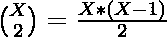

# 数组中的对计数，其差值等于颠倒数字的差值

> 原文:[https://www . geeksforgeeks . org/有差异数组中的对计数等于数字反转的差异/](https://www.geeksforgeeks.org/count-of-pairs-in-array-with-difference-equal-to-the-difference-with-digits-reversed/)

给定一个由 **N** 个整数组成的[数组](https://www.geeksforgeeks.org/introduction-to-arrays/) **arr[]** ，任务是找出数组元素对 **(arr[i]，arr[j])** 的个数，使得对之间的差等于两个数的位数颠倒时的差。

**示例:**

> **输入:** arr[] = {42，11，1，97}
> **输出:** 2
> **解释:**
> 数组元素的有效对为(42，97)，(11，1)为:
> 1。42–97 = 24–79 =(-55)
> 2。11 – 1 = 11 – 1 = (10)
> 
> **输入:** arr[] = {1，2，3，4}
> **输出:** 6

**方法:**给定的问题可以通过使用[散列](https://www.geeksforgeeks.org/hashing-data-structure/)来解决，该散列基于以下观察:

> 有效对 **(i，j)** 将遵循如下等式
> 
> **=>arr[I]–arr[j]= rev(arr[I])–rev(arr[j])**
> **=>arr[I]–rev(arr[I])= arr[j]–rev(arr[j])**

按照以下步骤解决问题:

*   现在，创建一个[函数](https://www.geeksforgeeks.org/functions-in-c/) **反转数字**，它将以一个整数为参数，反转该整数的数字。
*   将频率值**arr[I]–rev(arr[I])**存储在[无序地图](https://www.geeksforgeeks.org/unordered_map-in-cpp-stl/)中，比如 **mp** 。
*   对于频率 **X** 的每个键 **(=差)**，可以形成的对的数量由给出。
*   对的总计数由存储在图 **mp** 中的每个频率的上述表达式的值的总和给出。

下面是上述方法的实现:

## C++

```
// C++ program for the above approach

#include <bits/stdc++.h>
using namespace std;

// Function to reverse the digits
// of an integer
int reverseDigits(int n)
{
    // Convert the given number
    // to a string
    string s = to_string(n);

    // Reverse the string
    reverse(s.begin(), s.end());

    // Return the value of the string
    return stoi(s);
}
int countValidPairs(vector<int> arr)
{
    // Stores resultant count of pairs
    long long res = 0;

    // Stores the frequencies of
    // differences
    unordered_map<int, int> mp;
    for (int i = 0; i < arr.size(); i++) {
        mp[arr[i] - reverseDigits(arr[i])]++;
    }

    // Traverse the map and count pairs
    // formed for all frequency values
    for (auto i : mp) {
        long long int t = i.second;
        res += t * (t - 1) / 2;
    }

    // Return the resultant count
    return res;
}

// Driver Code
int main()
{
    vector<int> arr = { 1, 2, 3, 4 };
    cout << countValidPairs(arr);

    return 0;
}
```

## Java 语言(一种计算机语言，尤用于创建网站)

```
// Java program for the above approach
import java.util.HashMap;

class GFG {

    // Function to reverse the digits
    // of an integer
    public static int reverseDigits(int n)
    {

        // Convert the given number
        // to a string
        String s = String.valueOf(n);

        // Reverse the string
        s = new StringBuffer(s).reverse().toString();

        // Return the value of the string
        return Integer.parseInt(s);
    }

    public static int countValidPairs(int[] arr)
    {

        // Stores resultant count of pairs
        int res = 0;

        // Stores the frequencies of
        // differences
        HashMap<Integer, Integer> mp = new HashMap<Integer, Integer>();
        for (int i = 0; i < arr.length; i++) {
            if (mp.containsKey(arr[i] - reverseDigits(arr[i]))) {
                mp.put(arr[i] - reverseDigits(arr[i]), mp.get(arr[i] - reverseDigits(arr[i])) + 1);
            } else {
                mp.put(arr[i] - reverseDigits(arr[i]), 1);
            }
        }

        // Traverse the map and count pairs
        // formed for all frequency values
        for (int i : mp.keySet()) {
            int t = mp.get(i);
            res += t * (t - 1) / 2;
        }

        // Return the resultant count
        return res;
    }

    // Driver Code
    public static void main(String args[])
    {
        int[] arr = { 1, 2, 3, 4 };
        System.out.println(countValidPairs(arr));
    }

}

// This code is contributed by saurabh_jaiswal.
```

## 蟒蛇 3

```
# python program for the above approach

# Function to reverse the digits
# of an integer
def reverseDigits(n):

    # Convert the given number
    # to a string
    s = str(n)

    # Reverse the string
    s = "".join(reversed(s))

    # Return the value of the string
    return int(s)

def countValidPairs(arr):

    # Stores resultant count of pairs
    res = 0

    # Stores the frequencies of
    # differences
    mp = {}

    for i in range(0, len(arr)):
        if not arr[i] - reverseDigits(arr[i]) in mp:
            mp[arr[i] - reverseDigits(arr[i])] = 1
        else:
            mp[arr[i] - reverseDigits(arr[i])] += 1

        # Traverse the map and count pairs
        # formed for all frequency values
    for i in mp:
        t = mp[i]
        res += (t * (t - 1)) // 2

        # Return the resultant count
    return res

# Driver Code
if __name__ == "__main__":

    arr = [1, 2, 3, 4]
    print(countValidPairs(arr))

    # This code is contributed by rakeshsahni
```

## C#

```
// C# program for the above approach
using System;
using System.Collections.Generic;

class GFG {

    // Function to reverse the digits
    // of an integer
    public static int reverseDigits(int n)
    {

        // Convert the given number
        // to a string
        string s = n.ToString();

        // Reverse the string
        char[] arr = s.ToCharArray();
        Array.Reverse(arr);
        string st = new string(arr);

        // Return the value of the string
        return Int32.Parse(st);
    }

    public static int countValidPairs(int[] arr)
    {

        // Stores resultant count of pairs
        int res = 0;

        // Stores the frequencies of
        // differences
        Dictionary<int, int> mp
            = new Dictionary<int, int>();
        for (int i = 0; i < arr.Length; i++) {
            if (mp.ContainsKey(arr[i]
                               - reverseDigits(arr[i]))) {
                mp[arr[i] - reverseDigits(arr[i])]
                    = mp[arr[i] - reverseDigits(arr[i])]
                      + 1;
            }
            else {
                mp[arr[i] - reverseDigits(arr[i])] = 1;
            }
        }

        // Traverse the map and count pairs
        // formed for all frequency values
        foreach(int i in mp.Keys)
        {
            int t = mp[i];
            res += t * (t - 1) / 2;
        }

        // Return the resultant count
        return res;
    }

    // Driver Code
    public static void Main()
    {
        int[] arr = { 1, 2, 3, 4 };
        Console.WriteLine(countValidPairs(arr));
    }
}

// This code is contributed by ukasp.
```

## java 描述语言

```
<script>
// Javascript program for the above approach

// Function to reverse the digits
// of an integer
function reverseDigits(n)
{

  // Convert the given number
  // to a string
  let s = new String(n);

  // Reverse the string
  s = s.split("").reverse().join("");

  // Return the value of the string
  return parseInt(s);
}
function countValidPairs(arr)
{

  // Stores resultant count of pairs
  let res = 0;

  // Stores the frequencies of
  // differences
  let mp = new Map();
  for (let i = 0; i < arr.length; i++) {
    let temp = arr[i] - reverseDigits(arr[i]);
    if (mp.has(temp)) {
      mp.set(temp, mp.get(temp) + 1);
    } else {
      mp.set(temp, 1);
    }
  }

  // Traverse the map and count pairs
  // formed for all frequency values
  for (i of mp) {
    let t = i[1];
    res += (t * (t - 1)) / 2;
  }

  // Return the resultant count
  return res;
}

// Driver Code
let arr = [1, 2, 3, 4];
document.write(countValidPairs(arr));

// This code is contributed by gfgking.
</script>
```

**Output:** 

```
6
```

***时间复杂度:**O(N)*
T5**辅助空间:** O(N)