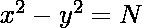
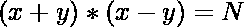
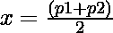

# 平方差等于 N 的整数对的计数

> 原文:[https://www . geesforgeks . org/整数对计数-其平方差等于-n/](https://www.geeksforgeeks.org/count-of-pairs-of-integers-whose-difference-of-squares-is-equal-to-n/)

给定一个正整数 **N** ，任务是求平方差等于 N 的整数对 **(x，y)** 的个数，即，



**示例:**

> **输入:** N = 20
> **输出:** 4
> **解释:**
> 4 个可能的对是(10，2)、(-10，2)、(-10，-2)和(10，-2)。
> 
> **输入:** N = 80
> **输出:** 12
> **解释:**
> 这 12 个可能的对是:
> 1。(40，2)、(-40，2)、(-40，-2)和(40，-2)。
> 2。(20，4)、(-20，4)、(-20，-4)和(20，-4)。
> 3。(10，8)、(-10，8)、(-10，-8)和(10，-8)。

**逼近:**
给定的方程也可以写成:

> => 
> = > 

对于给定方程的积分解:

> (x+y)(x-y)
> 
> 永远是整数
> = > (x+y)(x-y)
> 是**N**T4 的除数

设(x + y) = p1 和(x + y) = p2
为两个方程，其中 p1 & p2 为**N**T3 的除数，使得 **p1 * p2 = N** 。

求解上述两个方程，我们有:

> => 
> 和

从上面的计算来看， **x 和 y** 要积分，那么除数之和必须是**偶数**。因为 x 和 y 的两个值有 4 个可能的值作为 **(+x，+y)、(+x，-y)、(-x，+y)和(-x，-y)** 。
因此可能解的总数由 **4*(偶数和的除数对)**给出。

下面是上述方法的实现:

## C++

```
// C++ program for the above approach
#include <bits/stdc++.h>
using namespace std;

// Function to find the integral
// solutions of the given equation
void findSolutions(int N)
{

    // Initialise count to 0
    int count = 0;

    // Iterate till sqrt(N)
    for (int i = 1; i <= sqrt(N); i++) {

        if (N % i == 0) {

            // If divisor's pair sum is even
            if ((i + N / i) % 2 == 0) {
                count++;
            }
        }
    }

    // Print the total possible solutions
    cout << 4 * count << endl;
}

// Driver Code
int main()
{
    // Given number N
    int N = 80;

    // Function Call
    findSolutions(N);

    return 0;
}
```

## Java 语言(一种计算机语言，尤用于创建网站)

```
// Java program for the above approach
import java.util.*;
class GFG{

// Function to find the integral
// solutions of the given equation
static void findSolutions(int N)
{

    // Initialise count to 0
    int count = 0;

    // Iterate till sqrt(N)
    for(int i = 1; i <= Math.sqrt(N); i++)
    {
       if (N % i == 0)
       {

           // If divisor's pair sum is even
           if ((i + N / i) % 2 == 0)
           {
               count++;
           }
       }
    }

    // Print the total possible solutions
    System.out.print(4 * count);
}

// Driver code
public static void main(String[] args)
{

    // Given number N
    int N = 80;

    // Function Call
    findSolutions(N);
}
}

// This code is contributed by Shubham Prakash.
```

## 蟒蛇 3

```
# Python3 program for the above approach
import math;

# Function to find the integral
# solutions of the given equation
def findSolutions(N):

    # Initialise count to 0
    count = 0;

    # Iterate till sqrt(N)
    for i in range(1, int(math.sqrt(N)) + 1):

        if (N % i == 0):

            # If divisor's pair sum is even
            if ((i + N // i) % 2 == 0):
                count += 1;

    # Print the total possible solutions
    print(4 * count);

# Driver Code

# Given number N
N = 80;

# Function Call
findSolutions(N);

# This code is contributed by Code_Mech
```

## C#

```
// C# program for the above approach
using System;
class GFG{

// Function to find the integral
// solutions of the given equation
static void findSolutions(int N)
{

    // Initialise count to 0
    int count = 0;

    // Iterate till sqrt(N)
    for(int i = 1; i <= Math.Sqrt(N); i++)
    {
        if (N % i == 0)
        {

            // If divisor's pair sum is even
            if ((i + N / i) % 2 == 0)
            {
                count++;
            }
        }
    }

    // Print the total possible solutions
    Console.Write(4 * count);
}

// Driver code
public static void Main(String[] args)
{

    // Given number N
    int N = 80;

    // Function Call
    findSolutions(N);
}
}

// This code is contributed by sapnasingh4991
```

## java 描述语言

```
<script>

// Javascript program for the above approach

// Function to find the integral
// solutions of the given equation
function findSolutions(N)
{

    // Initialise count to 0
    let count = 0;

    // Iterate till sqrt(N)
    for(let i = 1; i <= Math.sqrt(N); i++)
    {
        if (N % i == 0)
        {

            // If divisor's pair sum is even
            if ((i + parseInt(N / i)) % 2 == 0)
            {
                count++;
            }
        }
    }

    // Print the total possible solutions
    document.write(4 * count + "<br>");
}

// Driver Code

// Given number N
let N = 80;

// Function Call
findSolutions(N);

// This code is contributed by souravmahato348

</script>
```

**Output:** 12 

**时间复杂度:** *O(sqrt(N))*