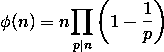

# 对于 Q 查询

，计数到 LCM 不等于其乘积的对

> 原文:[https://www . geesforgeks . org/对计数-up-n-so-what-LCM-不等于他们的产品-for-q-query/](https://www.geeksforgeeks.org/count-of-pairs-upto-n-such-whose-lcm-is-not-equal-to-their-product-for-q-queries/)

给定一个数字 **N** ，任务是在范围**【1，N】**中找到配对的数量 **(a，b)** ，使得它们的 [LCM](https://www.geeksforgeeks.org/lcm-gq/) 不等于它们的乘积，即 **LCM(a，b)！=(a * b)****(b>a)**。可以有多个查询要回答。

**示例:**

> **输入:** Q[] = {5}
> **输出:** 1
> **解释:**
> 从 1 到 5 的对是(2，4)
> **输入:** Q[] = {5，7}
> **输出:** 1，4
> **解释:**
> 从 1 到 5 的对是(2，4)
> 从 1 到 7 的对是

**方法:**思路是使用[欧拉全能性函数](https://www.geeksforgeeks.org/eulers-totient-function-for-all-numbers-smaller-than-or-equal-to-n/)。

1.用从 1 到 N 的数字找出可以形成的总对数，形成的对数等于(**N *(N–1))/2**。

2.对于每个整数 i ≤ N，使用欧拉全能函数找到所有与 I 同素的这样的对，并将它们存储在数组中。

**示例:**

```
arr[10] = 10 * (1-1/2) * (1-1/5)
        = 4
```

3.



4.现在构建前缀和表，该表存储 1 到 n 之间的所有 I 的所有φ(I)的和。

5.最后，任何 i ≤ N 的答案由形成的总对数与 pref[i]之差给出。

下面是给定方法的实现:

## C++

```
// C++ program to find the count of pairs
// from 1 to N such that their LCM
// is not equal to their product
#include <bits/stdc++.h>
using namespace std;

#define N 100005

// To store Euler's Totient Function
int phi[N];

// To store prefix sum table
int pref[N];

// Compute Totients of all numbers
// smaller than or equal to N
void precompute()
{
    // Make phi[1]=0 since 1 cannot form any pair
    phi[1] = 0;

    // Initialise all remaining phi[] with i
    for (int i = 2; i < N; i++)
        phi[i] = i;

    // Compute remaining phi
    for (int p = 2; p < N; p++) {

        // If phi[p] is not computed already,
        // then number p is prime
        if (phi[p] == p) {

            // phi of prime number is p-1
            phi[p] = p - 1;

            // Update phi of all multiples of p
            for (int i = 2 * p; i < N; i += p) {

                // Add the contribution of p
                // to its multiple i by multiplying
                // it with (1 - 1/p)
                phi[i] = (phi[i] / p) * (p - 1);
            }
        }
    }
}

// Function to store prefix sum table
void prefix()
{
    // Prefix Sum of all Euler's Totient Values
    for (int i = 1; i < N; i++)
        pref[i] = pref[i - 1] + phi[i];
}

void find_pairs(int n)
{

    // Total number of pairs that can be formed
    int total = (n * (n - 1)) / 2;

    int ans = total - pref[n];

    cout << "Number of pairs from 1 to "
         << n << " are " << ans << endl;
}

// Driver Code
int main()
{

    // Function call to compute all phi
    precompute();

    // Function call to store all prefix sum
    prefix();

    int q[] = { 5, 7 };
    int n = sizeof(q) / sizeof(q[0]);

    for (int i = 0; i < n; i++) {
        find_pairs(q[i]);
    }

    return 0;
}
```

## Java 语言(一种计算机语言，尤用于创建网站)

```
// Java program to find the count of pairs
// from 1 to N such that their LCM
// is not equal to their product

class GFG{

static final int N = 100005;

// To store Euler's Totient Function
static int []phi = new int[N];

// To store prefix sum table
static int []pref = new int[N];

// Compute Totients of all numbers
// smaller than or equal to N
static void precompute()
{
    // Make phi[1] = 0 since 1 cannot form any pair
    phi[1] = 0;

    // Initialise all remaining phi[] with i
    for (int i = 2; i < N; i++)
        phi[i] = i;

    // Compute remaining phi
    for (int p = 2; p < N; p++) {

        // If phi[p] is not computed already,
        // then number p is prime
        if (phi[p] == p) {

            // phi of prime number is p-1
            phi[p] = p - 1;

            // Update phi of all multiples of p
            for (int i = 2 * p; i < N; i += p) {

                // Add the contribution of p
                // to its multiple i by multiplying
                // it with (1 - 1/p)
                phi[i] = (phi[i] / p) * (p - 1);
            }
        }
    }
}

// Function to store prefix sum table
static void prefix()
{
    // Prefix Sum of all Euler's Totient Values
    for (int i = 1; i < N; i++)
        pref[i] = pref[i - 1] + phi[i];
}

static void find_pairs(int n)
{

    // Total number of pairs that can be formed
    int total = (n * (n - 1)) / 2;

    int ans = total - pref[n];

    System.out.print("Number of pairs from 1 to "
        + n + " are " + ans +"\n");
}

// Driver Code
public static void main(String[] args)
{

    // Function call to compute all phi
    precompute();

    // Function call to store all prefix sum
    prefix();

    int q[] = { 5, 7 };
    int n = q.length;

    for (int i = 0; i < n; i++) {
        find_pairs(q[i]);
    }

}
}

// This code contributed by Rajput-Ji
```

## 蟒蛇 3

```
# Python 3 program to find the count of pairs
# from 1 to N such that their LCM
# is not equal to their product

N = 100005

# To store Euler's Totient Function
phi = [0 for i in range(N)]

# To store prefix sum table
pref = [0 for i in range(N)]

# Compute Totients of all numbers
# smaller than or equal to N
def precompute():

    # Make phi[1]=0 since 1 cannot form any pair
    phi[1] = 0

    # Initialise all remaining phi[] with i
    for i in range(2, N, 1):
        phi[i] = i

    # Compute remaining phi
    for p in range(2,N):
        # If phi[p] is not computed already,
        # then number p is prime
        if (phi[p] == p):
            # phi of prime number is p-1
            phi[p] = p - 1

            # Update phi of all multiples of p
            for i in range(2*p, N, p):

                # Add the contribution of p
                # to its multiple i by multiplying
                # it with (1 - 1/p)
                phi[i] = (phi[i] // p) * (p - 1)

# Function to store prefix sum table
def prefix():

    # Prefix Sum of all Euler's Totient Values
    for i in range(1, N, 1):
        pref[i] = pref[i - 1] + phi[i]

def find_pairs(n):
    # Total number of pairs that can be formed
    total = (n * (n - 1)) // 2

    ans = total - pref[n]

    print("Number of pairs from 1 to",n,"are",ans)

# Driver Code
if __name__ == '__main__':
    # Function call to compute all phi
    precompute()

    # Function call to store all prefix sum
    prefix()

    q =  [5, 7]
    n = len(q)

    for i in range(n):
        find_pairs(q[i])

# This code is contributed by Surendra_Gangwar
```

## C#

```
// C# program to find the count of pairs
// from 1 to N such that their LCM
// is not equal to their product
using System;

class GFG{

static readonly int N = 100005;

// To store Euler's Totient Function
static int []phi = new int[N];

// To store prefix sum table
static int []pref = new int[N];

// Compute Totients of all numbers
// smaller than or equal to N
static void precompute()
{

    // Make phi[1] = 0 since 1
    // cannot form any pair
    phi[1] = 0;

    // Initialise all remaining
    // phi[] with i
    for(int i = 2; i < N; i++)
       phi[i] = i;

    // Compute remaining phi
    for(int p = 2; p < N; p++)
    {

       // If phi[p] is not computed already,
       // then number p is prime
       if (phi[p] == p)
       {

           // phi of prime number is p-1
           phi[p] = p - 1;

           // Update phi of all multiples of p
           for(int i = 2 * p; i < N; i += p)
           {

              // Add the contribution of p
              // to its multiple i by multiplying
              // it with (1 - 1/p)
              phi[i] = (phi[i] / p) * (p - 1);
           }
       }
    }
}

// Function to store prefix sum table
static void prefix()
{

    // Prefix Sum of all
    // Euler's Totient Values
    for(int i = 1; i < N; i++)
       pref[i] = pref[i - 1] + phi[i];
}

static void find_pairs(int n)
{

    // Total number of pairs
    // that can be formed
    int total = (n * (n - 1)) / 2;
    int ans = total - pref[n];

    Console.Write("Number of pairs from 1 to " +
                      n + " are " + ans + "\n");
}

// Driver Code
public static void Main(String[] args)
{

    // Function call to compute all phi
    precompute();

    // Function call to store
    // all prefix sum
    prefix();

    int []q = {5, 7};
    int n = q.Length;

    for(int i = 0; i < n; i++)
    {
       find_pairs(q[i]);
    }
}
}

// This code is contributed by Rajput-Ji
```

## java 描述语言

```
<script>
// javascript program to find the count of pairs
// from 1 to N such that their LCM
// is not equal to their product
    var  N = 100005;

    // To store Euler's Totient Function
    var phi = Array(N).fill(0);

    // To store prefix sum table
    var pref = Array(N).fill(0);

    // Compute Totients of all numbers
    // smaller than or equal to N
    function precompute() {
        // Make phi[1] = 0 since 1 cannot form any pair
        phi[1] = 0;

        // Initialise all remaining phi with i
        for (i = 2; i < N; i++)
            phi[i] = i;

        // Compute remaining phi
        for (p = 2; p < N; p++) {

            // If phi[p] is not computed already,
            // then number p is prime
            if (phi[p] == p) {

                // phi of prime number is p-1
                phi[p] = p - 1;

                // Update phi of all multiples of p
                for (i = 2 * p; i < N; i += p) {

                    // Add the contribution of p
                    // to its multiple i by multiplying
                    // it with (1 - 1/p)
                    phi[i] = (phi[i] / p) * (p - 1);
                }
            }
        }
    }

    // Function to store prefix sum table
    function prefix() {
        // Prefix Sum of all Euler's Totient Values
        for (i = 1; i < N; i++)
            pref[i] = pref[i - 1] + phi[i];
    }

    function find_pairs(n) {

        // Total number of pairs that can be formed
        var total = (n * (n - 1)) / 2;

        var ans = total - pref[n];

        document.write("Number of pairs from 1 to " + n + " are " + ans + "<br/>");
    }

    // Driver Code

        // Function call to compute all phi
        precompute();

        // Function call to store all prefix sum
        prefix();

        var q = [ 5, 7 ];
        var n = q.length;

        for (i = 0; i < n; i++) {
            find_pairs(q[i]);
        }

// This code contributed by Rajput-Ji
</script>
```

**Output:** 

```
Number of pairs from 1 to 5 are 1
Number of pairs from 1 to 7 are 4
```

时间复杂度:O(n <sup>2</sup> )

辅助空间:O(n)