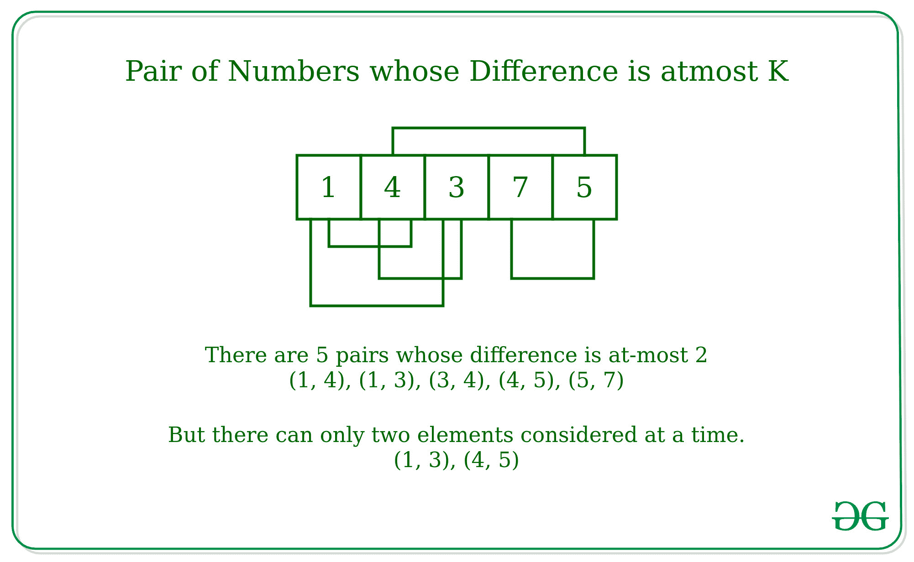

# 不重复元素最多 K 个有差异的对的计数

> 原文:[https://www . geeksforgeeks . org/无重复元素最多有 k 个差异的配对数/](https://www.geeksforgeeks.org/count-of-pairs-with-difference-at-most-k-with-no-element-repeating/)

给定一个数组 **arr[]** 和一个数字 **K** ，任务是计算差值小于或等于 K 的对的数量，这样一个元素只能在一对中被考虑。

**示例:**

> **输入:** arr[] = {1，3，3，9，4}，K = 2
> **输出:** 2
> **说明:**
> 只有两对的区别是 atmat 2
> (1，3)，(3，4)
> 
> **输入:** arr[] = {1，4，3，7，5}，K = 2
> **输出:** 2
> **解释:**
> 数组中有五对，它们的区别是 atmost 2、
> (1，3)、(3，4)、(4，5)、(3，5)、(5，7)
> 但是一次只能考虑其中的两个，因为一个元素
> 只能取一对。
> 
> 

**方法:**
思路是[排序](https://www.geeksforgeeks.org/merge-sort/)数组，找到相邻元素的[差，如果差最多为 K，则考虑该对，增加计数，然后根据条件，任何元素只能在一对中，如果找到一对，则将计数器加 2，使得任何元素只出现在一对中。](https://www.geeksforgeeks.org/python-calculate-difference-between-adjacent-elements-in-given-list/)

**例如:**

```
Given Array - {1, 4, 3, 7, 5}, K = 2 
After Sorting Array will be - {1, 3, 4, 5, 7}
Step 1 - i = 0, count = 0
Consider the pair of elements for i and i + 1
Pair - (1, 3), Difference = 3 - 1 = 2
As the Difference is less than equal to 2
count = 1 and i = 2

Step 2 - i = 2, count = 1
Consider the pair of elements for i and i + 1
Pair - (4, 5), Difference = 5 - 4 = 1
As the Difference is less than equal to 2
count = 2 and i = 4
As i is greater than length-2,
there will be no more possible pairs.
```

**算法:**

*   使用任何[排序算法](https://www.geeksforgeeks.org/sorting-algorithms/)对数组进行排序，使连续的元素在一起。
*   将索引计数器(比如 **i** )初始化为零，并在循环的同时运行[，直到索引计数器小于**(长度–1)**](https://www.geeksforgeeks.org/loops-in-c-and-cpp/)
    1.  检查索引 **i** 和 **i + 1** 处元素的差异。
    2.  如果差值小于或等于 K，则将索引增加 2，并将计数器增加 1，以考虑立即增加元素。
    3.  否则，将索引增加 1，以考虑下一个元素形成的对。

下面是上述方法的实现:

## C++

```
// C++ implementation to count the
// number of pairs whose difference
// is atmost K in an array
#include <iostream>
#include<bits/stdc++.h>

using namespace std;

    // Function to count the
    // number of pairs whose difference
    // is atmost K in an array
    int countPairs(int arr[], int k, int n)
    {

        // Variable to store the count of pairs
        // whose difference is atmost K
        int pair = 0;
        int index = 0;

        //int n = sizeof(arr)/sizeof(arr[0]);

        // Sorting the Array
        sort(arr,arr + n) ;

        // Loop to consider the consecutive
        // pairs of the array
        while(index < n -1)
        {

            // if Pair found increment
            // the index by 2
            if (arr[index + 1] - arr[index] <= k){
                pair += 1 ;
                index += 2 ;
            }
            else{
                index += 1;
            }
        }
        return pair ;

    }

// Driver Code
int main() {
    int arr[] = {1, 4, 3, 7, 5} ;
    int k = 2;

     int n = sizeof(arr)/sizeof(arr[0]);
    // Function Call
    int count = countPairs(arr, k,n) ;
    cout << count << endl;;
}

// This code is contributed by AnkitRai01
```

## Java 语言(一种计算机语言，尤用于创建网站)

```
// Java implementation to count the
// number of pairs whose difference
// is atmost K in an array
import java.util.*;

class GFG
{

    // Function to count the
    // number of pairs whose difference
    // is atmost K in an array
    static int countPairs(int arr[], int k)
    {

        // Sorting the Array
        Arrays.sort(arr) ;

        // Variable to store the count of pairs
        // whose difference is atmost K
        int pair = 0;
        int index = 0;

        // Loop to consider the consecutive
        // pairs of the array
        while(index < arr.length -1)
        {

            // if Pair found increment
            // the index by 2
            if (arr[index + 1] - arr[index] <= k){
                pair += 1 ;
                index += 2 ;
            }
            else{
                index += 1;
            }
        }
        return pair ;

    }

    // Driver Code
    public static void main (String[] args) {
        int arr[] = {1, 4, 3, 7, 5} ;
        int k = 2;

        // Function Call
        int count = countPairs(arr, k) ;
        System.out.println(count);
    }
}

// This code is contributed by AnkitRai01
```

## 蟒蛇 3

```
# Python3 implementation to count the
# number of pairs whose difference
# is atmost K in an array

# Function to count the
# number of pairs whose difference
# is atmost K in an array
def countPairs(arr, k):

    # Sorting the Array
    arr.sort()

    # Variable to store the count of pairs
    # whose difference is atmost K
    pair = 0
    index = 0

    # Loop to consider the consecutive
    # pairs of the array
    while(index < len(arr)-1):

        # if Pair found increment
        # the index by 2
        if arr[index + 1] - arr[index] <= k:
            pair += 1
            index += 2
        else:
            index += 1

    return pair

# Driver Code
if __name__ == "__main__":
    arr = [1, 4, 3, 7, 5]
    k = 2
    # Function Call
    count = countPairs(arr, k)
    print(count)
```

## C#

```
// C# implementation to count the
// number of pairs whose difference
// is atmost K in an array
using System;

class GFG
{

    // Function to count the
    // number of pairs whose difference
    // is atmost K in an array
    static int countPairs(int []arr, int k)
    {

        // Sorting the Array
        Array.Sort(arr) ;

        // Variable to store the count of pairs
        // whose difference is atmost K
        int pair = 0;
        int index = 0;

        // Loop to consider the consecutive
        // pairs of the array
        while(index < arr.Length - 1)
        {

            // if Pair found increment
            // the index by 2
            if (arr[index + 1] - arr[index] <= k)
            {
                pair += 1 ;
                index += 2 ;
            }
            else
            {
                index += 1;
            }
        }
        return pair ;
    }

    // Driver Code
    public static void Main ()
    {
        int []arr = {1, 4, 3, 7, 5} ;
        int k = 2;

        // Function Call
        int count = countPairs(arr, k) ;
        Console.WriteLine(count);
    }
}

// This code is contributed by AnkitRai01
```

## java 描述语言

```
<script>
    // Javascript implementation to count the
    // number of pairs whose difference
    // is atmost K in an array

    // Function to count the
    // number of pairs whose difference
    // is atmost K in an array
    function countPairs(arr, k, n)
    {

        // Variable to store the count of pairs
        // whose difference is atmost K
        let pair = 0;
        let index = 0;

        //int n = sizeof(arr)/sizeof(arr[0]);

        // Sorting the Array
        arr.sort((a, b) => a - b) ;

        // Loop to consider the consecutive
        // pairs of the array
        while(index < n -1)
        {

            // if Pair found increment
            // the index by 2
            if (arr[index + 1] - arr[index] <= k){
                pair += 1 ;
                index += 2 ;
            }
            else{
                index += 1;
            }
        }
        return pair ;

    }

// Driver Code

let arr = [1, 4, 3, 7, 5];
let k = 2;

let n = arr.length;

// Function Call
let count = countPairs(arr, k,n);

document.write(count + "<br>");

// This code is contributed by _saurabh_jaiswal
</script>
```

**Output:** 

```
2
```

**性能分析:**

*   **时间复杂度:**在上面给出的方法中，存在取 O(N logN)的数组的排序，并且还存在一次迭代来计数为 O(N)的对的数量。
    因此，该方法的总体复杂性是 **O(N logN + N)** 。
*   **空间复杂度:**在上面给出的方法中，没有额外的空间。因此，该方法的整体空间复杂性将是 **O(1)**