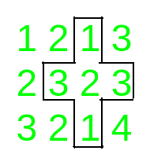
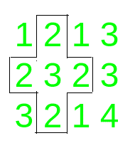

# 给定矩阵中回文加路径的计数

> 原文:[https://www . geesforgeks . org/给定矩阵中回文加路径的计数/](https://www.geeksforgeeks.org/count-of-palindromic-plus-paths-in-a-given-matrix/)

给定一个整数**N×M 矩阵**，任务是计算数组中回文脉冲的数量。

> **回文加**是回文子行和回文子列在中间元素交叉时形成的。

**例:**

> **输入:**矩阵= [[1，2，1]，[2，3，2]，[3，2，1]]
> **输出:** 1
> **解释:**
> 回文行从(1，0)–>(1，2)和回文列(0，1)–>(2，1)组成回文加号。
> **输入:**矩阵= [[1，2，1，3]，[2，3，2，3]，[3，2，1，4]
> **输出:** 2
> **解释:**
> 给定矩阵中的回文 pluses 为:
> 
>  

**方法:**
要解决问题，请按照以下步骤操作:

*   遍历所有可以作为回文加号中心的单元格，即除了属于第一行和最后一行和最后一列的单元格之外的所有单元格。
*   对于所有这些单元格 **(i，j)** ，检查**a【I】【j–1】**是否等于**a【I】【j+1】**和**a【I–1】【j】**是否等于**a【I+1】【j】**。如果两个条件都满足，那么就增加回文 pluses 的数量。
*   打印回文 pluses 的最终计数。

以下是上述方法的实现:

## C++

```
// C++ Program to count the number
// of palindromic pluses in
// a given matrix
#include <bits/stdc++.h>
using namespace std;

// Function to count and return
// the number of palindromic pluses
int countPalindromicPlus(
    int n, int m,
    vector<vector<int> >& a)
{
    int i, j, k;
    int count = 0;

    // Traverse all the centers
    for (i = 1; i < n - 1; i++) {
        for (j = 1; j < m - 1; j++) {

            // Check for palindromic plus
            // Check whether row and
            // column are palindrome or not
            if (a[i + 1][j] == a[i - 1][j]
                && a[i][j - 1] == a[i][j + 1])
                ++count;
        }
    }
    // Return the answer
    return count;
}

// Driver code
int main()
{
    int n = 4, m = 4;

    vector<vector<int> > a
        = { { 1, 2, 1, 3 },
            { 2, 3, 2, 3 },
            { 3, 2, 1, 2 },
            { 2, 3, 2, 3 } };
    cout << countPalindromicPlus(
                n, m, a)
         << endl;

    return 0;
}
```

## Java 语言(一种计算机语言，尤用于创建网站)

```
// Java program to count the number
// of palindromic pluses in
// a given matrix
class GFG{

// Function to count and return
// the number of palindromic pluses
static int countPalindromicPlus(int n, int m,
                                int [][]a)
{
    int i, j;
    int count = 0;

    // Traverse all the centers
    for(i = 1; i < n - 1; i++)
    {
       for(j = 1; j < m - 1; j++)
       {

          // Check for palindromic plus
          // Check whether row and
          // column are palindrome or not
          if (a[i + 1][j] == a[i - 1][j] &&
              a[i][j - 1] == a[i][j + 1])
              ++count;
       }
    }

    // Return the answer
    return count;
}

// Driver code
public static void main(String[] args)
{
    int n = 4, m = 4;
    int [][]a = { { 1, 2, 1, 3 },
                  { 2, 3, 2, 3 },
                  { 3, 2, 1, 2 },
                  { 2, 3, 2, 3 } };

    System.out.print(
           countPalindromicPlus(n, m, a) + "\n");
}
}

// This code is contributed by amal kumar choubey
```

## 蟒蛇 3

```
# Python3 Program to count the number
# of palindromic pluses in
# a given matrix

# Function to count and return
# the number of palindromic pluses
def countPalindromicPlus(n, m, a):
    i, j, k = 0, 0, 0
    count = 0

    # Traverse all the centers
    for i in range(1, n - 1):
        for j in range(1, m - 1):

            # Check for palindromic plus
            # Check whether row and
            # column are palindrome or not
            if (a[i + 1][j] == a[i - 1][j]
                and a[i][j - 1] == a[i][j + 1]):
                count += 1

    # Return the answer
    return count

# Driver code
if __name__ == '__main__':
    n = 4
    m = 4

    a = [[1, 2, 1, 3 ],
         [2, 3, 2, 3 ],
         [3, 2, 1, 2 ],
         [2, 3, 2, 3 ]]
    print(countPalindromicPlus(n, m, a))

# This code is contributed by Mohit Kumar
```

## C#

```
// C# program to count the number
// of palindromic pluses in
// a given matrix
using System;
class GFG{

// Function to count and return
// the number of palindromic pluses
static int countPalindromicPlus(int n, int m,
                                int [,]a)
{
    int i, j;
    int count = 0;

    // Traverse all the centers
    for(i = 1; i < n - 1; i++)
    {
        for(j = 1; j < m - 1; j++)
        {

            // Check for palindromic plus
            // Check whether row and
            // column are palindrome or not
            if (a[i + 1, j] == a[i - 1, j] &&
                a[i, j - 1] == a[i, j + 1])
                ++count;
        }
    }

    // Return the answer
    return count;
}

// Driver code
public static void Main()
{
    int n = 4, m = 4;
    int [,]a = {{ 1, 2, 1, 3 },
                { 2, 3, 2, 3 },
                { 3, 2, 1, 2 },
                { 2, 3, 2, 3 }};

    Console.Write(
            countPalindromicPlus(n, m, a) + "\n");
}
}

// This code is contributed by Code_Mech
```

## java 描述语言

```
<script>

    // JavaScript program to count the number
    // of palindromic pluses in a given matrix

    // Function to count and return
    // the number of palindromic pluses
    function countPalindromicPlus(n, m, a)
    {
        let i, j;
        let count = 0;

        // Traverse all the centers
        for(i = 1; i < n - 1; i++)
        {
           for(j = 1; j < m - 1; j++)
           {

              // Check for palindromic plus
              // Check whether row and
              // column are palindrome or not
              if (a[i + 1][j] == a[i - 1][j] &&
                  a[i][j - 1] == a[i][j + 1])
                  ++count;
           }
        }

        // Return the answer
        return count;
    }

    let n = 4, m = 4;
    let a = [ [ 1, 2, 1, 3 ],
               [ 2, 3, 2, 3 ],
               [ 3, 2, 1, 2 ],
               [ 2, 3, 2, 3 ] ];

    document.write(countPalindromicPlus(n, m, a) + "</br>");

</script>
```

**Output:** 

```
3
```

***时间复杂度:**O(N<sup>2</sup>)*
***辅助空间:** O(1)*