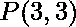
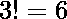

# 具有最大前缀数组 MEXs 和的数组的排列计数

> 原文:[https://www . geeksforgeeks . org/具有最大前缀和的数组排列计数/](https://www.geeksforgeeks.org/count-of-permutations-of-an-array-having-maximum-mexs-sum-of-prefix-arrays/)

给定一个大小为 **N** 的数组 arr，任务是找到它的置换数，使得它的前缀数组的 MEXs 之和最大。

**注:**整数集合的 MEX 定义为不属于该集合的最小非负整数。

**示例:**

> **输入:** arr[] = {1，0，1}
> **输出:** 2
> **解释:**
> 所有排列及其 MEX 如下:
> 【0，1，2】=>数组:{1，0，1}，MEX({1}) + MEX({1，0}) + MEX({1，0，1 })= 0+2+2 = 4
> 【0，2，1】 0}) = 0 + 0 + 2 = 2
> [1，0，2] = >数组:{0，1，1}，MEX({0}) + MEX({0，1}) + MEX({0，1，1}) = 1 + 2 + 2 = 5
> [1，2，0] = >数组:{0，1，1}，MEX({0}) + MEX({0，1}) + MEX({0，1}) 0}) = 0 + 0 + 2 = 2
> [2，1，0] = >数组:{1，0，1}，MEX({1}) + MEX({1，0}) + MEX({1，0，1}) = 0 + 2 + 2 = 4
> 因此最大和为 5，具有该和的排列数为 2。
> 
> **输入:** arr[] = {0，1，2，2，5，6 }
> T3】输出: 12

**进场:**

最优思想是基于这样的观察，即当所有不同的元素以递增的顺序排列并且重复出现在数组的末尾(如 0，1，2，3，…)时，前缀数组的 MEX 之和将是最大的。一旦这种连续性被打破，剩下的 MEX，在那之后保持不变。例如，在{0，1，2，2，5，6}中，前缀数组的 MEXs 是{1，2，3，3，3，3}，其中连续性在索引 3 处中断。

现在，要找到所有最大 MEXs 和的排列的计数，将元素的频率存储在一个映射中。在最大 MEX 前缀数组中，第一个位置总是被 0 填充，然后第二个被 1 填充，然后第三个被 2 填充，以此类推。因此，尝试用可用选项的数量来填充这些，一旦到达连续性中断的点，该点之后所有排列的 MEX 都是相同的，并且之后的元素可以以任何可能的排列排列。现在为了更好地理解它，假设数组中有 0 到 Y 个数字，然后连续性中断，之后有更多的 K 个元素。那么具有最大 MEXs 和的置换数是:

> **ans =频率[0] *频率[1] *频率[2] * … *频率[Y] *阶乘[K]**

现在，在{0，1，2，2，5，6}的情况下，具有其前缀数组的最大 MEXs 和的数组可以:

*   在索引 0 处仅包含 0，因此第一个索引的选项数为 1。
*   在索引 1 处只包含 1，所以这里的选择数是 1。
*   包含两个 2 中的任何一个，所以这里的选择数是 2。
*   在此之后，连续性中断，之后的元素可以按任何顺序排列:
    *   所以，这一点之后的选择总数为，即。
*   现在，所有排列的最终数字是。

按照以下步骤解决问题:

1.  声明一个地图 **mp** 来存储元素的频率。
2.  现在创建一个变量 **cnt** 来跟踪出现在一个元素右边的元素，并用 N 初始化它，即出现的元素总数。
3.  还要声明一个变量**和**来存储答案，并用 1 初始化。
4.  现在开始迭代从 0 到给定数组的大小，即从 i = 0 到 i < n:
    *   如果议员[我]！= 0，这意味着连续性将持续到这一点，所有可能的选择(即 mp[i])都将被考虑。因此，ans 将变为 **ans=ans*mp[i]** 并将 cnt 减少 1，以获得出现在下一个元素右侧的元素。
    *   如果 mp[i] == 0，这意味着这里的连续性中断，之后的元素可以排列成任何可能的排列。所以，这里打破了循环，考虑了这个点右边元素的所有可能排列，即 cnt 的阶乘。
5.  根据以上观察打印答案。

下面是上述方法的实现:

## C++

```
// C++ program for the above approach
#include <bits/stdc++.h>

using namespace std;

// To calculate the factorial
int factorial(int n)
{
    int res = 1, i;
    for (i = 2; i <= n; i++) {
        res *= i;
    }
    return res;
}

// To return the number of permutations of
// an array with maximum MEXs sum of prefix array
int countPermutations(int ar[], int n)
{

    // Map to store the frequency of each element
    unordered_map<int, int> mp;

    int ans = 1, cnt = n;

    for (int i = 0; i < n; i++) {
        mp[ar[i]]++;
    }

    // Running a loop from i=0 to i<n
    for (int i = 0; i < n; i++) {

        // If continuity breaks,
        // then break the loop
        if (mp[i] == 0) {
            break;
        }

        // Considering choices available to be
        // filled at this position, i.e. mp[i]
        ans = (ans * mp[i]);

        // Decrement the count of remaining
        // right elements
        cnt--;
    }

    // Adding all permutations of the
    // elements present to the right of
    // the point where continuity breaks.
    ans = ans * factorial(cnt);

    return ans;
}

// Driver Code
int main()
{
    int arr[] = { 1, 0, 1 };
    int N = sizeof(arr) / sizeof(arr[0]);
    cout << countPermutations(arr, N);
}
```

## Java 语言(一种计算机语言，尤用于创建网站)

```
// java program for the above approach
import java.util.*;
class GFG
{

// To calculate the factorial
static int factorial(int n)
{
    int res = 1, i;
    for (i = 2; i <= n; i++) {
        res *= i;
    }
    return res;
}

// To return the number of permutations of
// an array with maximum MEXs sum of prefix array
static int countPermutations(int[] ar, int n)
{

    // Map to store the frequency of each element
    Map<Integer, Integer> mp= new HashMap<Integer, Integer>();
    int ans = 1, cnt = n, i;

    for (i = 0; i < n; i++) {
        if (mp.containsKey(ar[i]))
        {
            mp.put(ar[i],mp.get(ar[i])+1);
        }
        else
        {
            mp.put(ar[i], 1);
        }
    }

    // Running a loop from i=0 to i<n
    for (i = 0; i < n; i++) {

        // If continuity breaks,
        // then break the loop
        if (! mp.containsKey(i)) {
            break;
        }

        // Considering choices available to be
        // filled at this position, i.e. mp[i]
        ans = (ans * mp.get(i));

        // Decrement the count of remaining
        // right elements
        cnt--;
    }

    // Adding all permutations of the
    // elements present to the right of
    // the point where continuity breaks.
    ans = ans * factorial(cnt);

    return ans;
}

// Driver Code
public static void main(String[] args)
{
    int[] arr = { 1, 0, 1 };
    int N = arr.length;
    System.out.print(countPermutations(arr, N));
}
}

// This code is contributed by amreshkumar3.
```

## 蟒蛇 3

```
# Python Program to implement
# the above approach

# To calculate the factorial
def factorial(n):
    res = 1
    for i in range(2, n + 1):
        res *= i
    return res

# To return the number of permutations of
# an array with maximum MEXs sum of prefix array
def countPermutations(ar, n):

    # Map to store the frequency of each element
    mp = dict()

    ans = 1
    cnt = n

    for i in range(n):

        if (ar[i] in mp):
            mp[ar[i]] += 1
        else:
            mp[ar[i]] = 1

    # Running a loop from i=0 to i<n
    for i in range(n):

        # If continuity breaks,
        # then break the loop
        if (i not in mp):
            break

        # Considering choices available to be
        # filled at this position, i.e. mp[i]
        ans = (ans * mp[i])

        # Decrement the count of remaining
        # right elements
        cnt -= 1

    # Adding all permutations of the
    # elements present to the right of
    # the point where continuity breaks.
    ans = ans * factorial(cnt)

    return ans

# Driver Code
arr = [1, 0, 1]
N = len(arr)
print(countPermutations(arr, N))

# This code is contributed by gfgking
```

## C#

```
// C# program for the above approach
using System;
using System.Collections.Generic;

public class GFG
{

// To calculate the factorial
static int factorial(int n)
{
    int res = 1, i;
    for (i = 2; i <= n; i++) {
        res *= i;
    }
    return res;
}

// To return the number of permutations of
// an array with maximum MEXs sum of prefix array
static int countPermutations(int[] ar, int n)
{

    // Map to store the frequency of each element
    Dictionary<int, int> mp = new Dictionary<int, int>();

    int ans = 1, cnt = n, i;

    for (i = 0; i < n; i++) {
        if (mp.ContainsKey(ar[i]))
        {
            mp[ar[i]] = mp[ar[i]] + 1;
        }
        else
        {
            mp.Add(ar[i], 1);
        }
    }

    // Running a loop from i=0 to i<n
    for (i = 0; i < n; i++) {

        // If continuity breaks,
        // then break the loop
        if (! mp.ContainsKey(i)) {
            break;
        }

        // Considering choices available to be
        // filled at this position, i.e. mp[i]
        ans = (ans * mp[i]);

        // Decrement the count of remaining
        // right elements
        cnt--;
    }

    // Adding all permutations of the
    // elements present to the right of
    // the point where continuity breaks.
    ans = ans * factorial(cnt);

    return ans;
}

// Driver Code
public static void Main(String[] args)
{
    int[] arr = { 1, 0, 1 };
    int N = arr.Length;
    Console.Write(countPermutations(arr, N));
}
}

// This code is contributed by code_hunt.
```

## java 描述语言

```
<script>
        // JavaScript Program to implement
        // the above approach

        // To calculate the factorial
        function factorial(n) {
            let res = 1, i;
            for (i = 2; i <= n; i++) {
                res *= i;
            }
            return res;
        }

        // To return the number of permutations of
        // an array with maximum MEXs sum of prefix array
        function countPermutations(ar, n) {

            // Map to store the frequency of each element
            let mp = new Map();

            let ans = 1, cnt = n;

            for (let i = 0; i < n; i++) {

                if (mp.has(ar[i])) {
                    mp.set(ar[i], mp.get(ar[i]) + 1)
                }
                else {
                    mp.set(ar[i], 1)
                }
            }

            // Running a loop from i=0 to i<n
            for (let i = 0; i < n; i++) {

                // If continuity breaks,
                // then break the loop
                if (!mp.has(i)) {
                    break;
                }

                // Considering choices available to be
                // filled at this position, i.e. mp[i]
                ans = (ans * mp.get(i));

                // Decrement the count of remaining
                // right elements
                cnt--;
            }

            // Adding all permutations of the
            // elements present to the right of
            // the point where continuity breaks.
            ans = ans * factorial(cnt);

            return ans;
        }

        // Driver Code
        let arr = [1, 0, 1];
        let N = arr.length
        document.write(countPermutations(arr, N));

// This code is contributed by Potta Lokesh
    </script>
```

**Output**

```
2
```

**时间复杂度:**O(N)
T3】辅助空间: O(1)