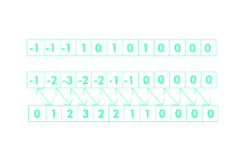

# 前缀和后缀和数组中可能数组的计数

> 原文:[https://www . geesforgeks . org/从前缀加和后缀加和数组计算可能的数组数量/](https://www.geeksforgeeks.org/count-of-possible-arrays-from-prefix-sum-and-suffix-sum-arrays/)

给定 **2*N** 个整数，它们是大小为 **N** 的数组的[前缀](https://www.geeksforgeeks.org/prefix-sum-array-implementation-applications-competitive-programming/)和后缀数组(以混洗的顺序)的元素，任务是找到可以由这些元素组成的大小为 **N** 的可能数组的数目

**示例:**

> **输入:** arr[] = {5，2，3，5}
> **输出:** 2
> **解释:**
> 第一个数组可以是:{2，3}
> 其前缀数组:{2，5}
> 其后缀数组:{5，3}
> 第二个数组可以是:{3，2}
> 其前缀数组:{3，5}
> 其后缀数组:{5，2}
> 
> **输入:** arr[] = {-1，-1，-1，0，1，0，1，0，1，0，0}
> **输出:** 80

**进场:**

*   可以得出的一个见解是，如果给定数组的所有元素之和除以 n+1，则分别获得前缀和后缀数组的最后一个和第一个元素。
*   这个结论可以通过观察前缀和后缀数组的元素得出。前缀数组的第一个元素和后缀数组的第二个元素之和等于前缀数组的第二个元素和后缀数组的第三个元素之和(如果后缀数组中有第三个元素)等等。
*   
    在图像中，第一个数组是给定数组，第二个是前缀数组，第三个是后缀数组。
*   这些对的总和等于要找到的数组的所有元素的总和。
*   如果假设对的和是 **s1** ，所有前缀和后缀元素的和是 **s** ，那么:
    T5】S1 *(n-1)+2 * S1 = s
    S1 = s/(n+1)
    其中 **s1** 是前缀数组的最后一个元素，也是后缀数组的第一个元素。
*   现在，需要找到总和等于 s1 的所有其他对，这可以使用哈希映射来完成。
*   如果这些对与数组一起线性混洗，那么我们可以得到的答案是
    (n-1)！/ (k1！* k2！… kr！)
    其中 k1，k2 … kr 为相似对的数量
*   每对也可以在前缀和后缀数组中相互交换(如果对的元素不相等)，那么答案就变成
    (n-1)！* (2^p) / (k1！*k2！…kr！)
    其中 p 是数组中和等于 s1 的不同对的个数。

下面是上述方法的实现。

## C++

```
// C++ implementation of the above approach
#include <bits/stdc++.h>
using namespace std;

// Function to find power of
// a number.
int power(int a, int b)
{
    int result = 1;
    while (b > 0) {
        if (b % 2 == 1) {
            result = result * a;
        }
        a = a * a;
        b = b / 2;
    }
    return result;
}

// Function to find
// factorial of a number.
int factorial(int n)
{
    int fact = 1;
    for (int i = 1; i <= n; i++) {
        fact = fact * i;
    }
    return fact;
}

// Function to print no of arrays
void findNoOfArrays(int* a, int n)
{
    // c variable counts the no of pairs
    int sum = 0, s1, c = 0;

    // Map to store the frequency
    // of each element
    map<int, int> mp;

    for (int i = 0; i < 2 * n; i++) {
        mp[a[i]]++;

        // Sum of all elements of the array
        sum = sum + a[i];
    }

    // Variable to check if it is
    // possible to make any array
    bool isArrayPossible = true;
    int ans = factorial(n - 1);

    // First element of suffix array
    // and the last element of prefix array
    s1 = sum / (n + 1);

    // Check if the element exists in the map
    if (mp[s1] >= 2) {
        mp[s1] = mp[s1] - 2;
    }
    else {
        isArrayPossible = false;
    }
    if (isArrayPossible) {
        for (auto i : mp) {

            // If elements of any pair are equal
            // and their frequency is not divisible by 2
            // update the isArrayPossible variable
            // to false and break through the loop

            if (i.first == s1 - i.first) {
                if (mp[i.first] % 2 != 0) {
                    isArrayPossible = false;
                    break;
                }
            }

            // If elements of any pair are not equal
            // and their frequency is not same
            // update the isArrayPossible variable
            // to false and break through the loop

            if (i.first != s1 - i.first) {
                if (mp[i.first]
                    != mp[s1 - i.first]) {
                    isArrayPossible = false;
                    break;
                }
            }
            // Check if frequency is greater than zero
            if (i.second > 0) {
                if (i.first != s1 - i.first) {
                    // update the count of pairs

                    c = c + i.second;

                    // Multiply the answer by
                    // 2^(frequency of pairs) since
                    // the elements of the pair are
                    // not the same in this condition

                    ans = ans * power(2, i.second);

                    // Divide the answer by the factorial
                    // of no of similar pairs

                    ans = ans / factorial(i.second);

                    // Make frequency of both these elements 0

                    mp[i.first] = 0;
                    mp[s1 - i.first] = 0;
                }
                if (i.first == s1 - i.first) {
                    // Update the count of pairs

                    c = c + i.second / 2;

                    // Divide the answer by the factorial
                    // of no. of similar pairs

                    ans = ans / factorial(i.second / 2);

                    // Make frequency of this element 0
                    mp[i.first] = 0;
                }
            }
        }
    }

    // Check if it is possible to make the
    // array and there are n-1 pairs
    // whose sum will be equal to s1
    if (c < n - 1 || isArrayPossible == false) {
        cout << "0" << endl;
    }
    else {
        cout << ans << endl;
    }
}

// Driver code
int main()
{
    int arr1[] = { 5, 2, 3, 5 };
    int n1 = sizeof(arr1) / sizeof(arr1[0]);

    // Function calling
    findNoOfArrays(arr1, n1 / 2);

    int arr2[] = { -1, -1, -1, 0, 1, 0,
                   1, 0, 1, 0, 0, 0 };
    int n2 = sizeof(arr2) / sizeof(arr2[0]);
    findNoOfArrays(arr2, n2 / 2);
    return 0;
}
```

## Java 语言(一种计算机语言，尤用于创建网站)

```
// Java implementation of the above approach
import java.util.*;

class GFG{

// Function to find power of
// a number.
static int power(int a, int b)
{
    int result = 1;
    while (b > 0) {
        if (b % 2 == 1) {
            result = result * a;
        }
        a = a * a;
        b = b / 2;
    }
    return result;
}

// Function to find
// factorial of a number.
static int factorial(int n)
{
    int fact = 1;
    for (int i = 1; i <= n; i++) {
        fact = fact * i;
    }
    return fact;
}

// Function to print no of arrays
static void findNoOfArrays(int[] a, int n)
{
    // c variable counts the no of pairs
    int sum = 0, s1, c = 0;

    // Map to store the frequency
    // of each element
    HashMap<Integer,Integer> mp = new HashMap<Integer,Integer>();         

    for (int i = 0; i < 2 * n; i++) {
        if(mp.get(a[i])==null)
          mp.put(a[i], 1);
        else
          mp.put(a[i], mp.get(a[i]) + 1);

        // Sum of all elements of the array
        sum = sum + a[i];
    }

    // Variable to check if it is
    // possible to make any array
    boolean isArrayPossible = true;
    int ans = factorial(n - 1);

    // First element of suffix array
    // and the last element of prefix array
    s1 = sum / (n + 1);

    // Check if the element exists in the map
    if (mp.get(s1) >= 2) {
        mp.replace(s1, mp.get(s1) - 2); 
    }
    else {
        isArrayPossible = false;
    }
    if (isArrayPossible) {
        for (Map.Entry<Integer,Integer> m:mp.entrySet()) {

            // If elements of any pair are equal
            // and their frequency is not divisible by 2
            // update the isArrayPossible variable
            // to false and break through the loop

            if (m.getKey() == s1-m.getKey()) {
                if (mp.get(m.getKey()) % 2 != 0) {
                    isArrayPossible = false;
                    break;
                }
            }

            // If elements of any pair are not equal
            // and their frequency is not same
            // update the isArrayPossible variable
            // to false and break through the loop

            if (m.getKey() != s1 - m.getKey()) {
                if (mp.get(m.getKey())
                    != mp.get(s1 - m.getKey())) {
                    isArrayPossible = false;
                    break;
                }
            }
            // Check if frequency is greater than zero
            if (m.getValue() > 0) {
                if (m.getKey() != s1 - m.getKey()) {
                    // update the count of pairs

                    c = c + m.getValue();

                    // Multiply the answer by
                    // 2^(frequency of pairs) since
                    // the elements of the pair are
                    // not the same in this condition
                    ans = ans * power(2, m.getValue());

                    // Divide the answer by the factorial
                    // of no of similar pairs
                    ans = ans / factorial(m.getValue());

                    // Make frequency of both these elements 0
                    mp.replace(m.getKey(),0);
                    mp.replace(s1 - m.getKey(),0);
                }
                if (m.getKey() == s1 - m.getKey()) {
                    // Update the count of pairs

                    c = c + m.getValue() / 2;

                    // Divide the answer by the factorial
                    // of no. of similar pairs
                    ans = ans / factorial(m.getValue() / 2);

                    // Make frequency of this element 0
                    mp.replace(m.getKey(),0);
                }
            }
        }
    }

    // Check if it is possible to make the
    // array and there are n-1 pairs
    // whose sum will be equal to s1
    if (c < n - 1 && isArrayPossible == false) {
        System.out.println("0");
    }
    else {
        System.out.println(ans);
    }
}

// Driver code
public static void main(String args[])
{
    int[] arr1 = { 5, 2, 3, 5 };
    int n1 = arr1.length;

    // Function calling
    findNoOfArrays(arr1, n1 / 2);

    int []arr2 = { -1, -1, -1, 0, 1, 0,
                1, 0, 1, 0, 0, 0 };
    int n2 = arr2.length;
    findNoOfArrays(arr2, n2 / 2);
}
}

// This code is contributed by Surendra_Gangwar
```

## 蟒蛇 3

```
# Python3 implementation of the above approach 

# Function to find power of 
# a number. 
def power(a, b) :

    result = 1; 
    while (b > 0) :
        if (b % 2 == 1) : 
            result = result * a; 
        a = a * a; 
        b = b // 2; 

    return result; 

# Function to find 
# factorial of a number. 
def factorial(n) : 

    fact = 1; 
    for i in range(1, n + 1) :
        fact = fact * i; 

    return fact; 

# Function to print no of arrays 
def findNoOfArrays(a, n) :

    # c variable counts the no of pairs 
    sum = 0; c = 0; 

    # Map to store the frequency 
    # of each element 
    mp = dict.fromkeys(a, 0); 

    for i in range(2 * n) :
        mp[a[i]] += 1; 

        # Sum of all elements of the array 
        sum = sum + a[i];

    # Variable to check if it is 
    # possible to make any array 
    isArrayPossible = True; 
    ans = factorial(n - 1); 

    # First element of suffix array 
    # and the last element of prefix array 
    s1 = sum // (n + 1); 

    # Check if the element exists in the map 
    if (mp[s1] >= 2) :
        mp[s1] = mp[s1] - 2; 

    else :
        isArrayPossible = False; 

    if (isArrayPossible) : 
        for first,second in mp.items() : 

            # If elements of any pair are equal 
            # and their frequency is not divisible by 2 
            # update the isArrayPossible variable 
            # to false and break through the loop 
            if (first == s1 - first) :
                if (mp[first] % 2 != 0) :
                    isArrayPossible = False;
                    break; 

            # If elements of any pair are not equal 
            # and their frequency is not same 
            # update the isArrayPossible variable 
            # to false and break through the loop 
            if (first != s1 - first) :
                if s1 - first in mp :
                    if (mp[first] != mp[s1 - first]) :
                        isArrayPossible = False;
                        break; 

            # Check if frequency is greater than zero 
            if (second > 0) :
                if (first != s1 - first) :

                    # update the count of pairs 
                    c = c + second; 

                    # Multiply the answer by 
                    # 2^(frequency of pairs) since 
                    # the elements of the pair are 
                    # not the same in this condition 
                    ans = ans * power(2, second); 

                    # Divide the answer by the factorial 
                    # of no of similar pairs 
                    ans = ans / factorial(second); 

                    # Make frequency of both these elements 0 
                    mp[first] = 0; 
                    mp[s1 - first] = 0; 

                if (first == s1 - first) : 

                    # Update the count of pairs 
                    c = c + second // 2; 

                    # Divide the answer by the factorial 
                    # of no. of similar pairs 
                    ans = ans // factorial(second // 2); 

                    # Make frequency of this element 0 
                    mp[first] = 0; 

    # Check if it is possible to make the 
    # array and there are n-1 pairs 
    # whose sum will be equal to s1 
    if (c < n - 1 or isArrayPossible == False) :
        print("0"); 
    else: 
        print(ans); 

# Driver code 
if __name__ == "__main__" : 

    arr1 = [ 5, 2, 3, 5 ]; 
    n1 = len(arr1); 

    # Function calling 
    findNoOfArrays(arr1, n1 // 2); 

    arr2 = [ -1, -1, -1, 0, 1, 0, 
                1, 0, 1, 0, 0, 0 ]; 
    n2 = len(arr2); 
    findNoOfArrays(arr2, n2 // 2); 

# This code is contributed by AnkitRai01
```

**Output:**

```
2
80

```

**时间复杂度:** O(N Log(N))