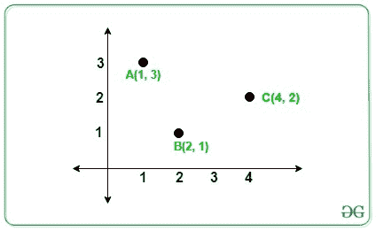
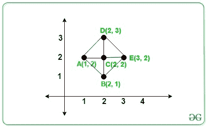

# 由给定的 N 个基点或垂线平行于 X 轴或 Y 轴形成的直角三角形的计数

> 原文:[https://www . geeksforgeeks . org/由给定 n 个点形成的直角三角形的数量，这些点的底部或垂直方向平行于 x 轴或 y 轴/](https://www.geeksforgeeks.org/count-of-right-angled-triangle-formed-from-given-n-points-whose-base-or-perpendicular-are-parallel-to-x-or-y-axis/)

在 **2D** 平面上给定 **N** 个不同整数点的[数组](https://www.geeksforgeeks.org/introduction-to-arrays/) **arr[]** 。任务是从 **N** 点开始数[直角三角形](https://www.geeksforgeeks.org/find-sides-right-angled-triangle-given-hypotenuse-area/)的个数，使底边或垂线平行于 **X** 或 **Y 轴**。

**示例:**

> **输入:** arr[][] = {{4，2}，{2，1}，{1，3}}
> **输出:** 0
> **解释:**
> 
> [](https://media.geeksforgeeks.org/wp-content/cdn-uploads/20200824162142/rightAngledTriangle.jpg)
> 
> 在上图中，没有形成直角三角形。
> **输入:** arr[][] = {{1，2}，{2，1}，{2，2}，{2，3}，{3，2}}
> **输出:** 4
> **解释:**
> 
> [](https://media.geeksforgeeks.org/wp-content/cdn-uploads/20200826182113/rightAngledTriangleExample2-1.jpg)
> 
> 上图中有 4 个直角三角形由三角形 **ACB、ACD、DCE、BCE** 组成。

**方法:**想法是分别存储具有相同 **X** 和 **Y** 坐标的每个坐标的计数。现在遍历每个给定点，由每个坐标(X，Y)形成的直角三角形的计数由下式给出:

> **直角三角形的计数=(X 坐标-1 的频率)***(Y 坐标-1 的频率)

**以下是步骤:**

*   **创建两个[地图](https://www.geeksforgeeks.org/map-associative-containers-the-c-standard-template-library-stl/)来存储点数，一个具有相同的 **X 坐标**，另一个具有相同的 **Y 坐标**。**
*   **对于 **x 坐标**的地图和 **y 坐标**的地图中的每个值，选择该对点作为枢轴元素，并找到该枢轴元素的频率。**
*   **对于上一步中的每个枢轴元素(比如**枢轴**，直角的计数由下式给出:**

> **(m1[pivot]。秒-1)*(m2[枢轴]。秒-1)**

*   **同样，计算其他 **N** 点的**总可能** [**直角三角形**](https://www.geeksforgeeks.org/check-whether-right-angled-triangle-valid-not-large-sides/) 。**
*   **最后，**将得到的所有可能的**三角形相加，即为最终答案。**

**下面是上述方法的实现:**

## **C++**

```
// C++ program for the above approach

#include <bits/stdc++.h>
using namespace std;

// Function to find the number of right
// angled triangle that are formed from
// given N points whose perpendicular or
// base is parallel to X or Y axis
int RightAngled(int a[][2], int n)
{

    // To store the number of points
    // has same x or y coordinates
    unordered_map<int, int> xpoints;
    unordered_map<int, int> ypoints;

    for (int i = 0; i < n; i++) {
        xpoints[a[i][0]]++;
        ypoints[a[i][1]]++;
    }

    // Store the total count of triangle
    int count = 0;

    // Iterate to check for total number
    // of possible triangle
    for (int i = 0; i < n; i++) {

        if (xpoints[a[i][0]] >= 1
            && ypoints[a[i][1]] >= 1) {

            // Add the count of triangles
            // formed
            count += (xpoints[a[i][0]] - 1)
                     * (ypoints[a[i][1]] - 1);
        }
    }

    // Total possible triangle
    return count;
}

// Driver Code
int main()
{
    int N = 5;

    // Given N points
    int arr[][2] = { { 1, 2 }, { 2, 1 },
                     { 2, 2 }, { 2, 3 },
                     { 3, 2 } };

    // Function Call
    cout << RightAngled(arr, N);

    return 0;
}
```

## **蟒蛇 3**

```
# Python3 program for the above approach
from collections import defaultdict

# Function to find the number of right
# angled triangle that are formed from
# given N points whose perpendicular or
# base is parallel to X or Y axis
def RightAngled(a, n):

    # To store the number of points
    # has same x or y coordinates
    xpoints = defaultdict(lambda:0)
    ypoints = defaultdict(lambda:0)

    for i in range(n):
        xpoints[a[i][0]] += 1
        ypoints[a[i][1]] += 1

    # Store the total count of triangle
    count = 0

    # Iterate to check for total number
    # of possible triangle
    for i in range(n):
        if (xpoints[a[i][0]] >= 1 and
            ypoints[a[i][1]] >= 1):

            # Add the count of triangles
            # formed
            count += ((xpoints[a[i][0]] - 1) *
                      (ypoints[a[i][1]] - 1))

    # Total possible triangle
    return count

# Driver Code
N = 5

# Given N points
arr = [ [ 1, 2 ], [ 2, 1 ],
        [ 2, 2 ], [ 2, 3 ],
        [ 3, 2 ] ]

# Function call
print(RightAngled(arr, N))

# This code is contributed by Stuti Pathak
```

## **Java 语言(一种计算机语言，尤用于创建网站)**

```
// Java program for the above approach
import java.util.*;
class GFG{

// Function to find the number of right
// angled triangle that are formed from
// given N points whose perpendicular or
// base is parallel to X or Y axis
static int RightAngled(int a[][], int n)
{

    // To store the number of points
    // has same x or y coordinates
    HashMap<Integer,
              Integer> xpoints  = new HashMap<Integer,
                                              Integer>();
    HashMap<Integer,
            Integer> ypoints  = new HashMap<Integer,
                                              Integer>();

    for (int i = 0; i < n; i++)
    {
        if(xpoints.containsKey(a[i][0]))
        {
            xpoints.put(a[i][0], xpoints.get(a[i][0]) + 1);
        }
        else
        {
            xpoints.put(a[i][0], 1);
        }
        if(ypoints.containsKey(a[i][1]))
        {
            ypoints.put(a[i][1], ypoints.get(a[i][1]) + 1);
        }
        else
        {
            ypoints.put(a[i][1], 1);
        }
    }

    // Store the total count of triangle
    int count = 0;

    // Iterate to check for total number
    // of possible triangle
    for (int i = 0; i < n; i++)
    {
        if (xpoints.get(a[i][0]) >= 1 &&
            ypoints.get(a[i][1]) >= 1)
        {

            // Add the count of triangles
            // formed
            count += (xpoints.get(a[i][0]) - 1) *
                     (ypoints.get(a[i][1]) - 1);
        }
    }

    // Total possible triangle
    return count;
}

// Driver Code
public static void main(String[] args)
{
    int N = 5;

    // Given N points
    int arr[][] = { { 1, 2 }, { 2, 1 },
                    { 2, 2 }, { 2, 3 },
                    { 3, 2 } };

    // Function Call
    System.out.print(RightAngled(arr, N));
}
}

// This code is contributed by Rajput-Ji
```

## **C#**

```
// C# program for the above approach
using System;
using System.Collections.Generic;
class GFG{

    // Function to find the number of right
    // angled triangle that are formed from
    // given N points whose perpendicular or
    // base is parallel to X or Y axis
    static int RightAngled(int[, ] a, int n)
    {

        // To store the number of points
        // has same x or y coordinates
        Dictionary<int, int> xpoints = new Dictionary<int, int>();
        Dictionary<int, int> ypoints = new Dictionary<int, int>();

        for (int i = 0; i < n; i++)
        {
            if (xpoints.ContainsKey(a[i, 0]))
            {
                xpoints[a[i, 0]] = xpoints[a[i, 0]] + 1;
            }
            else
            {
                xpoints.Add(a[i, 0], 1);
            }
            if (ypoints.ContainsKey(a[i, 1]))
            {
                ypoints[a[i, 1]] = ypoints[a[i, 1]] + 1;
            }
            else
            {
                ypoints.Add(a[i, 1], 1);
            }
        }

        // Store the total count of triangle
        int count = 0;

        // Iterate to check for total number
        // of possible triangle
        for (int i = 0; i < n; i++)
        {
            if (xpoints[a[i, 0]] >= 1 &&
                ypoints[a[i, 1]] >= 1)
            {

                // Add the count of triangles
                // formed
                count += (xpoints[a[i, 0]] - 1) *
                         (ypoints[a[i, 1]] - 1);
            }
        }

        // Total possible triangle
        return count;
    }

    // Driver Code
    public static void Main(String[] args)
    {
        int N = 5;

        // Given N points
        int[, ] arr = {{1, 2}, {2, 1},
                       {2, 2}, {2, 3}, {3, 2}};

        // Function Call
        Console.Write(RightAngled(arr, N));
    }
}

// This code is contributed by Rajput-Ji
```

## **java 描述语言**

```
<script>

      // JavaScript program for the above approach

      // Function to find the number of right
      // angled triangle that are formed from
      // given N points whose perpendicular or
      // base is parallel to X or Y axis
      function RightAngled(a, n) {
        // To store the number of points
        // has same x or y coordinates
        var xpoints = {};
        var ypoints = {};

        for (var i = 0; i < n; i++) {
          if (xpoints.hasOwnProperty(a[i][0])) {
            xpoints[a[i][0]] = xpoints[a[i][0]] + 1;
          } else {
            xpoints[a[i][0]] = 1;
          }
          if (ypoints.hasOwnProperty(a[i][1])) {
            ypoints[a[i][1]] = ypoints[a[i][1]] + 1;
          } else {
            ypoints[a[i][1]] = 1;
          }
        }

        // Store the total count of triangle
        var count = 0;

        // Iterate to check for total number
        // of possible triangle
        for (var i = 0; i < n; i++) {
          if (xpoints[a[i][0]] >= 1 && ypoints[a[i][1]] >= 1) {
            // Add the count of triangles
            // formed
            count += (xpoints[a[i][0]] - 1) * (ypoints[a[i][1]] - 1);
          }
        }

        // Total possible triangle
        return count;
      }

      // Driver Code
      var N = 5;

      // Given N points
      var arr = [
        [1, 2],
        [2, 1],
        [2, 2],
        [2, 3],
        [3, 2],
      ];

      // Function Call
      document.write(RightAngled(arr, N));

</script>
```

****Output:** 

```
4
```** 

*****时间复杂度:**O(N)*
T5**辅助空间:** O(1)**