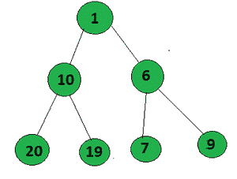

# 形成 AP 的二叉树中根到叶路径的计数

> 原文:[https://www . geeksforgeeks . org/形成 ap 的二叉树中根到叶路径的计数/](https://www.geeksforgeeks.org/count-of-root-to-leaf-paths-in-a-binary-tree-that-form-an-ap/)

给定一棵 [**二叉树，**](https://www.geeksforgeeks.org/binary-tree-data-structure/) 的任务是**计算**从**根**到**叶**的所有路径，形成一个[等差数列](https://www.geeksforgeeks.org/arithmetic-progression/)。

**示例:**

> **输入:**
> 
> [](https://media.geeksforgeeks.org/wp-content/uploads/20200709233314/Untitled-300x227.png)
> 
> **输出:** 2
> **解释:**
> 在给定的树中从根到叶形成 AP 的路径是:
> 
> *   1->3->5(普通差 2)
> *   1->6->11
> 
> **输入:**
> 
> [](https://media.geeksforgeeks.org/wp-content/uploads/20200709235422/Untitled-300x227.png)
> 
> **输出:** 1
> **解释:**
> 在给定的树中从根到叶形成 AP 的路径是 1- > 10- > 19(带差 9 的 AP)

**方法:**使用 [**前序遍历**](https://www.geeksforgeeks.org/tree-traversals-inorder-preorder-and-postorder/) 可以解决问题。按照以下步骤解决问题:

*   在给定的二叉树上执行**前序遍历**。
*   初始化一个数组 **arr[]** 来存储路径。
*   初始化**计数= 0，**以存储形成**接入点**的路径计数
*   到达叶节点后，检查数组中的当前元素(即从根到叶路径的节点值)是否形成 **A.P.** 。
    *   如果是，增加计数
    *   完成树的遍历后，打印**计数。**

下面是上述方法的实现:

## C++

```
// C++ implementation to count
// the path which forms an A.P.
#include <bits/stdc++.h>
using namespace std;

int count = 0;

// Node structure
struct Node {
    int val;
    // left and right child of the node
    Node *left, *right;
    // initialization constructor
    Node(int x)
    {
        val = x;
        left = NULL;
        right = NULL;
    }
};

// Function to check if path
// format A.P. or not
bool check(vector<int> arr)
{

    if (arr.size() == 1)
        return true;

    // if size of arr is greater than 2
    int d = arr[1] - arr[0];

    for (int i = 2; i < arr.size(); i++) {
        if (arr[i] - arr[i - 1] != d)
            return false;
    }

    return true;
}

// Function to find the maximum
// setbits sum from root to leaf
int countAP(Node* root, vector<int> arr)
{
    if (!root)
        return 0;

    arr.push_back(root->val);

    // If the node is a leaf node
    if (root->left == NULL
        && root->right == NULL) {
        if (check(arr))
            return 1;
        return 0;
    }

    // Traverse left subtree
    int x = countAP(root->left, arr);

    // Traverse the right subtree
    int y = countAP(root->right, arr);

    return x + y;
}

// Driver Code
int main()
{
    Node* root = new Node(1);
    root->left = new Node(3);
    root->right = new Node(6);
    root->left->left = new Node(5);
    root->left->right = new Node(7);
    root->right->left = new Node(11);
    root->right->right = new Node(23);

    cout << countAP(root, {});

    return 0;
}
```

## Java 语言(一种计算机语言，尤用于创建网站)

```
// Java implementation to count
// the path which forms an A.P.
import java.util.*;

class GFG{

int count = 0;

// Node structure
static class Node
{
    int val;

    // left and right child of the node
    Node left, right;

    // Initialization constructor
    Node(int x)
    {
        val = x;
        left = null;
        right = null;
    }
};

// Function to check if path
// format A.P. or not
static boolean check(Vector<Integer> arr)
{
    if (arr.size() == 1)
        return true;

    // If size of arr is greater than 2
    int d = arr.get(1) - arr.get(0);

    for(int i = 2; i < arr.size(); i++)
    {
        if (arr.get(i) - arr.get(i - 1) != d)
            return false;
    }
    return true;
}

// Function to find the maximum
// setbits sum from root to leaf
static int countAP(Node root,
                   Vector<Integer> arr)
{
    if (root == null)
        return 0;

    arr.add(root.val);

    // If the node is a leaf node
    if (root.left == null &&
        root.right == null)
    {
        if (check(arr))
            return 1;
        return 0;
    }

    // Traverse left subtree
    int x = countAP(root.left, arr);

    // Traverse the right subtree
    int y = countAP(root.right, arr);

    return x + y;
}

// Driver Code
public static void main(String[] args)
{
    Node root = new Node(1);
    root.left = new Node(3);
    root.right = new Node(6);
    root.left.left = new Node(5);
    root.left.right = new Node(7);
    root.right.left = new Node(11);
    root.right.right = new Node(23);

    System.out.print(countAP(root, new Vector<Integer>()));
}
}

// This code is contributed by gauravrajput1
```

## 蟒蛇 3

```
# Python3 implementation to count
# the path which forms an A.P.

# Node structure
class Node:
    def __init__(self, x):

        self.val = x
        self.left = None
        self.right = None

# Function to check if path
# format A.P. or not
def check(arr):

    if len(arr) == 1:
        return True

    # If size of arr is greater than 2
    d = arr[1] - arr[0]

    for i in range(2, len(arr)):
        if arr[i] - arr[i - 1] != d:
            return False

    return True

# Function to find the maximum
# setbits sum from root to leaf
def countAP(root, arr):

    if not root:
        return 0

    arr.append(root.val)

    # If the node is a leaf node
    if (root.left == None and
        root.right == None):
        if check(arr):
            return 1
        return 0

    # Traverse the left subtree
    x = countAP(root.left, arr)

    # Traverse the right subtree
    y = countAP(root.right, arr)

    return x + y

# Driver code
root = Node(1)
root.left = Node(3)
root.right = Node(6)
root.left.left = Node(5)
root.left.right = Node(7)
root.right.left = Node(11)
root.right.right = Node(23)

print(countAP(root, []))

# This code is contributed by stutipathak31jan
```

## C#

```
// C# implementation to count
// the path which forms an A.P.
using System;
using System.Collections.Generic;

class GFG{

//int count = 0;

// Node structure
class Node
{
    public int val;

    // left and right child of the node
    public Node left, right;

    // Initialization constructor
    public Node(int x)
    {
        val = x;
        left = null;
        right = null;
    }
};

// Function to check if path
// format A.P. or not
static bool check(List<int> arr)
{
    if (arr.Count == 1)
        return true;

    // If size of arr is greater than 2
    int d = arr[1] - arr[0];

    for(int i = 2; i < arr.Count; i++)
    {
        if (arr[i] - arr[i - 1] != d)
            return false;
    }
    return true;
}

// Function to find the maximum
// setbits sum from root to leaf
static int countAP(Node root,
                   List<int> arr)
{
    if (root == null)
        return 0;

    arr.Add(root.val);

    // If the node is a leaf node
    if (root.left == null &&
       root.right == null)
    {
        if (check(arr))
            return 1;
        return 0;
    }

    // Traverse left subtree
    int x = countAP(root.left, arr);

    // Traverse the right subtree
    int y = countAP(root.right, arr);

    return x + y;
}

// Driver Code
public static void Main(String[] args)
{
    Node root = new Node(1);
    root.left = new Node(3);
    root.right = new Node(6);
    root.left.left = new Node(5);
    root.left.right = new Node(7);
    root.right.left = new Node(11);
    root.right.right = new Node(23);

    Console.Write(countAP(root, new List<int>()));
}
}

// This code is contributed by amal kumar choubey
```

## java 描述语言

```
<script>

// JavaScript implementation to count
// the path which forms an A.P.
let count = 0;

// Node structure
class Node
{

    // Initialize constructor
    constructor(x)
    {
        this.val = x;
        this.left = null;
        this.right = null;
    }
}

var root;

// Function to check if path
// format A.P. or not
function check(arr)
{
    if (arr.length == 1)
        return true;

    // If size of arr is greater than 2
    let d = arr[1] - arr[0];

    for(let i = 2; i < arr.length; i++)
    {
        if (arr[i] - arr[i - 1] != d)
            return false;
    }
    return true;
}

// Function to find the maximum
// setbits sum from root to leaf
function countAP(root, arr)
{
    if (!root)
        return 0;

    arr.push(root.val);

    // If the node is a leaf node
    if (root.left == null &&
       root.right == null)
    {
        if (check(arr))
            return 1;
        return 0;
    }

    // Traverse left subtree
    let x = countAP(root.left, arr);

    // Traverse the right subtree
    let y = countAP(root.right, arr);

    return x + y;
}

// Driver Code
root = new Node(1);
root.left = new Node(3);
root.right = new Node(6);
root.left.left = new Node(5);
root.left.right = new Node(7);
root.right.left = new Node(11);
root.right.right = new Node(23);

let arr = [];
document.write(countAP(root, arr));

// This code is contributed by Dharanendra L V.

</script>
```

**输出:**

```
2
```

***时间复杂度:** O(N)*
***辅助空间:** O(h)，其中 h 为二叉树的高度。*