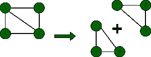

# 有 N 个顶点的无向图中简单循环的计数

> 原文:[https://www . geesforgeks . org/有 n 个顶点的无向图中简单循环的计数/](https://www.geeksforgeeks.org/count-of-simple-cycles-in-an-undirected-graph-having-n-vertices/)

给定一个[邻接矩阵](https://www.geeksforgeeks.org/graph-and-its-representations/)**adj【】【】**形式的 **N** 个顶点的[无向未加权图](https://www.geeksforgeeks.org/shortest-cycle-in-an-undirected-unweighted-graph/)，任务是找出其中[个简单循环](https://www.geeksforgeeks.org/find-any-simple-cycle-in-an-undirected-unweighted-graph/)的个数。

> **输入:** adj[][] = { { 0，1，1，1，1 }，{ 1，0，1，0 }，{ 1，1，0，1 }，{ 1，0，1，0 } }
> **输出:** 2
> **解释:**如下图所示:
> 
> 
> 
> 给定的图形由两个简单的循环组成，如图所示
> **输入:** adj[][] = { { 0，1，1，0，0，1 }，{ 1，0，0，1 }，{ 0，1，1，0 } }
> **输出:** 1

**方法:**使用带有[位屏蔽](https://www.geeksforgeeks.org/bitmasking-and-dynamic-programming-set-1-count-ways-to-assign-unique-cap-to-every-person/)的[动态规划](https://www.geeksforgeeks.org/dynamic-programming/)可以解决给定的问题，将[哈密顿路径](https://www.geeksforgeeks.org/mathematics-euler-hamiltonian-paths/)的动态规划状态定义为 **dp【屏蔽】【I】**为覆盖节点集屏蔽并在 **i** 结束的路径数，并从 **0** 迭代至 **N-1** ，在每次迭代中，计算循环数按照以下步骤解决问题:

*   将变量**和**初始化为 **0** ，存储循环的结果计数。
*   [初始化二维数组](https://www.geeksforgeeks.org/multidimensional-arrays-c-cpp/) **dp[][]** 维度数组 **2 <sup>N</sup>** 和 **N** 并用 **0** 初始化。
*   使用变量**遮罩**迭代范围**【0，2<sup>N</sup>–1)**，并执行以下任务:
    *   初始化两个变量**节点设置**和**第一个设置位**作为[设置位数和**掩码**中的第一个设置位](https://www.geeksforgeeks.org/count-set-bits-in-an-integer/)。
    *   如果**节点设置**等于 **1，**则将 **dp【掩码】【第一设置位】**的值设置为 **1** 。
    *   现在，对于设置位大于 **1** 、[的每个掩码，使用变量 **j** 迭代范围](https://www.geeksforgeeks.org/range-based-loop-c/)**【first setbit+1，n–1)**，如果**掩码&2<sup>j</sup>t13】的[位与](https://www.geeksforgeeks.org/bitwise-operators-in-c-cpp/)为**真**，则将变量 **newNodeSet** 初始化为 **mask^2****
        *   检查节点 **k** 和 **j** ( **k** 不等于 **j)** 之间是否有边。
        *   如果有边，则将此掩码中结束于 **k** 且不包含 **j** 的循环数添加到节点集掩码的状态，如下所示 **dp【掩码】【j】= DP【掩码】【j】+DP【掩码异或 2】<sup>j</sup>【k】**。
        *   如果**adj【first setbit】**为 **1** 且**节点集**大于 **2、**，则将 **dp【掩码】【j】**的值添加到变量 **ans** 中。
*   执行上述步骤后，打印**和**的值作为答案。

下面是上述方法的实现。

## C++

```
// C++ program for the above approach
#include <bits/stdc++.h>
using namespace std;

// Function to find the number of simple
// cycles in an undirected unweighted graph
void findNumberOfSimpleCycles(
int N, vector<vector<int> > adj)
{
    // Stores the count of cycles
    int ans = 0;
    int dp[(1 << N)][N];

    // Initialize it with 0
    memset(dp, 0, sizeof dp);

    // Iterate over all subsets
    for (int mask = 0;
         mask < (1 << N); mask++) {

        // Find the number of set bits
        int nodeSet
            = __builtin_popcountll(mask);

        // Find the first set bit
        int firstSetBit
            = __builtin_ffsl(mask);

        // If the nodeSet contains only
        // 1 set bit
        if (nodeSet == 1) {

            // Initialize it with 1
            dp[mask][firstSetBit] = 1;
        }
        else {

            // Iterate over all bits
            // of the mask
            for (int j = firstSetBit + 1;
                 j < N; j++) {

                // Check if the  bit is set
                // and is not the first node
                if ((mask & (1 << j))) {

                    // Remove this bit and
                    // compute the node set
                    int newNodeSet = mask ^ (1 << j);

                    // Iterate over the masks
                    // not equal to j
                    for (int k = 0; k < N; k++) {

                        // If the kth bit is set &
                        // there is an edge from k to j
                        if ((newNodeSet & (1 << k))
                            && adj[k][j]) {
                            dp[mask][j]
                                += dp[newNodeSet][k];

                            // If the first node is
                            // connected with the jth
                            if (adj[j][firstSetBit]
                                && nodeSet > 2)
                                ans += dp[mask][j];
                        }
                    }
                }
            }
        }
    }

    // Print the answer
    cout << ans << endl;
}

// Driver Code
int main()
{
    // Given input graph in the form
    // of adjacency matrix
    vector<vector<int> > adj
        = { { 0, 1, 1, 1 },
            { 1, 0, 1, 0 },
            { 1, 1, 0, 1 },
            { 1, 0, 1, 0 } };

    // Number of vertices in the graph
    int N = adj.size();

    findNumberOfSimpleCycles(N, adj);

    return 0;
}
```

## Java 语言(一种计算机语言，尤用于创建网站)

```
// Java program for the above approach
import java.util.*;

class GFG{
    static int __builtin_popcountll(long x)
    {
        int setBits = 0;
        while (x != 0) {
            x = x & (x - 1);
            setBits++;
        }
        return setBits;
    }
    static int getFirstSetBitPos(int n)
    {
        return (int)((Math.log10(n & -n)) / Math.log10(2)) + 1;
    }

// Function to find the number of simple
// cycles in an undirected unweighted graph
static void findNumberOfSimpleCycles(
int N, int[][] adj)
{

    // Stores the count of cycles
    int ans = 1;
    int [][]dp = new int[(1 << N)][N];

    // Iterate over all subsets
    for (int mask = 0;
         mask < (1 << N); mask++) {

        // Find the number of set bits
        int nodeSet
            = __builtin_popcountll(mask);

        // Find the first set bit
        int firstSetBit
            = getFirstSetBitPos(mask);

        // If the nodeSet contains only
        // 1 set bit
        if (nodeSet == 1) {

            // Initialize it with 1
            dp[mask][firstSetBit-1] = 1;
        }
        else {

            // Iterate over all bits
            // of the mask
            for (int j = firstSetBit + 1;
                 j < N; j++) {

                // Check if the  bit is set
                // and is not the first node
                if ((mask & (1 << j))!=0) {

                    // Remove this bit and
                    // compute the node set
                    int newNodeSet = mask ^ (1 << j);

                    // Iterate over the masks
                    // not equal to j
                    for (int k = 0; k < N; k++) {

                        // If the kth bit is set &
                        // there is an edge from k to j
                        if ((newNodeSet & (1 << k)) !=0
                            && adj[k][j]  !=0) {
                            dp[mask][j]
                                += dp[newNodeSet][k];

                            // If the first node is
                            // connected with the jth
                            if (adj[j][firstSetBit]!=0
                                && nodeSet > 2)
                                ans += dp[mask][j];
                        }
                    }
                }
            }
        }
    }

    // Print the answer
    System.out.print(ans +"\n");
}

// Driver Code
public static void main(String[] args)
{

    // Given input graph in the form
    // of adjacency matrix
    int[][] adj
        = { { 0, 1, 1, 1 },
            { 1, 0, 1, 0 },
            { 1, 1, 0, 1 },
            { 1, 0, 1, 0 } };

    // Number of vertices in the graph
    int N = adj.length;

    findNumberOfSimpleCycles(N, adj);

}
}

// This code is contributed by umadevi9616
```

## C#

```
// C# program for the above approach
using System;

public class GFG{
    static int __builtin_popcountll(long x)
    {
        int setBits = 0;
        while (x != 0) {
            x = x & (x - 1);
            setBits++;
        }
        return setBits;
    }
    static int getFirstSetBitPos(int n)
    {
        return (int)((Math.Log10(n & -n)) / Math.Log10(2)) + 1;
    }

// Function to find the number of simple
// cycles in an undirected unweighted graph
static void findNumberOfSimpleCycles(
int N, int[,] adj)
{

    // Stores the count of cycles
    int ans = 1;
    int [,]dp = new int[(1 << N),N];

    // Iterate over all subsets
    for (int mask = 0;
         mask < (1 << N); mask++) {

        // Find the number of set bits
        int nodeSet
            = __builtin_popcountll(mask);

        // Find the first set bit
        int firstSetBit
            = getFirstSetBitPos(mask);

        // If the nodeSet contains only
        // 1 set bit
        if (nodeSet == 1) {

            // Initialize it with 1
            dp[mask,firstSetBit-1] = 1;
        }
        else {

            // Iterate over all bits
            // of the mask
            for (int j = firstSetBit + 1;
                 j < N; j++) {

                // Check if the  bit is set
                // and is not the first node
                if ((mask & (1 << j))!=0) {

                    // Remove this bit and
                    // compute the node set
                    int newNodeSet = mask ^ (1 << j);

                    // Iterate over the masks
                    // not equal to j
                    for (int k = 0; k < N; k++) {

                        // If the kth bit is set &
                        // there is an edge from k to j
                        if ((newNodeSet & (1 << k)) !=0
                            && adj[k,j]  !=0) {
                            dp[mask,j]
                                += dp[newNodeSet,k];

                            // If the first node is
                            // connected with the jth
                            if (adj[j,firstSetBit]!=0
                                && nodeSet > 2)
                                ans += dp[mask,j];
                        }
                    }
                }
            }
        }
    }

    // Print the answer
    Console.Write(ans +"\n");
}

// Driver Code
public static void Main(String[] args)
{

    // Given input graph in the form
    // of adjacency matrix
    int[,] adj
        = { { 0, 1, 1, 1 },
            { 1, 0, 1, 0 },
            { 1, 1, 0, 1 },
            { 1, 0, 1, 0 } };

    // Number of vertices in the graph
    int N = adj.GetLength(0);

    findNumberOfSimpleCycles(N, adj);

}
}

// This code is contributed by gauravrajput1
```

## java 描述语言

```
<script>
// javascript program for the above approach
   function __builtin_popcountll(x)
    {
        var setBits = 0;
        while (x != 0) {
            x = x & (x - 1);
            setBits++;
        }
        return setBits;
    }
    function getFirstSetBitPos(n)
    {
        return parseInt(((Math.log10(n & -n)) / Math.log10(2)) + 1);
    }

// Function to find the number of simple
// cycles in an undirected unweighted graph
function findNumberOfSimpleCycles(
 N,  adj)
{

    // Stores the count of cycles
    var ans = 1;
    var dp = Array(1 << N).fill().map(()=>Array(N).fill(0));

    // Iterate over all subsets
    for (var mask = 0;
         mask < (1 << N); mask++) {

        // Find the number of set bits
        var nodeSet
            = __builtin_popcountll(mask);

        // Find the first set bit
        var firstSetBit
            = getFirstSetBitPos(mask);

        // If the nodeSet contains only
        // 1 set bit
        if (nodeSet == 1) {

            // Initialize it with 1
            dp[mask][firstSetBit-1] = 1;
        }
        else {

            // Iterate over all bits
            // of the mask
            for (j = firstSetBit + 1;
                 j < N; j++) {

                // Check if the  bit is set
                // and is not the first node
                if ((mask & (1 << j))!=0) {

                    // Remove this bit and
                    // compute the node set
                    var newNodeSet = mask ^ (1 << j);

                    // Iterate over the masks
                    // not equal to j
                    for (k = 0; k < N; k++) {

                        // If the kth bit is set &
                        // there is an edge from k to j
                        if ((newNodeSet & (1 << k)) !=0
                            && adj[k][j]  !=0) {
                            dp[mask][j]
                                += dp[newNodeSet][k];

                            // If the first node is
                            // connected with the jth
                            if (adj[j][firstSetBit]!=0
                                && nodeSet > 2)
                                ans += dp[mask][j];
                        }
                    }
                }
            }
        }
    }

    // Prvar the answer
    document.write(ans +"\n");
}

// Driver Code

    // Given input graph in the form
    // of adjacency matrix
    var adj
        = [ [ 0, 1, 1, 1 ],
            [ 1, 0, 1, 0 ],
            [ 1, 1, 0, 1 ],
            [ 1, 0, 1, 0 ] ];

    // Number of vertices in the graph
    var N = adj.length;

    findNumberOfSimpleCycles(N, adj);

// This code is contributed by umadevi9616
</script>
```

**Output:** 

```
2
```

***时间复杂度:**O((2<sup>N</sup>)N<sup>2</sup>)*
***辅助空间:** O(1)*