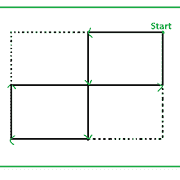

# 不用举起铅笔就能画出的方块数

> 原文:[https://www . geeksforgeeks . org/不举铅笔就能画出的方块数/](https://www.geeksforgeeks.org/count-of-squares-that-can-be-drawn-without-lifting-the-pencil/)

给定一个整数 **N** ，任务是从一个 **N * N** 网格的一个角开始，从不访问一个边两次，找到边 **1** 的可画方块数。

> **输入:**N = 2
> T3】输出: 2
> 
> 
> 
> **输入:**N = 3
> T3】输出: 5

**方法:**可以观察到对于 **N = 1、2、3、…** 的值，将形成一个系列为 **1、2、5、10、17、26、37、50、…** ，其**N<sup>th</sup>T9】术语为**(N<sup>2</sup>–(2 * N)+2)**
以下是上述方法的实现:**

## **C++**

```
// C++ implementation of the approach
#include <bits/stdc++.h>
using namespace std;

// Function to return the count of
// squares that can be formed
int countSquares(int n)
{
    return (pow(n, 2) - (2 * n) + 2);
}

// Driver code
int main()
{
    int n = 2;

    cout << countSquares(n);

    return 0;
}
```

## **Java 语言(一种计算机语言，尤用于创建网站)**

```
// Java implementation of the approach
class GFG
{

// Function to return the count of
// squares that can be formed
static int countSquares(int n)
{
    return (int) (Math.pow(n, 2) - (2 * n) + 2);
}

// Driver code
public static void main(String []args)
{
    int n = 2;
    System.out.println(countSquares(n));
}
}

// This code is contributed by Rajput-Ji
```

## **蟒蛇 3**

```
# Python3 implementation of the approach

# Function to return the count of
# squares that can be formed
def countSquares(n) :

    return (pow(n, 2) - (2 * n) + 2);

# Driver code
if __name__ == "__main__" :

    n = 2;

    print(countSquares(n));

# This code is contributed by AnkitRai01
```

## **C#**

```
// C# implementation of the approach
using System;

class GFG
{

    // Function to return the count of
    // squares that can be formed
    static int countSquares(int n)
    {
        return (int) (Math.Pow(n, 2) - (2 * n) + 2);
    }

    // Driver code
    public static void Main(String []args)
    {
        int n = 2;
        Console.WriteLine(countSquares(n));
    }
}

// This code is contributed by 29AjayKumar
```

## **java 描述语言**

```
<script>

// Javascript implementation of the approach

// Function to return the count of
// squares that can be formed
function countSquares(n)
{
    return (Math.pow(n, 2) - (2 * n) + 2);
}

// Driver code
var n = 2;
document.write(countSquares(n));

</script>
```

****Output:** 

```
2
```** 

****时间复杂度:** O(1)**