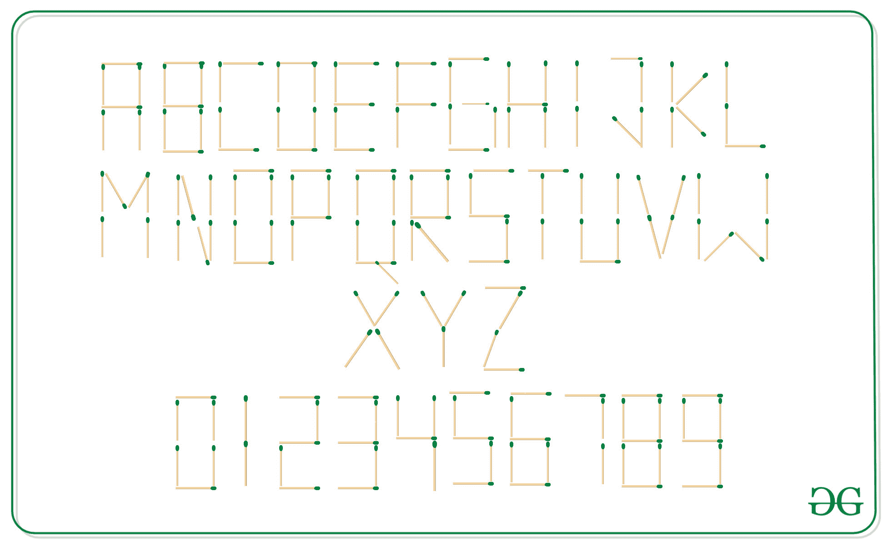

# 表示给定字符串所需的棒数

> 原文:[https://www . geesforgeks . org/需要表示给定字符串的棒数/](https://www.geeksforgeeks.org/count-of-sticks-required-to-represent-the-given-string/)

给定一个由大写字母和数字组成的字符串 **str** ，任务是找到表示它所需的火柴杆数量。



**例:**

> **输入:** str = "ABC2"
> **输出:** 22
> **说明:**
> 6 棒代表 A，
> 7 棒代表 B，
> 4 棒代表 C，
> 5 棒代表 2。
> 因此所需火柴杆总数为 6 + 7 + 4 + 5 = 22 根。
> **输入:**str = " GEEKSFORGEEKS "
> **输出:** 66
> **解释:**
> 6 棒代表 G，
> 5 棒代表 E，
> 4 棒代表 K，
> 5 棒代表 S，
> 4 棒代表 F，
> 6 棒代表 O，
> 代表 r 需要 6 根火柴杆
> 因此需要的火柴杆总数是 6+5+5+4+5+4+4+6+6+6+5+5+4+5 = 17 根。

**进场:**

1.  其想法是存储代表特定字母和数字所需的火柴杆的数量，如上图所示。
2.  遍历给定的字符串**字符串**，并添加每个字符所需的火柴杆数量。

以下是上述方法的实现:

## C++

```
// C++ implementation of the
// above approach
#include <bits/stdc++.h>
using namespace std;

// stick[] stores the count
// of matchsticks required to
// represent the alphabets
int sticks[] = { 6, 7, 4, 6, 5, 4, 6,
                 5, 2, 4, 4, 3, 6, 6,
                 6, 5, 7, 6, 5, 3, 5,
                 4, 6, 4, 3, 4 };

// number[] stores the count
// of matchsticks required to
// represent the numerals
int number[] = { 6, 2, 5, 5, 4, 5, 6,
                 3, 7, 6 };

// Function that return the count of
// sticks required to represent
// the given string
int countSticks(string str)
{
    int cnt = 0;

    // For every char of the given
    // string
    for (int i = 0; str[i]; i++) {

        char ch = str[i];

        // Add the count of sticks
        // required to represent the
        // current character
        if (ch >= 'A' && ch <= 'Z') {
            cnt += sticks[ch - 'A'];
        }
        else {
            cnt += number[ch - '0'];
        }
    }
    return cnt;
}

// Driver code
int main()
{
    string str = "GEEKSFORGEEKS";

    // Function call to find the
    // count of matchsticks
    cout << countSticks(str);

    return 0;
}
```

## Java 语言(一种计算机语言，尤用于创建网站)

```
// Java implementation of the above approach
class GFG {

    // stick[] stores the count
    // of matchsticks required to
    // represent the alphabets
    static int sticks[] = { 6, 7, 4, 6, 5, 4, 6,
                     5, 2, 4, 4, 3, 6, 6,
                     6, 5, 7, 6, 5, 3, 5,
                     4, 6, 4, 3, 4 };

    // number[] stores the count
    // of matchsticks required to
    // represent the numerals
    static int number[] = { 6, 2, 5, 5, 4, 5, 6,
                     3, 7, 6 };

    // Function that return the count of
    // sticks required to represent
    // the given string
    static int countSticks(String str)
    {
        int cnt = 0;

        // For every char of the given
        // string
        for (int i = 0; i < str.length(); i++) {

            char ch = str.charAt(i);

            // Add the count of sticks
            // required to represent the
            // current character
            if (ch >= 'A' && ch <= 'Z') {
                cnt += sticks[ch - 'A'];
            }
            else {
                cnt += number[ch - '0'];
            }
        }
        return cnt;
    }

    // Driver code
    public static void main (String[] args)
    {
        String str = "GEEKSFORGEEKS";

        // Function call to find the
        // count of matchsticks
        System.out.println(countSticks(str));

    }
}

// This code is contributed by AnkitRai01
```

## 蟒蛇 3

```
# Python3 implementation of the above approach

# stick[] stores the count
# of matchsticks required to
# represent the alphabets
sticks = [ 6, 7, 4, 6, 5, 4, 6,
            5, 2, 4, 4, 3, 6, 6,
            6, 5, 7, 6, 5, 3, 5,
            4, 6, 4, 3, 4 ];

# number[] stores the count
# of matchsticks required to
# represent the numerals
number = [ 6, 2, 5, 5, 4, 5, 6, 3, 7, 6 ];

# Function that return the count of
# sticks required to represent
# the given string
def countSticks(string) :

    cnt = 0;

    # For every char of the given
    # string
    for i in range(len(string)) :

        ch = string[i];

        # Add the count of sticks
        # required to represent the
        # current character
        if (ch >= 'A' and ch <= 'Z') :
            cnt += sticks[ord(ch) - ord('A')];

        else :
            cnt += number[ord(ch) - ord('0')];

    return cnt;

# Driver code
if __name__ == "__main__" :

    string = "GEEKSFORGEEKS";

    # Function call to find the
    # count of matchsticks
    print(countSticks(string));

# This code is contributed by AnkitRai01
```

## C#

```
// C# implementation of the above approach
using System;

class GFG
{

    // stick[] stores the count
    // of matchsticks required to
    // represent the alphabets
    static int []sticks = { 6, 7, 4, 6, 5, 4, 6,
                    5, 2, 4, 4, 3, 6, 6,
                    6, 5, 7, 6, 5, 3, 5,
                    4, 6, 4, 3, 4 };

    // number[] stores the count
    // of matchsticks required to
    // represent the numerals
    static int []number = { 6, 2, 5, 5, 4, 5, 6,
                    3, 7, 6 };

    // Function that return the count of
    // sticks required to represent
    // the given string
    static int countSticks(string str)
    {
        int cnt = 0;

        // For every char of the given
        // string
        for (int i = 0; i < str.Length; i++)
        {

            char ch = str[i];

            // Add the count of sticks
            // required to represent the
            // current character
            if (ch >= 'A' && ch <= 'Z')
            {
                cnt += sticks[ch - 'A'];
            }
            else
            {
                cnt += number[ch - '0'];
            }
        }
        return cnt;
    }

    // Driver code
    public static void Main()
    {
        string str = "GEEKSFORGEEKS";

        // Function call to find the
        // count of matchsticks
        Console.WriteLine(countSticks(str));
    }
}

// This code is contributed by AnkitRai01
```

## java 描述语言

```
<script>
// Javascript implementation of the
// above approach

// stick[] stores the count
// of matchsticks required to
// represent the alphabets
var sticks = [ 6, 7, 4, 6, 5, 4, 6,
                 5, 2, 4, 4, 3, 6, 6,
                 6, 5, 7, 6, 5, 3, 5,
                 4, 6, 4, 3, 4 ]
// number[] stores the count
// of matchsticks required to
// represent the numerals
var number = [ 6, 2, 5, 5, 4, 5, 6,
                 3, 7, 6 ];

// Function that return the count of
// sticks required to represent
// the given string
function countSticks(str)
{
    var cnt = 0;

    // For every char of the given
    // string
    for (var i = 0; str[i]; i++) {

        var ch = str[i];

        // Add the count of sticks
        // required to represent the
        // current character
        if (ch >= 'A' && ch <= 'Z') {
            cnt += sticks[ch.charCodeAt(0) - 'A'.charCodeAt(0)];
        }
        else {
            cnt += number[ch.charCodeAt(0) - '0'.charCodeAt(0)];
        }
    }
    return cnt;
}

// Driver Code

// Given array

var str = "GEEKSFORGEEKS";

// Function Call
document.write(countSticks(str));

// This code is contributed by ShubhamSingh10
</script>
```

**Output:** 

```
66
```

**时间复杂度:** O(N)，其中 N 为给定字符串的长度。

**辅助空间:** O(1)