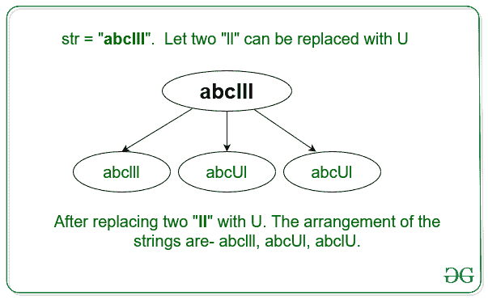
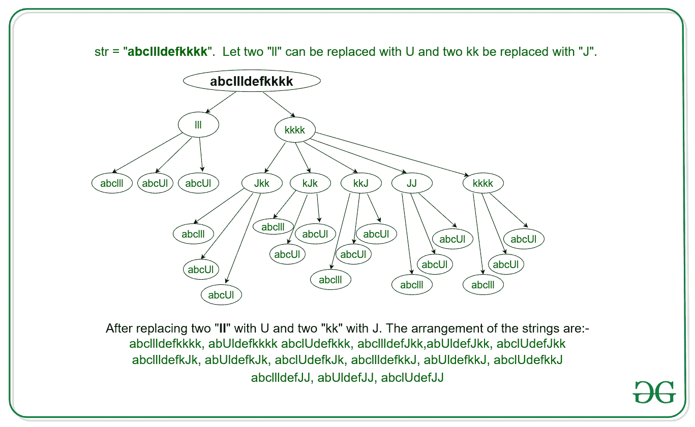

# 通过用新字符替换两个连续的相同字符来计算可能的字符串数

> 原文:[https://www . geesforgeks . org/通过用新字符替换两个连续的相同字符来计算可能的字符串数/](https://www.geeksforgeeks.org/count-of-strings-possible-by-replacing-two-consecutive-same-character-with-new-character/)

给定弦**弦**。任务是，如果字符串中两个连续的相同字符可以被一个不同的字符替换，则计算所有可能的不同字符串的数量。
**示例**

> **输入:**str = " abcyl "
> **输出:** 3
> **说明:**
> 可以有 3 个不同的字符串包括原始字符串如下图所示:-
> 
> 
> 
> **输入:**str = " abchilldefkkk "
> T3】输出: 15
> **说明:**
> 可以有 15 个不同的字符串包括原始字符串如下图所示:-
> 
> 

**方法:**
观察到一次替换两个相等字符的以下特性:

*   如果对于长度为 3 的字符串=**“AAA”**，我们用一个字符替换两个**“aa”**，比如说**“K”**，那么包括原始字符串在内的不同可能字符串的总数为:- **Ka，aK，aaa** 。因此，不同字符串的数量遵循字符串中连续字符长度的[斐波那契数](https://www.geeksforgeeks.org/program-for-nth-fibonacci-number/)的属性。
*   如果对于字符串=**aadefyyyy**，则通过一次替换两个连续的字符，可能的不同字符串的总数等于字符串**【AAA】**和**【yyyy】**的组合的乘积。

因此，从以上两个观察，具有 **N** 个连续字符的不同可能字符串的计数由[第 N 个斐波那契数](https://www.geeksforgeeks.org/program-for-nth-fibonacci-number/)给出。因此，给定字符串**字符串**的不同可能字符串的总数等于所有相同字符的每个子字符串的不同可能字符串的计数的乘积。
以下是步骤:

1.  计数(**表示 cnt** )给定字符串**字符串**中相同的连续字符数。
2.  要计算计数 **cnt** 的不同可能字符串，请在 **cnt** 处找到[斐波那契数列](https://www.geeksforgeeks.org/program-for-nth-fibonacci-number/)的值。
3.  对给定字符串**字符串**中的所有连续字符重复上述步骤。
4.  不同可能字符串的总计数等于对每个连续字符计数获得的[斐波那契序列](https://www.geeksforgeeks.org/program-for-nth-fibonacci-number/)的所有值的乘积。

以下是上述方法的实现:

## C++

```
// C++ program to count the
// different possible string
// form by replacing two same
// characters with one
#include <bits/stdc++.h>
using namespace std;

// Array to find the fibonacci
// sequence
int fib[100005];

// Function to find the
// fibonacci sequence
void computeFibonacci()
{
    fib[0] = 1;
    fib[1] = 1;
    for (int i = 2; i < 100005; i++) {
        fib[i] = fib[i - 1] + fib[i - 2];
    }
}

// Function to count all
// possible strings
int countString(string str)
{

    // Initialize ans = 1
    int ans = 1;
    int cnt = 1;

    for (int i = 1; str[i]; i++) {

        // If two consecutive
        // char are same
        // increase cnt
        if (str[i] == str[i - 1]) {
            cnt++;
        }

        // Else multiply the
        // fib[cnt] to ans
        // and initialize ans
        // to 1
        else {
            ans = ans * fib[cnt];
            cnt = 1;
        }
    }
    //
    // If str = abcdeeee, then
    // for last "eeee" the
    // count munst be updated
    ans = ans * fib[cnt];

    // Return the total count
    return ans;
}

// Driver's Code
int main()
{
    string str = "abdllldefkkkk";

    // Function to precompute
    // all the fibonacci number
    computeFibonacci();

    // Function call to find
    // the count
    cout << countString(str);
    return 0;
}
```

## Java 语言(一种计算机语言，尤用于创建网站)

```
// Java program to count the
// different possible string
// form by replacing two same
// characters with one
class GFG {

    // Array to find the fibonacci
    // sequence
    static int fib[] = new int[100005];

    // Function to find the
    // fibonacci sequence
    static void computeFibonacci()
    {
        fib[0] = 1;
        fib[1] = 1;
        for (int i = 2; i < 100005; i++) {
            fib[i] = fib[i - 1] + fib[i - 2];
        }
    }

    // Function to count all
    // possible strings
    static int countString(String str)
    {

        // Initialize ans = 1
        int ans = 1;
        int cnt = 1;

        for (int i = 1; i<str.length(); i++) {

            // If two consecutive
            // char are same
            // increase cnt
            if (str.charAt(i) == str.charAt(i - 1)) {
                cnt++;
            }

            // Else multiply the
            // fib[cnt] to ans
            // and initialize ans
            // to 1
            else {
                ans = ans * fib[cnt];
                cnt = 1;
            }
        }

        // If str = abcdeeee, then
        // for last "eeee" the
        // count munst be updated
        ans = ans * fib[cnt];

        // Return the total count
        return ans;
    }

    // Driver's Code
    public static void main (String[] args)
    {
        String str = "abdllldefkkkk";

        // Function to precompute
        // all the fibonacci number
        computeFibonacci();

        // Function call to find
        // the count
        System.out.println(countString(str));
    }
}

// This code is contributed by Yash_R
```

## 蟒蛇 3

```
# Python3 program to count the
# different possible string
# form by replacing two same
# characters with one

# Array to find the fibonacci
# sequence
fib = [0]*100005;

# Function to find the
# fibonacci sequence
def computeFibonacci() :

    fib[0] = 1;
    fib[1] = 1;
    for i in range(2, 100005) :
        fib[i] = fib[i - 1] + fib[i - 2];

# Function to count all
# possible strings
def countString(string) :

    # Initialize ans = 1
    ans = 1;
    cnt = 1;

    for i in range(1, len(string)) :

        # If two consecutive
        # char are same
        # increase cnt
        if (string[i] == string[i - 1]) :
            cnt += 1;

        # Else multiply the
        # fib[cnt] to ans
        # and initialize ans
        # to 1
        else :
            ans = ans * fib[cnt];
            cnt = 1;

    # If str = abcdeeee, then
    # for last "eeee" the
    # count munst be updated
    ans = ans * fib[cnt];

    # Return the total count
    return ans;

# Driver's Code
if __name__ == "__main__" :

    string = "abdllldefkkkk";

    # Function to precompute
    # all the fibonacci number
    computeFibonacci();

    # Function call to find
    # the count
    print(countString(string));

# This code is contributed by Yash_R
```

## C#

```
// C# program to count the
// different possible string
// form by replacing two same
// characters with one
using System;

class GFG {

    // Array to find the fibonacci
    // sequence
    static int []fib = new int[100005];

    // Function to find the
    // fibonacci sequence
    static void computeFibonacci()
    {
        fib[0] = 1;
        fib[1] = 1;
        for (int i = 2; i < 100005; i++) {
            fib[i] = fib[i - 1] + fib[i - 2];
        }
    }

    // Function to count all
    // possible strings
    static int countString(string str)
    {

        // Initialize ans = 1
        int ans = 1;
        int cnt = 1;

        for (int i = 1; i < str.Length; i++) {

            // If two consecutive
            // char are same
            // increase cnt
            if (str[i] == str[i - 1]) {
                cnt++;
            }

            // Else multiply the
            // fib[cnt] to ans
            // and initialize ans
            // to 1
            else {
                ans = ans * fib[cnt];
                cnt = 1;
            }
        }

        // If str = abcdeeee, then
        // for last "eeee" the
        // count munst be updated
        ans = ans * fib[cnt];

        // Return the total count
        return ans;
    }

    // Driver's Code
    public static void Main (string[] args)
    {
        string str = "abdllldefkkkk";

        // Function to precompute
        // all the fibonacci number
        computeFibonacci();

        // Function call to find
        // the count
        Console.WriteLine(countString(str));
    }
}

// This code is contributed by AnkitRai01
```

## java 描述语言

```
<script>

// Javascript program to count the
// different possible string
// form by replacing two same
// characters with one    

// Array to find the fibonacci
// sequence
     fib = Array(100005).fill(0);

    // Function to find the
    // fibonacci sequence
    function computeFibonacci()
    {
        fib[0] = 1;
        fib[1] = 1;
        for (i = 2; i < 100005; i++) {
            fib[i] = fib[i - 1] + fib[i - 2];
        }
    }

    // Function to count all
    // possible strings
    function countString( str) {

        // Initialize ans = 1
        var ans = 1;
        var cnt = 1;

        for (i = 1; i < str.length; i++)
        {

            // If two consecutive
            // char are same
            // increase cnt
            if (str.charAt(i) == str.charAt(i - 1))
            {
                cnt++;
            }

            // Else multiply the
            // fib[cnt] to ans
            // and initialize ans
            // to 1
            else {
                ans = ans * fib[cnt];
                cnt = 1;
            }
        }

        // If str = abcdeeee, then
        // for last "eeee" the
        // count munst be updated
        ans = ans * fib[cnt];

        // Return the total count
        return ans;
    }

    // Driver's Code

        var str = "abdllldefkkkk";

        // Function to precompute
        // all the fibonacci number
        computeFibonacci();

        // Function call to find
        // the count
        document.write(countString(str));

// This code contributed by umadevi9616

</script>
```

**Output:** 

```
15
```

**时间复杂度:** O(N)，其中 N 为给定字符串的长度。