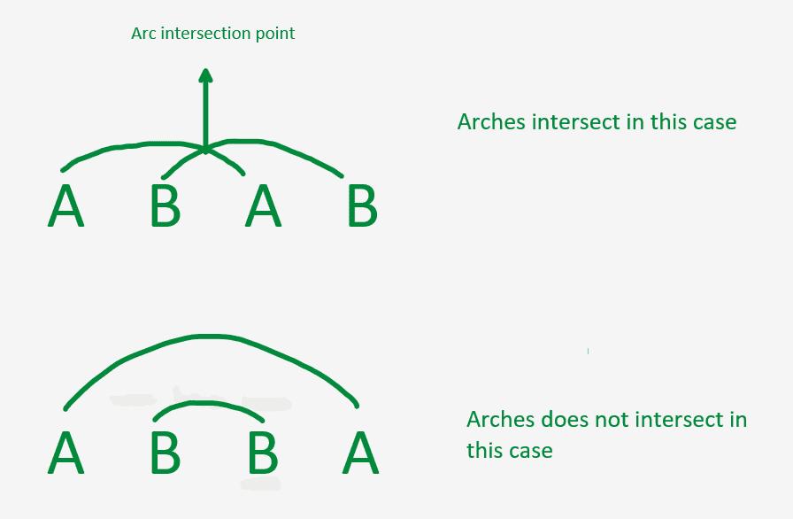

# 不包含弧交点的字符串数

> 原文:[https://www . geesforgeks . org/不包含弧交点的字符串计数/](https://www.geeksforgeeks.org/count-of-strings-that-does-not-contain-arc-intersection/)

给定一个由 **N** [二进制字符串](https://www.geeksforgeeks.org/tag/binary-string/)组成的[数组](https://www.geeksforgeeks.org/array-data-structure/) **arr[]** ，任务是统计不包含任何**弧交点**的字符串数量。

> 用圆弧连接连续的一对相同的字母，如果它们的交点是获得的，那么它被称为**圆弧交点**。下面是同样的说明。
> 
> [](https://media.geeksforgeeks.org/wp-content/uploads/20201103132424/arcintersection.PNG)

**示例:**

> **输入:**arr[]= {“0101”、“0011”、“0110”}
> **输出:** 2
> **说明:**字符串“0101”有弧相交。因此，没有任何弧交点的字符串计数为 2。
> 
> **输入:**arr[]= {“0011”、“0110”、“00011000”}
> **输出:** 3
> **解释:**所有给定的字符串没有任何弧相交。因此，计数为 3。

**简单方法:**最简单的方法是[遍历数组](https://www.geeksforgeeks.org/c-program-to-traverse-an-array/)并检查每个字符串，如果[相似的字符在连续的索引](https://www.geeksforgeeks.org/minimum-swaps-required-group-1s-together/)处被分组在一起。如果发现是真的，继续增加这些字符串的**计数**。最后，打印得到的**计数**的值。

***时间复杂度:** O(N*M <sup>2</sup> ，其中 M 是给定数组中字符串的最大长度。*
***辅助空间:** O(1)*

**高效途径:**优化上述途径，思路是使用[栈](https://www.geeksforgeeks.org/stack-data-structure/)。按照以下步骤解决问题:

1.  初始化**计数**，存储不包含任何圆弧交点的字符串的计数。
2.  初始化一个堆栈，将字符串的每个字符都存储到其中。
3.  [迭代给定字符串](https://www.geeksforgeeks.org/iterate-over-characters-of-a-string-in-python/)并执行以下操作:
    *   [将当前角色推入堆栈](https://www.geeksforgeeks.org/stack-push-and-pop-in-c-stl/)。
    *   如果[堆叠尺寸](https://www.geeksforgeeks.org/stack-size-method-in-java-with-example/)大于 **2** ，则检查堆叠的[顶部的两个元素是否相同。如果发现是真的，那么](https://www.geeksforgeeks.org/stack-top-c-stl/)[弹出](https://www.geeksforgeeks.org/stack-pop-method-in-java/)两个字符作为删除最近的弧交点。
4.  完成上述步骤后，如果[栈为空](https://www.geeksforgeeks.org/stack-empty-method-in-java/)，则不包含任何弧交点。
5.  对于数组中的每个字符串，按照**步骤 2** 至**步骤 4** 检查字符串是否包含弧交点。如果它不包含，那么计算这个字符串。

下面是上述方法的实现:

## C++

```
// C++ program for the above approach

#include <bits/stdc++.h>
using namespace std;

// Function to check if there is arc
// intersection or not
int arcIntersection(string S, int len)
{
    stack<char> stk;

    // Traverse the string S
    for (int i = 0; i < len; i++) {

        // Insert all the elements in
        // the stack one by one
        stk.push(S[i]);

        if (stk.size() >= 2) {

            // Extract the top element
            char temp = stk.top();

            // Pop out the top element
            stk.pop();

            // Check if the top element
            // is same as the popped element
            if (stk.top() == temp) {
                stk.pop();
            }

            // Otherwise
            else {
                stk.push(temp);
            }
        }
    }

    // If the stack is empty
    if (stk.empty())
        return 1;
    return 0;
}

// Function to check if there is arc
// intersection or not for the given
// array of strings
void countString(string arr[], int N)
{
    // Stores count of string not
    // having arc intersection
    int count = 0;

    // Iterate through array
    for (int i = 0; i < N; i++) {

        // Length of every string
        int len = arr[i].length();

        // Function Call
        count += arcIntersection(
            arr[i], len);
    }

    // Print the desired count
    cout << count << endl;
}

// Driver Code
int main()
{
    string arr[] = { "0101", "0011", "0110" };
    int N = sizeof(arr) / sizeof(arr[0]);

    // Function Call
    countString(arr, N);

    return 0;
}
```

## Java 语言(一种计算机语言，尤用于创建网站)

```
// Java program for the above approach
import java.util.*;

class GFG
{

// Function to check if there is arc
// intersection or not
static int arcIntersection(String S, int len)
{
    Stack<Character> stk  = new Stack<>();

    // Traverse the String S
    for (int i = 0; i < len; i++)
    {

        // Insert all the elements in
        // the stack one by one
        stk.push(S.charAt(i));

        if (stk.size() >= 2)
        {

            // Extract the top element
            char temp = stk.peek();

            // Pop out the top element
            stk.pop();

            // Check if the top element
            // is same as the popped element
            if (stk.peek() == temp)
            {
                stk.pop();
            }

            // Otherwise
            else
            {
                stk.add(temp);
            }
        }
    }

    // If the stack is empty
    if (stk.isEmpty())
        return 1;
    return 0;
}

// Function to check if there is arc
// intersection or not for the given
// array of Strings
static void countString(String arr[], int N)
{

    // Stores count of String not
    // having arc intersection
    int count = 0;

    // Iterate through array
    for (int i = 0; i < N; i++)
    {

        // Length of every String
        int len = arr[i].length();

        // Function Call
        count += arcIntersection(
            arr[i], len);
    }

    // Print the desired count
    System.out.print(count +"\n");
}

// Driver Code
public static void main(String[] args)
{
    String arr[] = { "0101", "0011", "0110" };
    int N = arr.length;

    // Function Call
    countString(arr, N);
}
}

// This code is contributed by 29AjayKumar
```

## 蟒蛇 3

```
# Python3 program for the above approach

# Function to check if there is arc
# intersection or not
def arcIntersection(S, lenn):

    stk = []

    # Traverse the string S
    for i in range(lenn):

        # Insert all the elements in
        # the stack one by one
        stk.append(S[i])

        if (len(stk) >= 2):

            # Extract the top element
            temp = stk[-1]

            # Pop out the top element
            del stk[-1]

            # Check if the top element
            # is same as the popped element
            if (stk[-1] == temp):
                del stk[-1]

            # Otherwise
            else:
                stk.append(temp)

    # If the stack is empty
    if (len(stk) == 0):
        return 1

    return 0

# Function to check if there is arc
# intersection or not for the given
# array of strings
def countString(arr, N):

    # Stores count of string not
    # having arc intersection
    count = 0

    # Iterate through array
    for i in range(N):

        # Length of every string
        lenn = len(arr[i])

        # Function Call
        count += arcIntersection(arr[i], lenn)

    # Print the desired count
    print(count)

# Driver Code
if __name__ == '__main__':

    arr = [ "0101", "0011", "0110" ]
    N = len(arr)

    # Function Call
    countString(arr, N)

# This code is contributed by mohit kumar 29
```

## C#

```
// C# program for
// the above approach
using System;
using System.Collections.Generic;

class GFG
{

// Function to check if there is arc
// intersection or not
static int arcIntersection(String S, int len)
{
    Stack<char> stk  = new Stack<char>();

    // Traverse the String S
    for (int i = 0; i < len; i++)
    {

        // Insert all the elements in
        // the stack one by one
        stk.Push(S[i]);

        if (stk.Count >= 2)
        {

            // Extract the top element
            char temp = stk.Peek();

            // Pop out the top element
            stk.Pop();

            // Check if the top element
            // is same as the popped element
            if (stk.Peek() == temp)
            {
                stk.Pop();
            }

            // Otherwise
            else
            {
                stk.Push(temp);
            }
        }
    }

    // If the stack is empty
    if (stk.Count == 0)
        return 1;
    return 0;
}

// Function to check if there is arc
// intersection or not for the given
// array of Strings
static void countString(String []arr, int N)
{

    // Stores count of String not
    // having arc intersection
    int count = 0;

    // Iterate through array
    for (int i = 0; i < N; i++)
    {

        // Length of every String
        int len = arr[i].Length;

        // Function Call
        count += arcIntersection(
            arr[i], len);
    }

    // Print the desired count
    Console.Write(count +"\n");
}

// Driver Code
public static void Main(String[] args)
{
    String [] arr = { "0101", "0011", "0110" };
    int N = arr.Length;

    // Function Call
    countString(arr, N);
}
}

// This code is contributed by jana_sayantan.
```

## java 描述语言

```
<script>

// JavaScript program for the above approach

// Function to check if there is arc
// intersection or not
function arcIntersection(S, len)
{
    var stk = [];

    // Traverse the string S
    for (var i = 0; i < len; i++) {

        // Insert all the elements in
        // the stack one by one
        stk.push(S[i]);

        if (stk.length >= 2) {

            // Extract the top element
            var temp = stk[stk.length-1];

            // Pop out the top element
            stk.pop();

            // Check if the top element
            // is same as the popped element
            if (stk[stk.length-1] == temp) {
                stk.pop();
            }

            // Otherwise
            else {
                stk.push(temp);
            }
        }
    }

    // If the stack is empty
    if (stk.length==0)
        return 1;
    return 0;
}

// Function to check if there is arc
// intersection or not for the given
// array of strings
function countString(arr, N)
{
    // Stores count of string not
    // having arc intersection
    var count = 0;

    // Iterate through array
    for (var i = 0; i < N; i++) {

        // Length of every string
        var len = arr[i].length;

        // Function Call
        count += arcIntersection(
            arr[i], len);
    }

    // Print the desired count
    document.write( count + "<br>");
}

// Driver Code

var arr = ["0101", "0011", "0110" ];
var N = arr.length;

// Function Call
countString(arr, N);

</script>
```

**Output:** 

```
2
```

***时间复杂度:** O(N*M)，其中 M 是给定数组中字符串的最大长度。*
***辅助空间:** O(M)，其中 M 为给定数组中字符串的最大长度。*