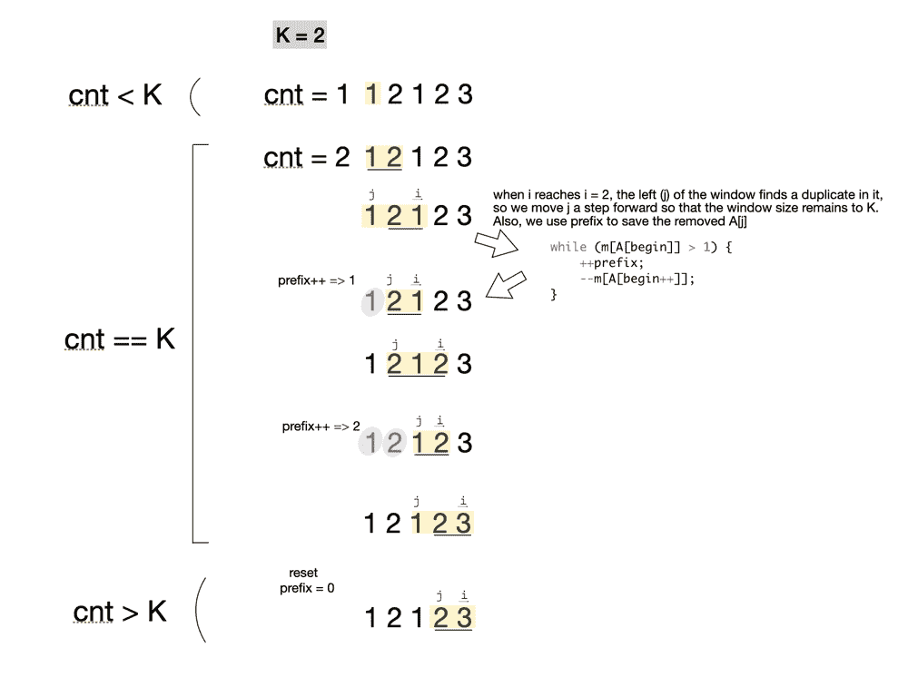

# 具有正好 K 个不同元素的子阵列的计数

> 原文:[https://www . geeksforgeeks . org/子阵列计数-具有精确 k 个不同元素/](https://www.geeksforgeeks.org/count-of-subarrays-having-exactly-k-distinct-elements/)

给定一个大小为 **N** 的数组 **arr[]** 和一个整数 **K** 。任务是找到子阵列的数量，使得每个子阵列都有精确的 **K** 不同的元素。

**示例:**

> **输入:** arr[] = {2，1，2，1，6}，K = 2
> **输出:** 7
> {2，1}、{1，2}、{2，1}、{1，6}、{2，1，2}、
> {1，2，1}和{2，1，2，1}是唯一有效的子阵。
> 
> **输入:** arr[] = {1，2，3，4，5}，K = 1
> T3】输出: 5

**方法:**精确地用 **K** 个不同的整数直接计数子阵是很难的，但是用**个最多 K 个**个不同的整数找到子阵的计数是很容易的。所以思路是找出最多**K**个不同整数的子阵个数，让它是 **C(K)** ，最多**个(K–1)**个不同整数的子阵个数，让它是**C(K–1)**最后取它们的差，**C(K)–C(K–1)**就是需要的答案。
最多有 **K** 个不同元素的子阵计数可以通过[滑动窗口技术](http://www.geeksforgeeks.org/window-sliding-technique/)轻松计算出来。其思想是不断扩大窗口的右边界，直到窗口中不同元素的计数小于或等于 **K** ，当窗口内不同元素的计数大于 **K** 时，从左边开始缩小窗口，直到计数小于或等于 **K** 。同样对于每次扩展，继续将子阵列计数为**右–左+ 1** ，其中**右**和**左**是当前窗口的边界。

下面是上述方法的实现:

## C++

```
// C++ implementation of the approach
#include<bits/stdc++.h>
#include<map>
using namespace std;

// Function to return the count of subarrays
// with at most K distinct elements using
// the sliding window technique
int atMostK(int arr[], int n, int k)
{

    // To store the result
    int count = 0;

    // Left boundary of window
    int left = 0;

    // Right boundary of window
    int right = 0;

    // Map to keep track of number of distinct
    // elements in the current window
    unordered_map<int,int> map;
    // Loop to calculate the count
    while (right < n) {

        // Calculating the frequency of each
        // element in the current window
        if (map.find(arr[right])==map.end())
            map[arr[right]]=0;
        map[arr[right]]++;

        // Shrinking the window from left if the
        // count of distinct elements exceeds K
        while (map.size() > k) {
            map[arr[left]]= map[arr[left]] - 1;
            if (map[arr[left]] == 0)
                map.erase(arr[left]);
            left++;
        }

        // Adding the count of subarrays with at most
        // K distinct elements in the current window
        count += right - left + 1;
        right++;
    }
    return count;
}

// Function to return the count of subarrays
// with exactly K distinct elements
int exactlyK(int arr[], int n, int k)
{

    // Count of subarrays with exactly k distinct
    // elements is equal to the difference of the
    // count of subarrays with at most K distinct
    // elements and the count of subararys with
    // at most (K - 1) distinct elements
    return (atMostK(arr, n, k) - atMostK(arr, n, k - 1));
}

// Driver code
int main()
{
    int arr[] = { 2, 1, 2, 1, 6 };
    int n = sizeof(arr)/sizeof(arr[0]);
    int k = 2;

    cout<<(exactlyK(arr, n, k));
}
```

## Java 语言(一种计算机语言，尤用于创建网站)

```
// Java implementation of the approach
import java.util.*;

public class GfG {

    // Function to return the count of subarrays
    // with at most K distinct elements using
    // the sliding window technique
    private static int atMostK(int arr[], int n, int k)
    {

        // To store the result
        int count = 0;

        // Left boundary of window
        int left = 0;

        // Right boundary of window
        int right = 0;

        // Map to keep track of number of distinct
        // elements in the current window
        HashMap<Integer, Integer> map = new HashMap<>();

        // Loop to calculate the count
        while (right < n) {

            // Calculating the frequency of each
            // element in the current window
            map.put(arr[right],
                    map.getOrDefault(arr[right], 0) + 1);

            // Shrinking the window from left if the
            // count of distinct elements exceeds K
            while (map.size() > k) {
                map.put(arr[left], map.get(arr[left]) - 1);
                if (map.get(arr[left]) == 0)
                    map.remove(arr[left]);
                left++;
            }

            // Adding the count of subarrays with at most
            // K distinct elements in the current window
            count += right - left + 1;
            right++;
        }
        return count;
    }

    // Function to return the count of subarrays
    // with exactly K distinct elements
    private static int exactlyK(int arr[], int n, int k)
    {

        // Count of subarrays with exactly k distinct
        // elements is equal to the difference of the
        // count of subarrays with at most K distinct
        // elements and the count of subararys with
        // at most (K - 1) distinct elements
        return (atMostK(arr, n, k)
                - atMostK(arr, n, k - 1));
    }

    // Driver code
    public static void main(String[] args)
    {
        int arr[] = { 2, 1, 2, 1, 6 };
        int n = arr.length;
        int k = 2;

        System.out.print(exactlyK(arr, n, k));
    }
}
```

## 蟒蛇 3

```
# Python3 implementation of the above approach

# Function to return the count of subarrays
# with at most K distinct elements using
# the sliding window technique

def atMostK(arr, n, k):

    # To store the result
    count = 0

    # Left boundary of window
    left = 0

    # Right boundary of window
    right = 0

    # Map to keep track of number of distinct
    # elements in the current window
    map = {}

    # Loop to calculate the count
    while(right < n):

        if arr[right] not in map:
            map[arr[right]] = 0

        # Calculating the frequency of each
        # element in the current window
        map[arr[right]] += 1

        # Shrinking the window from left if the
        # count of distinct elements exceeds K
        while(len(map) > k):

            if arr[left] not in map:
                map[arr[left]] = 0

            map[arr[left]] -= 1

            if map[arr[left]] == 0:
                del map[arr[left]]

            left += 1

        # Adding the count of subarrays with at most
        # K distinct elements in the current window
        count += right - left + 1
        right += 1

    return count

# Function to return the count of subarrays
# with exactly K distinct elements

def exactlyK(arr, n, k):

    # Count of subarrays with exactly k distinct
    # elements is equal to the difference of the
    # count of subarrays with at most K distinct
    # elements and the count of subararys with
    # at most (K - 1) distinct elements
    return (atMostK(arr, n, k) -
            atMostK(arr, n, k - 1))

# Driver code
if __name__ == "__main__":
    arr = [2, 1, 2, 1, 6]
    n = len(arr)
    k = 2

    print(exactlyK(arr, n, k))

# This code is contributed by AnkitRai01
```

## C#

```
// C# implementation of the approach
using System;
using System.Collections.Generic;

class GfG {

    // Function to return the count of subarrays
    // with at most K distinct elements using
    // the sliding window technique
    private static int atMostK(int[] arr, int n, int k)
    {

        // To store the result
        int count = 0;

        // Left boundary of window
        int left = 0;

        // Right boundary of window
        int right = 0;

        // Map to keep track of number of distinct
        // elements in the current window
        Dictionary<int, int> map
            = new Dictionary<int, int>();

        // Loop to calculate the count
        while (right < n) {

            // Calculating the frequency of each
            // element in the current window
            if (map.ContainsKey(arr[right]))
                map[arr[right]] = map[arr[right]] + 1;
            else
                map.Add(arr[right], 1);

            // Shrinking the window from left if the
            // count of distinct elements exceeds K
            while (map.Count > k) {
                if (map.ContainsKey(arr[left])) {
                    map[arr[left]] = map[arr[left]] - 1;
                    if (map[arr[left]] == 0)
                        map.Remove(arr[left]);
                }
                left++;
            }

            // Adding the count of subarrays with at most
            // K distinct elements in the current window
            count += right - left + 1;
            right++;
        }
        return count;
    }

    // Function to return the count of subarrays
    // with exactly K distinct elements
    private static int exactlyK(int[] arr, int n, int k)
    {

        // Count of subarrays with exactly k distinct
        // elements is equal to the difference of the
        // count of subarrays with at most K distinct
        // elements and the count of subararys with
        // at most (K - 1) distinct elements
        return (atMostK(arr, n, k)
                - atMostK(arr, n, k - 1));
    }

    // Driver code
    public static void Main(String[] args)
    {
        int[] arr = { 2, 1, 2, 1, 6 };
        int n = arr.Length;
        int k = 2;

        Console.Write(exactlyK(arr, n, k));
    }
}

// This code is contributed by 29AjayKumar
```

## java 描述语言

```
<script>

// Javascript implementation of the approach

// Function to return the count of subarrays
// with at most K distinct elements using
// the sliding window technique
function atMostK(arr, n, k)
{
    // To store the result
    let count = 0;

    // Left boundary of window
    let left = 0;

    // Right boundary of window
    let right = 0;

    // Map to keep track of number of distinct
    // elements in the current window
    let map = new Map();

    // Loop to calculate the count
    while (right < n)
    {

        // Calculating the frequency of each
        // element in the current window
        if (map.has(arr[right]))
            map.set(arr[right],
            map.get(arr[right]) + 1);
        else
            map.set(arr[right], 1);

        // Shrinking the window from left if the
        // count of distinct elements exceeds K
        while (map.size > k)
        {
            map.set(arr[left], map.get(arr[left]) - 1);
            if (map.get(arr[left]) == 0)
                map.delete(arr[left]);

            left++;
        }

        // Adding the count of subarrays with at most
        // K distinct elements in the current window
        count += right - left + 1;
        right++;
    }
    return count;
}

// Function to return the count of subarrays
// with exactly K distinct elements
function exactlyK(arr, n, k)
{

    // Count of subarrays with exactly k distinct
    // elements is equal to the difference of the
    // count of subarrays with at most K distinct
    // elements and the count of subararys with
    // at most (K - 1) distinct elements
    return (atMostK(arr, n, k) -
            atMostK(arr, n, k - 1));
}

// Driver code
let arr = [ 2, 1, 2, 1, 6 ];
let n = arr.length;
let k = 2;

document.write(exactlyK(arr, n, k));

// This code is contributed by avanitrachhadiya2155

</script>
```

**Output**

```
7
```

**时间复杂度:**O(N)
T3】空间复杂度: O(N)

**另一种方法:**当你移动右光标时，继续跟踪我们是否已经达到 K 个不同整数的计数，如果是，我们处理左光标，下面是我们如何处理左光标:

*   检查左光标指向的元素在窗口中是否重复，如果是，我们删除它，并使用一个变量(例如前缀)来记录我们已经从窗口中删除了一个元素)。保持这个过程，直到我们将窗口大小从减少到正好为 k。现在我们可以将有效的好数组的数量计算为 RES+= prefix；
*   在处理完左光标和所有的东西后，外循环将继续，右光标将向前移动，然后窗口大小将超过 K，我们可以简单地删除窗口最左边的元素，并将前缀重置为 0。继续。



下面是上述方法的实现:

## C++

```
// C++ program to calculate number
// of subarrays with distinct elements of size k
#include <bits/stdc++.h>
#include <map>
#include <vector>
using namespace std;

int subarraysWithKDistinct(vector<int>& A, int K)
{

    // declare a map for the frequency
    unordered_map<int, int> mapp;
    int begin = 0, end = 0, prefix = 0, cnt = 0;
    int res = 0;

    // traverse the array
    while (end < A.size())
    {
        // increase the frequency
        mapp[A[end]]++;
        if (mapp[A[end]] == 1) {
            cnt++;
        }
        end++;
        if (cnt > K)
        {
            mapp[A[begin]]--;
            begin++;
            cnt--;
            prefix = 0;
        }

        // loop until mapp[A[begin]] > 1
        while (mapp[A[begin]] > 1)
        {
            mapp[A[begin]]--;
            begin++;
            prefix++;
        }
        if (cnt == K)
        {
            res += prefix + 1;
        }
    }

    // return the final count
    return res;
}
// Driver code
int main()
{
    vector<int> arr{ 2, 1, 2, 1, 6 };
    int k = 2;

     // Function call
    cout << (subarraysWithKDistinct(arr, k));
}
// This code is contributed by Harman Singh
```

## Java 语言(一种计算机语言，尤用于创建网站)

```
// Java program to calculate number
// of subarrays with distinct elements of size k
import java.util.*;
class GFG
{
  static int subarraysWithKDistinct(int A[], int K)
  {

    // declare a map for the frequency
    HashMap<Integer, Integer> mapp = new HashMap<>();
    int begin = 0, end = 0, prefix = 0, cnt = 0;
    int res = 0;

    // traverse the array
    while (end < A.length)
    {

      // increase the frequency
      if(mapp.containsKey(A[end]))
      {
        mapp.put(A[end], mapp.get(A[end]) + 1);
      }
      else
      {
        mapp.put(A[end], 1);
      }
      if (mapp.get(A[end]) == 1)
      {
        cnt++;
      }
      end++;
      if (cnt > K)
      {
        if(mapp.containsKey(A[begin]))
        {
          mapp.put(A[begin], mapp.get(A[begin]) - 1);
        }
        else
        {
          mapp.put(A[begin], -1);
        }
        begin++;
        cnt--;
        prefix = 0;
      }

      // loop until mapp[A[begin]] > 1
      while (mapp.get(A[begin]) > 1)
      {
        if(mapp.containsKey(A[begin]))
        {
          mapp.put(A[begin], mapp.get(A[begin]) - 1);
        }
        else
        {
          mapp.put(A[begin], -1);
        }
        begin++;
        prefix++;
      }
      if (cnt == K)
      {
        res += prefix + 1;
      }
    }

    // return the final count
    return res;
  }

  // Driver code
  public static void main(String[] args)
  {
    int arr[] = { 2, 1, 2, 1, 6 };
    int k = 2;

    // Function call
    System.out.println(subarraysWithKDistinct(arr, k));
  }
}

// This code is contributed by divyeshrabadiya07
```

## 蟒蛇 3

```
# Python3 program to calculate number of
# subarrays with distinct elements of size k
def subarraysWithKDistinct(A, K):

    # Declare a map for the frequency
    mapp = {}
    begin, end, prefix, cnt = 0, 0, 0, 0
    res = 0

    # Traverse the array
    while (end < len(A)):

        # Increase the frequency
        mapp[A[end]] = mapp.get(A[end], 0) + 1

        if (mapp[A[end]] == 1):
            cnt += 1

        end += 1

        if (cnt > K):
            mapp[A[begin]] -= 1
            begin += 1
            cnt -= 1
            prefix = 0

        # Loop until mapp[A[begin]] > 1
        while (mapp[A[begin]] > 1):
            mapp[A[begin]] -= 1
            begin += 1
            prefix += 1

        if (cnt == K):
            res += prefix + 1

    # Return the final count
    return res

# Driver code
if __name__ == '__main__':

    arr = [ 2, 1, 2, 1, 6 ]
    k = 2

    # Function call
    print (subarraysWithKDistinct(arr, k))

# This code is contributed by Mohit kumar
```

## C#

```
// C# program to calculate number
// of subarrays with distinct elements of size k
using System;
using System.Collections.Generic;
class GFG {

    static int subarraysWithKDistinct(List<int> A, int K)
    {

        // declare a map for the frequency
        Dictionary<int, int> mapp = new Dictionary<int, int>(); 
        int begin = 0, end = 0, prefix = 0, cnt = 0;
        int res = 0;

        // traverse the array
        while (end < A.Count)
        {

            // increase the frequency
            if(mapp.ContainsKey(A[end]))
            {
                mapp[A[end]]++;
            }
            else{
                mapp[A[end]] = 1;
            }
            if (mapp[A[end]] == 1) {
                cnt++;
            }
            end++;
            if (cnt > K)
            {
                if(mapp.ContainsKey(A[begin]))
                {
                    mapp[A[begin]]--;
                }
                else{
                    mapp[A[begin]] = -1;
                }
                begin++;
                cnt--;
                prefix = 0;
            }

            // loop until mapp[A[begin]] > 1
            while (mapp[A[begin]] > 1)
            {
                mapp[A[begin]]--;
                begin++;
                prefix++;
            }
            if (cnt == K)
            {
                res += prefix + 1;
            }
        }

        // return the final count
        return res;
    }

  // Driver code
  static void Main()
  {
    List<int> arr = new List<int>(new int[] { 2, 1, 2, 1, 6 });
    int k = 2;

     // Function call
    Console.Write(subarraysWithKDistinct(arr, k));
  }
}

// This code is contributed by divyesh072019
```

## java 描述语言

```
<script>

// Javascript program to calculate number
// of subarrays with distinct elements of size k
function subarraysWithKDistinct(A, K)
{

    // Declare a map for the frequency
    let mapp = new Map();
    let begin = 0, end = 0, prefix = 0, cnt = 0;
    let res = 0;

    // Traverse the array
    while (end < A.length)
    {

        // increase the frequency
        if (mapp.has(A[end]))
        {
            mapp.set(A[end],
            mapp.get(A[end]) + 1);
        }
        else
        {
            mapp.set(A[end], 1);
        }
        if (mapp.get(A[end]) == 1)
        {
            cnt++;
        }
        end++;
        if (cnt > K)
        {
            if (mapp.has(A[begin]))
            {
                mapp.set(A[begin],
                mapp.get(A[begin]) - 1);
            }
            else
            {
                mapp.set(A[begin], -1);
            }
            begin++;
            cnt--;
            prefix = 0;
        }

        // loop until mapp[A[begin]] > 1
        while (mapp.get(A[begin]) > 1)
        {
            if(mapp.has(A[begin]))
            {
                mapp.set(A[begin],
                mapp.get(A[begin]) - 1);
            }
            else
            {
                mapp.set(A[begin], -1);
            }
            begin++;
            prefix++;
        }
        if (cnt == K)
        {
            res += prefix + 1;
        }
    }

    // Return the final count
    return res;
}

// Driver code
let arr = [ 2, 1, 2, 1, 6 ];
let k = 2;

// Function call
document.write(subarraysWithKDistinct(arr, k));

// This code is contributed by rag2127

</script>
```

**Output**

```
7
```

**时间复杂度:**O(N)
T3】辅助空间: O(N)