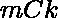

# 正好由 K 个素数组成的子序列的计数

> 原文:[https://www . geeksforgeeks . org/count-of-subseries-哪些-哪些-确切地-由-k-质数组成/](https://www.geeksforgeeks.org/count-of-subsequences-which-consists-exactly-k-prime-numbers/)

给定一个整数 **K** 和一个数组**arr【】**，任务是从给定的数组中找到子序列的数量，使得每个子序列正好由 K 个素数组成。
**例:**

> **输入:** K = 2，arr = [2，3，4，6]
> **输出:** 4
> **解释:**
> 有 4 个子序列，正好由 2 个质数{2，3} {2，3，4} {2，3，6} {2，3，4，6}，
> **输入:** K = 3，arr = [1，2，3，4，5，6，7]
> 【T13

**方法:**为了解决上面提到的问题，我们必须找到给定数组中素数的[计数。](https://www.geeksforgeeks.org/count-number-of-primes-in-an-array/) 

1.  让素数的计数为 *m* 。
2.  我们可以在 *m* 个素数中选择任意 K 个整数。
3.  因此在子序列中选择质数的可能组合是，在子序列中我们可以添加任意数量的非质数，因为对非质数没有限制，其中非质数的计数将是(N–m)。
4.  对于子序列中的非素数，我们可以选择(N–m)的任意子集。
5.  选择大小(N-m)所有子集的可能性是**次方(2，(m-N))**。
6.  为了生成子序列，我们将质数可能性与非质数可能性相乘。

> 子序列计数=(素数计数)C (K) *幂(2，非素数计数)

以下是上述方法的实现:

## C++

```
// C++ implementation to find
// the count of subsequences
// which consist exactly K primes

#include <bits/stdc++.h>
using namespace std;

// Returns factorial of n
int fact(int n)
{
    int res = 1;
    for (int i = 2; i <= n; i++)
        res = res * i;
    return res;
}

// Function to return total
// number of combinations
int nCr(int n, int r)
{
    return fact(n)
           / (fact(r)
              * fact(n - r));
}

// Function check whether a number
// is prime or not
bool isPrime(int n)
{
    // Corner case
    if (n <= 1)
        return false;

    // Check from 2 to n-1
    for (int i = 2; i < n; i++)
        if (n % i == 0)
            return false;

    return true;
}

// Function for finding number of subsequences
// which consists exactly K primes
int countSubsequences(int arr[], int n, int k)
{
    int countPrime = 0;
    for (int i = 0; i < n; i++) {
        if (isPrime(arr[i]))
            countPrime++;
    }
    // if number of primes are less thn k
    if (countPrime < k)
        return 0;

    return nCr(countPrime, k)
           * pow(2, (n - countPrime));
}

// Driver code
int main()
{

    int arr[] = { 1, 2, 3, 4, 5, 6, 7 };
    int K = 3;

    int n = sizeof(arr) / sizeof(arr[0]);

    cout << countSubsequences(arr, n, K);
    return 0;
}
```

## Java 语言(一种计算机语言，尤用于创建网站)

```
// Java implementation to find the
// count of subsequences which
// consist exactly K primes
import java.util.*;

class GFG{

// Returns factorial of n
static int fact(int n)
{
    int res = 1;
    for(int i = 2; i <= n; i++)
        res = res * i;

    return res;
}

// Function to return total
// number of combinations
static int nCr(int n, int r)
{
    return fact(n) / (fact(r) *
                      fact(n - r));
}

// Function check whether a number
// is prime or not
static boolean isPrime(int n)
{

    // Corner case
    if (n <= 1)
        return false;

    // Check from 2 to n-1
    for(int i = 2; i < n; i++)
        if (n % i == 0)
            return false;

    return true;
}

// Function for finding number of subsequences
// which consists exactly K primes
static int countSubsequences(int arr[],
                             int n, int k)
{
    int countPrime = 0;
    for(int i = 0; i < n; i++)
    {
        if (isPrime(arr[i]))
            countPrime++;
    }

    // If number of primes are less thn k
    if (countPrime < k)
        return 0;

    return nCr(countPrime, k) *
          (int)Math.pow(2, (n - countPrime));
}

// Driver code
public static void main(String args[])
{

    int arr[] = { 1, 2, 3, 4, 5, 6, 7 };
    int K = 3;
    int n = arr.length;

    System.out.println(countSubsequences(arr, n, K));
}
}

// This code is contributed by ANKITKUMAR34
```

## 蟒蛇 3

```
# Python3 implementation to find the
# count of subsequences which consist
# exactly K primes

# Returns factorial of n
def fact(n):

    res = 1;
    for i in range(2, n + 1):
        res = res * i

    return res

# Function to return total
# number of combinations
def nCr(n, r):

    return (fact(n) // (fact(r) *
                        fact(n - r)))

# Function check whether a number
# is prime or not
def isPrime(n):

    # Corner case
    if (n <= 1):
        return False;

    # Check from 2 to n-1
    for i in range(2, n):
        if (n % i == 0):
            return False

    return True

# Function for finding number of subsequences
# which consists exactly K primes
def countSubsequences(arr, n, k):

    countPrime = 0
    for i in range(n):
        if (isPrime(arr[i])):
            countPrime += 1

    # If number of primes are less than k
    if (countPrime < k):
        return 0

    return (nCr(countPrime, k) *
    pow(2, (n - countPrime)))

# Driver code
arr = [ 1, 2, 3, 4, 5, 6, 7 ]
K = 3
n = len(arr)

print(countSubsequences(arr, n, K))

# This code is contributed by ANKITKUMAR34
```

## C#

```
// C# implementation to find the
// count of subsequences which
// consist exactly K primes
using System;

class GFG{

// Returns factorial of n
static int fact(int n)
{
    int res = 1;
    for(int i = 2; i <= n; i++)
        res = res * i;

    return res;
}

// Function to return total
// number of combinations
static int nCr(int n, int r)
{
    return fact(n) / (fact(r) *
                      fact(n - r));
}

// Function check whether a number
// is prime or not
static bool isPrime(int n)
{

    // Corner case
    if (n <= 1)
        return false;

    // Check from 2 to n-1
    for(int i = 2; i < n; i++)
        if (n % i == 0)
            return false;

    return true;
}

// Function for finding number of subsequences
// which consists exactly K primes
static int countSubsequences(int []arr,
                             int n, int k)
{
    int countPrime = 0;
    for(int i = 0; i < n; i++)
    {
        if (isPrime(arr[i]))
            countPrime++;
    }

    // If number of primes are less than k
    if (countPrime < k)
        return 0;

    return nCr(countPrime, k) *
          (int)Math.Pow(2, (n - countPrime));
}

// Driver code
public static void Main(String []args)
{

    int []arr = { 1, 2, 3, 4, 5, 6, 7 };
    int K = 3;
    int n = arr.Length;

    Console.WriteLine(countSubsequences(arr, n, K));
}
}

// This code is contributed by gauravrajput1
```

## java 描述语言

```
<script>

// Javascript implementation to find
// the count of subsequences
// which consist exactly K primes

// Returns factorial of n
function fact(n)
{
    var res = 1;
    for (var i = 2; i <= n; i++)
        res = res * i;
    return res;
}

// Function to return total
// number of combinations
function nCr(n, r)
{
    return fact(n)
           / (fact(r)
              * fact(n - r));
}

// Function check whether a number
// is prime or not
function isPrime(n)
{
    // Corner case
    if (n <= 1)
        return false;

    // Check from 2 to n-1
    for (var i = 2; i < n; i++)
        if (n % i == 0)
            return false;

    return true;
}

// Function for finding number of subsequences
// which consists exactly K primes
function countSubsequences(arr, n, k)
{
    var countPrime = 0;
    for (var i = 0; i < n; i++) {
        if (isPrime(arr[i]))
            countPrime++;
    }
    // if number of primes are less thn k
    if (countPrime < k)
        return 0;

    return nCr(countPrime, k)
           * Math.pow(2, (n - countPrime));
}

// Driver code
var arr = [ 1, 2, 3, 4, 5, 6, 7 ];
var K = 3;
var n = arr.length;
document.write( countSubsequences(arr, n, K));

</script>
```

**Output:** 

```
32
```