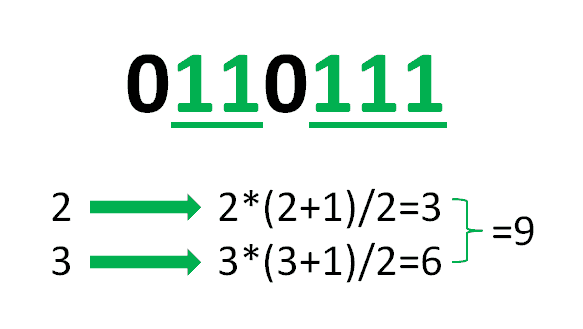

# 仅包含给定字符的子字符串计数

> 原文:[https://www . geesforgeks . org/只包含给定字符的子字符串计数/](https://www.geeksforgeeks.org/count-of-substrings-containing-only-the-given-character/)

给定一个字符串 **S** 和一个字符 **C，**的任务是计算仅包含字符 **C** 的 **S** 的子串数量。
**举例:**

> **输入** : S = "0110111 "，C = '1'
> **输出:** 9
> **解释:**
> 只包含' 1 '的子串为:
> “1”—5 次
> “11”—3 次
> “111”—1 次
> 因此，计数为 9。
> 
> **输入:** S = "geeksforgeeks "，C = ' e '
> T3】输出: 6

**天真方法:**
最简单的方法是[生成给定字符串的所有可能的子串](https://www.geeksforgeeks.org/program-print-substrings-given-string/) **S** 并计算只包含字符 **C.**
***时间复杂度:**O(N<sup>3</sup>)*
***空间复杂度:** O(1)*
**高效方法:** 【T24 因此，对于字符串中字符 **C** 的 **N** 连续出现，生成 **N*(N+1)/2** 子串。因此，迭代字符串的整个长度 **S** 并且对于字符的每个连续子串 **C，**计算它们可能的子串的可能数量，并且添加到可能的子串的总数中。

> **插图:**
> s = " 0111 "，c =‘1’
> 
> [](https://media.geeksforgeeks.org/wp-content/uploads/20200714163245/Screenshot686.png)

以下是上述方法的实现:

## C++

```
// C++ program to implement
// the above approach
#include <bits/stdc++.h>
using namespace std;

// Function that finds the count
// of substrings containing only
// character C in the string S
void countSubString(string S, char C)
{
    // To store total count
    // of substrings
    int count = 0;

    // To store count of
    // consecutive C's
    int conCount = 0;

    // Loop through the string
    for (char ch : S) {

        // Increase the consecutive
        // count of C's
        if (ch == C)
            conCount++;

        else {

            // Add count of sub-strings
            // from consecutive strings
            count += (conCount
                      * (conCount + 1))
                     / 2;

            // Reset the consecutive
            // count of C's
            conCount = 0;
        }
    }

    // Add count of sub-strings from
    // consecutive strings
    count += (conCount
              * (conCount + 1))
             / 2;

    // Print the count of sub-strings
    // containing only C
    cout << count;
}

// Driver Code
int main()
{
    string S = "geeksforgeeks";

    char C = 'e';

    countSubString(S, C);

    return 0;
}
```

## Java 语言(一种计算机语言，尤用于创建网站)

```
// Java program for the above approach
import java.util.*;

class GFG{

// Function that finds the count
// of substrings containing only
// character C in the string S
static void countSubString(String S, char C)
{

    // To store total count
    // of substrings
    int count = 0;

    // To store count of
    // consecutive C's
    int conCount = 0;

    // Loop through the string
    for(int i = 0; i < S.length(); i++)
    {
        char ch = S.charAt(i);

        // Increase the consecutive
        // count of C's
        if (ch == C)
            conCount++;

        else
        {

            // Add count of sub-strings
            // from consecutive strings
            count += (conCount *
                     (conCount + 1)) / 2;

            // Reset the consecutive
            // count of C's
            conCount = 0;
        }
    }

    // Add count of sub-strings from
    // consecutive strings
    count += (conCount *
             (conCount + 1)) / 2;

    // Print the count of sub-strings
    // containing only C
    System.out.println(count);
}

// Driver Code
public static void main(String s[])
{
    String S = "geeksforgeeks";
    char C = 'e';

    countSubString(S, C);
}
}

// This code is contributed by rutvik_56
```

## 蟒蛇 3

```
# Python3 program to implement
# the above approach

# Function that finds the count
# of substrings containing only
# character C in the S
def countSubString(S, C):

    # To store total count
    # of substrings
    count = 0

    # To store count of
    # consecutive C's
    conCount = 0

    # Loop through the string
    for ch in S:

        # Increase the consecutive
        # count of C's
        if (ch == C):
            conCount += 1

        else:

            # Add count of sub-strings
            # from consecutive strings
            count += ((conCount *
                      (conCount + 1)) // 2)

            # Reset the consecutive
            # count of C's
            conCount = 0

    # Add count of sub-strings from
    # consecutive strings
    count += ((conCount *
              (conCount + 1)) // 2)

    # Print the count of sub-strings
    # containing only C
    print(count)

# Driver Code
if __name__ == '__main__':

    S = "geeksforgeeks"
    C = 'e'

    countSubString(S, C)

# This code is contributed by mohit kumar 29
```

## C#

```
// C# program for the above approach 
using System;

class GFG{

// Function that finds the count
// of substrings containing only
// character C in the string S
static void countSubString(String S, char C)
{

    // To store total count
    // of substrings
    int count = 0;

    // To store count of
    // consecutive C's
    int conCount = 0;

    // Loop through the string
    for(int i = 0; i < S.Length; i++)
    {
        char ch = S[i];

        // Increase the consecutive
        // count of C's
        if (ch == C)
            conCount++;

        else
        {

            // Add count of sub-strings
            // from consecutive strings
            count += (conCount *
                     (conCount + 1)) / 2;

            // Reset the consecutive
            // count of C's
            conCount = 0;
        }
    }

    // Add count of sub-strings from
    // consecutive strings
    count += (conCount *
             (conCount + 1)) / 2;

    // Print the count of sub-strings
    // containing only C
    Console.Write(count);
}

// Driver Code
public static void Main(String[] args)
{
    String S = "geeksforgeeks";
    char C = 'e';

    countSubString(S, C);
}
}

// This code is contributed by grand_master
```

## java 描述语言

```
<script>
      // Javascript program for the above approach
      // Function that finds the count
      // of substrings containing only
      // character C in the string S
      function countSubString(S, C) {
        // To store total count
        // of substrings
        var count = 0;

        // To store count of
        // consecutive C's
        var conCount = 0;

        // Loop through the string
        for (var i = 0; i < S.length; i++) {
          var ch = S[i];

          // Increase the consecutive
          // count of C's
          if (ch === C) conCount++;
          else {
            // Add count of sub-strings
            // from consecutive strings
            count += (conCount * (conCount + 1)) / 2;

            // Reset the consecutive
            // count of C's
            conCount = 0;
          }
        }

        // Add count of sub-strings from
        // consecutive strings
        count += (conCount * (conCount + 1)) / 2;

        // Print the count of sub-strings
        // containing only C
        document.write(count);
      }

      // Driver Code
      var S = "geeksforgeeks";
      var C = "e";

      countSubString(S, C);
    </script>
```

**Output:** 

```
6
```

***时间复杂度:** O(N)*
***辅助空间:** O(1)*