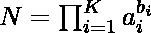
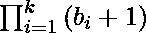
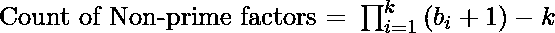

# 给定数目的非质因数的计数

> 原文:[https://www . geeksforgeeks . org/给定数的非质因数的计数/](https://www.geeksforgeeks.org/count-of-the-non-prime-divisors-of-a-given-number/)

给定一个数 **N** ，任务是求给定数 N 的非质因数的个数。

**示例:**

> **输入:** N = 8
> **输出:** 3
> **解释:**
> 8 的除数是–{ 1，2，4，8}
> 非质因数–{ 1，4，8}
> 
> **输入:** N = 20
> **输出:** 4
> **说明:**
> 20 的除数为–{ 1，2，4，5，10，20}
> 非质因数–{ 1，4，10，20}

**方法:**问题中的关键观察是，任何数都可以写成它的素因子的乘积



其中 K 是给定数的质因数的计数。利用[排列组合](https://www.geeksforgeeks.org/permutation-and-combination/)我们可以发现
因子的总数为



因此，非质因数的计数将是:



下面是上述方法的实现:

## C++

```
// C++ program to find count of
// non-prime divisors of given number

#include <bits/stdc++.h>
using namespace std;

// Function to factors of the given
// number
vector<int> getFactorization(int x)
{
    int count = 0;
    vector<int> v;

    // Loop to find the divisors of
    // the number 2
    while (x % 2 == 0) {
        count++;
        x = x / 2;
    }
    if (count != 0)
        v.push_back(count);

    // Loop to find the divisors of the
    // given number upto SQRT(N)
    for (int i = 3; i <= sqrt(x); i += 2) {
        count = 0;
        while (x % i == 0) {
            count++;
            x /= i;
        }
        if (count != 0)
            v.push_back(count);
    }

    // Condition to check if the rest
    // number is also a prime number
    if (x > 1) {
        v.push_back(1);
    }
    return v;
}

// Function to find the non-prime
// divisors of the given number
int nonPrimeDivisors(int N)
{
    vector<int> v = getFactorization(N);
    int ret = 1;

    // Loop to count the number of
    // the total divisors of given number
    for (int i = 0; i < v.size(); i++)
        ret = ret * (v[i] + 1);

    ret = ret - v.size();
    return ret;
}

// Driver Code
int main()
{
    int N = 8;

    // Function Call
    cout << nonPrimeDivisors(N) << endl;
    return 0;
}
```

## Java 语言(一种计算机语言，尤用于创建网站)

```
// Java program to find
// count of non-prime
// divisors of given number
import java.util.*;
class GFG{

// Function to factors
// of the given number
static Vector<Integer> getFactorization(int x)
{
  int count = 0;
  Vector<Integer> v = new Vector<>();

  // Loop to find the
  // divisors of the number 2
  while (x % 2 == 0)
  {
    count++;
    x = x / 2;
  }

  if (count != 0)
    v.add(count);

  // Loop to find the divisors
  // of the given number upto SQRT(N)
  for (int i = 3;
           i <= Math.sqrt(x); i += 2)
  {
    count = 0;
    while (x % i == 0)
    {
      count++;
      x /= i;
    }

    if (count != 0)
      v.add(count);
  }

  // Condition to check if
  // the rest number is also
  // a prime number
  if (x > 1)
  {
    v.add(1);
  }
  return v;
}

// Function to find the non-prime
// divisors of the given number
static int nonPrimeDivisors(int N)
{
  Vector<Integer> v = getFactorization(N);
  int ret = 1;

  // Loop to count the number of
  // the total divisors of given number
  for (int i = 0; i < v.size(); i++)
    ret = ret * (v.get(i) + 1);

  ret = ret - v.size();
  return ret;
}

// Driver Code
public static void main(String[] args)
{
  int N = 8;

  // Function Call
  System.out.println(nonPrimeDivisors(N));
}
}

// This code is contributed by shikhasingrajput
```

## 蟒蛇 3

```
# Python3 program to find count of
# non-prime divisors of given number
from math import sqrt

# Function to factors of the given
# number
def getFactorization(x):

    count = 0
    v = []

    # Loop to find the divisors of
    # the number 2
    while (x % 2 == 0):
        count += 1
        x = x // 2

    if (count != 0):
        v.append(count)

    # Loop to find the divisors of the
    # given number upto SQRT(N)
    for i in range(3, int(sqrt(x)) + 12):
        count = 0

        while (x % i == 0):
            count += 1
            x //= i

        if (count != 0):
            v.append(count)

    # Condition to check if the rest
    # number is also a prime number
    if (x > 1):
        v.append(1)

    return v

# Function to find the non-prime
# divisors of the given number
def nonPrimeDivisors(N):

    v = getFactorization(N)
    ret = 1

    # Loop to count the number of
    # the total divisors of given number
    for i in range(len(v)):
        ret = ret * (v[i] + 1)
    ret = ret - len(v)

    return ret

# Driver Code
if __name__ == '__main__':

    N = 8

    # Function Call
    print(nonPrimeDivisors(N))

# This code is contributed by Samarth
```

## C#

```
// C# program to find
// count of non-prime
// divisors of given number
using System;
using System.Collections.Generic;
class GFG{

// Function to factors
// of the given number
static List<int> getFactorization(int x)
{
  int count = 0;
  List<int> v = new List<int>();

  // Loop to find the
  // divisors of the number 2
  while (x % 2 == 0)
  {
    count++;
    x = x / 2;
  }

  if (count != 0)
    v.Add(count);

  // Loop to find the divisors
  // of the given number upto
  // SQRT(N)
  for (int i = 3;
           i <= Math.Sqrt(x); i += 2)
  {
    count = 0;
    while (x % i == 0)
    {
      count++;
      x /= i;
    }

    if (count != 0)
      v.Add(count);
  }

  // Condition to check if
  // the rest number is also
  // a prime number
  if (x > 1)
  {
    v.Add(1);
  }
  return v;
}

// Function to find the non-prime
// divisors of the given number
static int nonPrimeDivisors(int N)
{
  List<int> v = getFactorization(N);
  int ret = 1;

  // Loop to count the number of
  // the total divisors of given number
  for (int i = 0; i < v.Count; i++)
    ret = ret * (v[i] + 1);

  ret = ret - v.Count;
  return ret;
}

// Driver Code
public static void Main(String[] args)
{
  int N = 8;

  // Function Call
  Console.WriteLine(nonPrimeDivisors(N));
}
}

// This code is contributed by gauravrajput1
```

## java 描述语言

```
<script>

// Javascript program to find
// count of non-prime
// divisors of given number

// Function to factors
// of the given number
function getFactorization(x)
{
      let count = 0;
      let v = [];

      // Loop to find the
      // divisors of the number 2
      while (x % 2 == 0)
      {
        count++;
        x = Math.floor(x / 2);
      }

      if (count != 0)
        v.push(count);

      // Loop to find the divisors
      // of the given number upto
      // SQRT(N)
      for (let i = 3;
        i <= Math.floor(Math.sqrt(x)); i += 2)
      {
        count = 0;
        while (x % i == 0)
        {
              count++;
              x = Math.floor(x / i);
        }

        if (count != 0)
          v.push(count);
      }

      // Condition to check if
      // the rest number is also
      // a prime number
      if (x > 1)
      {
        v.push(1);
      }
      return v;
}

// Function to find the non-prime
// divisors of the given number
function nonPrimeDivisors(N)
{
      let v = getFactorization(N);
      let ret = 1;

      // Loop to count the number of
      // the total divisors of given number
      for (let i = 0; i < v.length; i++)
        ret = ret * (v[i] + 1);

      ret = ret - v.length;
      return ret;
}

// Driver Code

    let N = 8;

  // Function Call
  document.write(nonPrimeDivisors(N));

</script>
```

**Output:** 

```
3
```