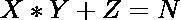
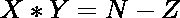

# 第三个数等于 N 的任意两个数乘积之和为 3 的三胞胎数

> 原文:[https://www . geesforgeks . org/三胞胎计数-任意两个数字的乘积之和-第三个数字等于 n/](https://www.geeksforgeeks.org/count-of-triplets-having-sum-of-product-of-any-two-numbers-with-the-third-number-equal-to-n/)

给定一个正整数 **N** ，任务是求三元组 **(X，Y，Z)** 的个数，使得任意两个数与第三个数的[乘积之和为 **N** 。](https://www.geeksforgeeks.org/product-2-numbers-using-recursion/)

**示例:**

> **输入:** N = 2
> **输出:** 1
> **解释:**
> 唯一满足给定标准的三元组是(1，1，1)。因此，计数为 1。
> 
> **输入:**N = 3
> T3】输出: 3

**方法:**这个给定的问题可以通过重新排列如下等式来解决:

> 那么考虑一个三元组为(X，Y，Z)
> 
> => 
> = > 

从上面的方程来看，思想是在范围**【1，N】**上迭代 **Z** 的所有可能值，并通过计算满足上面方程的(N–Z)的 [**质因数，加上 **X** 和 **Y** 的所有可能值的计数。按照以下步骤解决问题:**](https://www.geeksforgeeks.org/prime-factorization-using-sieve-olog-n-multiple-queries/)

*   初始化一个变量**计数三元组**以存储满足给定标准的三元组的结果计数。
*   使用伊拉斯托涅的[筛，找出范围内所有元素的](https://www.geeksforgeeks.org/sieve-of-eratosthenes/)[最小质因数](https://www.geeksforgeeks.org/smallest-prime-divisor-of-a-number/)**【1，10<sup>5</sup>**。
*   使用变量迭代范围**【1，N】**，说出 **K** 并执行以下步骤:
    *   使用本文[中讨论的方法](https://www.geeksforgeeks.org/prime-factorization-using-sieve-olog-n-multiple-queries/)找到乘积为**(N–K)**的对的数量，并将获得的计数添加到变量**计数三元组**中。
*   完成上述步骤后，打印**计数三元组**的值作为三元组的合成计数。

下面是上述方法的实现:

## C++

```
// C++ program for the above approach
#include<bits/stdc++.h>
using namespace std;

vector<int> s(11,0);

// Function to find the SPF[i] using the
// Sieve Of Erastothenes
void sieveOfEratosthenes(int N){

    // Stores whether i is prime or not
    bool prime[N+1];
    memset(prime,false,sizeof(false));

    // Initializing smallest factor as
    // 2 for all even numbers
    for (int i=2;i< N + 1; i+=2)
        s[i] = 2;

    // Iterate for all odd numbers < N
    for(int i =3;i<N + 1;i+=2){
        if (prime[i] == false){

            // SPF of i for a prime is
            // the number itself
            s[i] = i;

            // Iterate for all the multiples
            // of the current prime number
            for(int j= i;j< N / i + 1; j+=2){
                if (prime[i * j] == false){
                    prime[i * j] = true;

                    // The value i is smallest
                    // prime factor for i * j
                    s[i * j] = i;
                }
            }
        }
    }
}

// Function to generate prime factors
// and its power
int generatePrimeFactors(int N){
   // Current prime factor of N
    int curr = s[N];

    // Stores the powers of the current
    // prime factor
    map<int,int> cnt;
    cnt[s[N]] = 1;

    // Find all the prime factors and
    // their powers
    while (N > 1){
        N /= s[N];
        if (N and s[N])
            if(cnt.find(s[N]) == cnt.end())
                cnt[s[N]] = 1;
            else
                cnt[s[N]] += 1;

    }

    if (cnt.find(0) != cnt.end())
        cnt.erase(0);

    int totfactor = 1;

    for (auto i: cnt)
        totfactor *= i.second + 1;

    // Return the total count of factors
    return totfactor; 
}

// Function to count the number of triplets
// satisfying the given criteria
int countTriplets(int N){

    // Stores the count of resultant triplets
    int CountTriplet = 0;

    for (int z=1;z<N + 1;z++){

        // Add the count all factors of N-z
        // to the variable CountTriplet
        int p = generatePrimeFactors(N-z);
        if (p > 1)
            CountTriplet += p;
    }

    // Return total count of triplets
    return CountTriplet + 1;  

  }

// Driver Code
int main(){

int N = 10;

// S[i] stores the smallest prime factor
// for each element i

// Find the SPF[i]
sieveOfEratosthenes(N);

// Function Call
cout<<countTriplets(N);

}

// This code is contributed by SURENDRA_GANGWAR.
```

## Java 语言(一种计算机语言，尤用于创建网站)

```
// Java program for the above approach
import java.util.*;
class GFG{

static int[] s = new int[11];

// Function to find the SPF[i] using the
// Sieve Of Erastothenes
static void sieveOfEratosthenes(int N){

    // Stores whether i is prime or not
    boolean []prime = new boolean[N+1];

    // Initializing smallest factor as
    // 2 for all even numbers
    for (int i = 2; i < N + 1; i += 2)
        s[i] = 2;

    // Iterate for all odd numbers < N
    for(int i = 3; i < N + 1; i += 2){
        if (prime[i] == false){

            // SPF of i for a prime is
            // the number itself
            s[i] = i;

            // Iterate for all the multiples
            // of the current prime number
            for(int j= i; j < N / i + 1; j += 2){
                if (prime[i * j] == false){
                    prime[i * j] = true;

                    // The value i is smallest
                    // prime factor for i * j
                    s[i * j] = i;
                }
            }
        }
    }
}

// Function to generate prime factors
// and its power
static int generatePrimeFactors(int N){
   // Current prime factor of N
    int curr = s[N];

    // Stores the powers of the current
    // prime factor
    HashMap<Integer,Integer> cnt = new HashMap<>();
    cnt.put(s[N],1);

    // Find all the prime factors and
    // their powers
    while (N > 1){
        N /= s[N];
        if (N != 0 && s[N] != 0)
            if(!cnt.containsKey(s[N]))
                cnt.put(s[N], 1);
            else
                cnt.put(s[N], cnt.get(s[N]) + 1);

    }

    if (cnt.containsKey(0))
        cnt.remove(0);

    int totfactor = 1;

        for (Map.Entry<Integer,Integer> i : cnt.entrySet())
        totfactor *= i.getValue() + 1;

    // Return the total count of factors
    return totfactor; 
}

// Function to count the number of triplets
// satisfying the given criteria
static int countTriplets(int N){

    // Stores the count of resultant triplets
    int CountTriplet = 0;

    for (int z=1;z<N + 1;z++){

        // Add the count all factors of N-z
        // to the variable CountTriplet
        int p = generatePrimeFactors(N-z);
        if (p > 1)
            CountTriplet += p;
    }

    // Return total count of triplets
    return CountTriplet + 1;  

  }

// Driver Code
public static void main(String[] args){

int N = 10;

// S[i] stores the smallest prime factor
// for each element i

// Find the SPF[i]
sieveOfEratosthenes(N);

// Function Call
System.out.print(countTriplets(N));
}
}

// This code is contributed by gauravrajput1
```

## 蟒蛇 3

```
# Python program for the above approach

# Function to find the SPF[i] using the
# Sieve Of Erastothenes
def sieveOfEratosthenes(N, s):

    # Stores whether i is prime or not
    prime = [False] * (N + 1)

    # Initializing smallest factor as
    # 2 for all even numbers
    for i in range(2, N + 1, 2):
        s[i] = 2

    # Iterate for all odd numbers < N
    for i in range(3, N + 1, 2):
        if (prime[i] == False):

            # SPF of i for a prime is
            # the number itself
            s[i] = i

            # Iterate for all the multiples
            # of the current prime number
            for j in range(i, int(N / i) + 1, 2):
                if (prime[i * j] == False):
                    prime[i * j] = True

                    # The value i is smallest
                    # prime factor for i * j
                    s[i * j] = i

# Function to generate prime factors
# and its power
def generatePrimeFactors(N):

    # Current prime factor of N
    curr = s[N]

    # Stores the powers of the current
    # prime factor
    cnt = {s[N]:1}

    # Find all the prime factors and
    # their powers
    while (N > 1):

        N //= s[N]
        if N and s[N]:
            if cnt.get(s[N], 0) == 0:
                cnt[s[N]] = 1
            else:
                cnt[s[N]] += 1

    if 0 in cnt:
        cnt.pop(0)

    totfactor = 1

    for i in cnt.values():
        totfactor *= i + 1

    # Return the total count of factors
    return totfactor 

# Function to count the number of triplets
# satisfying the given criteria
def countTriplets(N):

    # Stores the count of resultant triplets
    CountTriplet = 0

    for z in range(1, N + 1):

        # Add the count all factors of N-z
        # to the variable CountTriplet
        p = generatePrimeFactors(N-z)
        if p > 1:
            CountTriplet += p 

    # Return total count of triplets
    return CountTriplet + 1   

# Driver Code
N = 10

# S[i] stores the smallest prime factor
# for each element i
s = [0] * (N + 1)

# Find the SPF[i]
sieveOfEratosthenes(N, s)

# Function Call
print(countTriplets(N))
```

## java 描述语言

```
<script>
// Javascript program for the above approach
let s = new Array(11).fill(0)

// Function to find the SPF[i] using the
// Sieve Of Erastothenes
function sieveOfEratosthenes(N){

    // Stores whether i is prime or not
    let prime = new Array(N+1).fill(false);

    // Initializing smallest factor as
    // 2 for all even numbers
    for (let i = 2; i < N + 1; i += 2)
        s[i] = 2;

    // Iterate for all odd numbers < N
    for(let i = 3; i < N + 1; i += 2){
        if (prime[i] == false){

            // SPF of i for a prime is
            // the number itself
            s[i] = i;

            // Iterate for all the multiples
            // of the current prime number
            for(let j= i; j < Math.floor(N / i + 1); j += 2){
                if (prime[i * j] == false){
                    prime[i * j] = true;

                    // The value i is smallest
                    // prime factor for i * j
                    s[i * j] = i;
                }
            }
        }
    }
}

// Function to generate prime factors
// and its power
function generatePrimeFactors(N)
{

   // Current prime factor of N
    let curr = s[N];

    // Stores the powers of the current
    // prime factor
    let cnt = new Map();
    cnt.set(s[N],1);

    // Find all the prime factors and
    // their powers
    while (N > 1){
        N = Math.floor(N / s[N]);
        if (N != 0 && s[N] != 0)
            if(!cnt.has(s[N]))
                cnt.set(s[N], 1);
            else
                cnt.set(s[N], cnt.get(s[N]) + 1);
    }

    if (cnt.has(0))
        cnt.delete(0);

    let totfactor = 1;

        for (i of cnt.values())
        totfactor *= i + 1;

    // Return the total count of factors
    return totfactor; 
}

// Function to count the number of triplets
// satisfying the given criteria
function countTriplets(N){

    // Stores the count of resultant triplets
    let CountTriplet = 0;

    for (let z=1;z<N + 1;z++){

        // Add the count all factors of N-z
        // to the variable CountTriplet
        let p = generatePrimeFactors(N-z);
        if (p > 1)
            CountTriplet += p;
    }

    // Return total count of triplets
    return CountTriplet + 1;  

  }

// Driver Code
let N = 10;

// S[i] stores the smallest prime factor
// for each element i

// Find the SPF[i]
sieveOfEratosthenes(N);

// Function Call
document.write((countTriplets(N)));

// This code is contributed by _saurabh_jaiswal

</script>
```

**Output:** 

```
23
```

***时间复杂度:** O(N*log N)*
***辅助空间:** O(N)*