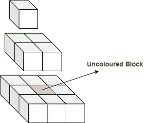
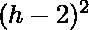

# 使用立方体形成的长度为 H 的金字塔中未着色细胞的数量

> 原文:[https://www . geeksforgeeks . org/使用立方体形成的长度为 h 的金字塔中未着色细胞的数量/](https://www.geeksforgeeks.org/count-of-uncolored-cells-in-a-pyramid-of-length-h-formed-using-cubes/)

给定一个金字塔，使用单位面积立方体形成，具有给定的高度 **H.** 然后将金字塔放置在地面上，从外部进行喷涂。任务是找出未着色的立方体的数量。

**示例:**

> **输入:** H = 3
> **输出:** 1
> **解释:**
> 
> 
> 
> **输入:**H = 1
> T3】输出: 0

**天真方法:**将保持未着色的立方体的数量是金字塔边界中不存在的立方体的数量。因此，对于高度为 **h** 的每一层立方体，未着色立方体的数量为其中 **h > 1** 。所以，把每一层的未着色立方体的数量加起来就可以得到答案。

下面是上述方法的实现:

## C++

```
// C++ program for the above problem

#include <bits/stdc++.h>
using namespace std;

// Function to return the number of
// uncoloured cubes
int uncolouredCubes(int H)
{

    // To store the number of uncoloured
    // cubes
    int res = 0;

    for (int h = 2; h <= H; h++) {
        res += (h - 2) * (h - 2);
    }

    return res;
}

// Driver Code
int main()
{
    int H = 3;
    cout << uncolouredCubes(H);
}
```

## Java 语言(一种计算机语言，尤用于创建网站)

```
// Java program for the above problem

class GFG{

  // Function to return the number of
  // uncoloured cubes
  static int uncolouredCubes(int H)
  {

      // To store the number of uncoloured
      // cubes
      int res = 0;

      for (int h = 2; h <= H; h++) {
          res += (h - 2) * (h - 2);
      }

      return res;
  }

  // Driver Code
  public static void main(String [] args)
  {
      int H = 3;
      System.out.println(uncolouredCubes(H));
  }

}

// This code is contributed by ihritik
```

## 蟒蛇 3

```
# python program for the above problem

# Function to return the number of
# uncoloured cubes
def uncolouredCubes(H):

    # To store the number of uncoloured
    # cubes
    res = 0

    for h in range(2, H + 1):
        res = res + (h - 2) * (h - 2)

    return res

# Driver Code

H = 3
print(uncolouredCubes(H))

# This code is contributed by ihritik
```

## C#

```
// C# program for the above problem

using System;
class GFG{

  // Function to return the number of
  // uncoloured cubes
  static int uncolouredCubes(int H)
  {

      // To store the number of uncoloured
      // cubes
      int res = 0;

      for (int h = 2; h <= H; h++) {
          res += (h - 2) * (h - 2);
      }

      return res;
  }

  // Driver Code
  public static void Main()
  {
      int H = 3;
      Console.WriteLine(uncolouredCubes(H));
  }

}

// This code is contributed by ihritik
```

## java 描述语言

```
<script>
// JavaScript program for the above problem

// Function to return the number of
// uncoloured cubes
function uncolouredCubes(H){

    // To store the number of uncoloured
    // cubes
    var res = 0

    for(var h = 2 ; h < H + 1; h++)
        res = res + (h - 2) * (h - 2)

    return res
}

// Driver Code

var H = 3
document.write(uncolouredCubes(H))

// This code is contributed by AnkThon
</script>
```

**Output**

```
1
```

**时间复杂度:**O(N)
T3】辅助空间: O(1)

**有效途径:**由于每层高度 **h** 的未着色立方体数量为，所以这个问题可以归结为求第一个 **(H-2)** 自然数的平方的[和。所以，答案是 **(n * (n + 1) * (2n + 1)) / 6** ，其中 **n=H-2** 。](https://www.geeksforgeeks.org/sum-square-sums-first-n-natural-numbers/)

## C++

```
// C++ program for the above problem

#include <bits/stdc++.h>
using namespace std;

// Function to return the number of
// uncoloured cubes
int uncolouredCubes(int H)
{

    // If H is less than 2, then
    // returning 0
    if (H < 2) {
        return 0;
    }

    int n = H - 2;

    // Sum of the squares of first
    // n natural numbers
    return (n * (n + 1) * (2 * n + 1)) / 6;
}

// Driver Code
int main()
{
    int H = 3;
    cout << uncolouredCubes(H);
}
```

## Java 语言(一种计算机语言，尤用于创建网站)

```
// Java program for the above problem
import java.util.*;
public class GFG
{

// Function to return the number of
// uncoloured cubes
static int uncolouredCubes(int H)
{

    // If H is less than 2, then
    // returning 0
    if (H < 2) {
        return 0;
    }
    int n = H - 2;

    // Sum of the squares of first
    // n natural numbers
    return (n * (n + 1) * (2 * n + 1)) / 6;
}

// Driver Code
public static void main(String args[])
{
    int H = 3;
    System.out.println(uncolouredCubes(H));
}
}

// This code is contributed by Samim Hossain Mondal
```

## 蟒蛇 3

```
# Python program for the above problem

# Function to return the number of
# uncoloured cubes
def uncolouredCubes(H):

  # If H is less than 2, then
  # returning 0
    if (H < 2):
        return 0;

    n = H - 2;

    # Sum of the squares of first
    # n natural numbers
    return (n * (n + 1) * (2 * n + 1)) / 6;

# Driver Code
H = 3;
print((int)(uncolouredCubes(H)));

# This code is contributed by Saurabh Jaiswal.
```

## C#

```
// C# program for the above problem
using System;
class GFG
{
// Function to return the number of
// uncoloured cubes
static int uncolouredCubes(int H)
{
    // If H is less than 2, then
    // returning 0
    if (H < 2) {
        return 0;
    }
    int n = H - 2;

    // Sum of the squares of first
    // n natural numbers
    return (n * (n + 1) * (2 * n + 1)) / 6;
}

// Driver Code
public static void Main()
{
    int H = 3;
    Console.Write(uncolouredCubes(H));
}
}
// This code is contributed by Samim Hossain Mondal
```

## java 描述语言

```
// Javascript program for the above problem

// Function to return the number of
// uncoloured cubes
function uncolouredCubes(H)
{

  // If H is less than 2, then
  // returning 0
  if (H < 2) {
    return 0;
  }

  let n = H - 2;

  // Sum of the squares of first
  // n natural numbers
  return (n * (n + 1) * (2 * n + 1)) / 6;
}

// Driver Code

let H = 3;
document.write(uncolouredCubes(H));

// This code is contributed by gfgking.
```

**Output**

```
1
```

**时间复杂度:**O(1)
T3】辅助空间: O(1)