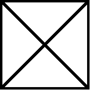
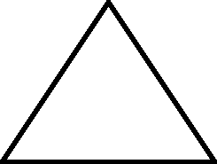

# 平面上 N 个点之间唯一直接路径的计数

> 原文:[https://www . geesforgeks . org/count-of-unique-direct-path-in-n-points-on-a-plane/](https://www.geeksforgeeks.org/count-of-unique-direct-path-between-n-points-on-a-plane/)

给定平面上的 **N 个**点，其中每个点都有一条直接路径连接到不同的点，任务是计算点之间唯一直接路径的总数。

**注意:**的 **N** 的值永远大于 **2** 。

**示例:**

> **输入:** N = 4
> **输出:** 6
> **解释:**把 4 个点想象成一个 4 边多边形。将有 4 条直接路径(多边形的边)和 2 条对角线(多边形的对角线)。因此，答案将是 6 条直接路径。
> 
> [](https://media.geeksforgeeks.org/wp-content/uploads/20210930213331/GFG1.png)
> 
> **输入:** N = 3
> **输出:** 3
> **解释:**把 3 个点想象成一个 3 边多边形。将有 3 条直接路径(多边形的边)和 0 条对角线(多边形的对角线)。因此，答案将是 3 条直接路径。
> 
> [](https://media.geeksforgeeks.org/wp-content/uploads/20210930213520/gfg2.png)

**方法:**给定的问题可以通过观察来解决，对于任何 **N** 边都有**(边数+对角线数)**直接路径。对于任何 **N-** 边多边形，都有 **N** 边和**N *(N–3)/2**对角线。因此，直接路径的总数由**N+(N *(N–3))/2**给出。

下面是上述方法的实现:

## C++

```
// C++ program for the above approach
#include <bits/stdc++.h>
using namespace std;

// Function to count the total number
// of direct paths
int countDirectPath(int N)
{
    return N + (N * (N - 3)) / 2;
}

// Driver Code
int main()
{

    int N = 5;
    cout << countDirectPath(N);

    return 0;
}
```

## Java 语言(一种计算机语言，尤用于创建网站)

```
// Java program for the above approach
import java.io.*;
class GFG
{

// Function to count the total number
// of direct paths
static int countDirectPath(int N)
{
    return N + (N * (N - 3)) / 2;
}

// Driver Code
public static void main(String []args)
{

    int N = 5;
    System.out.print(countDirectPath(N));

}
}

// This code is contributed by shivanisinghss2110
```

## 蟒蛇 3

```
# python program for the above approach

# Function to count the total number
# of direct paths
def countDirectPath(N):

    return N + (N * (N - 3)) // 2

# Driver Code
if __name__ == "__main__":

    N = 5
    print(countDirectPath(N))

# This code is contributed by rakeshsahni
```

## C#

```
// C# program for the above approach
using System;

public class GFG
{

    // Function to count the total number
    // of direct paths
    static int countDirectPath(int N)
    {
        return N + (N * (N - 3)) / 2;
    }

    // Driver Code
    public static void Main(string []args)
    {

        int N = 5;
        Console.Write(countDirectPath(N));

    }
}

// This code is contributed by AnkThon
```

## java 描述语言

```
<script>
        // JavaScript Program to implement
        // the above approach

        // Function to count the total number
        // of direct paths
        function countDirectPath(N) {
            return N + Math.floor((N * (N - 3)) / 2);
        }

        // Driver Code
        let N = 5;
        document.write(countDirectPath(N));

// This code is contributed by Potta Lokesh
    </script>
```

**Output:** 

```
10
```

***时间复杂度:**O(1)*
T5**辅助空间:** O(1)