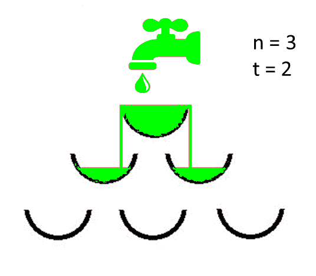
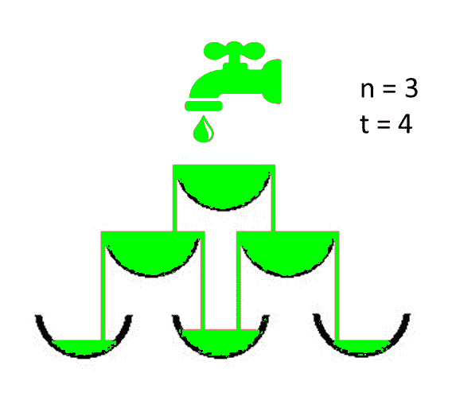

# 给定时间后完全充满的血管数

> 原文:[https://www . geeksforgeeks . org/给定时间后完全充满的血管数/](https://www.geeksforgeeks.org/count-of-vessels-completely-filled-after-a-given-time/)

给定两个整数 **N** 和 **T** 分别表示级别数和秒数，任务是在给定条件下 **T** 秒后找到完全充满的血管数:

*   **N** 级的血管结构是这样的，每一级的血管数量等于该级的数量，即 **1、2、3、…直到 N** 。
*   每个容器最多可以储存 1 个单位的水，每秒钟有 1 个单位的水从水龙头以恒定的速度流出。
*   如果容器变满，那么水开始从其中流出，并倾泻在容器的边缘，并均匀地分布在紧接其下的两个相连的容器上。

**假设:**

1.  所有的物体都沿着水平轴对称排列。
2.  所有级别的间距相等。
3.  水对称地流过容器的两个边缘。

**示例:**

> **输入:** N = 3，T = 2
> **输出:** 1
> **解释:**
> 打开水龙头后 T = 2 时 N = 3 的结构视图
> 
> [](https://media.geeksforgeeks.org/wp-content/uploads/20200728191432/out.png)
> 
> **输入:** N = 3，T = 4
> **输出:** 3
> **解释:**
> 打开水龙头后 T = 4 时 N = 3 的结构视图
> 
> [](https://media.geeksforgeeks.org/wp-content/uploads/20200728191701/out.png)

**天真方法:**解决问题最简单的方法是检查是否有可能在 **T** 秒内完全充满 **x** 血管。如果发现是真的，则检查 **x+1** 个血管，以此类推，得到 **x** 的最大值。
***时间复杂度:**O(N<sup>3</sup>)*
***辅助空间:** O(1)*

**高效方法:**上述方法可以使用[动态规划](https://www.geeksforgeeks.org/dynamic-programming/)进行优化。按照以下步骤解决问题:

1.  将容器结构存储在[矩阵](https://www.geeksforgeeks.org/matrix/)中，比如 **M** ，其中**M【I】【j】**表示 **i <sup>第</sup>层**中的 **j <sup>第</sup>容器**。
2.  对于任何船只 **M[i][j]** ，紧接在下一级的相连船只为 **M[i + 1][j]** 和 **M[i + 1][j + 1]** 。
3.  最初，将所有水放入第一个容器中，即 **M[0][0] = t** 。
4.  从最顶端的容器开始，每增加一个单位时间，重新计算矩阵的状态，即 **M[0][0] = t** 。
5.  如果水量超过容器的容积，从容器中流出的水量被分成 2 等份
6.  填充两个相连容器的零件位于紧邻的较低位置。

## C++

```
// C++ program to implement 
// the above approach 
#include <bits/stdc++.h> 
using namespace std; 

int n, t;

// Function to find the number of
// completely filled vessels
int FindNoOfFullVessels(int n, int t)
{

    // Store the vessels
    double Matrix[n][n];

    // Assuming all water is present
    // in the vessel at the first level
    Matrix[0][0] = t * 1.0;

    // Store the number of vessel
    // that are completely full
    int ans = 0;

    // Traverse all the levels
    for(int i = 0; i < n; i++)
    {

        // Number of vessel at each
        // level is j
        for(int j = 0; j <= i; j++)
        {

            // Calculate the exceeded
            // amount of water
            double exceededwater = Matrix[i][j] - 1.0;

            // If current vessel has
            // less than 1 unit of
            // water then continue
            if (exceededwater < 0)
                continue;

            // One more vessel is full
            ans++;

            // If left bottom vessel present
            if (i + 1 < n)
                Matrix[i + 1][j] += exceededwater / 2;

            // If right bottom vessel present
            if (i + 1 < n && j + 1 < n)
                Matrix[i + 1][j + 1] += exceededwater / 2;
        }
    }
    return ans;
}

// Driver Code
int main()
{

    // Number of levels
    int N = 3;

    // Number of seconds
    int T = 4;

    // Function call
    cout << FindNoOfFullVessels(N, T) << endl;

    return 0;
}

// This code is contributed by sanjoy_62
```

## Java 语言(一种计算机语言，尤用于创建网站)

```
// Java Program to implement
// the above approach

import java.io.*;
import java.util.*;

class GFG {

    static int n, t;

    // Function to find the number of
    // completely filled vessels
    public static int
    FindNoOfFullVessels(int n, int t)
    {
        // Store the vessels
        double Matrix[][]
            = new double[n][n];

        // Assuming all water is present
        // in the vessel at the first level
        Matrix[0][0] = t * 1.0;

        // Store the number of vessel
        // that are completely full
        int ans = 0;

        // Traverse all the levels
        for (int i = 0; i < n; i++) {

            // Number of vessel at each
            // level is j
            for (int j = 0; j <= i; j++) {

                // Calculate the exceeded
                // amount of water
                double exceededwater
                    = Matrix[i][j] - 1.0;

                // If current vessel has
                // less than 1 unit of
                // water then continue
                if (exceededwater < 0)
                    continue;

                // One more vessel is full
                ans++;

                // If left bottom vessel present
                if (i + 1 < n)
                    Matrix[i + 1][j]
                        += exceededwater / 2;

                // If right bottom vessel present
                if (i + 1 < n && j + 1 < n)
                    Matrix[i + 1][j + 1]
                        += exceededwater / 2;
            }
        }

        return ans;
    }

    // Driver Code
    public static void main(String[] args)
    {
        // Number of levels
        int N = 3;

        // Number of seconds
        int T = 4;

        // Function call
        System.out.println(
            FindNoOfFullVessels(N, T));
    }
}
```

## 蟒蛇 3

```
# Python3 program to implement    
# the above approach    

# Function to find the number of    
# completely filled vessels    
def FindNoOfFullVessels(n, t) :    

    # Store the vessels    
    Matrix = [[0 for i in range(n)] for j in range(n)]   

    # Assuming all water is present    
    # in the vessel at the first level    
    Matrix[0][0] = t * 1.0    

    # Store the number of vessel    
    # that are completely full    
    ans = 0    

    # Traverse all the levels    
    for i in range(n) :   

        # Number of vessel at each    
        # level is j    
        for j in range(i + 1) :   

            # Calculate the exceeded    
            # amount of water    
            exceededwater = Matrix[i][j] - 1.0    

            # If current vessel has    
            # less than 1 unit of    
            # water then continue    
            if (exceededwater < 0) :   
                continue   

            # One more vessel is full    
            ans += 1    

            # If left bottom vessel present    
            if (i + 1 < n) :    
                Matrix[i + 1][j] += exceededwater / 2   

            # If right bottom vessel present    
            if (i + 1 < n and j + 1 < n) :   
                Matrix[i + 1][j + 1] += exceededwater / 2    
    return ans   

# Number of levels    
N = 3   

# Number of seconds    
T = 4   

# Function call    
print(FindNoOfFullVessels(N, T))

# This code is contributed by divyesh072019
```

## C#

```
// C# program to implement 
// the above approach 
using System; 

class GFG{

//static int n, t;

// Function to find the number of
// completely filled vessels
public static int FindNoOfFullVessels(int n, 
                                      int t)
{

    // Store the vessels
    double[,] Matrix = new double[n, n];

    // Assuming all water is present
    // in the vessel at the first level
    Matrix[0, 0] = t * 1.0;

    // Store the number of vessel
    // that are completely full
    int ans = 0;

    // Traverse all the levels
    for(int i = 0; i < n; i++)
    {

        // Number of vessel at each
        // level is j
        for(int j = 0; j <= i; j++) 
        {

            // Calculate the exceeded
            // amount of water
            double exceededwater = Matrix[i, j] - 1.0;

            // If current vessel has
            // less than 1 unit of
            // water then continue
            if (exceededwater < 0)
                continue;

            // One more vessel is full
            ans++;

            // If left bottom vessel present
            if (i + 1 < n)
                Matrix[i + 1, j] += exceededwater / 2;

            // If right bottom vessel present
            if (i + 1 < n && j + 1 < n)
                Matrix[i + 1, j + 1] += exceededwater / 2;
        }
    }
    return ans;
}

// Driver Code
public static void Main()
{

    // Number of levels
    int N = 3;

    // Number of seconds
    int T = 4;

    // Function call
    Console.WriteLine(FindNoOfFullVessels(N, T));
}
}

// This code is contributed by sanjoy_62
```

## java 描述语言

```
<script>

// JavaScript program to implement 
// the above approach 

var n, t;

// Function to find the number of
// completely filled vessels
function FindNoOfFullVessels(n, t)
{

    // Store the vessels
    var Matrix = Array.from(Array(n), ()=> Array(n).fill(0));

    // Assuming all water is present
    // in the vessel at the first level
    Matrix[0][0] = t * 1.0;

    // Store the number of vessel
    // that are completely full
    var ans = 0;

    // Traverse all the levels
    for(var i = 0; i < n; i++)
    {

        // Number of vessel at each
        // level is j
        for(var j = 0; j <= i; j++)
        {

            // Calculate the exceeded
            // amount of water
            var exceededwater = Matrix[i][j] - 1;

            // If current vessel has
            // less than 1 unit of
            // water then continue
            if (exceededwater < 0)
                continue;

            // One more vessel is full
            ans++;

            // If left bottom vessel present
            if (i + 1 < n)
                Matrix[i + 1][j] += (exceededwater / 2);

            // If right bottom vessel present
            if (i + 1 < n && j + 1 < n)
                Matrix[i + 1][j + 1] += (exceededwater / 2);
        }
    }
    return ans;
}

// Driver Code
// Number of levels
var N = 3;

// Number of seconds
var T = 4;

// Function call
document.write( FindNoOfFullVessels(N, T));

</script>
```

**输出:**

```
3
```

**时间复杂度:**O(N<sup>2</sup>)
T5】空间复杂度: O(N <sup>2</sup> )