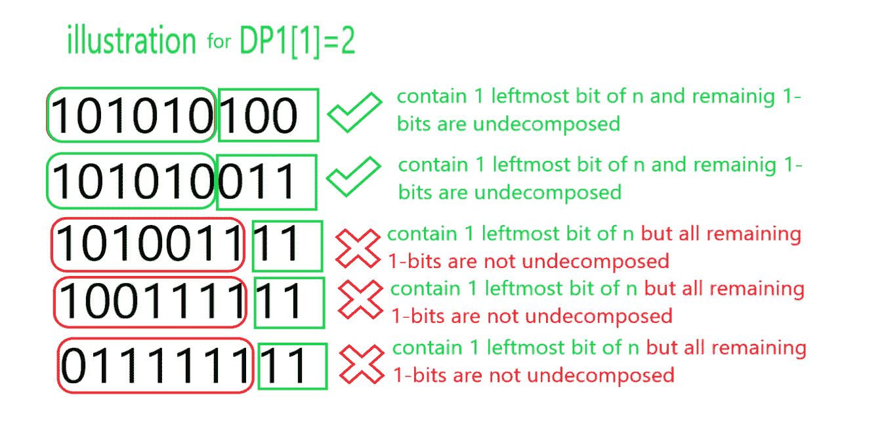
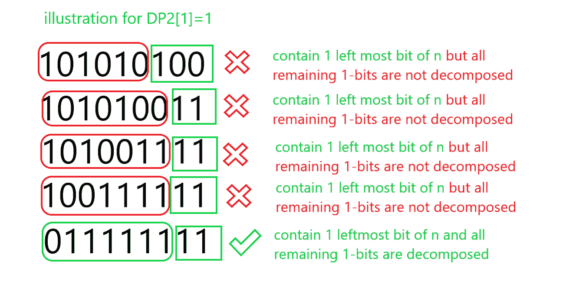

# 计数 N 可以不重复地表示为斐波那契数之和的方式

> 原文:[https://www . geesforgeks . org/n 路计数可以表示为不重复的斐波那契数之和/](https://www.geeksforgeeks.org/count-of-ways-in-which-n-can-be-represented-as-sum-of-fibonacci-numbers-without-repetition/)

给定一个数 **N** ，任务是找出整数 **N** 可以表示为[斐波那契数](https://www.geeksforgeeks.org/program-for-nth-fibonacci-number/)之和而不重复任何斐波那契数的方法数。

**示例:**

> **输入:** N = 13
> **输出:** 3
> **解释:**
> 选择 N 为 13 的可能方式有:{13} {8，5} {8，3，2}。请注意，不可能选择{5 + 5 + 3}，因为 5 会出现两次。
> 
> **输入:** N = 87
> **输出** : 5
> **说明:**
> 选择 N 为 13 的可能方式有:{55 + 21 + 8 + 3}、{55 + 21 + 8 + 2 + 1}、{55 + 21 + 5 + 3 + 2 + 1}、{55 + 13 + 8 + 5 + 3 + 2 + 1}、{34 + 21 + 13 + 8 + 5 + 3 + 2 + 1}。

**天真的方法:**天真的想法是写出[所有可能的组合，加起来就是给定的数**N**T5。检查任何组合是否有重复的整数，然后不要增加计数器，否则每次增加 1。在末尾返回计数。](https://www.geeksforgeeks.org/find-all-combinations-that-adds-upto-given-number-2/)

***时间复杂度:**O(N)*
T5**辅助空间:** O(1)

**高效途径:**思路是利用[动态规划](https://www.geeksforgeeks.org/dynamic-programming/)对上述途径进行优化。以下是步骤:

*   让我们用[斐波那契码](https://www.geeksforgeeks.org/fibonacci-coding/)来表示一个数字。

> 通过以下方式想象斐波那契编码:数字的第**位**对应于第**个斐波那契数**。
> 例如:16 = 13 + 3 会写成 100100。

*   为每个正数写斐波那契码，使得没有两个相邻的位是 **1** 。
*   这对于所有数字都是正确的，因为如果有两个相邻的位是 1 位，那么我们可以通过斐波那契数的属性将其转换为单个 **1 位**。让我们称这种表示为规范表示。
*   获取[规范表示](https://www.geeksforgeeks.org/canonical-and-standard-form/)。生成几个斐波那契数(关于 **90** )，然后尝试以递减顺序减去所有数字。
*   让我们以递增的顺序将给定数字的规范表示的 1 位的位置存储到数组 v 中，并将任何 **1 位**分解为两个 **1 位**，如下所示:

> 开始规范表示:100000001
> 将最左边的 1 位分解成两个较小的 1 位后:011000001
> 将第 2 个最左边的 1 位分解成两个较小的 1 位后:0101100001
> 将第 3 个最左边的 1 位分解成两个较小的 1 位后:0101011001
> 将第 4 个最左边的 1 位分解成两个较小的 1 位后:01010101011111

*   经过多次这样的操作，我们将得到下一个 **1 位**(或数字的结尾)。这个 **1 位**也可以分解，但是**只能移动**一位。
*   初始化一个 dp 数组 **dp1[]** ， **dp1[i]** 是表示一个数的多种方法，该数由该数的最左边的**I****1 位**组成，在这种情况下，所有剩余的 1 位都是**而不是**分解的。另外，以 **dp2[i]** 为例，其标记了表示由剩余的 **1 位**全部分解的情况下的数的最左边的 **1 位**组成的数的方式数。

> 例如:N = 87
> 
> N = 101010100 的规范形式
> N 的其他 4 种可能的表示是 101010011，101001111，10011111，0111111

下面是同样的说明:

[ ](https://media.geeksforgeeks.org/wp-content/uploads/20200808162657/gfg1.png) [ ](https://media.geeksforgeeks.org/wp-content/uploads/20200808162711/gfg2.png)

因此，答案是 **dp1[cnt] + dp2[cnt]** ，其中 **cnt** 是规范表示中 **1 位**的总数。

下面是上述方法的实现:

## C++

```
// C++ program for the above approach

#include <bits/stdc++.h>
using namespace std;

long long fib[101], dp1[101];
long long dp2[101], v[101];

// Function to generate the
// fibonacci number
void fibonacci()
{
    // First two number of
    // fibonacci sqequence
    fib[1] = 1;
    fib[2] = 2;

    for (int i = 3; i <= 87; i++) {
        fib[i] = fib[i - 1] + fib[i - 2];
    }
}

// Function to find maximum ways to
// represent num as the sum of
// fibonacci number
int find(int num)
{
    int cnt = 0;

    // Generate the Canonical form
    // of given number
    for (int i = 87; i > 0; i--) {
        if (num >= fib[i]) {
            v[cnt++] = i;
            num -= fib[i];
        }
    }

    // Reverse the number
    reverse(v, v + cnt);

    // Base condition of dp1 and dp2
    dp1[0] = 1;
    dp2[0] = (v[0] - 1) / 2;

    // Iterate from 1 to cnt
    for (int i = 1; i < cnt; i++) {

        // Calculate dp1[]
        dp1[i] = dp1[i - 1] + dp2[i - 1];

        // Calculate dp2[]
        dp2[i] = ((v[i] - v[i - 1]) / 2)
                     * dp2[i - 1]
                 + ((v[i] - v[i - 1] - 1) / 2)
                       * dp1[i - 1];
    }

    // Return final ans
    return (dp1[cnt - 1] + dp2[cnt - 1]);
}

// Driver Code
int main()
{
    // Function call to generate the
    // fibonacci numbers
    fibonacci();

    // Given Number
    int num = 13;

    // Function Call
    cout << find(num);
    return 0;
}
```

## Java 语言(一种计算机语言，尤用于创建网站)

```
// Java program for the above approach
import java.util.*;

class GFG{

static long[] fib = new long[101];
static long[] dp1 = new long[101];
static long[] dp2 = new long[101];
static long[] v = new long[101];

// Function to generate the
// fibonacci number
static void fibonacci()
{

    // First two number of
    // fibonacci sqequence
    fib[1] = 1;
    fib[2] = 2;

    for(int i = 3; i <= 87; i++)
    {
        fib[i] = fib[i - 1] + fib[i - 2];
    }
}

// Function to find maximum ways to
// represent num as the sum of
// fibonacci number
static long find(int num)
{
    int cnt = 0;

    // Generate the Canonical form
    // of given number
    for(int i = 87; i > 0; i--)
    {
        if (num >= fib[i])
        {
            v[cnt++] = i;
            num -= fib[i];
        }
    }

    // Reverse the number
    for(int i = 0; i < cnt / 2; i++)
    {
        long t = v[i];
        v[i] = v[cnt - i - 1];
        v[cnt - i - 1] = t;
    }

    // Base condition of dp1 and dp2
    dp1[0] = 1;
    dp2[0] = (v[0] - 1) / 2;

    // Iterate from 1 to cnt
    for(int i = 1; i < cnt; i++)
    {

        // Calculate dp1[]
        dp1[i] = dp1[i - 1] + dp2[i - 1];

        // Calculate dp2[]
        dp2[i] = ((v[i] - v[i - 1]) / 2) *
                 dp2[i - 1] +
                 ((v[i] - v[i - 1] - 1) / 2) *
                 dp1[i - 1];
    }

    // Return final ans
    return (dp1[cnt - 1] + dp2[cnt - 1]);
}

// Driver code
public static void main (String[] args)
{

    // Function call to generate the
    // fibonacci numbers
    fibonacci();

    // Given number
    int num = 13;

    // Function call
    System.out.print(find(num));
}
}

// This code is contributed by offbeat
```

## 蟒蛇 3

```
# Python3 program for the above approach
fib = [0] * 101
dp1 = [0] * 101
dp2 = [0] * 101
v = [0] * 101

# Function to generate the
# fibonacci number
def fibonacci():

    # First two number of
    # fibonacci sqequence
    fib[1] = 1
    fib[2] = 2

    for i in range(3, 87 + 1):
        fib[i] = fib[i - 1] + fib[i - 2]

# Function to find maximum ways to
# represent num as the sum of
# fibonacci number
def find(num):

    cnt = 0

    # Generate the Canonical form
    # of given number
    for i in range(87, 0, -1):
        if(num >= fib[i]):
            v[cnt] = i
            cnt += 1
            num -= fib[i]

    # Reverse the number
    v[::-1]

    # Base condition of dp1 and dp2
    dp1[0] = 1
    dp2[0] = (v[0] - 1) // 2

    # Iterate from 1 to cnt
    for i in range(1, cnt):

        # Calculate dp1[]
        dp1[i] = dp1[i - 1] + dp2[i - 1]

        # Calculate dp2[]
        dp2[i] = (((v[i] - v[i - 1]) // 2) *
                  dp2[i - 1] +
                  ((v[i] - v[i - 1] - 1) // 2) *
                  dp1[i - 1])

    # Return final ans
    return dp1[cnt - 1] + dp2[cnt - 1]

# Driver Code

# Function call to generate the
# fibonacci numbers
fibonacci()

# Given number
num = 13

# Function call
print(find(num))

# This code is contributed by Shivam Singh
```

## C#

```
// C# program for the above approach
using System;

class GFG{

static long[] fib = new long[101];
static long[] dp1 = new long[101]; 
static long[] dp2 = new long[101];
static long[] v = new long[101]; 

// Function to generate the 
// fibonacci number 
static void fibonacci() 
{

    // First two number of 
    // fibonacci sqequence 
    fib[1] = 1; 
    fib[2] = 2; 

    for(int i = 3; i <= 87; i++)
    { 
        fib[i] = fib[i - 1] + fib[i - 2]; 
    } 
} 

// Function to find maximum ways to 
// represent num as the sum of 
// fibonacci number 
static long find(long num) 
{ 
    int cnt = 0; 

    // Generate the Canonical form 
    // of given number 
    for(int i = 87; i > 0; i--) 
    { 
        if (num >= fib[i])
        { 
            v[cnt++] = i; 
            num -= fib[i]; 
        } 
    } 

    // Reverse the number 
    for(int i = 0; i < cnt / 2; i++)
    { 
        long t = v[i]; 
        v[i] = v[cnt - i - 1]; 
        v[cnt - i - 1] = t; 
    }

    // Base condition of dp1 and dp2 
    dp1[0] = 1; 
    dp2[0] = (v[0] - 1) / 2; 

    // Iterate from 1 to cnt 
    for(int i = 1; i < cnt; i++)
    { 

        // Calculate dp1[] 
        dp1[i] = dp1[i - 1] + dp2[i - 1]; 

        // Calculate dp2[] 
        dp2[i] = ((v[i] - v[i - 1]) / 2) * 
                 dp2[i - 1] +
                 ((v[i] - v[i - 1] - 1) / 2) * 
                 dp1[i - 1]; 
    } 

    // Return final ans 
    return (dp1[cnt - 1] + dp2[cnt - 1]); 
} 

// Driver code
static void Main()
{

    // Function call to generate the 
    // fibonacci numbers 
    fibonacci(); 

    // Given number 
    int num = 13; 

    // Function call 
    Console.Write(find(num));
}
}

// This code is contributed by divyeshrabadiya07
```

## java 描述语言

```
<script>

// Javascript program for the above approach
var fib = Array(101).fill(0);
var dp1 = Array(101).fill(0);
var dp2 = Array(101).fill(0);
var v = Array(101).fill(0);

// Function to generate the
// fibonacci number
function fibonacci()
{

    // First two number of
    // fibonacci sqequence
    fib[1] = 1;
    fib[2] = 2;

    for(i = 3; i <= 87; i++)
    {
        fib[i] = fib[i - 1] + fib[i - 2];
    }
}

// Function to find maximum ways to
// represent num as the sum of
// fibonacci number
function find(num)
{
    var cnt = 0;

    // Generate the Canonical form
    // of given number
    for(i = 87; i > 0; i--)
    {
        if (num >= fib[i])
        {
            v[cnt++] = i;
            num -= fib[i];
        }
    }

    // Reverse the number
    for(i = 0; i < cnt / 2; i++)
    {
        var t = v[i];
        v[i] = v[cnt - i - 1];
        v[cnt - i - 1] = t;
    }

    // Base condition of dp1 and dp2
    dp1[0] = 1;
    dp2[0] = parseInt((v[0] - 1) / 2);

    // Iterate from 1 to cnt
    for(i = 1; i < cnt; i++)
    {

        // Calculate dp1
        dp1[i] = dp1[i - 1] + dp2[i - 1];

        // Calculate dp2
        dp2[i] = parseInt((v[i] - v[i - 1]) /
                           2) * dp2[i - 1] +
                 parseInt((v[i] - v[i - 1] - 1) /
                           2) * dp1[i - 1];
    }

    // Return final ans
    return (dp1[cnt - 1] + dp2[cnt - 1]);
}

// Driver code

// Function call to generate the
// fibonacci numbers
fibonacci();

// Given number
var num = 13;

// Function call
document.write(find(num));

// This code is contributed by todaysgaurav

</script>
```

**Output:** 

```
3
```

***时间复杂度:** O(log N)*
***辅助空间:** O(log N)*